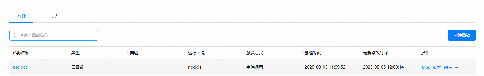
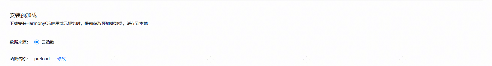

# 儿童教育（儿童）应用模版快速入门

## 目录
- [功能介绍](#功能介绍)
- [约束与限制](#约束与限制)
- [快速入门](#快速入门)
- [示例效果](#示例效果)
- [开源许可协议](#开源许可协议)


## 功能介绍
您可以基于此模板直接定制应用，从而降低您的开发难度，提高您的开发效率。

此模板提供如下组件，所有组件存放在工程根目录的components下，如果您仅需使用组件，可参考对应组件的指导链接；如果您使用此模板，请参考本文档。

| 组件                          | 描述                                                                    | 使用指导                                      |
|-----------------------------|-----------------------------------------------------------------------| --------------------------------------------- |
| 通用分享组件(aggregated_share)    | 提供分享到微信好友、朋友圈、QQ、微博等，支持碰一碰分享、生成海报、系统分享等功能                             | [使用指导](components/aggregated_share/README.md)  |
| 通用应用内设置组件(app_setting)      | 提供开关切换、下拉选择、页面跳转、文本刷新等基础设置项，同时包含深色模式、检测版本、字体大小、清理缓存、通知开关、关于我们、隐私协议等功能 | [使用指导](components/app_setting/README.md)   |
| 通用个人信息组件(collect_personal_info) | 提供编辑头像、昵称、姓名、性别、手机号、生日、个人简介等功能                                        | [使用指导](components/collect_personal_info/README.md)      |
| 通用拨号组件(dial_panel)          | 提供拉起拨号面板以及一键拨号的功能                                                     | [使用指导](components/dial_panel/README.md)    |
| 会员组件(membership)            | 提供通过应用内支付实现会员开通的功能                                                    | [使用指导](components/membership/README.md)        |
| 意见反馈组件(feed_back)           | 提供通用的自定义的意见反馈功能                                                       | [使用指导](components/feed_back/README.md)        |
| 广告组件(aggregated_ads)        | 提供通过华为广告平台展示开屏广告的功能                                                   | [使用指导](components/aggregated_ads/README.md) |
| 播放组件(recorded_player)       | 提供视频播放的功能                                                             | [使用指导](components/recorded_player/README.md)        |

本模板为儿童教育类应用提供了常用功能的开发样例，模板主要分首页和我的两大模块：

1、首页：通过精选、看动画、英语乐园、儿歌、学汉语多个Tab页展示不同类型的视频内容。

2、我的：提供登录，会员信息、观看历史管理，联系我们等功能。

本模板已集成华为账号服务，只需做少量配置和定制即可快速实现华为账号登录。


| 首页                                 | 我的                                  |
|------------------------------------|-------------------------------------|
|  |  |

本模板主要页面及核心功能如下所示：

```ts
儿童教育模板
 |-- 首页
 |    |-- 精选
 |    |    |-- 轮播图
 |    |    |-- 语数英、听故事
 |    |    |-- 精品互动视频
 |    |    |    └-- 视频专辑
 |    |    |-- 热门动画榜
 |    |    |    └-- 视频专辑 
 |    |    |-- 音频故事专区
 |    |    |    └-- 视频专辑 
 |    |    |-- 经典故事
 |    |    |    └-- 视频专辑
 |    |-- 看动画
 |    |    |-- 超级汽车、国学、科普百科、多米
 |    |    |-- XXX第四季
 |    |    |    └-- 视频专辑 
 |    |    |-- XXX每周更新
 |    |    |    └-- 视频专辑 
 |    |    |-- 趣味百科
 |    |    |    └-- 视频专辑 
 |    |    |
 |    |-- 英语乐园
 |    |    |-- 原版英语儿歌
 |    |    |    └-- 视频专辑 
 |    |-- 儿歌
 |    |    |-- 律动儿歌
 |    |    |    |-- 视频专辑
 |    |    |-- 经典童谣
 |    |    |    |-- 视频专辑
 |    └-- 学汉语
 |         |-- 听故事 学叙事
 |         |    └-- 视频专辑
 |         |-- 三字经 磨耳朵
 |              └-- 视频专辑
 └-- 我的
      |-- 用户信息
      |    |-- 华为账号一键登录
      |    └-- 头像昵称修改
      └-- 常用服务
           |-- 观看历史
           |-- 联系我们
           └-- 设置
                |-- 隐私协议
                └-- 时间管理
```


本模板工程代码结构如下所示：

```ts
ChildrenEducation
  |- components
  |   |- aggregated_ads/src/main/ets               // 通用广告组件
  |   |- aggregated_share/src/main/ets             // 通用分享组件
  |   |- app_setting/src/main/ets                  // 通用设置组件
  |   |- collect_personal_info/src/main/ets        // 通用个人信息组件
  |   |- dial_panel/src/main/ets                   // 通用拨号组件
  |   |- feed_back/src/main/ets                    // 通用反馈组件
  |   |- membership/src/main/ets                   // 通用会员中心组件
  |   └- recorded_player/src/main/ets              // 通用播放器组件
  |
  |- commons                                       // 公共层
  |   |- datasource/src/main/ets/components        // 公共资源
  |   |    |- homepage 
  |   |    |     DataGenerator.ets                 // 静态数据生成器
  |   |    └- minepage 
  |   |          MinePageData.ets                  // 我的静态数据
  |   |  
  |   └- utils/src/main/ets                        // 公共组件模块(hsp)
  |        |- constants 
  |        |     CommonConstants.ets               // 公共常量      
  |        |     DateConstants.ets                 // 日期常量 
  |        |- player                               // 播放器页面
  |        |     AudioPlayPage.ets                       
  |        |     PlayControl.ets                         
  |        |     VideoPlayPage.ets     
  |        |- push                               
  |        |     Model.ets                         // 推送模型
  |        |     PushUtils.ets                     // 华为推送工具类
  |        |- uicomponents                        
  |        |     FeedTitle.ets                     // 区域顶部公共组件          
  |        |     GridLine.ets                                 
  |        |     IconAndCount.ets                  // 更新集数         
  |        |     NoMore.ets                        // 没有更多         
  |        |     PlateType.ets                     // 内容类型       
  |        |     TagLabelCard.ets                  // 内容标签组件          
  |        |     Title.ets                         // 标题     
  |        └- utils
  |              AuthUtil.ets                      // 认证工具类
  |              DateFormatUtil.ets                // 日期格式化   
  |              DateUtil.ets                      // 日期处理   
  |              GlobalContext.ets                 // 全局变量   
  |              LogUtil.ets                       // 日志工具   
  |              ObjectUtil.ets                          
  |              BreakpointSystem.ets              // 断点工具类
  |              WindowUtil.ets                    // 注册断点
  |              CloudPrefetchUtils.ets            // 预加载
  |
  |- product/phone
  |   └-  src/main/ets                                               
  |        |- entryability
  |        |    MainEntry.ets                      // 主页面                                                                                                                       
  |        |-  ad                                                                                                                              
  |        |    SplashAdPage                       // 开屏广告页面                                                                                                                   
  |        |-  push                                                                                                  
  |        |    WantUtils                          // 华为推送处理类                                                                                                                   
  |        └- pages                              
  |             Index.ets                          // 入口页面
  |
  |                                            
  |- scenes/services                              
  |   |- cartoon/src/main/ets                     
  |   |    |- components                                    
  |   |    |    CoreButtons.ets                                    
  |   |    └- views                               
  |   |         CartoonPage.ets                    // 看动画列表页
  |   |
  |   |- chinese/src/main/ets                      
  |   |    |- components                          
  |   |    |    SingStory.ets                      // 听故事
  |   |    └- views                               
  |   |         ChinesePage.ets                    // 学汉语列表页
  |   |
  |   |- englishZone/src/main/ets                 
  |   |    └- views                               
  |   |         EnglishZonePage.ets                // 英语乐园列表页
  |   |
  |   |- selected/src/main/ets                   
  |   |    |- components                         
  |   |    |    AudioStoryZone.ets            
  |   |    |    Banner.ets                    
  |   |    |    HobbyCategory.ets                     
  |   |    |    NoMore.ets                          
  |   |    |    PremiumVideo.ets
  |   |    |    VideoCover.ets
  |   |    └- views                               
  |   |         SelectedPage.ets               // 精选列表页
  |   |
  |   |- sing/src/main/ets                     
  |   |    └- views                               
  |   |         SingPage.ets                   // 儿歌列表页
  |   |     
  └- scenes/tabs    
      |- homepage/src/main/ets                 // 酒店tab页功能组合(hsp)
      |    └- views                               
      |        HomePage.ets                    // 首页tab页
      | 
      └- minepage/src/main/ets                              
      |    └- views                               
      └----- MinePage.ets                    // 我的tab页
```

## 约束与限制
### 环境
* DevEco Studio版本：DevEco Studio 6.0.2 Release及以上
* HarmonyOS SDK版本：HarmonyOS 6.0.2 Release SDK及以上
* 设备类型：华为手机（包括双折叠和阔折叠）、华为平板
* HarmonyOS版本：HarmonyOS 6.0.1(21) 及以上

### 权限
* 网络权限: ohos.permission.INTERNET
* 身份认证权限: ohos.permission.ACCESS_BIOMETRIC
* 获取数据网络信息权限: ohos.permission.GET_NETWORK_INFO

## 快速入门
###  配置工程
在运行此模板前，需要完成以下配置：

1. 在AppGallery Connect创建应用，将包名配置到模板中。

   a. 参考[创建HarmonyOS应用](https://developer.huawei.com/consumer/cn/doc/app/agc-help-create-app-0000002247955506)为应用创建APP ID，并将APP ID与应用进行关联。

   b. 返回应用列表页面，查看应用的包名。

   c. 将模板工程根目录下AppScope/app.json5文件中的bundleName替换为创建应用的包名。

2. 配置华为账号服务。

   a. 将应用的client ID配置到product/phone模块的src/main/module.json5文件，详细参考：[配置Client ID](https://developer.huawei.com/consumer/cn/doc/harmonyos-guides/account-client-id)。

   b. 申请华为账号一键登录的权限，详细参考：[申请账号权限](https://developer.huawei.com/consumer/cn/doc/harmonyos-guides/account-config-permissions)。

3. 配置应用内支付服务。

   a. 您需[开通商户服务](https://developer.huawei.com/consumer/cn/doc/start/merchant-service-0000001053025967)才能开启应用内购买服务。商户服务里配置的银行卡账号、币种，用于接收华为分成收益。

   b. 使用应用内购买服务前，需要打开应用内购买服务(HarmonyOS NEXT) 开关，此开关是应用级别的，即所有使用IAP Kit功能的应用均需执行此步骤，详情请参考[打开应用内购买服务API开关](https://developer.huawei.com/consumer/cn/doc/app/switch-0000001958955097)。

   c. 开启应用内购买服务(HarmonyOS NEXT) 开关后，开发者需进一步激活应用内购买服务 (HarmonyOS NEXT)，具体请参见[激活服务和配置事件通知](https://developer.huawei.com/consumer/cn/doc/app/parameters-0000001931995692)。

4. 配置会员商品信息，详情请参考[配置商品信息](https://developer.huawei.com/consumer/cn/doc/harmonyos-guides/iap-config-product)。

5. 配置预加载服务。

   a. [开通预加载](https://developer.huawei.com/consumer/cn/doc/harmonyos-guides/cloudfoundation-enable-prefetch)。

   b. [开通云函数](https://developer.huawei.com/consumer/cn/doc/harmonyos-guides/cloudfoundation-enable-function)。

   c. 打包云函数包：进入工程preload目录，将目录下的文件压缩为zip文件，注意进入文件夹中，全选文件，右击压缩。

   d. [创建云函数](https://developer.huawei.com/consumer/cn/doc/harmonyos-guides/cloudfoundation-create-and-config-function)。

   * “函数名称”为“preload”
   * “触发方式”为“事件调用”
   * “触发器类型”为“HTTP触发器”，其他保持默认
   * “代码输入类型”为“*.zip文件”，代码文件上传上一步打包的zip文件

    

   e. [配置安装预加载](https://developer.huawei.com/consumer/cn/doc/harmonyos-guides/cloudfoundation-prefetch-config)

   安装预加载函数名称配置为上一步创建的云函数

    

6. 配置推送服务。

   a. [开启推送服务](https://developer.huawei.com/consumer/cn/doc/harmonyos-guides/push-config-setting)。

   b. 按照需要的权益[申请通知消息自分类权益](https://developer.huawei.com/consumer/cn/doc/harmonyos-guides/push-apply-right)。

   c. [端云调试](https://developer.huawei.com/consumer/cn/doc/harmonyos-guides/push-server)。

7. 对应用进行[手工签名](https://developer.huawei.com/consumer/cn/doc/harmonyos-guides/ide-signing#section297715173233)。

8. 添加手工签名所用证书对应的公钥指纹，详细参考：[配置应用证书指纹](https://developer.huawei.com/consumer/cn/doc/app/agc-help-cert-fingerprint-0000002278002933)。
9. 配置App Linking，详细参考：[App Lingking](https://developer.huawei.com/consumer/cn/doc/harmonyos-guides/applinking-introduction)。

### 运行调试工程
1. 连接调试手机和PC。

2. 菜单选择“Run > Run 'phone' ”或者“Run > Debug 'phone' ”，运行或调试模板工程。

## 示例效果
[功能展示录屏](./screenshots/功能展示录屏.mp4)

## 开源许可协议
该代码经过[Apache 2.0 授权许可](https://www.apache.org/licenses/LICENSE-2.0)。