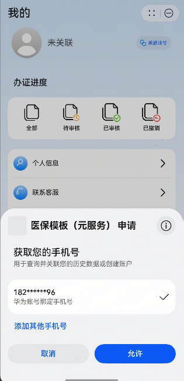

# 元服务关联账号组件快速入门

## 目录

- [简介](#简介)
- [约束与限制](#约束与限制)
- [快速入门](#快速入门)
- [API参考](#API参考)
- [示例代码](#示例代码)

## 简介

本组件提供关联华为账号，解除关联的功能。



## 约束与限制

### 环境

* DevEco Studio版本：DevEco Studio 5.0.4 Release及以上
* HarmonyOS SDK版本：HarmonyOS 5.0.4 Release SDK及以上
* 设备类型：华为手机（直板机）
* 系统版本：HarmonyOS 5.0.4(16)及以上

### 权限

- 网络权限：ohos.permission.INTERNET

## 快速入门

1. 安装组件。

   如果是在DevEvo Studio使用插件集成组件，则无需安装组件，请忽略此步骤。

   如果是从生态市场下载组件，请参考以下步骤安装组件。

   a. 解压下载的组件包，将包中所有文件夹拷贝至您工程根目录的XXX目录下。

   b. 在项目根目录build-profile.json5添加automatic_login模块。

   ```
   // 项目根目录下build-profile.json5填写automatic_login路径。其中XXX为组件存放的目录名
   "modules": [
     {
       "name": "automatic_association_count",
       "srcPath": "./XXX/automatic_association_count"
     }
   ]
   ```

   c. 在项目根目录oh-package.json5添加依赖。

   ```
   // XXX为组件存放的目录名称
   "dependencies": {
     "automatic_association_count": "file:./XXX/automatic_association_count"
   }
   ```

2. 引入组件。

   ```
   import { AutomaticAssociationCount } from 'automatic_association_count';
   ```

3. 将元服务的client ID配置到项目entry模块的module.json5文件

   ```
   "metadata": [
      {
        // 替换应用的clientID
        "name": "client_id",
        "value": "xxx"
      }
    ],
   ```

4. 如需获取用户真实手机号，需要申请phone权限，详细参考：[配置scope权限](https://developer.huawei.com/consumer/cn/doc/atomic-guides/account-guide-atomic-permissions)，并在端侧使用快速验证手机号码Button进行[验证获取手机号码](https://developer.huawei.com/consumer/cn/doc/atomic-guides/account-guide-atomic-get-phonenumber)。

## API参考

### 接口

AutomaticAssociationCount(option: [AutomaticAssociationCountOptions](#AutomaticAssociationCountOptions对象说明))

元服务关联账号组件

**参数：**

| 参数名  | 类型                                                         | 是否必填 | 说明                   |
| :------ | :----------------------------------------------------------- | :------- | :--------------------- |
| options | [AutomaticAssociationCountOptions](#AutomaticAssociationCountOptions对象说明) | 否       | 元服务登录组件的参数。 |

#### AutomaticAssociationCountOptions对象说明

| 参数名   | 类型                                        | 是否必填 | 说明     |
| :------- | :------------------------------------------ | :------- | :------- |
| userInfo | [userInfoOptions](#userInfoOptions对象说明) | 是       | 用户信息 |
| isLogin  | boolean                                     | 否       | 是否登录 |

#### userInfoOptions对象说明

| 参数名      | 类型   | 是否必填 | 说明       |
| :---------- | :----- | :------- |:---------|
| authCode    | string | 否       | 用户凭证     |
| avatar      | string | 否       | 用户的头像    |
| idToken     | string | 否       | 用户的token |
| phoneNumber | string | 否       | 用户的手机号   |
| userName    | string | 否       | 用户的昵称    |

### 事件

支持以下事件：

#### onLogin

onLogin: (code: string) => void = () => {}

关联账号的回调，返回用户的authCode

## 示例代码

```ts
import { AutomaticAssociationCount, UserInfo } from 'automatic_association_count'

@Entry
@ComponentV2
export struct Index {
  @Local userInfo: UserInfo = {
    authCode: '',
    avatar: '',
    idToken: '',
    phoneNumber: '',
    userName: '',
  }
  @Local isLogin: boolean = false

  build() {
    Column() {
      Column() {
        Text(this.isLogin ? this.userInfo.phoneNumber : '')
        Text(this.isLogin ? this.userInfo.userName : '')
      }

      AutomaticAssociationCount({
        userInfo: this.userInfo!!,
        isLogin: this.isLogin!!,
        onLogin: (code: string) => {
          if(code !== 'err') {
            this.isLogin = true
            this.userInfo.phoneNumber = '123xxx456'
            this.userInfo.userName = '华为用户'
            console.log('code_'+ code)
          }
        },
         onLoginOut:() => {
          this.isLogin = false
          this.userInfo = new UserInfo()
        }
      })
    }
  }
}
```