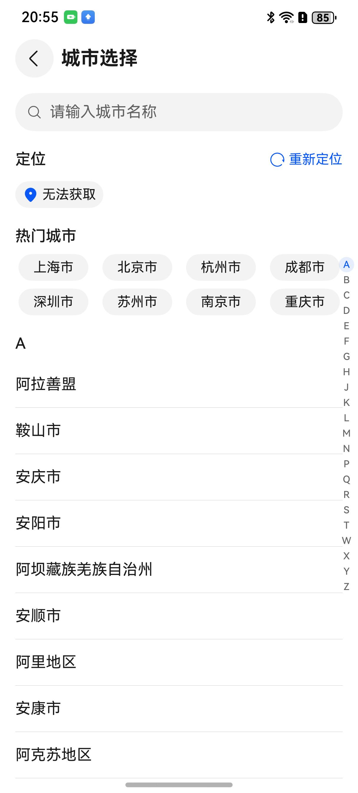
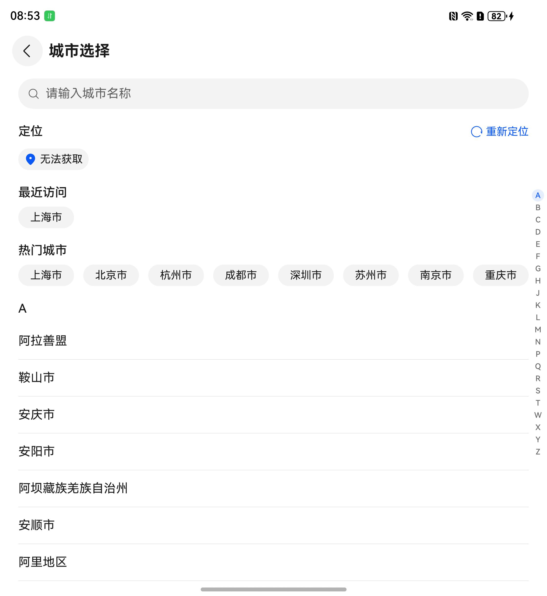
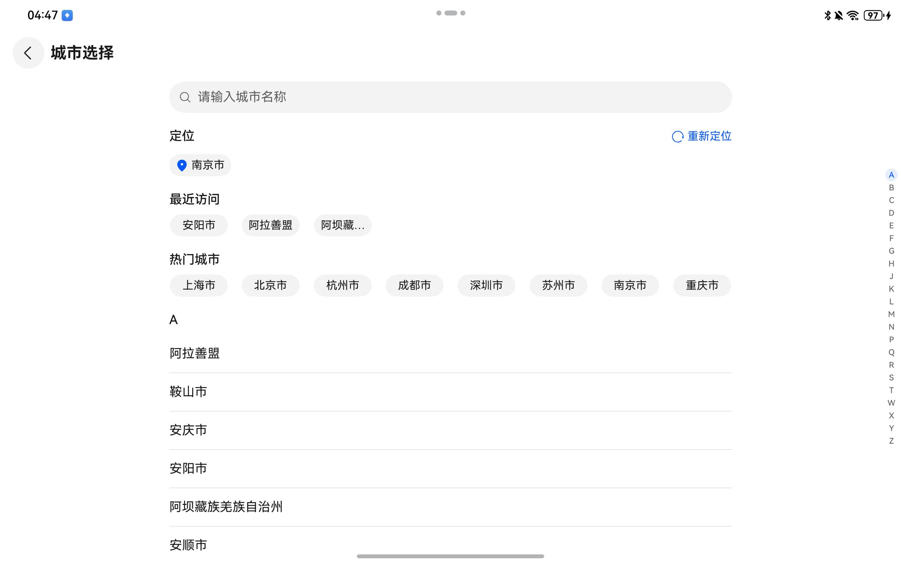

# 通用城市选择组件快速入门

## 目录

- [简介](#简介)
- [约束与限制](#约束与限制)
- [使用](#使用)
- [API参考](#API参考)
- [示例代码](#示例代码)

## 简介

本组件提供选择城市的功能，长按城市按钮将显示城市全称。

<div style='overflow-x:auto'>
  <table style='min-width:800px'>
    <tr>
      <th>直板机</th>
      <th>折叠屏</th>
      <th>平板</th>
    </tr>
    <tr>
      <td valign='top'></td>
      <td valign='top'></td>
      <td valign='top'></td>
    </tr>
  </table>
</div>

## 约束与限制

### 环境

- DevEco Studio版本：DevEco Studio 5.0.5 Release及以上
- HarmonyOS SDK版本：HarmonyOS 5.0.5 Release SDK及以上
- 设备类型：华为手机（包括双折叠和阔折叠）、华为平板
- 系统版本：HarmonyOS 5.0.1(13)及以上

### 权限

- 位置权限：ohos.permission.APPROXIMATELY_LOCATION

## 使用

1. 安装组件。

   如果是在DevEco Studio使用插件集成组件，则无需安装组件，请忽略此步骤。

   如果是从生态市场下载组件，请参考以下步骤安装组件。

   a. 解压下载的组件包，将包中所有文件夹拷贝至您工程根目录的xxx目录下。

   b. 在项目根目录build-profile.json5添加city_select模块。
   ```
   "modules": [
      {
      "name": "city_select",
      "srcPath": "./xxx/city_select",
      },
   ]
   ```
   c. 在项目根目录oh-package.json5中添加依赖
   ```
   "dependencies": {
      "city_select": "file:./xxx/city_select",
   }
   ```

2. 引入城市选择组件句柄。

   ```
   import { CitySelect, CitySelectController, City } from 'city_select';
   ```

3. 定位当前城市需要开通地图服务，详细参考[地图服务的开发准备](https://developer.huawei.com/consumer/cn/doc/harmonyos-guides/map-config-agc)。

4. 调用组件，详细参数配置说明参见[API参考](#API参考)。

## API参考

### 接口

CitySelect(option: CitySelectOptions)
城市选择组件。

**参数：**

| 参数名     | 类型                                          | 是否必填 | 说明       |
|:--------|:--------------------------------------------|:-----|:---------|
| options | [CitySelectOptions](#CitySelectOptions对象说明) | 是    | 城市选择组件参数 |

### CitySelectOptions对象说明

| 参数名               | 类型                                                | 是否必填 | 说明       |
|:------------------|:--------------------------------------------------|:-----|:---------|
| cityList          | [City](#City类型说明)[]                               | 是    | 城市列表     |
| hotCityList       | [City](#City类型说明)[]                               | 否    | 热门城市列表   |
| select            | (city: [City](#City类型说明)) => void                 | 否    | 选择城市     |
| handleCurrentCity | (city: [City](#City类型说明)) => void                 | 否    | 处理当前定位城市 |
| controller        | [CitySelectController](#CitySelectController类型说明) | 否    | 返回逻辑控制器  |

### City类型说明

| 参数名  | 类型     | 是否必填 | 说明     |
|:-----|:-------|:-----|:-------|
| name | string | 是    | 城市名称   |
| code | string | 否    | 城市code |

### CitySelectController类型说明

| 参数名           | 类型            | 是否必填 | 说明                            |
|:--------------|:--------------|:-----|:------------------------------|
| onBackPressed | () => boolean | 否    | 返回逻辑函数，侧滑返回触发清空搜索框内容，返回到城市选择页 |

## 示例代码

```
import { CITY_LIST_SAMPLE, CitySelect, HOT_CITY_LIST_SAMPLE, CitySelectController, City } from 'city_select';

@Entry
@ComponentV2
struct CitySelectPage {
   @Local currentCity: City = {
      name: '南京市',
      code: '320100',
   };
   controller: CitySelectController = new CitySelectController();

   onBackPress(): boolean | void {
      return this.controller.onBackPressed();
   }

   build() {
      NavDestination() {
         Column() {
            CitySelect({
               select: ((city) => {
                  // 选择城市
                  this.currentCity = city
               }),
               cityList: CITY_LIST_SAMPLE,
               hotCityList: HOT_CITY_LIST_SAMPLE,
               controller: this.controller,
            })
         }
         .width('100%')
      }
      .height('100%')
         .width('100%')
         .title(`城市选择：${this.currentCity.name}`)
   }
}
```
