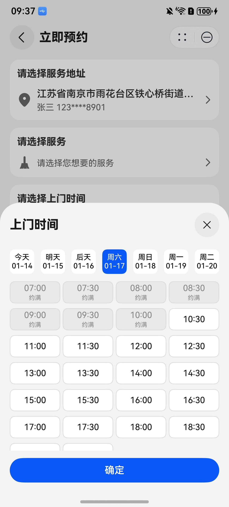

# 时间选择弹窗组件快速入门

## 目录

- [简介](#简介)
- [约束与限制](#约束与限制)
- [使用](#使用)
- [API参考](#API参考)
- [示例代码](#示例代码)

## 简介

本组件提供通过底部弹窗选择日期时间的功能。



## 约束与限制

### 环境

* DevEco Studio版本：DevEco Studio 5.0.0 Release及以上
* HarmonyOS SDK版本：HarmonyOS 5.0.0 Release SDK及以上
* 设备类型：华为手机（包括双折叠和阔折叠）
* 系统版本：HarmonyOS 5.0.0(12)及以上

### 权限

* 无

## 使用

1. 安装组件。

   如果是在DevEco Studio使用插件集成组件，则无需安装组件，请忽略此步骤。

   如果是从生态市场下载组件，请参考以下步骤安装组件。

   a. 解压下载的组件包，将包中所有文件夹拷贝至您工程根目录的XXX目录下。

   b. 在项目根目录build-profile.json5添加module_time_select模块。

   ```
   // 项目根目录下build-profile.json5填写module_time_select路径。其中XXX为组件存放的目录名
   "modules": [
     {
       "name": "module_time_select",
       "srcPath": "./XXX/module_time_select"
     }
   ]
   ```

   c. 在项目根目录oh-package.json5添加依赖。
   ```
   // XXX为组件存放的目录名称
   "dependencies": {
     "module_time_select": "file:./XXX/module_time_select"
   }
   ```

2. 引入组件。

    ```
    import { TimeSelect } from 'module_time_select';
    ```
3. 调用组件，详细参数配置说明参见[API参考](#API参考)。

## API参考

### 接口

TimeSelect(option?: [TimeSelectOptions](#TimeSelectOptions对象说明))

时间选择弹窗组件

**参数：**

| 参数名     | 类型                                          | 是否必填 | 说明             |
|:--------|:--------------------------------------------|:-----|:---------------|
| options | [TimeSelectOptions](#TimeSelectOptions对象说明) | 否    | 配置时间选择弹窗组件的参数。 |

### TimeSelectOptions对象说明

| 参数名          | 类型                                                  | 是否必填 | 说明           |
|:-------------|:----------------------------------------------------|:-----|:-------------|
| label        | ResourceStr                                         | 否    | 时间文本         |
| timeOptions  | [TimeOptions](#TimeOptions类型说明)                     | 否    | 天数、起止时间等时间选项 |
| styleOptions | [StyleOptions](#StyleOptions类型说明)                   | 否    | 样式选项         |
| onTimeSelect | (dateTime: Date                    \| null) => void | 否    | 选择时间的回调      |

### TimeOptions类型说明

| 参数名       | 类型     | 必填 | 说明   |
|:----------|:-------|:---|:-----|
| days      | number | 否  | 天数   |
| startTime | string | 否  | 起始时间 |
| endTime   | string | 否  | 结束时间 |

### StyleOptions类型说明

| 参数名                | 类型            | 必填 | 说明         |
|:-------------------|:--------------|:---|:-----------|
| dayFg              | ResourceColor | 否  | 未被选中日期文字颜色 |
| dayFgSelected      | ResourceColor | 否  | 被选中日期文字颜色  |
| timeBg             | ResourceColor | 否  | 未被选中时间文字颜色 |
| timeBgSelected     | ResourceColor | 否  | 被选中时间文字颜色  |
| timeBorder         | ResourceColor | 否  | 未被选中时间边框颜色 |
| timeBorderSelected | ResourceColor | 否  | 被选中时间边框颜色  |

## 示例代码

```
import { TimeSelect } from 'module_time_select';

@Entry
@ComponentV2
struct TimeSelectSample {
  @Local date: Date | null = null;

  @Computed
  get getTimeText() {
    if (this.date) {
      return this.date.toLocaleString();
    }
    return '请选择';
  }

  build() {
    NavDestination() {
      Column({ space: 12 }) {
        Text('请选择上门时间')
          .fontSize($r('sys.float.Subtitle_M'))
          .fontWeight(FontWeight.Bold)
          .lineHeight(21)

        TimeSelect({
          label: this.getTimeText,
          timeOptions: {
            days: 7,
            startTime: '06:59:00',
            endTime: '19:30:00',
          },
          onTimeSelect: (dateTime: Date | null) => {
            this.date = dateTime;
          },
        })
      }
      .width('100%')
      .padding(12)
      .borderRadius(16)
      .backgroundColor(Color.White)
      .alignItems(HorizontalAlign.Start)
    }
    .title('时间选择弹窗组件')
    .backgroundColor('#F1F3F5')
  }
}
```
