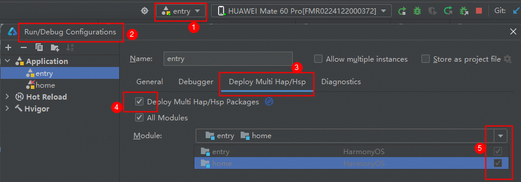

# 生活服务（美甲）元服务模板快速入门

## 目录

- [功能介绍](#功能介绍)
- [约束与限制](#约束与限制)
- [快速入门](#快速入门)
- [示例效果](#示例效果)
- [开源许可协议](#开源许可协议)

## 功能介绍

您可以基于此模板直接定制元服务，也可以挑选此模板中提供的多种组件使用，从而降低您的开发难度，提高您的开发效率。

此模板提供如下组件，所有组件存放在工程根目录的components下，如果您仅需使用组件，可参考对应组件的指导链接；如果您使用此模板，请参考本文档。

| 组件                                      | 描述                                                     | 使用指导                                               |
| :---------------------------------------- | :------------------------------------------------------- | :----------------------------------------------------- |
| 个人信息编辑组件（profile_edit）          | 支持编辑个人信息，包括姓名、性别、手机号、生日等         | [使用指导](components/profile_edit/README.md)          |
| 预约管理卡片组件（reservation_card）      | 支持查看预约信息、添加日程、订阅通知、取消预约等         | [使用指导](components/reservation_card/README.md)      |
| 预约表单组件（reservation_form）          | 支持填写预约表单信息，包括预约时间、预约联系人等         | [使用指导](components/reservation_form/README.md)      |
| 通用个人信息组件（collect_personal_info） | 支持编辑头像、昵称、姓名、性别、手机号、生日、个人简介等 | [使用指导](components/collect_personal_info/README.md) |
| 选择店铺组件（select_store）              | 本组件提供了店铺选择功能                                 | [使用指导](components/select_store/README.md)          |

本模板为美容行业（美甲美睫）类元服务提供了常用功能的开发样例，模板主要分首页和我的两大模块：

- 首页：提供商品卡、团购、推荐商品的展示，支持购买和预约。
- 我的：展示会员卡信息，支持订单、商品卡、团购信息的管理。

本模板已集成华为账号、推送、华为支付等服务，只需做少量配置和定制即可快速实现华为账号的登录、预约提醒、购买商品等功能。

| 首页                                                    | 我的                                                    |
|-------------------------------------------------------|-------------------------------------------------------|
|  |  |

本模板主要页面及核心功能如下所示：

```text
美业模板
 |-- 华为账号登录
 |    |-- 授权
 |    └-- 解绑
 |-- 首页
 |    |-- Banner
 |    |-- 店铺信息
 |    |-- 开通会员
 |    |-- 次卡
 |    |     |-- 次卡详情
 |    |     |-- 提交订单
 |    |     └-- 下单成功
 |    |-- 团购
 |    |     |-- 团购详情
 |    |     |-- 提交订单
 |    |     └-- 下单成功
 |    └-- 商品列表
 |          |-- 商品详情
 |          |-- 预约页面
 |          └-- 预约成功
 └-- 我的
      |-- 用户信息
      |     |-- 个人信息
      |-- 我的预约
      |     |-- 已预约
      |     |-- 已完成
      |     |-- 已取消
      |     └-- 已失效
      |-- 服务与工具
      |     |-- 次卡
      |     └-- 团购
      └-- 为您推荐
```

本模板工程代码结构如下所示：

```text
LifeBeauty
  ├─commons/foundation/src/main
  │  ├─ets
  │  │  ├─constants
  │  │  │      AppConstant.ets               // 应用常量
  │  │  │      CommonConstants.ets           // 通用常量
  │  │  │      ErrorCode.ets                 // 错误码
  │  │  │      GridRowColSetting.ets         // 一多适配，栅格和断点常量
  │  │  │      HttpUrlMap.ets                // 云侧url映射
  │  │  │      RouterMap.ets                 // 路由表
  │  │  ├─http
  │  │  │      ApiManage.ets                 // 服务端接口管理
  │  │  │      AxiosBase.ets                 // 请求基础能力
  |  |  |      MockAdapter.ets               // mock适配器
  │  │  │      MockApi.ets                   // 接口Mock
  │  │  │      MockData.ets                  // 数据Mock
  │  │  ├─login
  │  │  │      Login.ets                     // 登录方法
  │  │  ├─model
  │  │  │      BreakpointModel.ets           // 一多适配断点模型
  |  |  |      IRequest.ets                  // 数据请求模型
  │  │  │      IResponse.ets                 // 数据响应模型
  │  │  │      Model.ets                     // UI监听数据模型
  │  │  ├─router
  │  │  │      RouterModule.ets              // 路由模块
  │  │  ├─uicomponent
  │  │  │      DialogBindPhone.ets           // 关联手机号弹窗
  │  │  │      DialogCancelBind.ets          // 取消关联手机号弹窗
  │  │  │      DialogReBind.ets              // 换绑手机号弹窗
  │  │  │      GoodCard.ets                  // 商品卡片
  │  │  │      NoticeDialog.ets              // 通知弹窗
  │  │  │      UIBackBtn.ets                 // 通用的返回按钮组件
  │  │  │      UIEmpty.ets                   // 通用的空页面组件
  │  │  │      UIOrderPart.ets               // 通用的订购组件
  │  │  └─utils
  |  |         AppPrivacyUtils.ets           // 隐私声明方法
  |  |         BreakpointUtils.ets           // 一多适配监听断点方法
  │  │         CommonUtils.ets               // 通用方法
  │  │         LoadingUtils.ets              // 加载方法
  │  │         Logger.ets                    // 日志打印
  │  │         PopViewUtils.ets              // 公共弹窗
  │  │         SystemSceneUtils.ets          // 系统方法
  │  └─resources                             
  │
  ├──components
  │  ├──collect_personal_info                // 通用个人信息组件
  │  ├──profile_edit                         // 个人信息编辑组件                     
  │  ├──reservation_card                     // 预约管理卡片组件
  │  ├──reservation_form                     // 预约表单组件
  │  └──select_store                         // 选择店铺组件
  │                                            
  │─features/home/src/main                     
  │  ├─ets                                    
  │  │  ├─common                              
  │  │  │      Constant.ets                  // 常量 
  │  │  │      StoreDataSource.ets           // 店铺数据类
  |  |  |      Utils.ets                     // 工具方法
  │  │  ├─components                          
  │  │  │      ActiveMemberModule.ets        // 开通会员卡 
  │  │  │      DialogBookSuccess.ets         // 预约成功
  │  │  │      DialogBusiness.ets            // 营业执照弹窗
  │  │  │      DialogCall.ets                // 拨号弹窗
  │  │  │      GroupModule.ets               // 首页团购
  |  |  |      NumberStepper.ets             // 计数器
  │  │  │      SingleVisitModule.ets         // 首页次卡
  │  │  │      StoreList.ets                 // 店铺列表
  │  │  ├─pages                               
  │  │  │      BookGood.ets                  // 预约服务
  │  │  │      GoodDetail.ets                // 商品详情页
  │  │  │      GroupDetail.ets               // 团购详情页
  │  │  │      HomePage.ets                  // 首页
  │  │  │      SelectStorePage.ets           // 选择门店页面
  │  │  │      SingleCardDetail.ets          // 次卡详情页
  │  │  │      SubmitOrder.ets               // 下单页面
  │  │  │      SuccessPay.ets                // 付款成功页面
  │  │  └─viewmodel                           
  │  │         HomeBaseVM.ets                // 首页VM
  │  └─resources                              
  │                                           
  │─features/mine/src                         
  │    ├─ets                                    
  │    │  ├─common                              
  │    │  │    Constant.ets                  // 常量 
  │    │  ├─components
  |    |  |    AppointmentContentView.ets    // 预约列表
  │    │  │    DialogQRCode.ets              // 二维码弹窗
  |    |  |    GroupListContentView.ets      // 团购列表
  │    │  │    MineIconLabel.ets             // 我的grid视图
  |    |  |    NavBarListView                // 自定义tabBar
  │    │  └─pages                              
  │    │       AppointmentList.ets           // 我的预约列表
  │    │       BookGroupDetail.ets           // 我的团购详情
  │    │       EditPersonalInfo.ets          // 编辑个人信息页面
  │    │       GroupList.ets                 // 我的团购列表
  │    │       Mine.ets                      // 我的页面
  │    │       SingleVisitList.ets           // 我的次卡列表
  │    └─resources                             
  │
  └─products/entry/src/main                           
      ├─ets                                   
      │  ├─entryability                        
      │  │      EntryAbility.ets              // 应用入口Ability
      │  ├─entryformability                   
      │  │      EntryFormAbility.ets          // 卡片入口Ability
      │  ├─pages                              
      │  │      Index.ets                     // 入口页面
      │  │      Main.ets                      // 主页面
      │  └─simplewidget/pages
      │         SimpleWidgetCard.ets          // 卡片页面 
      └─resources  
```

## 约束与限制

### 环境

- DevEco Studio版本：DevEco Studio 5.0.3 Release及以上
- HarmonyOS SDK版本：HarmonyOS 5.0.3 Release SDK及以上
- 设备类型：华为手机（包括双折叠和阔折叠）
- 系统版本：HarmonyOS 5.0.3(15)及以上

### 权限

- 位置权限：ohos.permission.APPROXIMATELY_LOCATION、ohos.permission.LOCATION
- 日历活动读写权限：ohos.permission.READ_CALENDAR、ohos.permission.WRITE_CALENDAR
- 网络权限：ohos.permission.INTERNET

## 快速入门

### 配置工程

在运行此模板前，需要完成以下配置：

1. 在AppGallery Connect创建元服务，将包名配置到模板中。

   a. 参考[创建元服务](https://developer.huawei.com/consumer/cn/doc/app/agc-help-create-atomic-service-0000002247795706)为元服务创建APP ID，并将APP ID与元服务进行关联。

   b. 返回应用列表页面，查看元服务的包名。

   c. 将模板工程根目录下AppScope/app.json5文件中的bundleName替换为创建元服务的包名。

2. 配置华为账号服务。

   a. 将元服务的Client ID配置到entry模块下的products/entry/src/main/module.json5文件，详细参考：[配置Client ID](https://developer.huawei.com/consumer/cn/doc/atomic-guides/account-atomic-client-id)。

   b. 将元服务的Client ID配置到commons/foundation/src/main/ets/constants/AppConstant.ets文件中。

   ```
   export enum CurAppInfo {
     CLIENT_ID = 'xxx', // client_id
   }
   ```
   
   c. 获取华为账号相关授权，详细参考：[配置scope权限](https://developer.huawei.com/consumer/cn/doc/atomic-guides/account-guide-atomic-permissions)。

3. 配置推送服务。

   a. [开通推送服务](https://developer.huawei.com/consumer/cn/doc/atomic-guides/push-as-prepare)。

   b. 开通服务并选择订阅模板，获取模板ID，详细参考：[开通服务通知并选择订阅模板](https://developer.huawei.com/consumer/cn/doc/atomic-guides/push-as-service-noti)。

   c. 将模板ID填充到commons/foundation/src/main/ets/constants/AppConstant.ets中。

   ```
   export enum CurAppInfo {
     PUSH_TEMPLATE_ID = 'xxx',// 推送服务通知模板ID
   }
   ```
   [说明]
   本模板只包含客户端侧代码的实现，如需完整体验推送能力，还需要补充服务端开发。详细参考：[推送基于账号的订阅消息](https://developer.huawei.com/consumer/cn/doc/atomic-guides/push-as-send-sub-noti)。

4. （可选）如使用支付能力，需要配置支付服务。

   a. 华为支付当前仅支持商户接入，在使用服务前，需要完成商户入网、开通服务等相关配置。更多详细内容参考：[支付服务接入准备](https://developer.huawei.com/consumer/cn/doc/harmonyos-guides/payment-preparations)。

   b. 当前模板仅提供端侧集成示例，真实调用华为支付场景下，修改端侧文件：features/home/src/main/ets/pages/SubmitOrder.ets，主要修改点如下：

   ```
   // todo: 设置参数为false，使得不绕过华为支付
   private ignoreRequestPayment: boolean = false;
   
   // 调用华为支付客户端
   requestPaymentPromise(): Promise<void> {
      if (this.ignoreRequestPayment) {
         return new Promise((resolve) => resolve());
      }
      // todo: 补充订购信息
      const orderStr = '{}';
      return paymentService.requestPayment(this.context, orderStr)
         .then(() => {
            console.info('succeeded in paying');
         })
         .catch((error: BusinessError) => {
            console.error(`failed to pay, error.code: ${error.code}, error.message: ${error.message}`);
            this.getUIContext().getPromptAction().showToast({ message: '拉起支付失败' });
         });
   }
   ```

5. （可选）配置服务器域名。

   a. 当前模板接口均采用mock数据，若是使用服务端接口请求，需要改造http请求的相关代码：commons/foundation/src/main/ets/http/AxiosBase.ets。

   b. [配置服务器域名](https://developer.huawei.com/consumer/cn/doc/atomic-guides/agc-help-harmonyos-server-domain)，“httpRequest合法域名”需要配置为：`https://agc-storage-drcn.platform.dbankcloud.cn`

6. （可选）智能填充服务，需要[申请接入智能填充服务](https://developer.huawei.com/consumer/cn/doc/harmonyos-guides/scenario-fusion-introduction-to-smart-fill#section1167564853816)。

7. 对元服务进行[手工签名](https://developer.huawei.com/consumer/cn/doc/harmonyos-guides/ide-signing#section297715173233)。

8. 添加手工签名所用证书对应的公钥指纹。详细参考：[配置应用签名证书指纹](https://developer.huawei.com/consumer/cn/doc/app/agc-help-cert-fingerprint-0000002278002933)

### 运行调试工程

1. 连接调试手机和PC。

2. 配置多模块调试：由于本模板存在多个模块，运行时需确保所有模块安装至调试设备。

   a. 运行模块选择“entry”。

   b. 下拉框选择“Edit Configurations”，在“Run/Debug Configurations”界面，选择“Deploy Multi Hap”页签，勾选上模板中所有模块。

   

   c. 点击"Run"，运行模板工程。

## 示例效果

1. 订购和预约

   [点击观看视频](screenshots/order_reservation.mp4)

2. 我的管理

   [点击观看视频](screenshots/management.mp4)

## 开源许可协议

该代码经过[Apache 2.0 授权许可](http://www.apache.org/licenses/LICENSE-2.0)。
