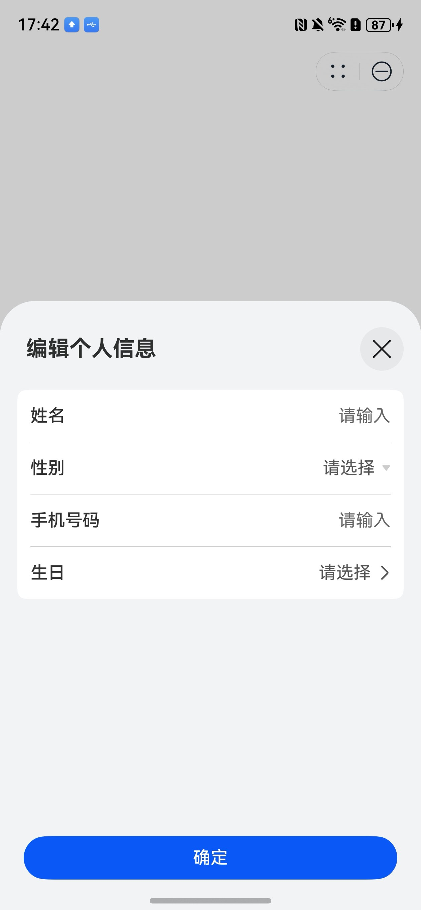

# 个人信息编辑组件快速入门

## 目录

- [简介](#简介)
- [约束与限制](#约束与限制)
- [快速入门](#快速入门)
- [API参考](#API参考)
- [示例代码](#示例代码)

## 简介

本组件支持编辑个人信息，包括姓名、性别、手机号、生日等，以及支持查看用户协议。



## 约束与限制

### 环境

- DevEco Studio版本：DevEco Studio 5.0.3 Release及以上
- HarmonyOS SDK版本：HarmonyOS 5.0.3 Release SDK及以上
- 设备类型：华为手机（包括双折叠和阔折叠）
- 系统版本：HarmonyOS 5.0.3(15)及以上

### 权限

- 无

## 快速入门

1. 安装组件。

   如果是在DevEco Studio使用插件集成组件，则无需安装组件，请忽略此步骤。

   如果是从生态市场下载组件，请参考以下步骤安装组件。

   a. 解压下载的组件包，将包中所有文件夹拷贝至您工程根目录的XXX目录下。

   b. 在项目根目录build-profile.json5添加profile_edit模块。

   ```
   // 项目根目录下build-profile.json5填写profile_edit路径。其中XXX为组件存放的目录名
   "modules": [
     {
       "name": "profile_edit",
       "srcPath": "./XXX/profile_edit"
     }
   ]
   ```

   c. 在项目根目录oh-package.json5添加依赖。
   ```
   // XXX为组件存放的目录名称
   "dependencies": {
     "profile_edit": "file:./XXX/profile_edit"
   }
   ```

2. 引入组件。

    ```
    import { EditPersonalInfo } from 'profile_edit';
    ```

3. 调用组件，详细参数配置说明参见[API参考](#API参考)。

4. （可选）智能填充服务，需要[申请接入智能填充服务](https://developer.huawei.com/consumer/cn/doc/harmonyos-guides/scenario-fusion-introduction-to-smart-fill#section1167564853816)。


## API参考

### 接口

EditPersonalInfo(option?: [EditPersonalInfoOptions](#EditPersonalInfoOptions对象说明))

个人信息编辑组件

**参数：**

| 参数名     | 类型                                                      | 是否必填 | 说明           |
|:--------|:--------------------------------------------------------|:-----|:-------------|
| options | [EditPersonalInfoOptions](#EditPersonalInfoOptions对象说明) | 否    | 个人信息编辑组件的参数。 |

### EditPersonalInfoOptions对象说明

| 参数名                | 类型                                                 | 是否必填 | 说明         |
|:-------------------|:---------------------------------------------------|:-----|:-----------|
| btnLabel           | ResourceStr                                        | 否    | 按钮文本       |
| themeColor         | ResourceColor                                      | 否    | 主题色        |
| isNeedAgreePrivacy | boolean                                            | 否    | 是否需要同意隐私政策 |
| confirm            | (value: [PersonalInfo](#PersonalInfo对象说明)) => void | 否    | 确认事件回调     |
| close              | () => void                                         | 否    | 取消事件回调     |

### PersonalInfo对象说明

| 参数名    | 类型     | 说明   |
|:-------|:-------|:-----|
| name   | string | 姓名   |
| gender | string | 性别   |
| mobile | string | 手机号码 |
| birth  | number | 生日   |

## 示例代码

```ts
import { EditPersonalInfo, PersonalInfo } from 'profile_edit';

@Entry
@ComponentV2
struct Sample1 {
  @Local showSheet: boolean = false;

  build() {
    NavDestination() {
      Column() {
        Button('编辑个人信息')
          .onClick(() => {
            this.showSheet = true;
          })
          .bindSheet($$this.showSheet, this.fillInfoSheet(), {
            showClose: false,
            backgroundColor: $r('sys.color.background_secondary'),
            height: 560,
          })
      }
    }
    .hideTitleBar(true)
    .padding(16)
  }

  @Builder
  fillInfoSheet() {
    Column() {
      EditPersonalInfo({
        btnLabel: '确定',
        themeColor: $r('sys.color.brand'),
        confirm: (value: PersonalInfo) => {
          this.getUIContext().getPromptAction().showToast({ message: '提交成功' });
          this.showSheet = false;
        },
        close: () => {
          this.showSheet = false;
        },
      })
    }
  }
}
```
