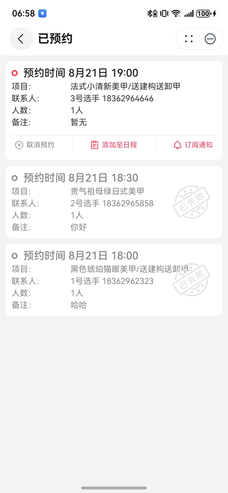

# 预约管理卡片组件快速入门

## 目录

- [简介](#简介)
- [约束与限制](#约束与限制)
- [快速入门](#快速入门)
- [API参考](#API参考)
- [示例代码](#示例代码)

## 简介

本组件支持查看预约信息、添加日程、订阅通知、取消预约等。



## 约束与限制

### 环境

- DevEco Studio版本：DevEco Studio 5.0.3 Release及以上
- HarmonyOS SDK版本：HarmonyOS 5.0.3 Release SDK及以上
- 设备类型：华为手机（包括双折叠和阔折叠）
- 系统版本：HarmonyOS 5.0.3(15)及以上

### 权限

- 日历活动读写权限：ohos.permission.READ_CALENDAR、ohos.permission.WRITE_CALENDAR

## 快速入门

1. 安装组件。

   如果是在DevEco Studio使用插件集成组件，则无需安装组件，请忽略此步骤。

   如果是从生态市场下载组件，请参考以下步骤安装组件。

   a. 解压下载的组件包，将包中所有文件夹拷贝至您工程根目录的XXX目录下。

   b. 在项目根目录build-profile.json5添加reservation_card模块。

   ```
   // 项目根目录下build-profile.json5填写reservation_card路径。其中XXX为组件存放的目录名
   "modules": [
     {
       "name": "reservation_card",
       "srcPath": "./XXX/reservation_card"
     }
   ]
   ```

   c. 在项目根目录oh-package.json5添加依赖。
   ```
   // XXX为组件存放的目录名称
   "dependencies": {
     "reservation_card": "file:./XXX/reservation_card"
   }
   ```

2. 引入组件。

    ```
    import { ReservationCard } from 'reservation_card';
    ```

3. 调用组件，详细参数配置说明参见[API参考](#API参考)。

4. （可选）如需使用订阅能力，需要配置推送服务。

   a. [开通推送服务](https://developer.huawei.com/consumer/cn/doc/atomic-guides/push-as-prepare)。

   b. 开通服务并选择订阅模板，详细参考：[开通服务通知并选择订阅模板](https://developer.huawei.com/consumer/cn/doc/atomic-guides/push-as-service-noti)。

   [说明]
   本组件只包含客户端侧代码的实现，如需完整体验推送能力，还需要补充服务端开发。详细参考：[推送基于账号的订阅消息](https://developer.huawei.com/consumer/cn/doc/atomic-guides/push-as-send-sub-noti)。

## API参考

### 接口

ReservationCard(option?: [ReservationCardOptions](#ReservationCardOptions对象说明))

预约管理卡片组件

**参数：**

| 参数名     | 类型                                                    | 是否必填 | 说明             |
|:--------|:------------------------------------------------------|:-----|:---------------|
| options | [ReservationCardOptions](#ReservationCardOptions对象说明) | 否    | 配置预约管理卡片组件的参数。 |

### ReservationCardOptions对象说明

| 参数名                | 类型                                                     | 是否必填 | 说明                      |
|:-------------------|:-------------------------------------------------------|:-----|:------------------------|
| appointInfo        | [AppointmentInfo](#AppointmentInfo对象说明)                | 否    | 预约信息                    |
| themeColor         | ResourceColor                                          | 否    | 主题色                     |
| entityIds          | string                                                 | 否    | 推送模板订阅ID，多个ID以英文逗号(,)连接 |
| systemLanguage     | string                                                 | 否    | 系统语言                    |
| updateReservation  | (setSchedule: number, setSubscription: number) => void | 否    | 更新预约信息事件回调              |
| cancelReservation  | () => void                                             | 否    | 取消预约事件回调                |
| refreshReservation | () => void                                             | 否    | 刷新预约信息事件回调              |

### AppointmentInfo对象说明

| 参数名             | 类型                                | 是否必填 | 说明      |
|:----------------|:----------------------------------|:-----|:--------|
| reserveTime     | number                            | 是    | 预约时间    |
| itemName        | string                            | 是    | 预约的项目名称 |
| contactName     | string                            | 是    | 联系人姓名   |
| contactPhone    | string                            | 是    | 联系人电话   |
| numbers         | number                            | 是    | 预约人数    |
| remarks         | string                            | 否    | 预约备注    |
| state           | [AppointState](#AppointState枚举说明) | 是    | 预约状态    |
| setSchedule     | number                            | 是    | 是否添加到日程 |
| setSubscription | number                            | 是    | 是否订阅推送  |

### AppointState枚举说明

| 名称     | 说明  |
|:-------|:----|
| NEW    | 新预约 |
| FINISH | 已完成 |
| CANCEL | 已取消 |

## 示例代码

```ts
import { ReservationCard, AppointmentInfo, IAppointment } from 'reservation_card';

@Entry
@ComponentV2
struct Sample1 {
  @Local list: AppointmentInfo[] = [
    new AppointmentInfo({
      reserveTime: 1767061800000,
      itemName: '法式美甲',
      contactName: '1号选手',
      contactPhone: '130****1212',
      numbers: 2,
      remarks: '大概会晚到一会',
      state: 10,
      setSchedule: 0,
      setSubscription: 0,
    } as IAppointment),
    new AppointmentInfo({
      reserveTime: 1755769268621,
      itemName: '猫眼美甲',
      contactName: '2号选手',
      contactPhone: '130****1212',
      numbers: 4,
      remarks: '',
      state: 30,
      setSchedule: 0,
      setSubscription: 0,
    } as IAppointment),
  ];

  build() {
    NavDestination() {
      Scroll() {
        Column({ space: 10 }) {
          ForEach(this.list, (v: AppointmentInfo, index: number) => {
            ReservationCard({
              appointInfo: v,
              // todo: 替换为实际的推送服务通知模板ID，多个ID以英文逗号(,)连接
              entityIds: 'xxx',
              cancelReservation: () => {
                this.list.splice(index, 1);
                this.getUIContext().getPromptAction().showToast({ message: '已取消预约' });
              },
            })
          }, (v: AppointmentInfo) => JSON.stringify(v))
        }
      }
      .width('100%')
      .height('100%')
      .align(Alignment.Top)
      .scrollBar(BarState.Off)
      .edgeEffect(EdgeEffect.Spring)
    }
    .title('预约管理卡片列表')
    .backgroundColor($r('sys.color.background_secondary'))
    .padding(16)
  }
}
```
