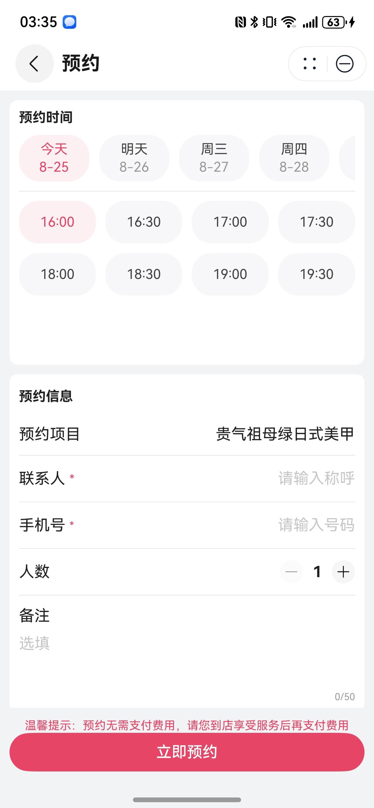

# 预约表单组件快速入门

## 目录

- [简介](#简介)
- [约束与限制](#约束与限制)
- [快速入门](#快速入门)
- [API参考](#API参考)
- [示例代码](#示例代码)

## 简介

本组件支持填写预约表单信息，包括预约时间、预约联系人等。



## 约束与限制

### 环境

- DevEco Studio版本：DevEco Studio 5.0.3 Release及以上
- HarmonyOS SDK版本：HarmonyOS 5.0.3 Release SDK及以上
- 设备类型：华为手机（包括双折叠和阔折叠）
- 系统版本：HarmonyOS 5.0.3(15)及以上

## 快速入门

1. 安装组件。

   如果是在DevEco Studio使用插件集成组件，则无需安装组件，请忽略此步骤。

   如果是从生态市场下载组件，请参考以下步骤安装组件。

   a. 解压下载的组件包，将包中所有文件夹拷贝至您工程根目录的XXX目录下。

   b. 在项目根目录build-profile.json5添加reservation_form模块。

   ```
   // 项目根目录下build-profile.json5填写reservation_form路径。其中XXX为组件存放的目录名
   "modules": [
     {
       "name": "reservation_form",
       "srcPath": "./XXX/reservation_form"
     }
   ]
   ```

   c. 在项目根目录oh-package.json5添加依赖。
   ```
   // XXX为组件存放的目录名称
   "dependencies": {
     "reservation_form": "file:./XXX/reservation_form"
   }
   ```

2. 引入组件。

    ```
    import { ReservationForm } from 'reservation_form';
    ```

3. 调用组件，详细参数配置说明参见[API参考](#API参考)。

## API参考

### 接口

ReservationForm(option?: [ReservationFormOptions](#ReservationFormOptions对象说明))

预约管理卡片组件

**参数：**

| 参数名     | 类型                                                    | 是否必填 | 说明             |
|:--------|:------------------------------------------------------|:-----|:---------------|
| options | [ReservationFormOptions](#ReservationFormOptions对象说明) | 否    | 配置预约管理卡片组件的参数。 |

### ReservationFormOptions对象说明

| 参数名             | 类型                                              | 是否必填 | 说明               |
|:----------------|:------------------------------------------------|:-----|:-----------------|
| projectName     | string                                          | 否    | 预约项目名称           |
| themeColor      | string                                          | 否    | 主题色，十六进制，带#      |
| btnLabel        | ResourceStr                                     | 否    | 提交按钮文字           |
| isSubmitLoading | boolean                                         | 否    | 提交按钮loading防暴力点击 |
| submitForm      | (formData: [IFormData](#IFormData对象说明)) => void | 否    | 提交表单事件回调         |

### IFormData对象说明

| 参数名         | 类型     | 说明         |
|:------------|:-------|:-----------|
| name        | string | 联系人姓名      |
| phone       | string | 联系人手机号     |
| reserveTime | string | 预约时间，时间戳类型 |
| remarks     | string | 预约备注       |
| numbers     | string | 预约人数       |

## 示例代码

```ts
import { ReservationForm, IFormData } from 'reservation_form';

@Entry
@ComponentV2
struct Sample1 {
  @Local isSubmitLoading: boolean = false;

  build() {
    NavDestination() {
      Column() {
        ReservationForm({
          projectName: '猫眼美甲',
          btnLabel: '立即预约',
          isSubmitLoading: this.isSubmitLoading,
          submitForm: (formData: IFormData) => {
            console.log('form data: ' + JSON.stringify(formData));
            this.isSubmitLoading = true;
            setTimeout(() => {
              this.isSubmitLoading = false;
              this.getUIContext().getPromptAction().showToast({ message: '提交成功' });
            }, 200);
          },
        })
      }
      .width('100%')
      .height('100%')
      .padding(16)
    }
    .title('预约', { backgroundColor: Color.White })
  }
}
```
