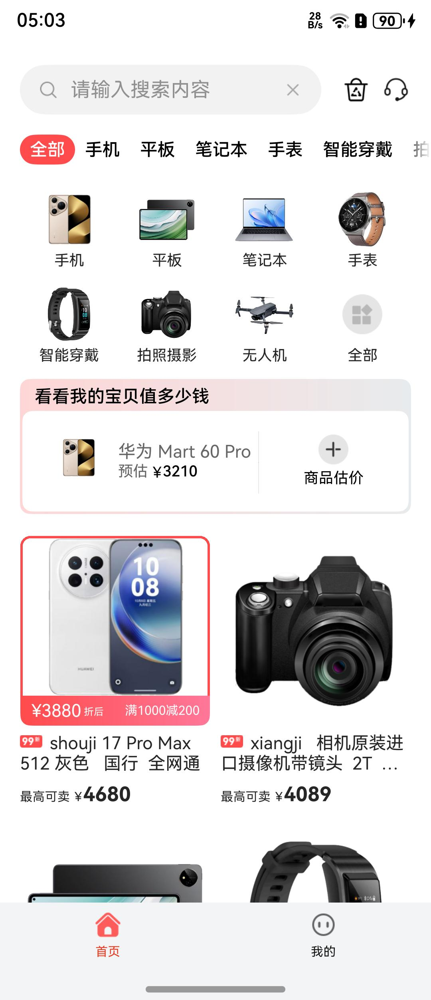
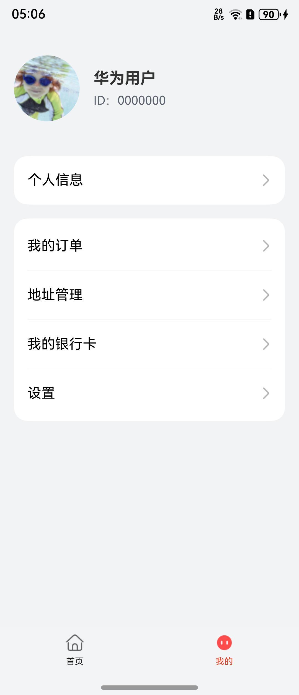
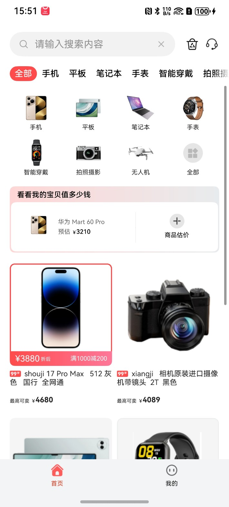
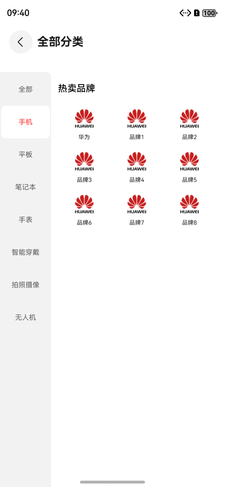
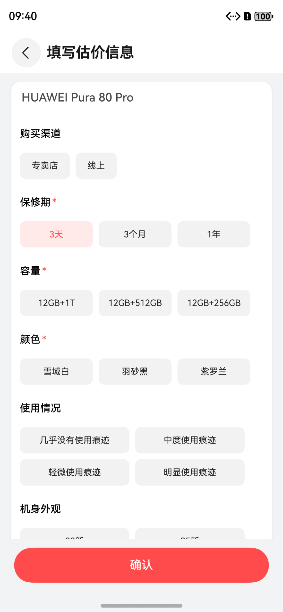
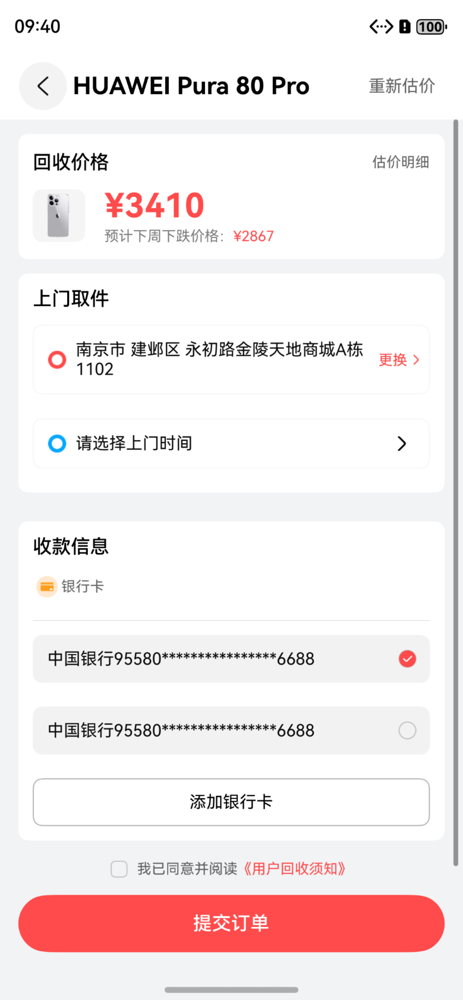
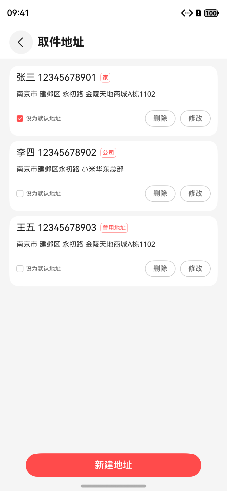
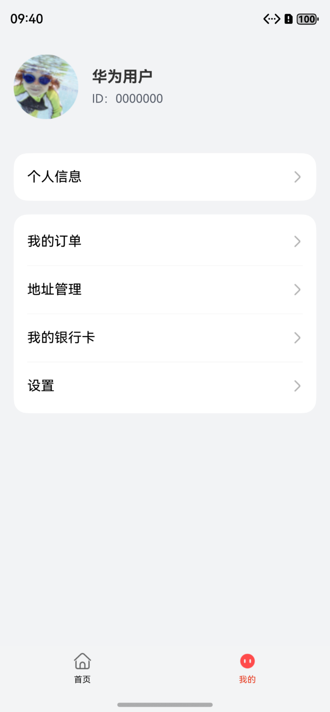

# 购物（回收）应用模板快速入门

## 目录

- [功能介绍](#功能介绍)
- [约束与限制](#约束与限制)
- [快速入门](#快速入门)
- [示例效果](#示例效果)
- [开源许可协议](#开源许可协议)

## 功能介绍

您可以基于此模板直接定制应用，也可以挑选此模板中提供的多种组件使用，从而降低您的开发难度，提高您的开发效率。

本模板提供如下组件，所有组件存放在工程根目录的components下，如果您仅需使用组件，可参考对应组件的指导链接；如果您使用此模板，请参考本文档。

| 组件                              | 描述                    | 使用指导                                               |
|:--------------------------------|:----------------------|:---------------------------------------------------|
| 回收估价表单组件（valuation_information） | 构建手机/电脑回收估价页面         | [使用指导](components/valuation_information/README.md) |
| 通用地址管理组件（address_management）    | 地址列表选择与编辑，支持地图与账号能力扩展 | [使用指导](components/address_management/README.md)    |
| 时间轴组件（module_time_line）         | 订单物流时间轴展示与进度节点        | [使用指导](components/module_time_line/README.md)      |
| 通用登录组件（aggregated_login）        | 华为账号一键登录与其他登录方式       | [使用指导](components/aggregated_login/README.md)      |
| 通用问题反馈组件（feedback）              | 问题反馈记录与提交             | [使用指导](components/feedback/README.md)              |
| 检测应用更新组件（check_app_update）      | 检测新版本与引导更新            | [使用指导](components/check_app_update/README.md)      |
| 通用个人信息组件（collect_personal_info） | 头像、昵称、手机号、生日、简介等信息采集  | [使用指导](components/collect_personal_info/README.md) |
| 通用分类列表组件（category_list）         | 宫格或者列表形式分类展示信息        | [使用指导](components/category_list/README.md)         |
| 列表筛选组件（module_filter_list）      | 列表筛选组件，支持条件筛选和列表展示    | [使用指导](components/module_filter_list/README.md)    |
| 时间选择弹窗组件（module_time_select）    | 底部弹窗选择日期时间            | [使用指导](components/module_time_select/README.md)    |
| 日历组件（calendar_select）           | 入住、离开日期选择             | [使用指导](components/calendar_select/README.md)       |
| 通用城市选择组件（city_select）           | 选择城市的功能，长按城市按钮将显示城市全称 | [使用指导](components/city_select/README.md)           |

本模板为回收类应用提供了常用功能的开发样例，模板主要分首页和我的两大模块：

- 首页：提供订单详情、流程步骤线、物流时间轴、师傅热线、上门地址/时间修改等功能。
- 我的：提供登录、个人信息管理、意见反馈、设置等功能。

本模板已集成回收服务、华为账号、订单流程、地址管理、银行卡等服务，支持创建订单、编辑地址、我的设置等特性，提供完整的回收服务应用解决方案，只需做少量配置和定制即可快速实现回收服务应用的核心功能。

| 首页                                                          | 我的                                                          |
|-------------------------------------------------------------|-------------------------------------------------------------|
|  |  |

本模板主要页面及核心功能如下所示：

```text
回收服务应用模板
  ├──首页
  │   ├──商品列表
  │   │   ├── 估价流程
  │   │   ├── 上门信息
  │   │   └── 提交订单
  │   │
  │   └──订单列表
  │       └──修改订单信息
  │
  └──我的
      ├──登录
      │   ├── 华为账号登录
      │   ├── 其他登录方式
      │   └── 用户隐私协议同意
      │
      ├──个人信息
      │   ├── 头像、昵称、手机号、生日
      │   └── 个人资料编辑
      │
      ├──我的订单
      │   └──订单列表
      │
      ├──地址管理
      │   
      │        
      ├──我的银行卡
      │ 
      └──设置
           ├── 个人信息
           ├── 隐私设置
           ├── 清除缓存
           ├── 版本检测
           ├── 关于我们
           └── 退出登录
```

本模板工程代码结构如下所示：

```text
RecyclingService
├──commons                                                // 公共模块
│  ├──common                                              // 基础模块
│  │    ├──basic                                          // 基础类（BaseViewModel、GlobalContext、Logger等）
│  │    ├──constant                                       // 通用常量（Constants、RouterMap等）
│  │    ├──model                                          // 数据模型（UserInfo、FileInfo等）
│  │    ├──service                                        // 通用服务
│  │    ├──ui                                             // 通用UI组件（Header、WebView等）
│  │    └──util                                           // 通用工具方法（权限、缓存、文件、时间等工具类）
│  │
│  └──oh_router                                           // 路由模块（页面管理、路由跳转）
│
├──components                                             // 组件模块
│  ├──aggregated_login                                    // 通用登录组件
│  ├──feedback                                            // 通用问题意见反馈组件
│  ├──check_app_update                                    // 检测应用更新组件
│  ├──collect_personal_info                               // 通用个人信息收集组件
│  ├──address_management                                  // 地址管理组件
│  ├──valuation_information                               // 估价与客服弹窗组件
│  ├──module_time_line                                    // 时间轴组件
│  ├──category_list                                       // 通用分类列表组件
│  ├──module_filter_list                                  // 列表筛选组件
│  ├──module_time_select                                  // 时间选择弹窗组件
│  ├──calendar_select                                     // 日历组件
│  ├──city_select                                         // 通用城市选择组件
│  └──recyclingservice_process_step                       // 流程步骤线组件
│
├──features                                               // 功能模块
│  └──person                                              // 个人中心模块
│       ├──comp                                           // 组件（用户信息行等）
│       ├──viewmodel                                      // 视图模型
│       └──views                                          // 视图页面
│           ├──MyOrderPage.ets                            // 我的订单页面
│           ├──MyOrderDetailPage.ets                      // 订单详情页面
│           ├──MyOrderProcessOneView.ets                  // 流程步骤线视图
│           ├──MyOrderProcessThreeView.ets                // 物流时间轴视图
│           ├──LoginPage.ets                              // 登录页面
│           ├──PrivacySettingsPage.ets                    // 隐私设置页面
│           ├──PrivacyAgreementPage.ets                   // 隐私协议页面
│           ├──PrivacyInfoCollectPage.ets                 // 隐私信息收集页面
│           ├──Privacy3rdPartySharePage.ets               // 第三方信息共享页面
│           └──MinePage.ets                               // 我的页面
│
└──products                                               // 产品模块
   └──entry/src/main/ets                                  // 入口模块
        ├──entryability                                   // 入口能力
        │   └──EntryAbility.ets                           // 应用入口
        ├──entrybackupability                             // 入口备份能力
        │   └──EntryBackupAbility.ets                     // 应用备份入口
        ├──pages                                          // 页面
        │   └──Index.ets                                  // 首页
        └──viewmodels                                     // 视图模型
            └──IndexVM.ets                                // 首页视图模型
```

## 约束与限制

### 环境

- DevEco Studio 版本：DevEco Studio 5.0.5 Release 及以上
- HarmonyOS SDK 版本：HarmonyOS 5.0.3(15) Release SDK 及以上
- 设备类型：华为手机（包括双折叠和阔折叠）
- 系统版本：HarmonyOS 5.0.3 及以上

### 权限

- 网络权限: ohos.permission.INTERNET
- 震动权限: ohos.permission.VIBRATE

## 快速入门

### 配置工程

在运行此模板前，需要完成以下配置：

1. 在 AppGallery Connect 创建应用，将包名配置到模板中。

   a. 参考[创建 HarmonyOS 应用](https://developer.huawei.com/consumer/cn/doc/app/agc-help-create-app-0000002247955506)
   为应用创建 APP ID，并将 APP ID 与应用进行关联。

   b. 返回应用列表页面，查看应用的包名。

   c. 将模板工程根目录下 AppScope/app.json5 文件中的 bundleName 替换为创建应用的包名。

2. 配置华为账号服务。

   a. 将应用的 Client ID 配置到 products/entry/src/main 路径下的 module.json5
   文件中，详细参考：[配置 Client ID](https://developer.huawei.com/consumer/cn/doc/harmonyos-guides/account-client-id)。

   b.
   申请华为账号登录所需权限，详细参考：[申请账号权限](https://developer.huawei.com/consumer/cn/doc/harmonyos-guides/account-config-permissions)。

3. 接入微信 SDK（可选）。

   前往微信开放平台申请 AppID
   并配置鸿蒙应用信息，详情参考：[鸿蒙接入指南](https://developers.weixin.qq.com/doc/oplatform/Mobile_App/Access_Guide/ohos.html)。

4. 对应用进行[手工签名](https://developer.huawei.com/consumer/cn/doc/harmonyos-guides/ide-signing#section297715173233)。

5.
添加手工签名所用证书对应的公钥指纹，详细参考：[配置公钥指纹](https://developer.huawei.com/consumer/cn/doc/app/agc-help-cert-fingerprint-0000002278002933)。

### 运行调试工程

1. 连接调试手机和 PC。

2. 菜单选择"Run > Run 'entry' "或者"Run > Debug 'entry' "，运行或调试模板工程。

## 示例效果

### 商品估价流程

|                         首页                          |                          全部分类                           |
|:---------------------------------------------------:|:-------------------------------------------------------:|
|  |  |

|                         估价                          |                          提交订单                           |
|:---------------------------------------------------:|:-------------------------------------------------------:|
|  |  |

### 地址管理与设置

|                          地址管理                           |                         设置                          |
|:-------------------------------------------------------:|:---------------------------------------------------:|
|  |  |

## 开源许可协议

该代码经过[Apache 2.0 授权许可](http://www.apache.org/licenses/LICENSE-2.0)。
