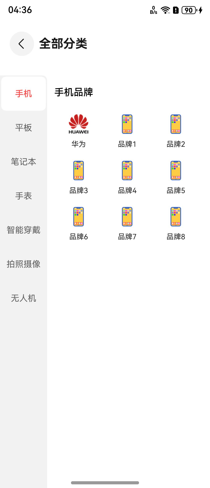
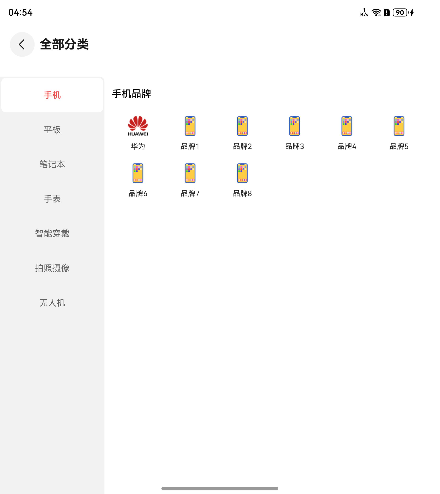
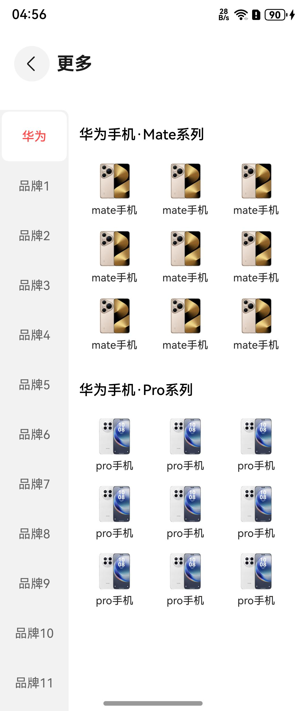
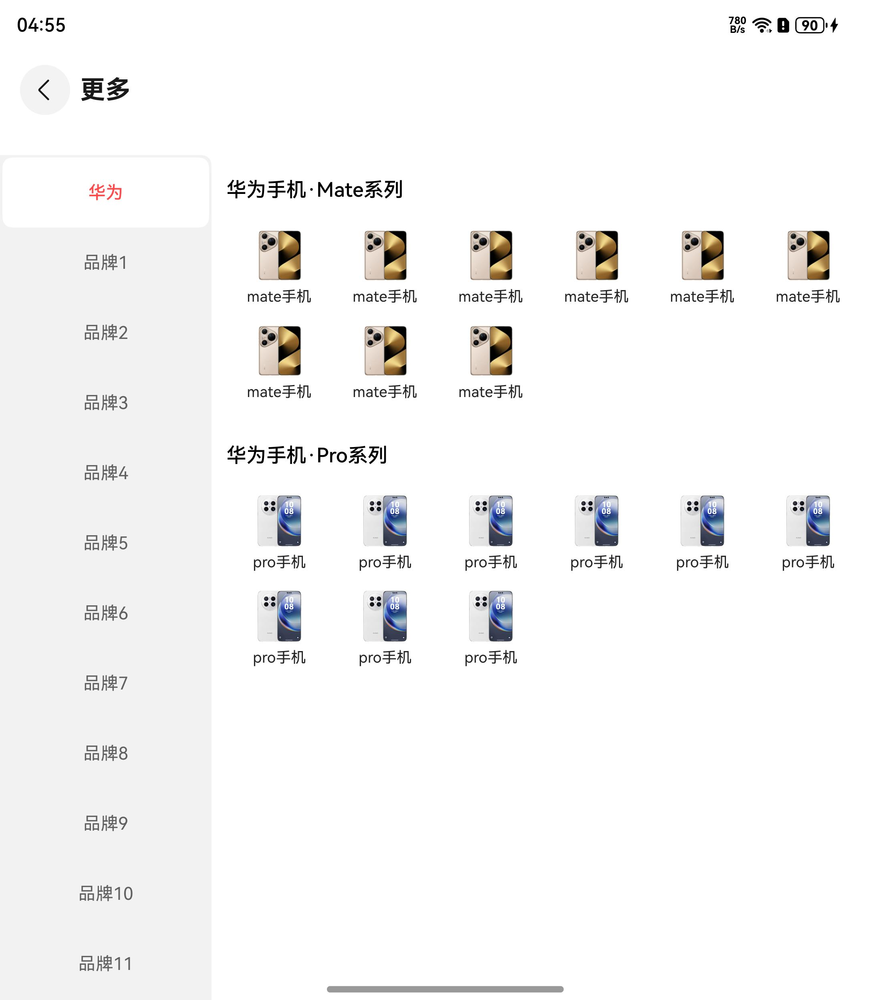

# 通用分类列表组件快速入门

## 目录

- [简介](#简介)
- [约束与限制](#约束与限制)
- [快速入门](#快速入门)
- [API参考](#API参考)
- [示例代码](#示例代码)

## 简介

本组件提供了以宫格或者列表形式分类展示信息的功能。

<div style='overflow-x:auto'>
  <table style='min-width:800px'>
    <tr>
      <th></th>
      <th>直板机</th>
      <th>折叠屏</th>
    </tr>
    <tr>
      <th scope='row'>全部分类</th>
      <td valign='top'></td>
      <td valign='top'></td>
    </tr>
    <tr>
      <th scope='row'>更多</th>
      <td valign='top'></td>
      <td valign='top'></td>
    </tr>
  </table>
</div>

## 约束与限制

### 环境

- DevEco Studio版本：DevEco Studio 5.0.5 Release及以上
- HarmonyOS SDK版本：HarmonyOS 5.0.5 Release SDK及以上
- 设备类型：华为手机（包括双折叠和阔折叠）、华为平板
- 系统版本：HarmonyOS 5.0.1(13) 及以上

### 权限

无

## 快速入门

1. 安装组件。

   如果是在DevEco Studio使用插件集成组件，则无需安装组件，请忽略此步骤。

   如果是从生态市场下载组件，请参考以下步骤安装组件。

   a. 解压下载的组件包，将包中所有文件夹拷贝至您工程根目录的xxx目录下。

   b. 在项目根目录build-profile.json5并添加category_list模块。
   ```
   // 在项目根目录的build-profile.json5填写category_list路径。其中xxx为组件存在的目录名
   "modules": [
     {
       "name": "category_list",
       "srcPath": "./xxx/category_list",
     }
   ]
   ```
   c. 在项目根目录oh-package.json5中添加依赖。
   ```
   // xxx为组件存放的目录名称
   "dependencies": {
     "category_list": "file:./xxx/category_list"
   }
   ```

2. 引入分类组件句柄。

   ```
   import { CategoryItem, SubCategoryItem, ItemInfo, CategoryList, LayoutType } from 'category_list';
   ```

3. 调用组件，详细参数配置说明参见[API参考](#API参考)。

## API参考

### 接口

CategoryList(options?: CategoryListOptions)

按分类展示列表组件。
**参数：**

| 参数名     | 类型                                              | 是否必填 | 说明       |
|:--------|:------------------------------------------------|:-----|:---------|
| options | [CategoryListOptions](#CategoryListOptions对象说明) | 是    | 分类列表组件参数 |

### CategoryListOptions对象说明

| 参数名              | 类型                                                                                                        | 是否必填 | 说明                         |
|------------------|-----------------------------------------------------------------------------------------------------------|------|----------------------------|
| categoryTabs     | [CategoryItem](#CategoryItem对象说明)[]                                                                       | 是    | 一级分类列表数据                   |
| productList      | [SubCategoryItem](#SubCategoryItem对象说明)[]                                                                 | 是    | 二级列表项                      |
| initIndex        | number                                                                                                    | 否    | 一级分类列表初始索引                 |       |    |                   |
| layoutType       | [LayoutType](#LayoutType枚举说明)                                                                             | 否    | 二级分类列表展示方式为宫格或列表，默认为宫格     |
| themeColor       | [ResourceColor](https://developer.huawei.com/consumer/cn/doc/harmonyos-references/ts-types#resourcecolor) | 否    | 主题色                        |
| tabBarScroller   | Scroller                                                                                                  | 否    | 一级分类滚动控制器                  |
| subBarScroller   | Scroller                                                                                                  | 否    | 二级分类滚动控制器                  |
| scroller         | Scroller                                                                                                  | 否    | 宫格或列表项滚动控制器                |
| itemBuilderParam | (item: [ItemInfo](#ItemInfo对象说明)) => void                                                                 | 否    | 自定义二级列表项组件内容，默认设置宫格布局或列表布局 |

### CategoryItem对象说明

| 名称            | 类型          | 是否必填 | 说明              |
|---------------|-------------|------|-----------------|
| id            | string      | 是    | 一级分类id          |
| label         | string      | 是    | 一级分类名称          |
| iconUrl       | ResourceStr | 否    | 一级分类图标          |
| subCategoryId | string[]    | 否    | 一级分类所包含的二级子分类id |

### SubCategoryItem对象说明

| 名称       | 类型                          | 是否必填 | 说明        |
|----------|-----------------------------|------|-----------|
| id       | string                      | 是    | 二级分类id    |
| label    | string                      | 是    | 二级分类名称    |
| itemList | [ItemInfo](#ItemInfo对象说明)[] | 是    | 二级分类包含的列表 |

### ItemInfo对象说明

| 名称          | 类型     | 是否必填 | 说明  |
|-------------|--------|------|-----|
| id          | string | 是    | id  |
| title       | string | 是    | 名称  |
| description | string | 否    | 描述  |
| imgSrc      | string | 否    | 缩略图 |

#### LayoutType枚举说明

| 名称   | 值 | 说明 |
|:-----|:--|:---|
| GRID | 0 | 宫格 |
| LIST | 1 | 列表 |

### 事件

支持以下事件：

#### onTabClick

onTabClick(callback: (tabItem: [CategoryItem](#CategoryItem对象说明)) => void)

点击左侧一级分类触发事件

#### onItemClick

onItemClick(callback: (itemDetail: [ItemInfo](#ItemInfo对象说明)) => void)

点击右侧列表项触发事件

## 示例代码

```
import { CategoryItem, SubCategoryItem, ItemInfo, CategoryList, LayoutType } from 'category_list';

@Entry
@ComponentV2
struct CategoryListSample {
   @Local currentIndex: number = 0
   @Local themeColor: ResourceColor = '#0A59F7'

   build() {
      NavDestination() {
         RelativeContainer() {
            CategoryList({
               categoryTabs: this.tabList,
               productList: this.recipeCategoryList,
               initIndex: this.currentIndex,
               layoutType: LayoutType.GRID,
               themeColor: this.themeColor,
               tabBarScroller: new Scroller(),
               subBarScroller: new Scroller(),
               scroller: new Scroller(),
               itemBuilderParam: this.itemBuilder,
               onTabClick: (tabItem: CategoryItem) => {
                  this.getProductList(tabItem)
               },
               onItemClick: (itemDetail: ItemInfo) => {
                  // 待实现，跳转详情页
               },
            })
         }.height('100%').width('100%')
      }.hideToolBar(true).title('分类')
   }

   @Builder
   itemBuilder(item: ItemInfo) {
      Image($r(`app.media.${item.imgSrc}`))
         .borderRadius(8)
      Text(item.title)
         .fontSize($r('sys.float.Body_M'))
         .fontWeight(FontWeight.Medium)
         .fontColor($r('sys.color.font_primary'))
         .textAlign(TextAlign.Center)
         .maxLines(1)
         .textOverflow({ overflow: TextOverflow.Ellipsis })
         .margin({ top: 8 })
   }


   getProductList(tabItem: CategoryItem) {
      switch (tabItem.id) {
         case '1':
            this.recipeCategoryList = this.list1;
            break;
         case '2':
            this.recipeCategoryList = this.list2;
            break;
         case '3':
            this.recipeCategoryList = this.list3;
            break;
         default:
            this.recipeCategoryList = [];
            break;
      }
   }
   
   // todo 所有的imgSrc需要替换为开发者所需的图像资源文件。
   @Local list1: SubCategoryItem[] = [{
      id: '1001',
      label: '热门菜肴',
      itemList: [{
         id: '1001_1',
         title: '西红柿牛腩1001',
         imgSrc: 'thumbnail12',
         description: '牛肉软烂，汤汁浓郁。'
      },
         {
            id: '1001_2',
            title: '可乐鸡翅',
            imgSrc: 'thumbnail13',
            description: '色泽红亮，甜香可口的家常美食。'
         },
         {
            id: '1001_3',
            title: '宫保鸡丁',
            imgSrc: 'thumbnail1',
            description: '经典的中式家常菜，鸡肉鲜嫩，花生米香脆，口味香辣酸甜。'
         },
         {
            id: '1001_4',
            title: '鱼香肉丝',
            imgSrc: 'thumbnail3',
            description: '具有鱼香味的经典川菜，肉丝鲜嫩，配菜丰富。'
         },
         {
            id: '1001_5',
            title: '糖醋排骨',
            imgSrc: 'thumbnail5',
            description: '色泽红亮，口味酸甜的经典家常菜。'
         }],
   }, {
      id: '1002',
      label: '家常菜',
      itemList: [{
         id: '1002_1',
         title: '清蒸鱼1002',
         imgSrc: 'thumbnail7',
         description: '清淡鲜美，保留鱼的原汁原味，营养丰富。'
      }, {
         id: '1002_2',
         title: '油焖大虾',
         imgSrc: 'thumbnail10',
         description: '色泽红亮，虾肉鲜嫩，味道浓郁。'
      },
         {
            id: '1002_3',
            title: '清炒西兰花',
            imgSrc: 'thumbnail24',
            description: '一道清爽可口的素菜，西兰花营养丰富。'
         },
         {
            id: '1002_4',
            title: '醋溜白菜',
            imgSrc: 'thumbnail25',
            description: '酸甜可口，开胃下饭的醋溜白菜。'
         }],
   }, {
      id: '1003',
      label: '下饭菜',
      itemList: [{
         id: '1003_1',
         title: '清蒸鱼1003',
         imgSrc: 'thumbnail7',
         description: '清淡鲜美，保留鱼的原汁原味，营养丰富。'
      },
         {
            id: '1003_2',
            title: '油焖大虾',
            imgSrc: 'thumbnail10',
            description: '色泽红亮，虾肉鲜嫩，味道浓郁。'
         },
         {
            id: '1003_3',
            title: '醋溜白菜',
            imgSrc: 'thumbnail25',
            description: '酸甜可口，开胃下饭的醋溜白菜。'
         }],
   }, {
      id: '1004',
      label: '快手菜',
      itemList: [{
         id: '1004_1',
         title: '清蒸鱼1004',
         imgSrc: 'thumbnail7',
         description: '清淡鲜美，保留鱼的原汁原味，营养丰富。'
      },
         {
            id: '1004_2',
            title: '油焖大虾',
            imgSrc: 'thumbnail10',
            description: '色泽红亮，虾肉鲜嫩，味道浓郁。'
         },
         {
            id: '1004_3',
            title: '清炒西兰花',
            imgSrc: 'thumbnail24',
            description: '一道清爽可口的素菜，西兰花营养丰富。'
         }],
   }, {
      id: '1005',
      label: '肉类',
      itemList: [{
         id: '1005_1',
         title: '清蒸鱼1005',
         imgSrc: 'thumbnail7',
         description: '清淡鲜美，保留鱼的原汁原味，营养丰富。'
      },
         {
            id: '1005_2',
            title: '油焖大虾',
            imgSrc: 'thumbnail10',
            description: '色泽红亮，虾肉鲜嫩，味道浓郁。'
         },
         {
            id: '1005_3',
            title: '清炒西兰花',
            imgSrc: 'thumbnail24',
            description: '一道清爽可口的素菜，西兰花营养丰富。'
         }],
   }, {
      id: '1006',
      label: '夜宵',
      itemList: [{
         id: '1006_1',
         title: '清蒸鱼1006',
         imgSrc: 'thumbnail7',
         description: '清淡鲜美，保留鱼的原汁原味，营养丰富。'
      },
         {
            id: '1006_2',
            title: '油焖大虾',
            imgSrc: 'thumbnail10',
            description: '色泽红亮，虾肉鲜嫩，味道浓郁。'
         },
         {
            id: '1006_3',
            title: '清炒西兰花',
            imgSrc: 'thumbnail24',
            description: '一道清爽可口的素菜，西兰花营养丰富。'
         }],
   }];
   @Local list2 : SubCategoryItem[] = [{
      id: '2001',
      label: '海鲜',
      itemList: [{
         id: '2001_1',
         title: '清蒸鱼2001',
         imgSrc: 'thumbnail7',
         description: '清淡鲜美，保留鱼的原汁原味，营养丰富。'
      },
         {
            id: '2001_2',
            title: '油焖大虾',
            imgSrc: 'thumbnail10',
            description: '色泽红亮，虾肉鲜嫩，味道浓郁。'
         },
         {
            id: '2001_3',
            title: '清炒西兰花',
            imgSrc: 'thumbnail24',
            description: '一道清爽可口的素菜，西兰花营养丰富。'
         },
         {
            id: '2001_4',
            title: '醋溜白菜',
            imgSrc: 'thumbnail25',
            description: '酸甜可口，开胃下饭的醋溜白菜。'
         },
         {
            id: '2001_5',
            title: '地三鲜',
            imgSrc: 'thumbnail8',
            description: '经典的东北素菜，鲜香下饭。'
         }],
   }, {
      id: '2002',
      label: '热门菜肴',
      itemList: [{
         id: '2002_1',
         title: '西红柿牛腩2002',
         imgSrc: 'thumbnail12',
         description: '牛肉软烂，汤汁浓郁，酸甜可口。'
      },
         {
            id: '2002_2',
            title: '可乐鸡翅',
            imgSrc: 'thumbnail13',
            description: '色泽红亮，甜香可口的家常美食。'
         },
         {
            id: '2002_3',
            title: '宫保鸡丁',
            imgSrc: 'thumbnail1',
            description: '经典的中式家常菜，鸡肉鲜嫩，花生米香脆，口味香辣酸甜。'
         },
         {
            id: '2002_4',
            title: '鱼香肉丝',
            imgSrc: 'thumbnail3',
            description: '具有鱼香味的经典川菜，肉丝鲜嫩，配菜丰富。'
         },
         {
            id: '2002_5',
            title: '糖醋排骨',
            imgSrc: 'thumbnail5',
            description: '色泽红亮，口味酸甜的经典家常菜。'
         }],
   }, {
      id: '2003',
      label: '蔬菜',
      itemList: [{
         id: '2003_1',
         title: '清蒸鱼2003',
         imgSrc: 'thumbnail7',
         description: '清淡鲜美，保留鱼的原汁原味，营养丰富。'
      },
         {
            id: '2003_2',
            title: '油焖大虾',
            imgSrc: 'thumbnail10',
            description: '色泽红亮，虾肉鲜嫩，味道浓郁。'
         },
         {
            id: '2003_3',
            title: '清炒西兰花',
            imgSrc: 'thumbnail24',
            description: '一道清爽可口的素菜，西兰花营养丰富。'
         },
         {
            id: '2003_4',
            title: '醋溜白菜',
            imgSrc: 'thumbnail25',
            description: '酸甜可口，开胃下饭的醋溜白菜。'
         }],
   }, {
      id: '2004',
      label: '豆制品',
      itemList: [{
         id: '2004_1',
         title: '清蒸鱼2004',
         imgSrc: 'thumbnail7',
         description: '清淡鲜美，保留鱼的原汁原味，营养丰富。'
      },
         {
            id: '2004_2',
            title: '油焖大虾',
            imgSrc: 'thumbnail10',
            description: '色泽红亮，虾肉鲜嫩，味道浓郁。'
         },
         {
            id: '2004_3',
            title: '醋溜白菜',
            imgSrc: 'thumbnail25',
            description: '酸甜可口，开胃下饭的醋溜白菜。'
         }],
   }];
   @Local list3: SubCategoryItem[] =[{
      id: '3001',
      label: '家常菜',
      itemList: [{
         id: '3001_1',
         title: '清蒸鱼3001',
         imgSrc: 'thumbnail7',
         description: '清淡鲜美，保留鱼的原汁原味，营养丰富。'
      },
         {
            id: '3001_2',
            title: '油焖大虾',
            imgSrc: 'thumbnail10',
            description: '色泽红亮，虾肉鲜嫩，味道浓郁。'
         },
         {
            id: '3001_3',
            title: '清炒西兰花',
            imgSrc: 'thumbnail24',
            description: '一道清爽可口的素菜，西兰花营养丰富。'
         }],
   }, {
      id: '3002',
      label: '下饭菜',
      itemList: [{
         id: '3002_1',
         title: '清蒸鱼',
         imgSrc: 'thumbnail7',
         description: '清淡鲜美，保留鱼的原汁原味，营养丰富。'
      },
         {
            id: '3002_2',
            title: '油焖大虾',
            imgSrc: 'thumbnail10',
            description: '色泽红亮，虾肉鲜嫩，味道浓郁。'
         },
         {
            id: '3002_3',
            title: '清炒西兰花',
            imgSrc: 'thumbnail24',
            description: '一道清爽可口的素菜，西兰花营养丰富。'
         },
         {
            id: '3002_4',
            title: '醋溜白菜',
            imgSrc: 'thumbnail25',
            description: '酸甜可口，开胃下饭的醋溜白菜。'
         },
         {
            id: '3002_5',
            title: '地三鲜',
            imgSrc: 'thumbnail8',
            description: '经典的东北素菜，鲜香下饭。'
         }],
   }]
   @Local recipeCategoryList: SubCategoryItem[] = this.list1
   @Local tabList: CategoryItem[] = [{
      id: '1',
      label: '分类1',
      iconUrl: '',
      subCategoryId: ['1001', '1002', '1003', '1004', '1005', '1006'],
   }, {
      id: '2',
      label: '分类2',
      iconUrl: '',
      subCategoryId: ['2001', '2002', '2003', '2004'],
   }, {
      id: '3',
      label: '分类3',
      iconUrl: '',
      subCategoryId: ['3001', '3002', '3003', '3004'],
   }, {
      id: '4',
      label: '分类4',
      iconUrl: '',
   }, {
      id: '5',
      label: '分类5',
      iconUrl: '',
   }, {
      id: '6',
      label: '分类6',
      iconUrl: '',
   }, {
      id: '7',
      label: '分类7',
   }, {
      id: '8',
      label: '分类8',
   }, {
      id: '9',
      label: '分类9',
   }, {
      id: '10',
      label: '分类10',
   }, {
      id: '11',
      label: '分类11',
   }, {
      id: '12',
      label: '分类12',
   }, {
      id: '13',
      label: '分类13',
   }, {
      id: '14',
      label: '分类14',
   }, {
      id: '15',
      label: '分类15',
   }, {
      id: '16',
      label: '分类16',
   }];
}
```
