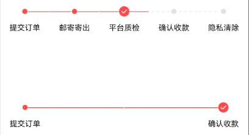

# 回收流程组件快速入门

## 目录

- [简介](#简介)
- [约束与限制](#约束与限制)
- [使用](#使用)
- [API参考](#API参考)
- [示例代码](#示例代码)

## 简介

本组件提供了显示步骤线和步骤点的功能，步骤线包括了步骤名称、线条组件和步骤小节点显示，步骤点显示当前停留在步骤线上的哪个步骤节点上，还可以
调整线的长宽和节点偏移距离（默认居中显示，偏移为0）。



## 约束与限制

### 环境

- DevEco Studio版本：DevEco Studio 5.0.5 Release及以上
- HarmonyOS SDK版本：HarmonyOS 5.0.3 Release SDK及以上
- 设备类型：华为手机（包括双折叠和阔折叠）
- 系统版本：HarmonyOS 5.0.3(15) 及以上

### 权限

无

## 使用

1. 安装组件。  
   如果是在DevEco Studio使用插件集成组件，则无需安装组件，请忽略此步骤。
   如果是从生态市场下载组件，请参考以下步骤安装组件。  
   a. 解压下载的组件包，将包中所有文件夹拷贝至您工程根目录的xxx目录下。  
   b. 在项目根目录build-profile.json5并添加recyclingservice_process_step模块。
   ```typescript
   // 在项目根目录的build-profile.json5填写cloud_view_switch路径。其中xxx为组件存在的目录名
   "modules": [
    {
      "name": 'recyclingservice_process_step',
      "srcPath": "./XXX/recyclingservice_process_step"
    }
   ]
   ```
   c. 在项目根目录oh-package.json5中添加依赖
   ```typescript
   // xxx为组件存放的目录名称
   "dependencies": {
    "recyclingservice_process_step": "file:../recyclingservice_process_step"
   }
   ```

2. 引入组件。

   ```typescript
   import { ProcessStepsView }  from 'recyclingservice_process_step';
   ```

3. 调用组件，详细参数配置说明参见[API参考](#API参考)。

   ```typescript
   // 创建参数并初始化
   // 流程步骤数组
   @Local steps1: string[] = ['提交订单', '邮寄寄出', '平台质检', '确认收款', '隐私清除']
   // 停留的节点下标
   @Local stayIndex1: number = 2
   // 偏移比例
   @Local offsetRatio1: number = 0.0
   
   // 使用组件
   ProcessStepsView({
     array: this.steps1,
     offsetRaito: this.offsetRatio1,
     processIndex: this.stayIndex1
   })
   ```

## API参考

### 接口

#### ProcessStepsView

ProcessStepsView({
array: ['提交订单', '邮寄寄出', '平台质检', '确认收款', '隐私清除'],
offsetRaito: 0.3,
processIndex: 2
})

流程步骤线组件，提供显示横向流程步骤线、步骤点等功能。

**参数：**

| 参数名          | 类型               | 是否必填 | 说明                                   |
|--------------|------------------|------|--------------------------------------|
| array        | string[]         | 是    | 步骤线的节点文本数组                           |
| processIndex | number           | 否    | 步骤线上停留的节点下标                          |
| offsetRatio  | [OffsetRatio](#OffsetRatio) | 否    | 步骤线的节点偏移距离，或者调整线的长宽，（类型：OffsetRatio） |

**注意：** 组件使用 `@Require @Param` 装饰器，array 为必填参数。

#### OffsetRatio

**参数：**

| 参数名                 | 类型     | 是否必填 | 说明                |
|---------------------|--------|------|-------------------|
| Offset_Ratio1       | number | 否    | 向右偏移0.4，两点连线缩短0.8 |
| Offset_Ratio2       | number | 否    | 向右偏移0.3，两点连线缩短0.6 |
| Offset_Ratio3       | number | 否    | 向右偏移0.2，两点连线缩短0.4 |
| Offset_Ratio4       | number | 否    | 向右偏移0.1，两点连线缩短0.2 |
| Offset_Ratio5       | number | 否    | 向左偏移0.1，两点连线延长0.2 |
| Offset_Ratio6       | number | 否    | 向左偏移0.2，两点连线延长0.4 |
| Offset_Ratio7       | number | 否    | 向左偏移0.3，两点连线延长0.6 |
| Offset_Ratio8       | number | 否    | 向左偏移0.4，两点连线延长0.8 |
| Offset_Ratio_Normal | number | 否    | 不偏移               |

## 示例代码

```typescript
import { ProcessStepsView, OffsetRatio }  from 'recyclingservice_process_step'

@Entry
@ComponentV2
struct Index {
   // 流程步骤数组
   @Local steps1: string[] = ['提交订单', '邮寄寄出', '平台质检', '确认收款', '隐私清除']
   // 停留的节点下标
   @Local stayIndex1: number = 2
   // 偏移比例
   @Local offsetRatio1: OffsetRatio = OffsetRatio.Offset_Ratio_Normal

   // 流程步骤数组
   @Local steps2: string[] = ['提交订单', '确认收款']
   // 停留的节点下标
   @Local stayIndex2: number = 1
   // 偏移比例
   @Local offsetRatio2: OffsetRatio = OffsetRatio.Offset_Ratio7

   build() {
      RelativeContainer() {
         ProcessStepsView({
            array: this.steps1,
            offsetRatio: this.offsetRatio1,
            processIndex: this.stayIndex1
         })
            .alignRules({
               middle: { align: HorizontalAlign.Center, anchor: '__container__' },
               center: { align: VerticalAlign.Center, anchor: '__container__' }
            })
            .margin({ top: 50 })
            .height(100)
            .id('process1')

         ProcessStepsView({
            array: this.steps2,
            offsetRatio: this.offsetRatio2,
            processIndex: this.stayIndex2
         })
            .alignRules({
               middle: { align: HorizontalAlign.Center, anchor: '__container__' },
               top: { align: VerticalAlign.Bottom, anchor: 'process1' }
            })
            .height(100)
            .margin({ top: 50 })
      }
      .height('100%')
         .width('100%')
   }
}
```


