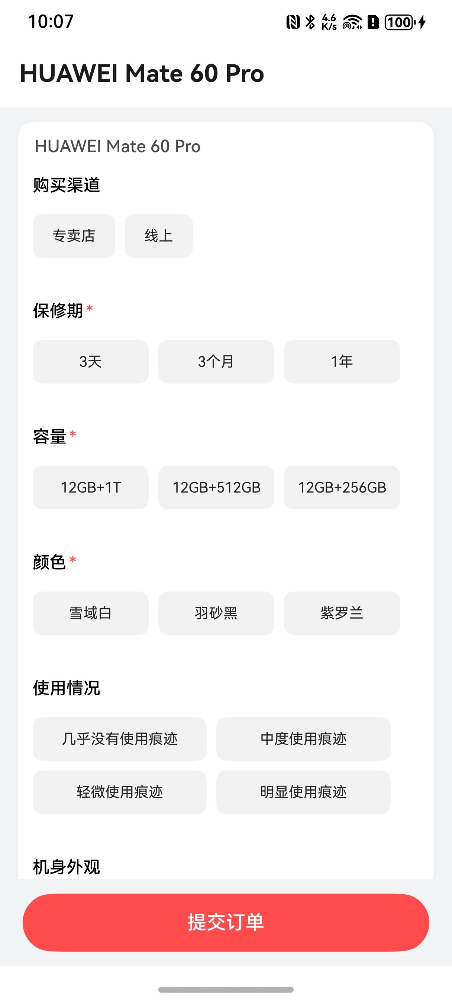
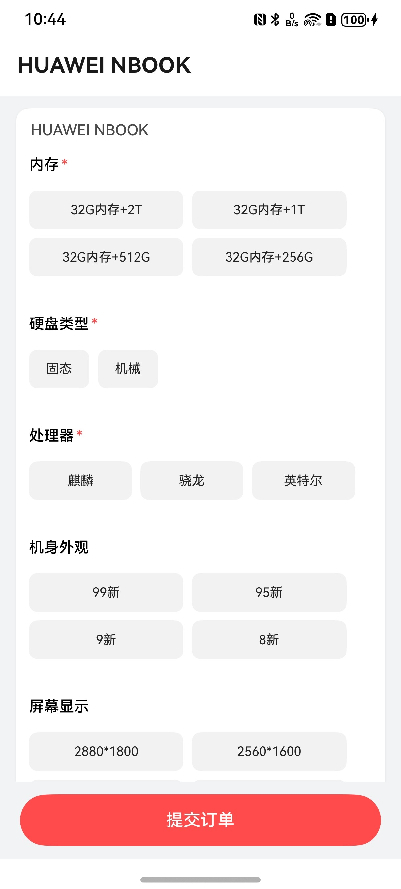

# 回收估价表单组件快速入门

## 目录

- [简介](#简介)
- [约束与限制](#约束与限制)
- [使用](#使用)
- [API参考](#API参考)
- [示例代码](#示例代码)

## 简介

本组件提供手机/电脑回收估价表单能力：

- 估价表单：通过 `BuildValuationInfoPageBuilder` 构建页面，支持型号、设备类型、选项选择与价格计算，并通过回调返回估价结果。

|                                    估价页面 （手机）                                    |                                    估价组件（电脑）                                     |
|:-------------------------------------------------------------------------------:|:-------------------------------------------------------------------------------:|
|  |  |

## 约束与限制

### 环境

- DevEco Studio 版本：DevEco Studio 5.0.5 Release 及以上
- HarmonyOS SDK 版本：HarmonyOS 5.0.3 Release SDK 及以上
- 设备类型：华为手机（包括双折叠和阔折叠）
- 系统版本：HarmonyOS 5.0.3 及以上

### 权限

- 无

## 使用

1. 安装组件

   如果是在 DevEco Studio 使用插件集成组件，则无需安装组件，请忽略此步骤。

   如果是从生态市场下载组件，请参考以下步骤安装组件。

   a. 解压下载的组件包，将包中所有文件夹拷贝至您工程根目录的 XXX 目录下。

   b. 在项目根目录 build-profile.json5 添加 valuation_information 模块。

   ```
   // 在项目根目录 build-profile.json5 填写 valuation_information 路径。其中 XXX 为组件存放的目录名
   "modules": [
     {
       "name": "valuation_information",
       "srcPath": "./XXX/valuation_information"
     }
   ]
   ```

   c. 在项目根目录 oh-package.json5 中添加依赖。

   ```
   // XXX 为组件存放的目录名称
   {
     "dependencies": {
       "valuation_information": "file:./XXX/valuation_information"
     }
   }
   ```

2. 引入组件。

   ```
   import { BuildValuationInfoPageBuilder } from 'valuation_information';
   ```

3. 调用组件，详细参数配置说明参见 [API 参考](#API参考)。

## API参考

### 接口

**BuildValuationInfoPageBuilder(params?: ValuationParams): void**

构建手机/电脑估价页面。

**参数：**

| 参数名        | 类型                              | 是否必填 | 说明                            |
|------------|---------------------------------|------|-------------------------------|
| modelName  | string                          | 否    | 机型名称                          |
| deviceType | string                          | 否    | 设备类型，`'phone'` 或 `'computer'` |
| onBack     | () => void                      | 否    | 返回事件回调                        |
| onSubmit   | (data: [SubmitData](#SubmitData)) => void | 否    | 提交估价数据回调                      |

### SubmitData

| 字段名        | 类型                   | 说明         |
|------------|----------------------|------------|
| modelName  | string               | 机型名称       |
| deviceType | string               | 设备类型       |
| price      | number               | 计算后的估价金额   |
| selections | [SelectionPair](#SelectionPair)[] | 用户已选择的项目列表 |

### SelectionPair

| 字段名        | 类型              | 说明         |
|------------|-----------------|------------|
| title  | string          | 类别名称       |
| value | string          | 被选择类别的值    |


## 示例代码

```
//估价组件
import { router } from '@kit.ArkUI'
import { BuildValuationInfoPageBuilder, SubmitData } from 'valuation_information'


@Entry
@ComponentV2
export struct ValuationDemo {

  build() {
    NavDestination() {
      Column() {
        BuildValuationInfoPageBuilder({
          modelName: 'HUAWEI Mate 60 Pro',
          deviceType: 'phone',
          onBack: () => router.back(),
          onSubmit: (data: SubmitData) => {
            const msg = `已估价：${data.modelName}（${data.deviceType}）¥${data.price},用户所选项${JSON.stringify(data)}`
            this.getUIContext().getPromptAction().showToast({ message: msg })
          }
        })
      }
      .width('100%')
      .height('100%')
    }
    .hideToolBar(true)
    .title('HUAWEI Mate 60 Pro')
  }
}

```

