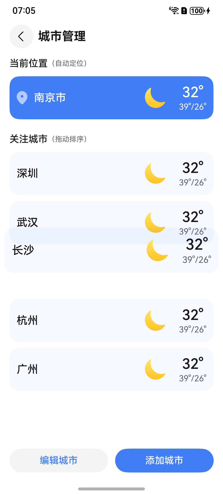
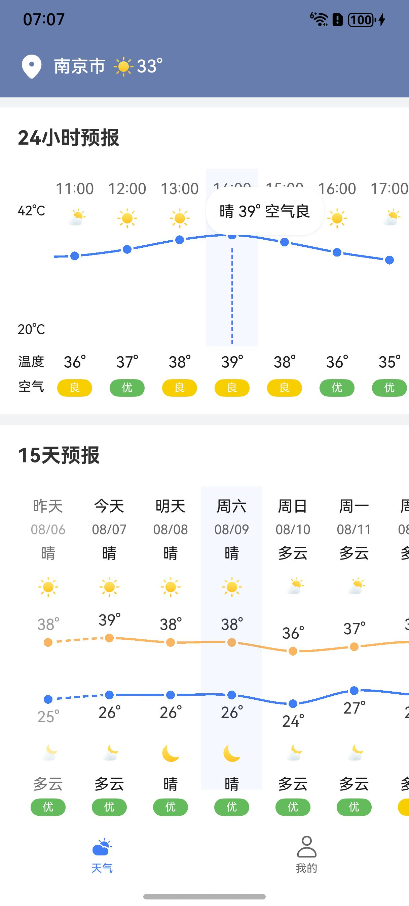
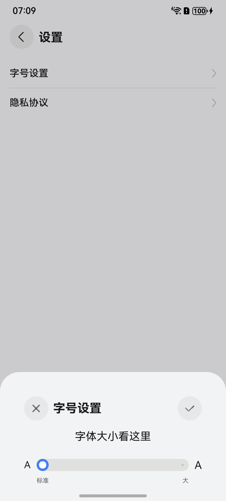

# 生活服务（天气）应用模板快速入门

## 目录

- [功能介绍](#功能介绍)
- [约束与限制](#约束与限制)
- [快速入门](#快速入门)
- [示例效果](#示例效果)
- [开源许可协议](#开源许可协议)

## 功能介绍

您可以基于此模板直接定制应用，也可以挑选此模板中提供的多种组件使用，从而降低您的开发难度，提高您的开发效率。

本模板提供如下组件，所有组件存放在工程根目录的components下，如果您仅需使用组件，可参考对应组件的指导链接；如果您使用此模板，请参考本文档。

| 组件                             | 描述                               | 使用指导                                                  |
|--------------------------------|----------------------------------|-------------------------------------------------------|
| 城市管理组件（module_city_manage）     | 提供城市选择、排序管理的能力，包括列表管理页和地区搜索页。    | [使用指导](./components/module_city_manage/README.md)     |
| 登录组件（module_login）             | 提供华为账号一键登录的能力。                   | [使用指导](./components/module_login/README.md)           |
| 主题组件（module_theme）             | 提供个性主题的浏览、选择能力，包括主题列表页和主题详情页。    | [使用指导](./components/module_theme/README.md)           |
| 语音播报组件（module_voice_broadcast） | 提供语音列表组件，支持下载、切换语音包。提供接口播放中英文文本。 | [使用指导](./components/module_voice_broadcast/README.md) |
| 天气组件（module_weather_core）      | 提供实时天气、24小时天气、15天天气和生活指数组件。      | [使用指导](./components/module_weather_core/README.md)    |


本模板为天气应用提供了常用功能的开发样例，模板主要分首页和我的两大模块：

- 首页：主要提供定位显示、实时天气预报、24小时天气预报、15天天气预报和生活指数展示等功能。

- 我的：展示个人信息、浏览切换个性主题、查看详细生活指数、下载使用播报语音包和字体设置等功能。

本模板已集成华为账号等服务，只需做少量配置和定制即可快速实现华为账号登录等功能。

| 首页                                                     | 我的                                                     |
|--------------------------------------------------------|--------------------------------------------------------|
|  |  |

本模板主要页面及核心功能如下所示：

```ts
天气模板
├──首页                         
│    ├──位置显示
│    │    ├──刷新定位                          
│    │    ├──城市管理                        
│    │    │    ├──删除城市                     
│    │    │    └──拖拽排序             
│    │    └──添加城市入口             
│    │         ├──区域搜索                     
│    │         └──新增城市             
│    ├──实时天气
│    │    ├──天气基本信息                        
│    │    └──语音播报文本
│    ├──24小时天气
│    │    ├──24小时温度曲线                        
│    │    └──对应小时相关指数
│    ├──15天天气
│    │    ├──15天温度曲线                        
│    │    │    ├──最高温度                     
│    │    │    └──最低温度                     
│    │    └──对应日期白天夜晚指数
│    └──生活指数
│         └──当天指数展示     
│                     
└──我的    
     ├──信息展示
     ├──个性主题
     │    ├──主题列表入口                        
     │    └──主题详情入口                                           
     ├──生活指数       
     │    ├──天气信息    
     │    └──指数信息  
     ├──语音播报       
     │    ├──语音包下载  
     │    └──语音包切换  
     └──更多设置       
          ├──字号调整 
          └──隐私协议  

```

本模板工程代码结构如下所示：

```ts
Weather                                        
├──commons                                     // 公共层
│    └──lib_foundation/src/main/ets            // 公共工具模块(har)
│         ├──components                          
│         │    AgreeDialog.ets                 // 安全弹窗组件    
│         │    CommonButtom.ets                // 公共按钮组件    
│         │    CommonHeader.ets                // 公共标题组件    
│         │    ComfirmSheet.ets                // 确认取消组件    
│         │    SettingFont.ets                 // 字号设置组件    
│         ├──constatns                         
│         │    CommonConstants.ets             // 公共常量       
│         │    CommonEnum.ets                  // 公共枚举  
│         │    RouterMap.ets                   // 页面表        
│         ├──styles                             
│         │    CardAttributeUpdater.ets        // 卡片样式
│         │    TextStyleModifier.ets           // 文字样式
│         ├──types                             
│         │    LocationInfo.ets                // 地址类型
│         │    UserInfo.ets                    // 用户类型     
│         └──utils                             
│              AccountUtil.ets                 // 账号管理工具       
│              FontUtil.ets                    // 字号管理工具       
│              Logger.ets                      // 日志打印工具  
│              PopViewUtils.ets                // 弹窗管理工具       
│              RouterModule.ets                // 路由管理工具        
│              SafeUtil.ets                    // 安全管理工具      
│              WindowUtil.ets                  // 窗口管理工具     
│                                              
│                                              
├──components                                  // 组件层
│    ├──module_city_manage/src/main/ets        // 城市管理组件(har）
│    │    ├──components                             
│    │    │    CommonHeader.ets                // 标题栏组件
│    │    │    DragList.ets                    // 拖拽列表组件
│    │    ├──constants                             
│    │    │    Contants.ets                    // 页面表
│    │    ├──pages                             
│    │    │    ManagedCityPage.ets             // 城市管理页
│    │    │    SearchCityPage.ets              // 城市搜索页
│    │    ├──types                             
│    │    │    Types.ets                       // 省市区类型
│    │    ├──utils                             
│    │    │    Loading.ets                     // 定位加载弹窗   
│    │    │    PostionUtil.ets                 // 城市持久化工具   
│    │    │    Utils.ets                       // 相关辅助工具   
│    │    │    WindowUtil.ets                  // 窗口管理工具   
│    │    └──viewmodels                              
│    │         ManagedVM.ets                   // 管理视图模型
│    │         SearchVM.ets                    // 搜索视图模型
│    │                                         
│    ├──module_login/src/main/ets              // 登录组件(har）
│    │    ├──components                             
│    │    │    AgreementDialog.ets             // 同意弹窗工具
│    │    │    QuickLogin.ets                  // 快速登录组件
│    │    ├──model                             
│    │    │    ErrorCode.ets                   // 错误码   
│    │    │    UserInfo.ets                    // 用户类型   
│    │    └──utils                              
│    │         AccountUtil.ets                 // 用户管理工具
│    │                                         
│    ├──module_theme/src/main/ets              // 主题组件(har)
│    │    ├──components                             
│    │    │    CommonHeader.ets                // 标题栏组件
│    │    │    ThemeSwiper.ets                 // 图片轮播组件
│    │    ├──constants                             
│    │    │    Contants.ets                    // 页面表和主题常量
│    │    ├──pages                             
│    │    │    ThemeDetailPage.ets             // 主题详情页
│    │    │    ThemeListPage.ets               // 主题列表页
│    │    ├──types                             
│    │    │    Types.ets                       // 主题类型
│    │    ├──utils                             
│    │    │    CommonUtil.ets                  // 通用方法   
│    │    │    ThemeController.ets             // 主题控制器   
│    │    │    WindowUtil.ets                  // 窗口管理工具   
│    │    └──viewmodels                              
│    │         ThemesCard.ets                  // 主题卡片组件
│    │                                         
│    ├──module_voice_broadcast/src/main/ets    // 语音播报组件(har)
│    │    ├──components                          
│    │    │    VoiceListItem.ets               // 语音包列表项组件  
│    │    ├──types                         
│    │    │    Types.ets                       // 语音包类型 
│    │    ├──utils                        
│    │    │    BroadcastUtil.ets               // 语音播报控制器
│    │    │    Logger.ets                      // 日志打印工具
│    │    └──views                             
│    │         VoiceList.ets                   // 语音包列表组件
│    │                                         
│    └──module_weather_core/src/main/ets       // 天气组件(har)
│         ├──common                          
│         │    CoreType.ets                    // 自定义tab组件
│         │    StyleConstants.ets              // 相关样式常量
│         ├──components                          
│         │    CardContainer.ets               // 卡片容器组件
│         │    CustomCanvas.ets                // 自定义画板组件
│         ├──http                        
│         │    Api.ets                         // 模拟天气接口
│         ├──utils                        
│         │    CanvasUtil.ets                  // 画板工具  
│         │    CommonUtil.ets                  // 通用工具  
│         │    FontUtil.ets                    // 字体工具  
│         │    Logger.ets                      // 日志工具  
│         │    WeatherUtils.ets                // 导出接口  
│         └──views                             
│              UIDays.ets                      // 15日天气组件
│              UIHours.ets                     // 24小时天气组件
│              UIIndices.ets                   // 生活指数天气组件
│              UINow.ets                       // 实时天气预报组件                                                                                           
│                                              
├──features                                                                       
│    ├──business_home/src/main/ets             // 首页tab模块(har)
│    │    ├──components                        
│    │    │    TopLocation .ets                // 常用地址项
│    │    ├──pages                             
│    │    │    Home.ets                        // 首页Tab页
│    │    ├──utils                             
│    │    │    WidgetUtil.ets                  // 卡片管理工具
│    │    └──viewmodels                        
│    │         HomeVM.ets                      // 首页视图模型
│    │                                         
│    └──business_mine/src/main/ets             // 我的tab模块(har)
│         ├──components                         
│         │    AvatarButton.ets                // 头像选择按钮                     
│         │    MineBot.ets                     // 我的更多设置
│         │    MineTop.ets                     // 我的信息展示
│         ├──pages                             
│         │    BroadcastPage.ets               // 语音播报页                  
│         │    IndicesPage.ets                 // 生活指数页                  
│         │    Mine.ets                        // 我的Tab页                  
│         │    PrivacyPolicyPage.ets           // 隐私政策页
│         │    ProfileEditPage.ets             // 信息编辑页
│         │    QuickLoginPage.ets              // 快速登录页
│         │    SettingPage.ets                 // 更多设置页
│         └──viewmodels                        
│              MineVM.ets                      // 我的视图模型
│                                                                                           
│                                                                                           
└──products                                    // 产品层                  
     └──phone/src/main/ets                     // 应用入口模块(hap)
          ├──pages                             
          │    Index.ets                       // 加载页              
          │    Main.ets                        // 主页面                    
          │    SafePage.ets                    // 安全协议页面                    
          ├──phoneability                      
          │    PhoneAbility.ets                // 主进程生命周期
          ├──phonebackupability                      
          │    PhoneBackupAbility.ets          // 主进程生命周期
          ├──phoneformability                  
          │    PhoneFormAbility.ets            // 卡片生命周期
          ├──types                             
          │    Types.ets                       // 相关类型           
          ├──utils                         
          │    WidgetUpdate.ets                // 刷新卡片方法                   
          ├──viewmodels                        
          │    IndexVM.ets                     // 加载页面视图模型                
          │    MainVM.ets                      // 主页面视图模型                
          │    SafeVM.ets                      // 安全页面视图模型                
          ├──widget                        
          │    └──pages                        
          │         WidgetCard.ets             // 2x2卡片布局 
          ├──widget1                        
          │    └──pages                        
          │         Widget1Card.ets            // 2x4卡片布局                     
          └──widget2                         
               └──pages                        
                    Widget2Card.ets            // 4x4卡片布局
```

## 约束与限制

### 环境
- DevEco Studio版本：DevEco Studio 5.1.1 Release及以上
- HarmonyOS SDK版本：HarmonyOS 5.1.1 Release SDK及以上
- 设备类型：华为手机（包括双折叠和阔折叠）
- 系统版本：HarmonyOS 5.0.5(17)及以上

### 权限
- 网络权限：ohos.permission.INTERNET
- 获取位置权限：ohos.permission.APPROXIMATELY_LOCATION。

## 调试
语音播报功能，暂不支持模拟器调试。

## 快速入门

### 配置工程

在运行此模板前，需要完成以下配置：

1. 在AppGallery Connect创建应用，将包名配置到模板中。

   a. 参考[创建HarmonyOS应用](https://developer.huawei.com/consumer/cn/doc/app/agc-help-create-app-0000002247955506)为应用创建APP ID，并将APP ID与应用进行关联。

   b. 返回应用列表页面，查看应用的包名。

   c. 将模板工程根目录下AppScope/app.json5文件中的bundleName替换为创建应用的包名。

2. 配置华为账号服务。

   a. 将应用的client ID配置到products/phone/src/main路径下的module.json5文件中，详细参考：[配置Client ID](https://developer.huawei.com/consumer/cn/doc/harmonyos-guides/account-client-id)。

   b. 申请华为账号一键登录所需的quickLoginMobilePhone权限，详细参考：[配置scope权限](https://developer.huawei.com/consumer/cn/doc/harmonyos-guides/account-config-permissions)。

3. 开通地图服务。详见[开通地图服务](https://developer.huawei.com/consumer/cn/doc/harmonyos-guides/map-config-agc)。

4. 对应用进行[手工签名](https://developer.huawei.com/consumer/cn/doc/harmonyos-guides/ide-signing#section297715173233)。

5. 添加手工签名所用证书对应的公钥指纹。详细参考：[配置应用签名证书指纹](https://developer.huawei.com/consumer/cn/doc/app/agc-help-cert-fingerprint-0000002278002933)

### 运行调试工程

1. 连接调试手机和PC。

2. 菜单选择“Run > Run 'phone' ”或者“Run > Debug 'phone' ”，运行或调试模板工程。

## 示例效果
| 城市排序                                                       | 气温曲线                                                        | 主题设置                                                           | 字号调整                                                      |
|------------------------------------------------------------|-------------------------------------------------------------|----------------------------------------------------------------|-----------------------------------------------------------|
|  |  |  |  |


## 开源许可协议

该代码经过[Apache 2.0 授权许可](http://www.apache.org/licenses/LICENSE-2.0)。
