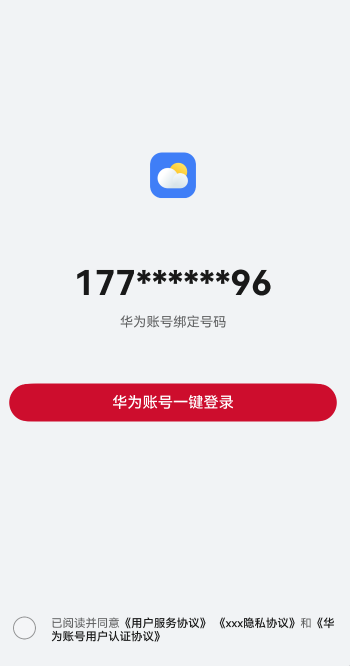

# 登录组件快速入门

## 目录

- [简介](#简介)
- [约束与限制](#约束与限制)
- [使用](#使用)
- [API参考](#API参考)
- [示例代码](#示例代码)

## 简介

本组件提供了华为账号一键登录的能力，开发者可以根据业务需要快速实现应用登录。




## 约束与限制
### 环境

* DevEco Studio版本：DevEco Studio 5.0.5 Release及以上
* HarmonyOS SDK版本：HarmonyOS 5.0.5 Release SDK及以上
* 设备类型：华为手机（包括双折叠和阔折叠）
* 系统版本：HarmonyOS 5.0.5(17)及以上

### 权限
- 网络权限：ohos.permission.INTERNET

## 使用

1. 安装组件。

   如果是在DevEvo Studio使用插件集成组件，则无需安装组件，请忽略此步骤。

   如果是从生态市场下载组件，请参考以下步骤安装组件。

   a. 解压下载的组件包，将包中所有文件夹拷贝至您工程根目录的XXX目录下。

   b. 在项目根目录build-profile.json5添加module_login模块。

    ```
    // 项目根目录下build-profile.json5填写module_login路径。其中XXX为组件存放的目录名
    "modules": [
        {
        "name": "module_login",
        "srcPath": "./XXX/module_login"
        }
    ]
    ```

   c. 在项目根目录oh-package.json5中添加依赖。
    ```
    // XXX为组件存放的目录名
    "dependencies": {
        "module_login": "file:./XXX/module_login"
    }
    ```

2. 配置华为账号服务。

   a. 将应用的client ID配置到entry模块的module.json5文件，详细参考：[配置Client ID](https://developer.huawei.com/consumer/cn/doc/harmonyos-guides/account-client-id)。
   ```
   ...
   "requestPermissions": [],
   "metadata": [
      {
        "name": "client_id",
        "value": "*****"
        // 配置为获取的Client ID
      },
    ],
    "extensionAbilities": [],
   ...
   ```
   b. [配置签名和指纹](https://developer.huawei.com/consumer/cn/doc/harmonyos-guides/account-sign-fingerprints)。

   c. [申请scope权限](https://developer.huawei.com/consumer/cn/doc/harmonyos-guides/account-config-permissions) 。

3. 引入登录组件句柄。
   ```typescript
   import { QuickLogin } from 'module_login';
   ```

4. 调用组件，详细参数配置说明参见[API参考](#API参考)。

   ```typescript
   // 登录使用
     QuickLogin({
      icon:$r("app.media.ic_pre_exam_01"),
      loginBtnBgColor:"#4B5CC4",
      appName:"xxx",
       // 点击登录回调方法
       onLoginWithHuaweiID:()=>{

       },
       // 点击隐私协议方法
       onPrivacyPolicy:()=>{
   
       },
       // 点击服务协议方法
       onServicePolicy:()=>{
   
       },
       // 点击华为账号用户认证协议
       onHYAccountRouter:()=>{
   
       },
     })
   ```

## API参考

### 子组件

无

### 接口

QuickLogin(options?: QuickLoginOptions)

登录组件。

**参数：**

| 参数名     | 类型                                          | 是否必填 | 说明         |
|---------|---------------------------------------------|------|------------|
| options | [QuickLoginOptions](#QuickLoginOptions对象说明) | 是    | 配置登录组件的参数。 |

### QuickLoginOptions对象说明
| 参数名             | 类型                                                                                                    | 必填 | 说明                                                                                                                              |
|:----------------|:------------------------------------------------------------------------------------------------------|:---|:--------------------------------------------------------------------------------------------------------------------------------|
| icon            | [ResourceStr](https://developer.huawei.com/consumer/cn/doc/harmonyos-references/ts-types#resourcestr) | 是  | 应用图标，参考[UX设计规范](https://developer.huawei.com/consumer/cn/doc/harmonyos-guides/account-phone-unionid-login#section2558741102912) |
| loginBtnBgColor | [ResourceStr](https://developer.huawei.com/consumer/cn/doc/harmonyos-references/ts-types#resourcestr) | 是  | 一键登录按钮背景色                                                                                                                       |                                                                                                                          |
| appName         | string                                                                                                | 是  | 应用隐私协议名称                                                                                                                        |                                                                                                                          |


### 事件

支持以下事件：

#### onLoginWithHuaweiID

onLoginWithHuaweiID: () => void = () => {}

点击华为账号一键登录时的跳转方法。

#### onPrivacyPolicy

onPrivacyPolicy: () => void = () => {}

点击隐私协议时的跳转方法。

#### onPrivacyPolicy

onServicePolicy: () => void = () => {}

点击服务协议时的跳转方法。

#### onHYAccountRouter

onHYAccountRouter: () => void = () => {}

点击华为用户认证协议时的跳转方法。

## 示例代码

```
import { QuickLogin } from 'module_login';
import { promptAction } from '@kit.ArkUI';

@Entry
@ComponentV2
struct LoginPage {
   build() {
      Column() {
         QuickLogin({
            icon: $r('app.media.ic_pre_exam_01'),
            loginBtnBgColor: '#4B5CC4',
            appName: 'xxx',
            // 登录回调方法
            onLoginWithHuaweiID: () => {
               promptAction.showToast({ message: '登陆成功', duration: 2000 });
            },
            // 隐私协议方法
            onPrivacyPolicy: () => {
               promptAction.showToast({ message: '隐私协议点击事件', duration: 2000 });
            },
            // 服务协议方法
            onServicePolicy: () => {
               promptAction.showToast({ message: '服务协议点击事件', duration: 2000 });
            },
            // 华为账号用户认证协议
            onHYAccountRouter: () => {
               promptAction.showToast({ message: '华为账号用户认证协议点击事件', duration: 2000 });
            },
         })
      }
   }
}
```