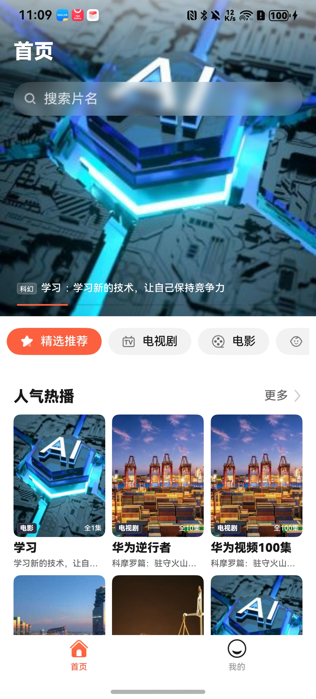
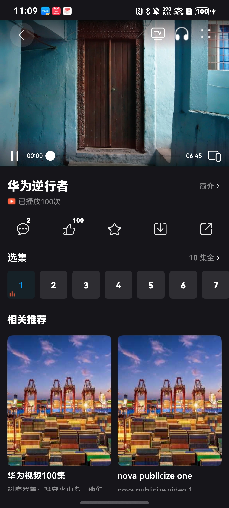
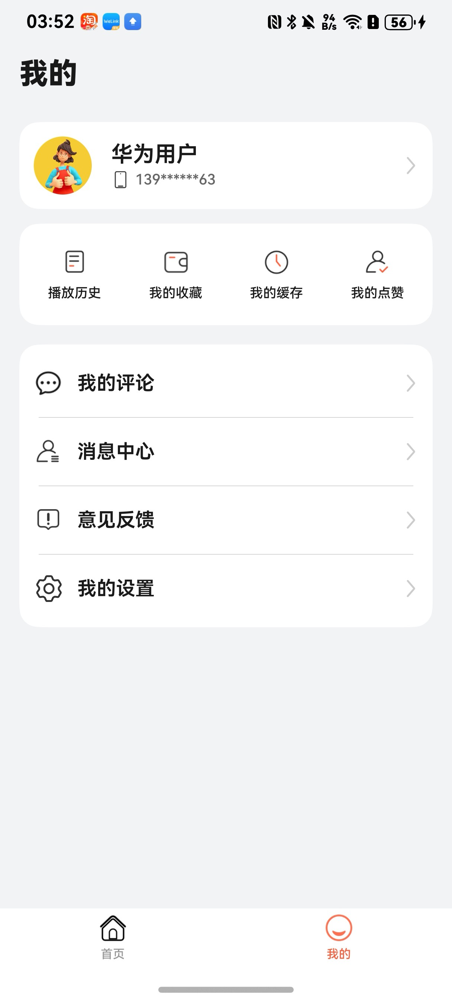

# 影视与直播（视频）应用模板快速入门

## 目录

- [功能介绍](#功能介绍)
- [约束与限制](#约束与限制)
- [快速入门](#快速入门)
- [示例效果](#示例效果)
- [开源许可协议](#开源许可协议)

## 功能介绍

您可以基于此模板直接定制应用，也可以挑选此模板中提供的组件使用，从而降低您的开发难度，提高您的开发效率。

此模板提供如下组件，所有组件存放在工程根目录的components下，如果您仅需使用组件，可参考对应组件的指导链接；如果您使用此模板，请参考本文档。

| 组件                        | 描述                 | 使用指导                                     |
| :------------------------ | :----------------- | :--------------------------------------- |
| 视频交互组件（video_interaction） | 支持视频评论、点赞、收藏、分享、下载 | [使用指导](components/video_interaction/README.md) |

本模板为视频类应用提供了常用功能的开发样例，模板主要分首页、我的两个模块：

* 首页：提供频道、视频分类、搜索、热榜、视频播放页、视频交互、相关推等功能。

* 我的：提供个人主页查看、评论、消息、管理收藏、点赞、浏览历史、意见反馈、设置等功能。

本模板已集成华为账号、广告、微信登录等服务，只需做少量配置和定制即可快速实现华为账号的登录、视频播放等功能。

| 首页                                       | 播放页                                      | 我的                                       |
| ---------------------------------------- | ---------------------------------------- | ---------------------------------------- |
|  |  |  |

本模板主要页面及核心功能如下所示：

```text
视频模板
  ├──首页                           
  │   ├──顶部栏-搜索  
  │   │   ├── 历史搜索                          
  │   │   └── 热门搜索                             
  │   │                    
  │   ├──顶部栏-导航栏                                                 
  │   │   └── 推荐、电影、电视剧、少儿
  │   │
  │   └──视频分类    
  │       ├── 热播                                             
  │       ├── 热搜                       
  │       └── 必看榜 
  │
  ├──播放器页                                                   
  │   └──视频详情页         
  │       ├── 竖屏播放
  │       ├── 横屏播放
  │       ├── 暂停、播放、进度调节、倍速、投屏、后台听视频、举报反馈
  │       │── 评论、点赞、收藏、下载、分享 
  │       └── 相关推荐                                        
  │
  └──我的                           
      ├──登录  
      │   ├── 华为账号一键登录                          
      │   ├── 微信登录                                                   
      │   ├── 账密登录
      │   └── 用户隐私协议同意                       
      │         
      ├──个人主页         
      │   └── 头像、昵称、简介
      │                    
      ├──分类导航栏    
      │   ├── 历史                                        
      │   ├── 收藏               
      │   ├── 缓存                             
      │   └── 点赞
      │
      └──常用服务    
          ├── 我的评论   
          ├── 消息中心   
          ├── 意见反馈                   
          └── 设置
               ├── 个人信息 
               ├── 账号安全
               ├── 隐私设置           
               ├── 通知开关             
               ├── 清理缓存             
               ├── 关于我们 
               └── 退出登录                               
```

本模板工程代码结构如下所示：

```text
Video
├──commons
│  ├──lib_account/src/main/ets                            // 账号登录模块             
│  │    ├──components
│  │    │   └──AgreePrivacyBox.ets                        // 隐私同意勾选                  
│  │    ├──pages  
│  │    │   ├──HuaweiLoginPage.ets                        // 华为账号登录页面
│  │    │   ├──OtherLoginPage.ets                         // 其他方式登录页面
│  │    │   └──ProtocolWebView.ets                        // 协议H5                  
│  │    └──utils  
│  │        ├──HuaweiAuthUtils.ets                        // 华为认证工具类
│  │        ├──LoginSheetUtils.ets                        // 统一登录半模态弹窗
│  │        └──WXApiUtils.ets                             // 微信登录事件处理类 
│  │
│  ├──lib_common/src/main/ets                             // 基础模块             
│  │    ├──constants                                      // 通用常量 
│  │    ├──datasource                                     // 懒加载数据模型
│  │    ├──dialogs                                        // 通用弹窗 
│  │    ├──models                                         // 状态观测模型
│  │    ├──push                                           // 推送
│  │    └──utils                                          // 通用方法                  
│  │
│  ├──lib_video_api/src/main/ets                          // 服务端api模块             
│  │    ├──constants                                      // 常量文件    
│  │    ├──database                                       // 数据库 
│  │    ├──observedmodels                                 // 状态模型  
│  │    ├──params                                         // 请求响应参数 
│  │    ├──services                                       // 服务api  
│  │    └──utils                                          // 工具utils      
│  │ 
│  └──lib_widget/src/main/ets                             // 通用UI模块             
│       └──components
│           ├──ButtonGroup.ets                            // 组合按钮
│           ├──CustomBadge.ets                            // 自定义信息标记组件
│           ├──EmptyBuilder.ets                           // 空白组件
│           └──NavHeaderBar.ets                           // 自定义标题栏
│
├──components
│  ├──module_advertisement                                // 广告组件 
│  ├──module_cast                                         // 投屏组件 
│  ├──module_feedback                                     // 意见反馈组件 
│  ├──module_highlight                                    // 高亮组件
│  ├──module_imagepreview                                 // 图片预览组件
│  ├──module_share                                        // 分享组件
│  ├──recorded_player                                     // 视频播放组件
│  └──video_interaction                                   // 视频交互组件            
│      
├──features
│  ├──business_home/src/main/ets                          // 首页模块             
│  │    ├──components
│  │    │   ├──ChildComponent.ets                         // 少儿内容   
│  │    │   ├──HotComponent.ets                           // 热播内容
│  │    │   ├──MorePage.ets                               // 更多视频页面    
│  │    │   ├──MovieComponent.ets                         // 电影频道  
│  │    │   ├──NewsSearch.ets                             // 搜索页面    
│  │    │   └──TvComponent.ets                            // 电视剧频道                  
│  │    └──pages
│  │        ├──ALLPage.ets                                // 搜索页面     
│  │        └──HomePage.ets                               // 首页页面            
│  │
│  ├──business_mine/src/main/ets                          // 我的模块             
│  │    ├──components
│  │    │   ├──CommentRoot.ets                            // 主评论
│  │    │   ├──CommentSub.ets                             // 从属评论
│  │    │   ├──IMItem.ets                                 // 私信单元
│  │    │   ├──MessageItem.ets                            // 消息单元
│  │    │   └──SetReadIcon.ets                            // 标记已读
│  │    └──pages 
│  │        ├──CachedPage.ets                             // 已缓存页面
│  │        ├──CachingPage.ets                            // 正在缓存页面
│  │        ├──HistoryPage.ets                            // 我的历史
│  │        ├──LikePage.ets                               // 我的点赞
│  │        ├──MarkPage.ets                               // 我的收藏
│  │        ├──MessageCommentReplyPage.ets                // 评论与回复
│  │        ├──MessageFansPage.ets                        // 新增粉丝
│  │        ├──MessageIMChatPage.ets                      // 聊天页面
│  │        ├──MessageIMListPage.ets                      // 私信列表
│  │        ├──MessagePage.ets                            // 消息页面
│  │        ├──MessageSingleCommentList.ets               // 全部回复页面
│  │        ├──MessageSystemPage.ets                      // 系统消息
│  │        ├──MinePage.ets                               // 我的页面   
│  │        ├──MyCachePage.ets                            // 我的缓存页面
│  │        └──MyComment.ets                              // 评论页面
│  │
│  ├──business_play/src/main/ets                          // 播放模块             
│  │    ├─components
│  │    │  ├──MoreRecommendView.ets                       // 更多推荐列表
│  │    │  ├──SelectTvView.ets                            // 选集
│  │    │  └──VideoInfoView.ets                           // 视频信息          
│  │    └──pages 
│  │        └──PlayPage.ets                               // 播放页面
│  │ 
│  └──business_setting/src/main/ets                       // 设置模块             
│       ├──components
│       │   ├──SettingCard.ets                            // 设置卡片
│       │   └──SettingSelectDialog.ets                    // 设置选项弹窗               
│       └──pages
│           ├──AccountSecurity.ets                        // 账户安全页面
│           ├──LoginPassword.ets                          // 修改密码页面
│           ├──NotificationSettings.ets                   // 通知设置页面
│           ├──SettingAbout.ets                           // 关于页面
│           ├──SettingH5.ets                              // H5页面
│           ├──SettingPage.ets                            // 设置页面
│           ├──SettingPersonal.ets                        // 编辑个人信息页面
│           ├──SettingPhone.ets                           // 更换手机号页面
│           ├──SettingPrivacy.ets                         // 隐私设置页面
│           └──SettingTeenagersPage.ets                   // 设置未成年模式页面
│
└──products
   └──phone/src/main/ets                                  // phone模块
        ├──common                        
        │   ├──AppTheme.ets                               // 应用主题色
        │   ├──Constants.ets                              // 业务常量
        │   ├──FormUtils.ets                              // 卡片Utils
        │   └──Types.ets                                  // 数据模型
        ├──components                    
        │   └──CustomTabBar.ets                           // 应用底部Tab
        └──pages   
            ├──AgreeDialogPage.ets                        // 隐私同意弹窗
            ├──Index.ets                                  // 入口页面
            ├──IndexPage.ets                              // 应用主页面
            ├──PrivacyPage.ets                            // 查看隐私协议页面
            ├──SafePage.ets                               // 隐私同意页面
            ├──SplashPage.ets                             // 开屏广告页面
            └──StartPage.ets                              // 应用启动页面
```

## 约束与限制

### 环境

- DevEco Studio版本：DevEco Studio 5.0.5 Release及以上
- HarmonyOS SDK版本：HarmonyOS 5.0.5 Release SDK及以上
- 设备类型：华为手机（包括双折叠和阔折叠）
- 系统版本：HarmonyOS 5.0.5(17)及以上

### 权限

- 网络权限：ohos.permission.INTERNET
- 允许应用获取数据网络信息: ohos.permission.GET_NETWORK_INFO
- 允许应用获取Wi-Fi信息: ohos.permission.GET_WIFI_INFO
- 后台持续运行权限: ohos.permission.KEEP_BACKGROUND_RUNNING


## 快速入门

### 配置工程

在运行此模板前，需要完成以下配置：

1. 在AppGallery Connect创建应用，将包名配置到模板中。

   a. 参考[创建HarmonyOS应用](https://developer.huawei.com/consumer/cn/doc/app/agc-help-create-app-0000002247955506)
   为应用创建APP ID，并将APP ID与应用进行关联。

   b. 返回应用列表页面，查看应用的包名。

   c. 将模板工程根目录下AppScope/app.json5文件中的bundleName替换为创建应用的包名。

2. 配置华为账号服务。

   a. 将应用的Client
   ID配置到products/phone/src/main路径下的module.json5文件中，详细参考：[配置Client ID](https://developer.huawei.com/consumer/cn/doc/harmonyos-guides/account-client-id)。

   b.
   申请华为账号一键登录所需的quickLoginMobilePhone权限，详细参考：[配置scope权限](https://developer.huawei.com/consumer/cn/doc/harmonyos-guides/account-config-permissions)。

3. 配置广告服务。

   a. 如果仅调测广告，可使用测试广告位ID：开屏广告：testd7c5cewoj6、横幅广告：testw6vs28auh3。

   b. 申请正式的广告位ID。

   登录[鲸鸿动能媒体服务平台](https://developer.huawei.com/consumer/cn/service/ads/publisher/html/index.html?lang=zh)
   进行申请，具体操作详情请参见[展示位创建](https://developer.huawei.com/consumer/cn/doc/distribution/monetize/zhanshiweichuangjian-0000001132700049)。

4. 接入微信SDK。
   前往微信开放平台申请AppID并配置鸿蒙应用信息，详情参考：[鸿蒙接入指南](https://developers.weixin.qq.com/doc/oplatform/Mobile_App/Access_Guide/ohos.html)。

5. 接入QQ。
   前往QQ开放平台申请AppID并配置鸿蒙应用信息，详情参考：[鸿蒙接入指南](https://wiki.connect.qq.com/sdk%e4%b8%8b%e8%bd%bd)。

6. 对应用进行[手工签名](https://developer.huawei.com/consumer/cn/doc/harmonyos-guides/ide-signing#section297715173233)。

7. 添加手工签名所用证书对应的公钥指纹，详细参考：[配置应用签名证书指纹](https://developer.huawei.com/consumer/cn/doc/app/agc-help-cert-fingerprint-0000002278002933)

### 运行调试工程

1. 连接调试手机和PC。

2. 菜单选择“Run > Run 'phone' ”或者“Run > Debug 'phone' ”，运行或调试模板工程。

## 示例效果

1. [首页](./screenshots/home.jpg)
2. [播放页](./screenshots/video.jpg)
3. [我的](./screenshots/mine.jpg)

## 开源许可协议

该代码经过[Apache 2.0 授权许可](http://www.apache.org/licenses/LICENSE-2.0)。
