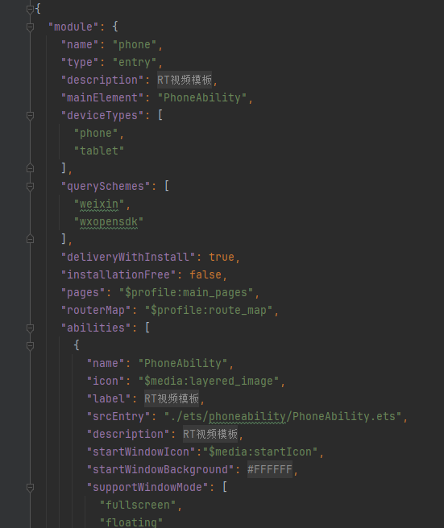
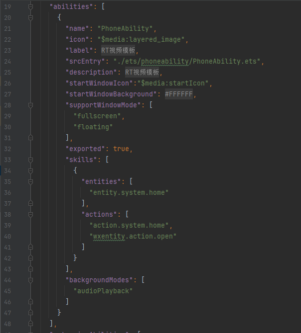

# 视频交互组件快速入门

## 目录

- [简介](#简介)
- [约束与限制](#约束与限制)
- [快速入门](#快速入门)
- [API参考](#API参考)
- [示例代码](#示例代码)

## 简介

本组件支持评论、点赞、收藏、缓存下载、分享功能。


## 约束与限制

### 环境

- DevEco Studio版本：DevEco Studio 5.0.5 Release及以上
- HarmonyOS SDK版本：HarmonyOS 5.0.5 Release SDK及以上
- 设备类型：华为手机（包括双折叠和阔折叠）
- 系统版本：HarmonyOS 5.0.5(17)及以上

### 权限

- 网络权限：ohos.permission.INTERNET

## 快速入门

1. 安装组件。

   如果是在DevEco Studio使用插件集成组件，则无需安装组件，请忽略此步骤。

   如果是从生态市场下载组件，请参考以下步骤安装组件。

   a. 解压下载的组件包，将包中所有文件夹拷贝至您工程根目录的xxx目录下。

   b. 在项目根目录build-profile.json5添加video_interaction模块、module_share模块。

   ```typescript
   // 项目根目录下build-profile.json5填写module_share路径。其中xxx为组件存放的目录名
   "modules": [
     {
       "name": "module_share",
       "srcPath": "./xxx/module_share"
     },
     {
       "name": "video_interaction",
       "srcPath": "./xxx/video_interaction"
     }
   ]
   ```

   c. 在项目根目录oh-package.json5添加依赖。

   ```typescript
   // xxx为组件存放的目录名称
   "dependencies": {
     "video_interaction": "file:./xxx/video_interaction"
   }
   ```

2. 在工程入口hap包的module.json5文件中添加配置，具体见下图。
   ```typescript
   "querySchemes": [
      "weixin",
      "wxopensdk"
    ],

   "skills": [
          {
            "entities": [
              "entity.system.home"
            ],
            "actions": [
              "action.system.home",
              "wxentity.action.open"
            ]
          }
        ]
   "metadata": [
      {
        /*
        * 替换应用的Client ID
        */
        "name": "client_id",
        "value": "xxx"
      }
    ]
   ```
   
    
3. 接入微信SDK。
   前往微信开放平台申请AppID并配置鸿蒙应用信息，详情参考：[鸿蒙接入指南](https://developers.weixin.qq.com/doc/oplatform/Mobile_App/Access_Guide/ohos.html)。
4. 接入QQ。
   前往QQ开放平台申请AppID并配置鸿蒙应用信息，详情参考：[鸿蒙接入指南](https://wiki.connect.qq.com/sdk%e4%b8%8b%e8%bd%bd)。

5. 引入组件。

   ```typescript
   import { VideoInteraction } from 'video_interaction';
   ```

6. 调用组件，详细参数配置说明参见[API参考](#参数)。

   ```typescript
   VideoInteraction()
   ```

## API参考

### 接口

VideoInteraction(option: [VideoInteractionOptions](#VideoInteractionOptions对象说明))

### VideoInteractionOptions对象说明

| 参数名                 | 类型                                  | 是否必填 | 说明       |
| :------------------ | :---------------------------------- | :--- | :------- |
| windowBottomPadding | number                              | 否    | 底部安全距离高度 |
| mediaItem           | [MediaItemModel](#MediaItem对象说明)    | 是    | 媒体（视频）信息 |
| commentList         | [CommentInfo](#CommentInfo对象说明)[]   | 是    | 评论列表     |
| userInfo            | [UserInfoModel](#UserInfoModel对象说明) | 是    | 用户信息     |

### MediaItem对象说明

| 参数名          | 类型            | 是否必填 | 说明     |
| :----------- | :------------ | :--- | :----- |
| videoId      | string        | 否    | 视频的id  |
| type         | string        | 否    | 视频的类型  |
| title        | string        | 否    | 视频的标题  |
| coverUrl     | string        | 否    | 视频的封面  |
| videoUrl     | ResourceStr[] | 否    | 视频的源   |
| createTime   | string        | 否    | 视频创建时间 |
| isLike       | boolean       | 否    | 是否点赞   |
| isMark       | boolean       | 否    | 是否收藏   |
| commentCount | number        | 否    | 评论数量   |

### CommentInfo对象说明

| 参数名            | 类型                              | 是否必填 | 说明     |
| :------------- | :------------------------------ | :--- | ------ |
| commentId      | string                          | 否    | 评论的id  |
| videoId        | string                          | 否    | 视频的id  |
| author         | [AuthorInfo](#AuthorInfo对象说明)   | 否    | 评论人    |
| parentComment  | [CommentInfo](#CommentInfo对象说明) | 否    | 父评论对象  |
| commentLikeNum | number                          | 否    | 评论数量   |
| commentBody    | string                          | 否    | 评论内容   |
| createTime     | number                          | 否    | 评论创建时间 |
| isReply        | boolean                         | 否    | 是否回复   |
| likeCount      | number                          | 否    | 点赞数量   |
| isLiked        | boolean                         | 否    | 是否点赞   |
| replyComments  | [CommentInfo](#CommentInfo对象说明)                   | 否    | 评论回复集合 |

### AuthorInfo对象说明

| 参数名            | 类型     | 是否必填 | 说明    |
| :------------- | :----- | :--- | ----- |
| authorId       | string | 是    | 评论者id |
| authorNickName | string | 是    | 评论者昵称 |
| authorIcon     | string | 是    | 评论者头像 |

### UserInfoModel对象说明

| 参数名            | 类型             | 是否必填 | 说明   |
| :------------- | :------------- | :--- | ---- |
| isLogin        | boolean        | 是    | 是否登录 |
| authorId       | string         | 是    | 用户id |
| authorNickName | string | 是    | 用户昵称 |

### 事件

支持以下事件：

#### changeIsLike

changeIsLike?: (isLike: boolean) => boolean

（视频）点赞和取消点赞事件

#### changeIsMark

@Event changeIsMark?: (isMark: boolean) => boolean

（视频）收藏和取消收藏事件

**goDownloadPage**

goDownloadPage?: () => void

自定义事件，跳转缓存列表页面

#### addComment

addComment: (commentInfo: CommentInfo, parentCommentId: string) => void;

回复评论事件

#### giveLike

giveLike: (commentInfo: CommentInfo, isLike: boolean) => void;

（评论）点赞/取消点赞评论事件

#### onInterceptLogin

onInterceptLogin:(cb: (isLogin: boolean) => void) => void;

拦截登录校验

#### onDeleteComment

onDeleteComment: (commentId: string) => void;

删除评论事件

#### onFirstComment

onFirstComment: (commentContent: string) => void;

首评事件

## 示例代码

```typescript
import { CommentInfo, MakeObCommentServed, MediaItemModel, UserInfoModel, VideoInteraction } from 'video_interaction';
import { promptAction } from '@kit.ArkUI';

@Entry
@ComponentV2
struct Index {
  private navPathStack: NavPathStack = new NavPathStack();
  @Local video: MediaItemModel = new MediaItemModel({
    videoId: 'video_1',
    type: 'tv_movie',
    title: '视频标题',
    coverUrl: 'https://agc-storage-drcn.platform.dbankcloud.cn/v0/news-hnp2d/news_7.jp',
    videoUrl: [
      'https://www-file.huawei.com/admin/asset/v1/pro/view/73253951779340a39a7763e29f40ccb8.mp4',
      'https://www-file.huawei.com/admin/asset/v1/pro/view/a20e0965e56a4dc498fc33ee23750c0d.mp4'
    ],
    createTime: '2025-01-02',
    isLike: false,
    likeCount: 10,
    isMark: false,
    commentCount: 0,
  })
  @Local commentList: CommentInfo[] = []
  @Local userInfo: UserInfoModel = new UserInfoModel()

  aboutToAppear(): void {
    this.commentList = []?.map((value: CommentInfo) => {
      return new MakeObCommentServed(value)
    }) ?? [];

    this.userInfo.authorId = '1001'
    this.userInfo.authorNickName = '华为用户'
  }

  build() {
    Navigation(this.navPathStack) {
      NavDestination() {
        Column() {
          VideoInteraction({
            windowBottomPadding: 0,
            mediaItem: this.video,
            changeIsLike: (isLiked) => {
              this.video.isLike = isLiked
              if (isLiked) {
                this.video.likeCount++
              } else {
                this.video.likeCount--
              }
            },
            changeIsMark: (isMarked) => {
              this.video.isMark = isMarked
            },
            goDownloadPage: () => {
              promptAction.showToast({
                message: '需要配置跳转路由页面',
              })
            },
            commentList: this.commentList,
            userInfo: this.userInfo,
            addComment: (comment: CommentInfo, parentCommentId: string) => {
              promptAction.showToast({
                message: '回复成功',
              })
            },
            onFirstComment: (commentContent: string) => {
              this.video.commentCount++
              const comment: CommentInfo = new CommentInfo()
              comment.commentId = 'commentId_' + Math.random().toString(36)
              comment.createTime = new Date().getTime()
              comment.commentBody = commentContent
              this.commentList.unshift(new MakeObCommentServed(comment))
              promptAction.showToast({
                message: '评论成功',
              })
            },
            giveLike: (comment: CommentInfo, isLike: boolean) => {
              this.setCommentInfo(this.commentList, comment, isLike)
              promptAction.showToast({
                message: isLike ? '点赞成功' : '取消点赞',
              })
            },
            onInterceptLogin: (loginInterceptCb: (isLogin: boolean) => void) => {
              if (!this.userInfo.isLogin) {
                this.userInfo.isLogin = true
                return
              }
              loginInterceptCb(this.userInfo.isLogin)
            },
            onDeleteComment: (commentId: string) => {
              promptAction.showToast({
                message: '已删除评论'
              })
            },
          })
        }
        .backgroundColor('#555')
        .height('100%')
        .width('100%')
        .justifyContent(FlexAlign.Center)
      }
      .hideTitleBar(true)
    }
    .hideTitleBar(true)
  }

  setCommentInfo(commentInfoList: CommentInfo[], comment: CommentInfo, isLike: boolean) {
    if (commentInfoList.length) {
      commentInfoList.forEach(item => {
        if (item.commentId === comment.commentId) {
          item.isLiked = isLike
          item.commentLikeNum = isLike ? item.commentLikeNum + 1 : item.commentLikeNum - 1
        }
        this.setCommentInfo(item.replyComments, comment, isLike)
      })
    }
  }
}
```
## 开源许可协议

该代码经过[Apache 2.0 授权许可](http://www.apache.org/licenses/LICENSE-2.0)。

