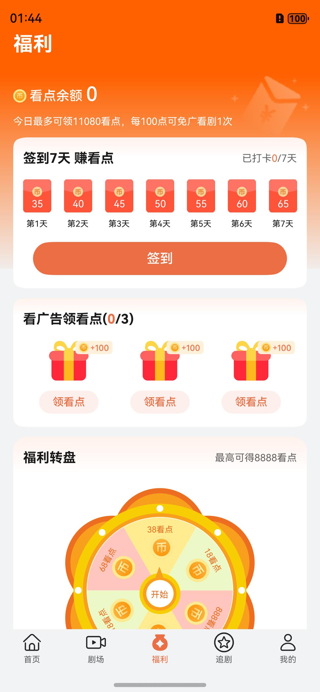
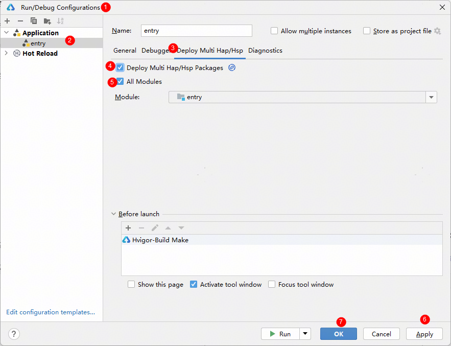

# 影视与直播（微短剧）应用模板快速入门

## 目录

- [功能介绍](#功能介绍)
- [约束和限制](#约束和限制)
- [快速入门](#快速入门)
- [示例效果](#示例效果)
- [开源许可协议](#开源许可协议)

## 功能介绍

您可以基于此模板直接定制应用，也可以挑选此模板中提供的多种组件使用，从而降低您的开发难度，提高您的开发效率。

此模板提供如下组件，所有组件存放在工程根目录的components下，如果您仅需使用组件，可参考对应组件的指导链接；如果您使用此模板，请参考本文档。

| 组件                   | 描述              | 使用指导                                      |
|----------------------|-----------------|-------------------------------------------|
| 滑动视频组件(video_swiper) | 包括滑动视频，视频播放的控制等 | [使用指导](components/video_swiper/README.md) |
| 投屏组件(module_cast)    | 包括投屏播放控制功能      | [使用指导](components/module_cast/README.md)  |

本模板为短剧类应用提供了常用功能的开发样例，模板主要分首页、剧场、我的及详情播放页六大模块：

* 首页：提供短剧推荐流功能，按照剧目播放。

* 剧场：提供榜单和优选短剧浏览，支持输入剧名搜索。

* 福利：提供任务，完成任务来获取看点。

* 追剧：用于管理用户收藏的剧集。

* 我的：支持账号的管理和常用服务(设置/观看记录)。

* 详情：沉浸式观看短剧，支持剧集播放常用功能(上下滑切换剧集，选集，社交交互等)

本模板已集成华为账号等服务，只需做少量配置和定制即可快速实现华为账号的登录功能。

| 首页                         | 剧场                         | 福利                         | 追剧                         | 我的                         | 详情                         |
|----------------------------|----------------------------|----------------------------|----------------------------|----------------------------|----------------------------|
|  |  |  |  |  |  |

本模板主要页面及核心功能如下所示：

```ts
短剧模板
 |-- 首页
 |    |-- 简介
 |    |-- 看全集
 |    └-- 自动播放全集
 |-- 剧场
 |    |-- 榜单
 |    |-- 标签分类
 |    └-- 搜索
 |         └-- 历史记录
 |-- 福利
 |    |-- 任务
 |    |-- 抽奖
 |    └-- 签到
 |-- 追剧
 |    |-- 查看收藏
 |    └-- 管理删除
 |-- 我的
 |    |-- 用户信息
 |    |-- 我的追剧
 |    └-- 观看记录
 └-- 详情
      |-- 简介
      |-- 社交信息
      |    |-- 点赞
      |    |-- 分享
      |    |-- 收藏
      |    └-- 评论
      |-- 选集
      |-- 播放设置
      └-- 剧集详情介绍
```

本模板工程代码结构如下所示：

```ts
WebShortDrama
  |- commons                                       // 公共层
  |   |- common                                    // 资源统一管理层
  |   |- server/src/main/ets                       // 无法层
  |   |    |- api                                  // 接口层 
  |   |    |    mock                               // 模拟数据
  |   |    |    Decorators.ts                      // 装饰器
  |   |    |    Domain.ts                          // 域名管理
  |   |    |    RequestAPI.ts                      // 请求API定义
  |   |    |- bean                                 // 后端数据结构定义
  |   |    └- handler                              // 请求handler 
  |   |- styles                                    // 风格统一管理层
  |   |- utils                                     // 工具类层
  |   └- widgets                                   // 基础控件类层
  |
  |- components                                    // 组件   
  |   |- base_apis                                 // 集成能力组件   
  |   |- feed_back                                 // 意见反馈组件   
  |   |- module_share                              // 分享组件   
  |   |- open_ads                                  // 广告组件   
  |   |- video_swiper                              // 滑动视频组件     
  |   |- module_cast                               // 视频投屏组件     
  |   └- vip_center                                // 会员中心组件  
  |
  |- EntryCard                                     // 卡片资源     
  |                      
  |- features    
  |   |- award/src/main/ets                         // 福利功能(hsp)
  |   |        |- common                            // 公共组件 
  |   |        |- components                        // 抽离组件   
  |   |        |- constants                         // 常量
  |   |        |- customdialog                      // dialog组件
  |   |        |- model                             // class类型定义     
  |   |        |- pages                                
  |   |        |    AwardMainPage.ets               // 福利页面
  |   |        |- utils                             // 工具组件   
  |   |        └- viewmodel                         // 与页面一一对应的vm层 
  |   | 
  |   |- home/src/main/ets                          // home主页组合(hsp)
  |   |        |- components                        // 抽离组件   
  |   |        |- mapper                            // 接口数据到页面数据类型映射 
  |   |        |- pages                               
  |   |        |    HomeMainPage.ets                // 主页页面
  |   |        └- viewmodel                         // 与页面一一对应的vm层 
  |   | 
  |   |- detail/src/main/ets                        // 详情播放功能(hsp)
  |   |        |- components                        // 抽离组件   
  |   |        |- mapper                            // 接口数据到页面数据类型映射 
  |   |        |- models                            // class类型定义     
  |   |        |- page                                
  |   |        |    ShortDramaDetailPage.ets        // 详情播放页面
  |   |        |- viewdata                          // view组件的数据定义   
  |   |        └- viewmodels                        // 与页面一一对应的vm层 
  |   | 
  |   |- mine/src/main/ets                          // 我的组合(hsp)
  |   |        |- component                         // 抽离组件   
  |   |        └- pages                               
  |   |             ChangePage.ets                  // 信息修改播放页面
  |   |             MineMainPage.ets                // 我的主页页面
  |   |             VIPCenterPage.ets               // 会员中心页面
  |   |             PersonalInfoPage.ets            // 个人信息页面
  |   |             WatchRecordsPage.ets            // 观看记录页面
  |   |             AboutPage.ets                   // 关于我的页面
  |   |             FeedbackPage.ets                // 反馈页面
  |   |             FeedbackRecordPage.ets          // 反馈记录页面
  |   |             LaunchPage.ets                  // 启动页面
  |   |             LaunchAdPage.ets                // 广告页面
  |   |             LikesPage.ets                   // 点赞记录页面
  |   |             MyPreferencesPage.ets           // 首选项页面
  |   |             PrivacyAgreementPage.ets        // 隐私协议页面
  |   |             PrivacyStatementPage.ets        // 隐私声明页面
  |   |             SetupPage.ets                   // 设置页面
  |   | 
  |   |- theater/src/main/ets                       // 剧场组合(hsp)
  |   |        |- components                        // 抽离组件   
  |   |        |- mapper                            // 接口数据到页面数据类型映射 
  |   |        |- pages                               
  |   |        |    BillboardPage.ets               // 排行榜页面
  |   |        |    DramaDetailInfoPage.ets         // 剧集详情信息页面
  |   |        |    SearchPage.ets                  // 搜索页面
  |   |        |    TheaterMainPage.ets             // 剧场入口页面  
  |   |        |- views                             // 视图组件
  |   |        └- viewmodels                        // 与页面一一对应的vm层 
  |   | 
  |   |- favor/src/main/ets                         // 追剧组合(hsp)
  |   |        └- pages                               
  |   |             FavorMainPage.ets               // 追剧页面
  |   | 
  |   |- frame/src/main/ets/view                    // 通用Frame框架(hsp)
  |   |        |- components                        // 抽离组件   
  |   |        └- pages                               
  |   |             MainTabPage.ets                 // 主页Tab容器页面
  |   | 
  |   └- login                                      // 通用登录功能(hsp)
  |   
  └- products/entry                                 // 应用层主包(hap)  
      └-  src/main/ets                                               
           |- entryability                          // Ability入口页面                                       
           |- entryformability                      // 卡片Ability入口页面                                    
           |- pages                              
           |    Index.ets                           // 入口页面  
           └- widget2x2                             // 卡片页面 
```

## 约束和限制

### 环境

- DevEco Studio版本：DevEco Studio 5.0.0 Release及以上
- HarmonyOS SDK版本：HarmonyOS 5.0.0 Release SDK及以上
- 设备类型：华为手机（包括双折叠和阔折叠）
- 系统版本：HarmonyOS 5.0.0(12)及以上

### 权限

- 网络权限：ohos.permission.INTERNET
- 后台运行权限：ohos.permission.KEEP_BACKGROUND_RUNNING

### 调试

本模板不支持模拟器调试，请使用真机调试

## 快速入门

### 配置工程

1. 在AppGallery Connect创建应用，将包名配置到模板中。

   a. 参考[创建HarmonyOS应用](https://developer.huawei.com/consumer/cn/doc/app/agc-help-create-app-0000002247955506)
   为应用创建APP ID，并将APP ID与应用进行关联。

   b. 返回应用列表页面，查看应用的包名。

   c. 将模板工程根目录下AppScope/app.json5文件中的bundleName替换为创建应用的包名。

2. 配置华为账号服务。

   a. 将应用的client
   ID配置到products/entry/src/main路径下的module.json5文件中，详细参考：[配置Client ID](https://developer.huawei.com/consumer/cn/doc/harmonyos-guides/account-client-id)。

   b.
   申请华为账号一键登录所需的quickLoginMobilePhone权限，详细参考：[配置scope权限](https://developer.huawei.com/consumer/cn/doc/harmonyos-guides/account-config-permissions)。

3. 配置支付服务。

   华为支付当前仅支持商户接入，在使用服务前，需要完成商户入网、开发服务等相关配置，本模板仅提供了端侧集成的示例。详细参考：[支付服务接入准备](https://developer.huawei.com/consumer/cn/doc/harmonyos-guides/payment-preparations)。

4. 对应用进行[手工签名](https://developer.huawei.com/consumer/cn/doc/harmonyos-guides/ide-signing#section297715173233)。

5.
添加手工签名所用证书对应的公钥指纹。详细参考：[配置应用签名证书指纹](https://developer.huawei.com/consumer/cn/doc/app/agc-help-cert-fingerprint-0000002278002933)

### 运行调试工程

1. 连接调试手机和PC。

2. 配置多模块调试：由于本模板存在多个模块，运行时需确保所有模块安装至调试设备。

   a. 运行模块选择“entry”。

   b. 下拉框选择“Edit Configurations”，在“Run/Debug Configurations”界面，选择“Deploy Multi Hap”页签，勾选上模板中所有模块。

   

   c. 点击"Run"，运行模板工程。

## 示例效果

[功能展示录屏](./screenshots/功能展示录屏.mp4)

## 开源许可协议

该代码经过[Apache 2.0 授权许可](http://www.apache.org/licenses/LICENSE-2.0)。
