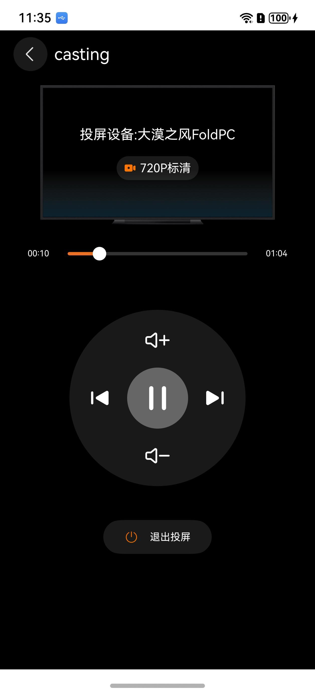

# 投屏组件快速入门

## 目录

- [简介](#简介)
- [约束与限制](#约束与限制)
- [快速入门](#快速入门)
- [API参考](#API参考)
- [示例代码](#示例代码)

## 简介

本组件支持视频投屏能力。

| 投屏控制                                               |
|----------------------------------------------------|
|  |

## 约束与限制

### 环境

- DevEco Studio版本：DevEco Studio 5.0.0 Release及以上
- HarmonyOS SDK版本：HarmonyOS 5.0.0 Release SDK及以上
- 设备类型：华为手机
- 系统版本：HarmonyOS 5.0.0(12)及以上

### 权限

- 后台任务权限：ohos.permission.KEEP_BACKGROUND_RUNNING

### 调试

进行投屏调试时，需保证两端的设备同时打开蓝牙和Wifi，并且可以访问网络。

## 快速入门

1. 安装组件。

   如果是在DevEco Studio使用插件集成组件，则无需安装组件，请忽略此步骤。

   如果是从生态市场下载组件，请参考以下步骤安装组件。

   a. 解压下载的组件包，将包中所有文件夹拷贝至您工程根目录的XXX目录下。

   b. 在项目根目录build-profile.json5添加module_cast。

   ```
   // 项目根目录下build-profile.json5填写module_cast路径。其中XXX为组件存放的目录名
   "modules": [
     {
       "name": "module_cast",
       "srcPath": "./XXX/module_cast"
     }
   ]
   ```

   c. 在项目根目录oh-package.json5添加依赖。
   ```
   // XXX为组件存放的目录名称
   "dependencies": {
     "module_cast": "file:./XXX/module_cast"
   }
   ```

2. 引入组件。

    ```
   import { CastingLayer, CastPicker, CastService, CastSessionListener, VideoData } from 'module_cast';
   ```

3. 调用组件，详细参数配置说明参见[API参考](#API参考)。
   ```
   import { CastingLayer, CastService, CastSessionListener, VideoData } from 'module_cast'
   import { hilog } from '@kit.PerformanceAnalysisKit'
   import { common } from '@kit.AbilityKit'
   
   const TAG = 'CastDemo'
   
   @Entry
   @ComponentV2
   struct Index {
     @Local castService: CastService = CastService.getInstance()
     @Local listener: CastSessionListenerImpl = new CastSessionListenerImpl()
   
     aboutToAppear(): void {
       this.castService.init(this.getUIContext().getHostContext() as common.UIAbilityContext)
       this.castService.registerSessionListener(this.listener)
     }
   
     build() {
       Stack({ alignContent: Alignment.TopStart }) {
         CastingLayer({
           castService: this.castService,
           title: `第${this.listener.currentIndex + 1}集`,
           onBack: () => {
             this.castService.endCasting()
           },
           onPlayNext: () => {
             this.listener.onPlayNext()
           },
           onPlayPre: () => {
             this.listener.onPlayPre()
           }
         })
       }.width('100%')
       .height('100%')
     }
   }
   
   @ObservedV2
   class CastSessionListenerImpl implements CastSessionListener {
     @Trace isPlay: boolean = false
     @Trace public currentIndex: number = 0
     public videoList: VideoData[] = [{
       index: 1,
       url: 'https://consumer.huawei.com/content/dam/huawei-cbg-site/cn/mkt/pdp/phones/ah-ultra/video/kv-intro-pop.mp4',
       name: '第1集',
       head: 'https://developer.huawei.com/allianceCmsResource/resource/HUAWEI_Developer_VUE/images/0603public/APPICON.png'
     }, {
       index: 2,
       url: 'https://consumer.huawei.com/content/dam/huawei-cbg-site/cn/mkt/plp/new-phones/video/mate-series.mp4',
       name: '第2集',
       head: 'https://developer.huawei.com/allianceCmsResource/resource/HUAWEI_Developer_VUE/images/0603public/sj-next-pc.jpeg'
     }, {
       index: 3,
       url: 'https://consumer.huawei.com/content/dam/huawei-cbg-site/cn/mkt/pdp/phones/ah-ultra/video/design-intro-pop.mp4',
       name: '第3集',
       head: 'https://developer.huawei.com/allianceCmsResource/resource/HUAWEI_Developer_VUE/images/0603public/APPICON.png'
     }]
   
     onStartCasting(): void {
     }
   
     onEndCasting(): void {
     }
   
     onPlay(): void {
     }
   
     onPause(): void {
     }
   
     onPlayNext(): void {
     }
   
     onPlayPre(): void {
     }
   
     onSeek(time: number): void {
     }
   
     onFastForward(time: number): void {
     }
   
     onRewind(time: number): void {
     }
   }
   ```

## API参考

### 接口

CastingLayer(options: [CastingLayerOptions](#CastingLayerOptions对象说明))

投屏组件。

**参数：**

| 参数名     | 类型                                              | 是否必填 | 说明         |
|:--------|:------------------------------------------------|:-----|:-----------|
| options | [CastingLayerOptions](#CastingLayerOptions对象说明) | 是    | 配置投屏组件的参数。 |

### CastingLayerOptions对象说明

| 参数名         | 类型                              | 是否必填 | 说明     |
|:------------|:--------------------------------|:-----|:-------|
| castService | [CastService](#CastService对象说明) | 是    | 投屏服务实例 |
| title       | string                          | 否    | 投屏名称   |
| onPlayNext  | Function                        | 否    | 上一曲通知  |
| onPlayPre   | Function                        | 否    | 下一曲通知  |
| onBack      | Function                        | 否    | 退出界面通知 |

### CastService对象说明

| 参数名                       | 类型                                                                          | 说明                 |
|:--------------------------|:----------------------------------------------------------------------------|:-------------------|
| getInstance               | () => [CastService](#CastService对象说明)                                       | 获取CastService单实例对象 |
| init                      | (context: common.UIAbilityContext) => Promise<void>                         | 初始化CastService     |
| registerSessionListener   | (listener: [CastSessionListener](#CastSessionListener对象说明)) => void         | 注册会话监听             |
| unregisterSessionListener | (ilistener: [CastSessionListener](#CastSessionListener对象说明)) => void        | 取消会话监听             |
| play                      | (position?: avSession.PlaybackPosition, duration?: number) => Promise<void> | 播放                 |
| pause                     | (position?: avSession.PlaybackPosition, duration?: number) => Promise<void> | 暂停                 |
| seek                      | (timeMs: number) => void                                                    | 设置视频跳转到某个时间位置播放    |
| setVolume                 | (value: number) => void                                                     | 设置远端播放音量           |
| setVolumeByOffset         | (value: number) => void                                                     | 设置远端播放音量           |
| setAVMetadata             | (videoData: [VideoData](#VideoData对象说明), duration?: number) => void         | 设置当前播放媒体信息         |
| endCasting                | () => void                                                                  | 停止投屏               |
| castStatusModel           | [CastStatusModel](#CastStatusModel对象说明)                                     | 投屏状态               |
| deinit                    | ()=>void                                                                    | 销毁CastService      |
| reInit                    | ()=>void                                                                    | 重新初始化CastService   |

### CastSessionListener对象说明

| 参数名            | 类型                     | 说明       |
|:---------------|:-----------------------|:---------|
| onStartCasting | () => void             | 启动投屏通知   |
| onEndCasting   | () => void             | 停止投屏通知   |
| onPlay         | () => void             | 播放通知     |
| onPause        | () => void             | 暂停通知     |
| onPlayNext     | () => void             | 下一视频通知   |
| onPlayPre      | () => void             | 上一视频通知   |
| onSeek         | (time: number) => void | 调整播放进度通知 |
| onFastForward  | (time: number) => void | 快进通知     |
| onRewind       | (time: number) => void | 快退通知     |

### VideoData对象说明

| 参数名   | 类型     | 说明                          |
|:------|:-------|:----------------------------|
| url   | string | 投屏链接(支持网络链接和图库视频的file://格式) |
| index | number | 投屏id                        |
| head  | string | 投屏封面                        |
| name  | string | 投屏名称                        |

### CastStatusModel对象说明

| 参数名               | 类型                   | 说明        |
|:------------------|:---------------------|:----------|
| isCasting         | boolean              | 是否投屏中     |
| isCastPlaying     | boolean              | 停止投屏处于播放中 |
| castCurrentTime   | number               | 当前投屏时间    |
| castDuration      | number               | 当前投屏总时长   |
| castResolution    | string               | 当前投屏分辨率   |
| currentDeviceName | string               | 当前投屏设备名称  |
| castVolume        | number               | 当前投屏音量    |
| castMaxVolume     | number               | 当前投屏最大音量  |
| currentDeviceType | avSession.DeviceType | 停止投屏设备类型  |

## 示例代码

```
import { CastingLayer, CastPicker, CastService, CastSessionListener, VideoData } from 'module_cast'
   import { hilog } from '@kit.PerformanceAnalysisKit'
   import { common } from '@kit.AbilityKit'
   import { photoAccessHelper } from '@kit.MediaLibraryKit'
   import { BusinessError } from '@kit.BasicServicesKit'
   
   const TAG = 'CastDemo'
   const DOMAIN = 0x0000
   
   @Entry
   @ComponentV2
   struct Index {
     @Local castService: CastService = CastService.getInstance()
     @Local listener: CastSessionListenerImpl = new CastSessionListenerImpl()
     @Local ready: boolean = false
     private photoSelectOptions = new photoAccessHelper.PhotoSelectOptions();

     playLocalVideo(){
       this.photoSelectOptions.MIMEType = photoAccessHelper.PhotoViewMIMETypes.VIDEO_TYPE; // 过滤选择媒体文件类型为VIDEO。
       this.photoSelectOptions.maxSelectNumber = 5; // 选择媒体文件的最大数目。
       const photoViewPicker = new photoAccessHelper.PhotoViewPicker();
       photoViewPicker.select(this.photoSelectOptions).then((photoSelectResult: photoAccessHelper.PhotoSelectResult) => {
         photoSelectResult.photoUris.forEach((item:string,index:number)=>{
           let video: VideoData = {
             index: 4+index,
             url: item,
             name: `第${4+index}集`,
             head: 'https://developer.huawei.com/allianceCmsResource/resource/HUAWEI_Developer_VUE/images/0603public/APPICON.png'
           }
           this.listener.videoList.push(video)
         })
       }).catch((err: BusinessError) => {
         console.error(`Invoke photoViewPicker.select failed, code is ${err.code}, message is ${err.message}`);
       })
     }
   
     aboutToAppear(): void {
       this.castService.init(this.getUIContext().getHostContext() as common.UIAbilityContext)
       this.castService.registerSessionListener(this.listener)
     }
   
     build() {
       Stack({ alignContent: Alignment.TopStart }) {
         if (this.castService.castStatusModel.isCasting) {
           CastingLayer({
             castService: this.castService,
             title: `第${this.listener.currentIndex + 1}集`,
             onBack: () => {
               this.castService.endCasting()
             },
             onPlayNext: () => {
               this.listener.onPlayNext()
             },
             onPlayPre: () => {
               this.listener.onPlayPre()
             }
           })
         } else {
           Row() {
              if (this.ready) {
                 CastPicker()
                   .margin({ left: 12 })
                 SymbolGlyph($r('sys.symbol.picture_2'))
                    .fontSize(24)
                    .fontColor([$r('sys.color.font_on_primary')])
                    .onClick(()=>{
                      this.playLocalVideo()
                    })
              }
           }.height(40)
           .width('100%')
           .backgroundColor(Color.Black)
   
           Stack({ alignContent: Alignment.Center }) {
             SymbolGlyph(this.listener.isPlay ? $r('sys.symbol.pause') : $r('sys.symbol.play'))
               .onClick(() => {
                 this.ready = true
                 this.listener.isPlay = !this.listener.isPlay
                 if (this.listener.isPlay) {
                   this.castService.setAVMetadata(this.listener.videoList[this.listener.currentIndex], 100000)
                   this.castService.play()
                 } else {
                   this.castService.pause()
                 }
   
                 hilog.info(DOMAIN, TAG, `play:${this.listener.isPlay}`)
               })
               .fontColor([$r('sys.color.black')])
               .fontSize(40)
           }
           .width('100%')
           .height('100%')
           .hitTestBehavior(HitTestMode.Transparent)
         }
       }
       .width('100%')
       .height('100%')
     }
   }
   
   @ObservedV2
   class CastSessionListenerImpl implements CastSessionListener {
     @Trace isPlay: boolean = false
     @Trace public currentIndex: number = 0
     public videoList: VideoData[] = [{
       index: 1,
       url: 'https://consumer.huawei.com/content/dam/huawei-cbg-site/cn/mkt/pdp/phones/ah-ultra/video/kv-intro-pop.mp4',
       name: '第1集',
       head: 'https://developer.huawei.com/allianceCmsResource/resource/HUAWEI_Developer_VUE/images/0603public/APPICON.png'
     }, {
       index: 2,
       url: 'https://consumer.huawei.com/content/dam/huawei-cbg-site/cn/mkt/plp/new-phones/video/mate-series.mp4',
       name: '第2集',
       head: 'https://developer.huawei.com/allianceCmsResource/resource/HUAWEI_Developer_VUE/images/0603public/sj-next-pc.jpeg'
     }, {
       index: 3,
       url: 'https://consumer.huawei.com/content/dam/huawei-cbg-site/cn/mkt/pdp/phones/ah-ultra/video/design-intro-pop.mp4',
       name: '第3集',
       head: 'https://developer.huawei.com/allianceCmsResource/resource/HUAWEI_Developer_VUE/images/0603public/APPICON.png'
     }]
   
     onStartCasting(): void {
       hilog.info(DOMAIN, TAG, 'onStartCasting')
     }
   
     onEndCasting(): void {
       hilog.info(DOMAIN, TAG, 'onStopCasting')
     }
   
     onPlay(): void {
       hilog.info(DOMAIN, TAG, 'onPlay')
     }
   
     onPause(): void {
       hilog.info(DOMAIN, TAG, 'onPause')
     }
   
     onPlayNext(): void {
       hilog.info(DOMAIN, TAG, 'onPlayNext')
       this.currentIndex = (this.currentIndex + 1) % this.videoList.length
       CastService.getInstance().setAVMetadata(this.videoList[this.currentIndex], 100000)
       CastService.getInstance().play()
     }
   
     onPlayPre(): void {
       hilog.info(DOMAIN, TAG, 'onPlayPre')
       this.currentIndex = (this.currentIndex - 1) % this.videoList.length
       CastService.getInstance().setAVMetadata(this.videoList[this.currentIndex], 100000)
       CastService.getInstance().play()
     }
   
     onSeek(time: number): void {
       hilog.info(DOMAIN, TAG, 'onSeek')
     }
   
     onFastForward(time: number): void {
       hilog.info(DOMAIN, TAG, 'onFastForward')
     }
   
     onRewind(time: number): void {
       hilog.info(DOMAIN, TAG, 'onRewind')
     }
   }
```
