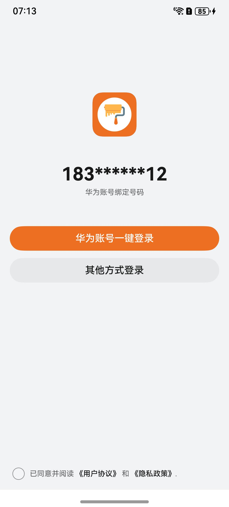

# 登录组件快速入门

## 目录

- [简介](#简介)
- [使用](#使用)
- [API参考](#API参考)
- [示例代码](#示例代码)

## 简介

本组件提供了华为账号一键登录及微信一键登录的能力，开发者可以根据业务需要快速实现应用登录。



## 使用

1. 配置华为账号服务。

   a. 将应用的client ID配置到entry模块的src/main/module.json5文件，详细参考：[配置Client ID](https://developer.huawei.com/consumer/cn/doc/harmonyos-guides/account-client-id)。

    ```
    ...
      "requestPermissions": [],
      "metadata": [
         {
           "name": "client_id",
           "value": "*****"
           // 配置为获取的Client ID
         },
       ],
       "extensionAbilities": [],
      ... 
    ```
   b. [配置签名和指纹](https://developer.huawei.com/consumer/cn/doc/harmonyos-guides/account-sign-fingerprints)。

   c. [申请scope权限](https://developer.huawei.com/consumer/cn/doc/harmonyos-guides/account-config-permissions) 。

2. 前往微信开放平台申请AppId并配置鸿蒙应用信息，详情请参考[鸿蒙接入指南](https://developers.weixin.qq.com/doc/oplatform/Mobile_App/Access_Guide/ohos.html)。

3. 将模板根目录的components下module_login目录拷贝至您工程根目录components/，并添加依赖和module声明。

    ```
    // entry/oh-package.json5
    "dependencies": {
      "module_login": "file:../components/module_login"
    }

    // build-profile.json5
    "modules": [
      {
        "name": "module_login",
        "srcPath": "./components/module_login"
      }
    ]
    ```

4. 引入登录组件句柄。

    ```
    import { Channel, LoginService, LoginType } from 'module_login';
    ```

5. 调用组件，详细参数配置说明参见[API参考](#API参考)。

    ```
    // 登录使用
    LoginService({
        icon: $r('app.media.app_icon'),
        privacyPolicyEvent: () => {
        	// 跳转页面
        },
        loginBtnBgColor: '#007DFF',
        termOfServiceEvent: () => {
        	// 跳转页面
        },
        loginTypes: [new Channel(LoginType.WECHAT, '微信登录', {
            appId: 'wxd5a474c635b8fd17',
            scope: 'snsapi_userinfo,snsapi_friend,snsapi_message,snsapi_contact',
            transaction: 'test123',
            state: 'none',
        }, $r('app.media.wechat'))],
        pathInfos: this.pageInfos,
    });
    ```

## API参考

### 子组件

无

### 接口

LoginService(icon:ResourceStr,loginTypes:Channel[],loginBtnBgColor:ResourceStr,pathInfos:NavPathStack)

登录组件。

**参数：**

| 参数名             | 类型                                                                                                            | 是否必填 | 说明                                                                                                                              |
|:----------------|:--------------------------------------------------------------------------------------------------------------|:-----|:--------------------------------------------------------------------------------------------------------------------------------|
| icon            | [ResourceStr](https://developer.huawei.com/consumer/cn/doc/harmonyos-references-V14/ts-types-V14#resourcestr) | 否    | 应用图标，参考[UX设计规范](https://developer.huawei.com/consumer/cn/doc/harmonyos-guides/account-phone-unionid-login#section2558741102912) |
| loginTypes      | [Channel](#Channel对象说明)                                                                                       | 是    | 登录渠道信息                                                                                                                          |
| loginBtnBgColor | string                                                                                                        | 否    | 一键登录按钮背景色                                                                                                                       |

#### Channel对象说明

| 参数名       | 类型                                                                                                            | 是否必填 | 说明       |
|:----------|:--------------------------------------------------------------------------------------------------------------|:-----|:---------|
| type      | [LoginType](#LoginType枚举说明)                                                                                   | 是    | 登录类型     |
| icon      | [ResourceStr](https://developer.huawei.com/consumer/cn/doc/harmonyos-references-V14/ts-types-V14#resourcestr) | 是    | 登录渠道图标   |
| extraInfo | ExtraInfo                                                                                                     | 是    | 登录必须信息   |
| click     | ()=>{}                                                                                                        | 否    | 登录图标点击方法 |
| name      | string                                                                                                        | 是    | 登录方式名称   |

#### LoginType枚举说明

| 名称     | 值 | 说明     |
|:-------|:--|:-------|
| WECHAT | 1 | 微信一键登录 |

#### ExtraInfo对象说明

当登录方式为微信登录时，此对象必传，具体参数含义请参考[鸿蒙接入指南](https://developers.weixin.qq.com/doc/oplatform/Mobile_App/Access_Guide/ohos.html)。

| 参数名         | 类型     | 是否必填 |
|:------------|:-------|:-----|
| appId       | string | 是    |
| scope       | string | 否    |
| transaction | string | 否    |
| state       | string | 否    |

### 事件

支持以下事件：

#### privacyPolicyEvent

privacyPolicyEvent: () => void = () => {}

点击隐私政策时的跳转方法。

#### termOfServiceEvent

termOfServiceEvent: () => void = () => {}

点击用户协议时的跳转方法。

#### loginFinishedCb

loginFinishedCb: (flag: boolean, unionId?: string) => void = () => {}

登录成功的回调事件，flag标志是否为真实登录，unionId为华为账号用户在同一个开发者账号下产品的身份ID。

## 示例代码

```
import { promptAction } from '@kit.ArkUI';
import { Channel, LoginService, LoginType } from 'module_login';

@Entry
@ComponentV2
struct Index {
   
   build() {
      RelativeContainer() {
         LoginService({
            icon: $r('app.media.startIcon'),
            privacyPolicyEvent: () => {
               promptAction.showToast({ message: '跳转页面' })
            },
            loginBtnBgColor: '#FF0000',
            termOfServiceEvent: () => {
               promptAction.showToast({ message: '跳转页面' })
            },
            loginTypes: [new Channel(LoginType.WECHAT, '微信登录', {
               appId: 'wxd5a474c635b8fd17',
               scope: 'snsapi_userinfo,snsapi_friend,snsapi_message,snsapi_contact',
               transaction: 'test123',
               state: 'none',
            }, $r('app.media.startIcon'))],
            loginFinishedCb: (flag: boolean, unionID?: string) => {
               // 模板忽略登录失败场景
               promptAction.showToast({ message: '登录成功回调' })
            },
         });
      }
      .height('100%')
         .width('100%')
   }
}

```
