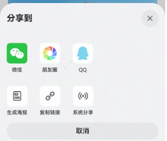

# 分享组件快速入门

## 目录

- [简介](#简介)
- [约束与限制](#约束与限制)
- [快速入门](#快速入门)
- [API参考](#API参考)
- [示例代码](#示例代码)

## 简介

本组件支持微信、朋友圈、qq、生成海报、系统分享等分享功能。



## 约束与限制

### 环境

- DevEco Studio版本：DevEco Studio 5.0.3 Release及以上
- HarmonyOS SDK版本：HarmonyOS 5.0.3 Release SDK及以上
- 设备类型：华为手机（包括双折叠和阔折叠）
- 系统版本：HarmonyOS 5.0.1(13)及以上

### 权限

- 网络权限：ohos.permission.INTERNET

## 快速入门

1. 安装组件。

   如果是在DevEco Studio使用插件集成组件，则无需安装组件，请忽略此步骤。

   如果是从生态市场下载组件，请参考以下步骤安装组件。

   a. 解压下载的组件包，将包中所有文件夹拷贝至您工程根目录的XXX目录下。

   b. 在项目根目录build-profile.json5添加module_share模块。

   ```
   // 项目根目录下build-profile.json5填写module_share路径。其中XXX为组件存放的目录名
   "modules": [
     {
       "name": "module_share",
       "srcPath": "./XXX/module_share"
     }
   ]
   ```

   c. 在项目根目录oh-package.json5添加依赖。

   ```
   // XXX为组件存放的目录名称
   "dependencies": {
     "module_share": "file:./XXX/module_share"
   }
   ```

2. 引入组件。

   ```
   import { Share } from 'module_share';
   ```
3. 在工程入口hap包的module.json5文件中添加配置,具体见下图
   ```
   "querySchemes": [
      "weixin",
      "wxopensdk"
    ],
   
   "skills": [
          {
            "entities": [
              "entity.system.home"
            ],
            "actions": [
              "action.system.home",
              "wxentity.action.open"
            ]
          }
        ]
   "metadata": [
      {
        /*
        * 替换应用的Client ID
        */
        "name": "client_id",
        "value": "xxx"
      }
    ]
   ```
      
    
4. 接入微信SDK。
   前往微信开放平台申请AppID并配置鸿蒙应用信息，详情参考：[鸿蒙接入指南](https://developers.weixin.qq.com/doc/oplatform/Mobile_App/Access_Guide/ohos.html)。
5. 接入QQ。
   前往QQ开放平台申请AppID并配置鸿蒙应用信息，详情参考：[鸿蒙接入指南](https://wiki.connect.qq.com/sdk%e4%b8%8b%e8%bd%bd)。

## API参考

### 接口

Share(option: [ShareOptions](#ShareOptions对象说明))

分享组件的参数

**参数：**

| 参数名     | 类型                                                    | 是否必填 | 说明         |
|:--------|:------------------------------------------------------|:-----|:-----------|
| options | [ShareOptions](#ShareOptions对象说明) | 否    | 配置分享组件的参数。 |

#### ShareOptions对象说明

| 参数名                | 类型                                | 是否必填 | 说明                  |
|:-------------------|:----------------------------------|:-----|:--------------------|
| qrCodeInfo         | [ShareOptions](#ShareOptions对象说明) | 是    | 生成海报二维码的相关信息        |
| shareRenderBuilder | () => void                        | 否    | 自定义插槽，可自定义分享入口图片内容等 |

#### ShareOptions对象说明

| 参数名         | 类型                  | 是否必填 | 说明        |
|:------------|:--------------------|:-----|:----------|
| id          | string              | 否    | 分享文章的id   |
| type        | string \| number    | 否    | 分享文章的类型   |
| title       | string              | 否    | 分享文章的标题   |
| createTime  | string              | 否    | 分享文章的创建时间 |
| coverUrl    | string \| undefined | 否    | 分享文章的封面   |
| isVideo     | boolean             | 否    | 分享文章是否是视频 |
| articleFrom | string \| undefined | 否    | 分享文章的来源   |

### 事件

支持以下事件：

#### onClose

onClose: () => void = () => {}

分享弹窗关闭的回调

#### onOpen

onOpen: () => void = () => {}

分享弹窗打开的回调

## 示例代码

```ts
import { Share } from 'module_share';

@Entry
@ComponentV2
export struct Index {
  @Builder
  shareCommentBuilder() {
    Column({ space: 5 }) {
      Image($r('app.media.app_background'))
        .width(21)
        .height(21)
      Text('2000')
        .fontSize(10)
        .fontColor($r('sys.color.font_on_primary'))
    }
  }

  build() {
    Column(){
      Share({
        qrCodeInfo: {
          id: 'post_1',
          type: 2,
          articleFrom: '1号选手',
          title: '假期的旅行碎片已加载完毕～。旅行哪里是逃离呀，分明是让你在人山人海里，重新找到自己的位置',
          createTime: '2025-8-4 10:26',
          isVideo: false,
          coverUrl: 'https://agc-storage-drcn.platform.dbankcloud.cn/v0/news-hnp2d/news_tra_2.jpg',
        },
        shareRenderBuilder: () => {
          this.shareCommentBuilder()
        },
      })
    }
  }
}
```