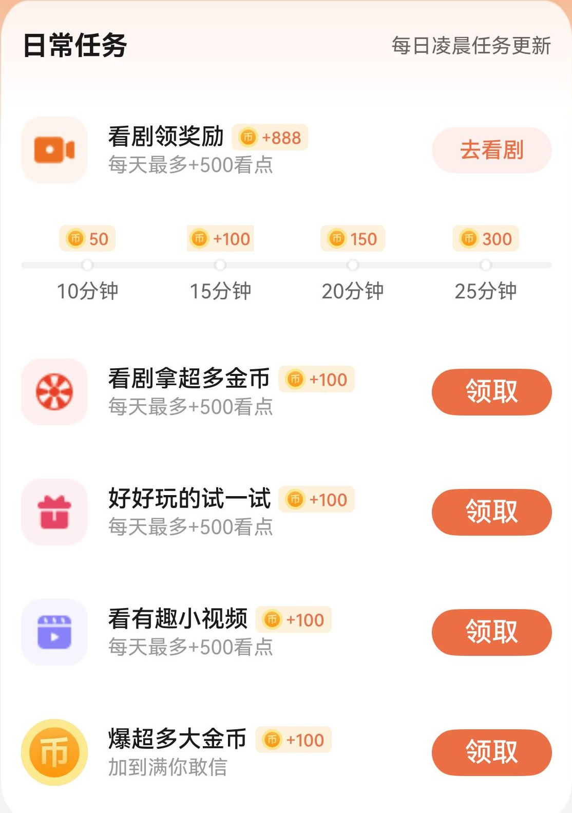

# 日常任务组件快速入门

## 目录

- [简介](#简介)
- [约束与限制](#约束与限制)
- [快速入门](#快速入门)
- [API参考](#API参考)
- [示例代码](#示例代码)

## 简介

本组件提供了做日常任务的功能，**其中看剧功能暂未对接三方短剧位，所展示短剧均为调测短剧，实际开发中可以借鉴使用，具体短剧位请对接实际业务**。



## 约束与限制

### 软件

* DevEco Studio版本：DevEco Studio 5.0.0 Release及以上
* HarmonyOS SDK版本：HarmonyOS 5.0.0 Release SDK及以上

### 硬件

* 设备类型：华为手机（包括双折叠和阔折叠）
* 系统版本：HarmonyOS 5.0.0(12)及以上

## 快速入门

1. 安装组件。

   如果是在DevEco Studio使用插件集成组件，则无需安装组件，请忽略此步骤。

   如果是从生态市场下载组件，请参考以下步骤安装组件。

   a. 解压下载的组件包，将包中所有文件夹拷贝至您工程根目录的XXX目录下。

   b. 在项目根目录build-profile.json5添加task_list模块。

   ```
    // 在项目根目录build-profile.json5填写task_list路径。其中XXX为组件存放的目录名
    "modules": [
        {
        "name": "task_list",
        "srcPath": "./XXX/task_list",
        }
    ]
   ```
   c. 在项目根目录oh-package.json5中添加依赖。
    ```
    // XXX为组件存放的目录名称
    "dependencies": {
      "task_list": "file:./XXX/task_list"
    }
    ```

2. 引入组件。

   ```
   import { TaskList, TaskModel } from 'task_list';
   ```

3. 调用组件，详细参数配置说明参见[API参考](#API参考)。

   ```
   import { TaskList, TaskModel } from 'task_list';
   
   @Entry
   @ComponentV2
   struct Index {
   
     build() {
       Column() {
         TaskList({
                taskmsg: [
                  new TaskModel("看剧拿超多金币", 'app.media.award_lottery_event'),
                  new TaskModel("好好玩的试一试", 'app.media.award_treasure_box'),
                  new TaskModel("看有趣小视频", 'app.media.award_share_short_dramas'),
                  new TaskModel("爆超多大金币", undefined, "加到满你敢信")
                ]
              })
       }
     }
   }
   ```

## API参考

### 子组件

无

### 接口

TaskList(options?: TaskListOptions)

日常任务组件

**参数：**

| 参数名     | 类型                                      | 是否必填 | 说明     |
|---------|-----------------------------------------|----|--------|
| options | [TaskListOptions](#TaskListOptions对象说明) | 否  | 日常任务组件 |

### TaskListOptions对象说明

| 名称            | 类型                                 | 是否必填 | 说明                              |
|:--------------|:-----------------------------------|----|---------------------------------|
| taskmsg       | Array<[TaskModel](#TaskModel对象说明)> | 否  | 任务信息数组                          |
| onTaskSuccess | (balance:number)=>void             | 否  | 定义回调函数，balance为做任务获得金币数         |
| button        | ()=>void                           | 否  | 定义任务函数（定义点击“领取”按钮后，触发任务奖励的判断函数） |

### TaskModel对象说明

| 名称        | 类型     | 是否必填 | 说明   |
|:----------|:-------|----|------|
| title     | string | 是  | 任务名称 |
| titleIcon | string | 否  | 任务图标 |
| subTitle  | string | 否  | 任务提醒 |

## 示例代码

```
import { TaskList, TaskModel } from 'task_list';
   
   @Entry
   @ComponentV2
   struct Index {
     bonus: number = 0
   
     build() {
       Column() {
         TaskList({
                taskmsg: [
                  new TaskModel("看剧拿超多金币", 'app.media.award_lottery_event'),
                  new TaskModel("好好玩的试一试", 'app.media.award_treasure_box'),
                  new TaskModel("看有趣小视频", 'app.media.award_share_short_dramas'),
                  new TaskModel("爆超多大金币", undefined, "加到满你敢信")
                ],
                onTaskSuccess: (balance: number) => this.bonus += balance
              })
       }
     }
   }
```