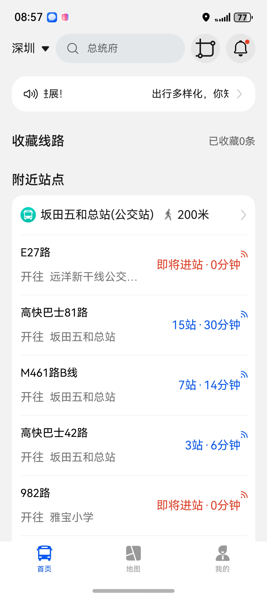
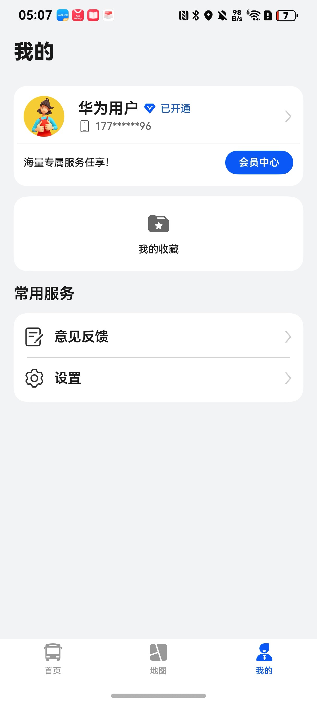

# 出行导航（公交地铁）应用模板快速入门

## 目录

- [功能介绍](#功能介绍)
- [约束与限制](#约束与限制)
- [快速入门](#快速入门)
- [示例效果](#示例效果)
- [开源许可协议](#开源许可协议)

## 功能介绍

您可以基于此模板直接定制应用，也可以挑选此模板中提供的多种组件使用，从而降低您的开发难度，提高您的开发效率。

此模板提供如下组件，所有组件存放在工程根目录的components下，如果您仅需使用组件，可参考对应组件的指导链接；如果您使用此模板，请参考本文档。

| 组件                                 | 描述                             | 使用指导                                            |
|:-----------------------------------|:-------------------------------|:------------------------------------------------|
| 站点线路组件（module_station_line_detail） | 支持频道地图展示、收藏、一键导航、实时到站信息、反向站台、经过该站点的所有公交、车辆信息地铁图、收藏、到站提醒  | [使用指导](components/module_station_line_detail/README.md) |
| 公交地铁站点地图组件（module_map_detail）      | 支持地图显示、路线规划、 导航进行中             | [使用指导](components/module_map_detail/README.md)  |
| 会员中心组件（vip_center）                 | 支持华为支付、支付宝支付、微信支付功能            | [使用指导](components/vip_center/README.md)        |
| 图片预览组件（module_imagepreview）        | 支持图片预览的功能，包括滑动预览、双指放大缩小图片      | [使用指导](components/module_imagepreview/README.md)     |

本模板为公交地铁类应用提供了常用功能的开发样例，模板主要分首页、地图、我的三大模块：

* 首页：提供地铁图、官方通告、搜索、附近站点统计、到站提醒

* 地图：提供附近站点地图标记、路线规划、导航进行中、定位自己位置、收藏路线、以及查看站点详情信息

* 我的：支持查看收藏、查看修改用户信息、会员中心、意见反馈、设置

本模板已集成华为账号、微信支付、支付宝支付、地图、推送等服务，只需做少量配置和定制即可快速实现华为账号的登录、地图等功能。

| 首页                                                | 地图                                          | 我的                                           |
|---------------------------------------------------|---------------------------------------------|----------------------------------------------|
|  |  |  |

本模板主要页面及核心功能如下所示：

```text
地铁公交模板
  ├──首页                           
  │   ├──顶部栏-搜索  
  │   │   ├── 历史搜索                          
  │   │   └── 热门搜索                      
  │   │         
  │   ├──顶部栏-城市选择    
  │   │     
  │   │──顶部栏-官方通告   
  │   │                
  │   ├──顶部栏-城市地铁图    
  │   │          ├── 离我最近                                             
  │   │          ├── 距离                                             
  │   │          └── 地铁站详情                                            
  │   │                 ├── 开往方向信息                                             
  │   │                 └── 首末班车信息 
  │   │
  │   │──收藏线路-查看收藏的线路  
  │   │       
  │   ├──附近站点    
  │   │     ├── 距离自己最近站点信息                                             
  │   │     ├── 到站信息                        
  │   │     ├── 开往方向                        
  │   │     └── 首末班车信息
  │   │
  │   └──站点详情    
  │       ├── 地铁详情                                             
  │       ├── 公交车详情                        
  │       ├── 到站提醒                         
  │       ├── 收藏公交站信息
  │       ├── 切换站台
  │       ├── 到这里去
  │       ├── 从这里出发
  │       └── 线路详情 
  │              ├──线路方向
  │              ├──站点信息
  │              ├──票价
  │              ├──拥堵信息
  │              ├──当前站点
  │              ├──收藏
  │              └──同站线路
  │
  ├──地图                           
  │   ├──我的位置  
  │   │     
  │   ├──附近站点-站点详情     
  │   │              ├── 地铁详情                                             
  │   │              ├── 公交车详情                        
  │   │              ├── 到站提醒                         
  │   │              ├── 收藏公交站信息
  │   │              ├── 切换站台
  │   │              ├── 到这里去
  │   │              ├── 从这里出发
  │   │              └── 线路详情 
  │   │                     ├──线路方向
  │   │                     ├──站点信息
  │   │                     ├──票价
  │   │                     ├──拥堵信息
  │   │                     ├──当前站点
  │   │                     ├──收藏
  │   │                     └──同站线路                    
  │   └──路线规划      
  │         ├── 我的位置       
  │         ├── 你要去哪       
  │         ├── 推荐       
  │         ├── 最快到达       
  │         ├── 最少换乘       
  │         ├── 站点搜索       
  │         └── 路线规划详情   
  │                 ├── 到达时间  
  │                 ├── 步行距离  
  │                 ├── 规划一览  
  │                 ├── 互换起始点  
  │                 ├── 总共站点  
  │                 ├── 上车站点  
  │                 └── 换乘详情                         
  │                          ├──我的位置   
  │                          ├──规划一览   
  │                          ├──步行距离   
  │                          ├──票价   
  │                          ├──乘坐的站点一览   
  │                          ├──到站提醒   
  │                          ├──收藏   
  │                          └──出发    
  │                              ├──导航进行   
  │                              ├──绘制线路一览   
  │                              └──地图站点信息                        
  └──我的                           
      ├──登录  
      │   ├── 华为账号一键登录                          
      │   ├── 微信登录                                                   
      │   ├── 验证码登录                                                   
      │   └── 用户隐私协议同意     
      │                   
      ├──会员中心                  
      │      ├── 开通会员            
      │      ├── 华为支付            
      │      ├── 微信支付            
      │      ├── 支付宝支付            
      │      ├── 取消自动续费会员            
      │      ├── 兑换会员            
      │      └── 会员套餐选择            
      │         
      ├──个人主页         
      │   ├── 头像、昵称
      │   ├── 编辑个人信息
      │   └── 手机号、简介
      │                    
      └──常用服务                                           
          ├── 意见反馈 
          │      ├──反馈问题             
          │      └──反馈记录                           
          └── 设置
               ├── 优先交通方式             
               ├── 车辆刷新频率           
               ├── 到站提醒  
               ├── 提醒时机             
               ├── 异常提醒           
               ├── 末班车提醒
               └── 退出登录                               
```

本模板工程代码结构如下所示：

```text
bussubway
├──commons
│  ├──lib_account/src/main/ets                            // 账号登录模块             
│  │    ├──components
│  │    │   └──AgreePrivacyBox.ets                        // 隐私同意勾选 
│  │    ├──constants
│  │    │   ├──Constants.ets                               // 常量
│  │    │   ├──ErrorCode.ets                               // 错误码
│  │    │   └──Types.ets                                   // 类型定义
│  │    ├──pages
│  │    │   ├──HuaweiLoginPage.ets                         // 华为账号登录
│  │    │   ├──OtherLoginPage.ets                          // 其他登录方式      
│  │    │   └──ProtocolWebView.ets                         // 协议webview
│  │    │ 
│  │    ├──services
│  │    │    ├──AccountApi.ets                             // 账号api
│  │    │    └──mockdata                                   // 协议数据                 
│  │    │          └──ProtocolData.ets                            
│  │    ├──utils  
│  │    │    ├──HuaweiAuthUtils.ets                        // 华为认证工具类
│  │    │    ├──LoginSheetUtils.ets                        // 统一登录半模态弹窗
│  │    │    └──WXApiUtils.ets                             // 微信登录事件处理类 
│  │    └──viewmodels
│  │            └──LoginVM.ets                             // 登录模块viewmodel
│  ├──lib_api/src/main/ets                                 // api模块                         
│  │    ├──account                                         // 用户模型    
│  │    └──bussubway                                       // 公交地铁api封装
│  │            
│  ├──lib_common/src/main/ets                              // 公用模块           
│  │    ├──constants                                       // 常量
│  │    ├──dialogs                                         // 弹窗
│  │    ├──models                                          // 模型
│  │    ├──push                                            // 推送
│  │    └──utils                                           // 工具 
│  │
│  ├──lib_native_components/src/main/ets                   // 自定义组件            
│  │    ├──components
│  │    │   ├──LineBusCard.ets                             // 线路公交卡片
│  │    │   ├──LineMetroCard.ets                           // 线路地铁卡片
│  │    │   └──TransferCard.ets                            // 换乘卡片
│  │    └─type 
│  │        └──CardTypes.ets                               // 卡片公交类型                
│  │
│  └──lib_widget/src/main/ets                              // 组件模块                
│       ├──components                         
│       │    └──NavHeaderBar.ets                           // 公用导航栏
│       └──constants                                       
│              └──Constants.ets                            // 常量
├──components
│  ├──module_advertisement                                 // 广告模块            
│  ├──aggregated_payment                                   // 聚合支付模块  
│  ├──base_apis                                            // 基础接口模块  
│  ├──module_city_select                                   // 城市选择模块
│  ├──module_feedback                                      // 意见反馈模块  
│  ├──module_imagepreview                                  // 图片预览模块
│  ├──module_map_detail                                    // 地图模块                                      
│  ├──module_station_line_detail                           // 站点详情模块                                                                                                                
│  └──vip_center                                           // 会员中心模块           
│      
├──features
│  ├──business_home/src/main/ets                           // 首页模块             
│  │    ├──components
│  │    │   ├──HomeHeaderBar.ets                           // 公用导航栏                     
│  │    │   ├──NewsSwiper.ets                              // 最新通知提醒                 
│  │    │   ├──SetReadIcon.ets                             // 设置已读图标                  
│  │    │   ├──StationBusCard.ets                          // 站点公交卡片                     
│  │    │   └──StationMetroCard.ets                        // 站点地铁卡片                       
│  │    ├──constants
│  │    │   └──SearchMockData.ets                          // 搜索mock数据
│  │    ├──pages
│  │    │   ├──CityPage.ets                                // 城市选择             
│  │    │   ├──HomePage.ets                                // 首页                            
│  │    │   ├──LineDetailPage.ets                          // 线路详情
│  │    │   ├──MoreNewsPage.ets                            // 官方公告 
│  │    │   ├──NewsDetailPage.ets                          // 公告数据
│  │    │   ├──SearchPage.ets                              // 搜索
│  │    │   ├──StopDetailPage.ets                          // 站点详情
│  │    │   └──SubwayPage.ets                              // 地铁
│  │    ├──utils
│  │    │   └──StopLineModelConvertUtil.ets                // 站点线路模型转换
│  │    └──viewmodels
│  │        └──HomeViewModel.ets                           // 主页viewmodel
│  │                                     
│  │
│  ├──business_map/src/main/ets                            // 地图           
│  │    ├─components                        
│  │    │   └──MapCommonConstants.ets                      // 地图模块常量                                                     
│  │    └──pages                         
│  │        └──HomeMap.ets                                 // 地图展示             
│  │
│  ├──business_mine/src/main/ets                           // 我的模块             
│  │    ├──components
│  │    │   ├──StationBusCard.ets                          // 站点公交卡片                      
│  │    │   └──StationMetroCard.ets                        // 站点地铁卡片
│  │    ├──constants
│  │    │   └──Constants.ets                               // 常量         
│  │    ├──pages 
│  │    │   ├──CollectPage.ets                             // 收藏
│  │    │   ├──MinePage.ets                                // 我的
│  │    │   └──VipCenterPage.ets                           // 会员中心                
│  │    ├──types
│  │    │   └──Types.ets                                   // 类型定义
│  │    └──viewmodels
│  │        └──MineVM.ets                                  // 我的viewmodel
│  │
│  └──business_setting/src/main/ets                        // 设置模块             
│      ├──components
│      │   ├──SettingCard.ets                              // 设置卡片
│      │   └──SettingSelectDialog.ets                      // 设置选项弹窗               
│      ├──pages
│      │   ├──SettingPage.ets                              // 设置页面
│      │   ├──SettingPersonal.ets                          // 编辑个人信息页面
│      │   └──SettingPrivacy.ets                           // 隐私设置页面
│      ├──types 
│      │   └──Types.ets                                    // 类型定义
│      └──viewmodels
│          ├──SettingAboutVM.ets                           // 关于页面
│          ├──SettingFontVM.ets                            // 字体大小设置
│          ├──SettingNetworkVM.ets                         // 播放与网络设置   
│          ├──SettingPersonalVM.ets                        // 编辑个人信息       
│          ├──SettingPrivacyVM.ets                         // 隐私设置
│          └──SettingVM.ets                                // 退出登录
│   
└──phone/src/main/ets                                      // phone模块
        ├──common                        
        │   ├──AppTheme.ets                                // 应用主题色
        │   ├──Constants.ets                               // 业务常量
        │   └──WantUtils.ets                               // 数据模型
        ├──components                    
        │   └──CustomTabBar.ets                            // 应用底部Tab
        ├──pages   
        │   ├──AgreeDialogPage.ets                         // 隐私同意弹窗
        │   ├──Index.ets                                   // 入口页面
        │   ├──IndexPage.ets                               // 应用主页面
        │   ├──PrivacyPage.ets                             // 查看隐私协议页面
        │   ├──SafePage.ets                                // 隐私同意页面
        │   ├──SplashPage.ets                              // 开屏广告页面
        │   └──StartPage.ets                               // 应用启动页面
        ├──viewmodels
        │   ├──IndexPageVM.ets                             // 应用启动
        │   ├──IndexVM.ets                                 // 主页
        │   └──SafePageVM.ets                              // 隐私同意  
        └──widget                                          // 服务卡片
 
```

## 约束与限制

### 环境

* DevEco Studio版本：DevEco Studio 5.0.5 Release及以上
* HarmonyOS SDK版本：HarmonyOS 5.0.5 Release SDK及以上
* 设备类型：华为手机(双折叠和阔折叠)
* 系统版本：HarmonyOS 5.0.5(17)及以上

### 权限

- 网络权限：ohos.permission.INTERNET
- 允许应用获取网络信息：ohos.permission.GET_NETWORK_INFO
- 允许应用获取Wi-Fi信息和使用P2P能力：ohos.permission.GET_WIFI_INFO
- 跨应用关联权限：ohos.permission.APP_TRACKING_CONSENT
- 位置权限：ohos.permission.LOCATION
- 允许应用在后台运行时获取设备位置信息：ohos.permission.APPROXIMATELY_LOCATION
- 地图后台权限：ohos.permission.LOCATION_IN_BACKGROUND
- 允许Service Ability在后台持续运行：ohos.permission.KEEP_BACKGROUND_RUNNING

### 调试

只支持真机运行。

## 快速入门

### 配置工程

在运行此模板前，需要完成以下配置：

1. 在AppGallery Connect创建应用，将包名配置到模板中。

   a. 参考[创建HarmonyOS应用](https://developer.huawei.com/consumer/cn/doc/app/agc-help-create-app-0000002247955506)为应用创建APP ID，并将APP ID与应用进行关联。

   b. 返回应用列表页面，查看应用的包名。

   c. 将模板工程根目录下AppScope/app.json5文件中的bundleName替换为创建应用的包名。

2. 配置华为账号服务。

   a. 将应用的Client ID配置到products/phone/src/main路径下的module.json5文件中，详细参考：[配置Client ID](https://developer.huawei.com/consumer/cn/doc/harmonyos-guides/account-client-id)。

   b. 申请华为账号一键登录所需的权限，详细参考：[申请账号权限](https://developer.huawei.com/consumer/cn/doc/harmonyos-guides/account-config-permissions)。

3. 配置推送服务。

   a. [开通推送服务](https://developer.huawei.com/consumer/cn/doc/harmonyos-guides/push-config-setting)。

   b. 按照需要的权益[申请通知消息自分类权益](https://developer.huawei.com/consumer/cn/doc/harmonyos-guides/push-apply-right)。

   c. [端云调试](https://developer.huawei.com/consumer/cn/doc/harmonyos-guides/push-server)。

4. [开通地图服务](https://developer.huawei.com/consumer/cn/doc/harmonyos-guides/map-config-agc)。

5. 接入微信SDK。
   前往微信开放平台申请AppID并配置鸿蒙应用信息，详情参考：[鸿蒙接入指南](https://developers.weixin.qq.com/doc/oplatform/Mobile_App/Access_Guide/ohos.html)。

6. 对应用进行[手工签名](https://developer.huawei.com/consumer/cn/doc/harmonyos-guides/ide-signing#section297715173233)。

7. 添加手工签名所用证书对应的公钥指纹，详细参考：[配置公钥指纹](https://developer.huawei.com/consumer/cn/doc/app/agc-help-cert-fingerprint-0000002278002933)

8. 接入高德开放平台。
   前往高德开放平台申请JS API的开发者Key，详细参考：[高德地铁图 JS API](https://lbs.amap.com/api/subway-api/quickstart)。
   前往高德开放平台申请Web服务 API密钥（key），详细参考：[高德地图](https://lbs.amap.com/api/webservice/gettingstarted)。

### 运行调试工程

1. 连接调试手机和PC。

2. 菜单选择“Run > Run 'phone' ”或者“Run > Debug 'phone' ”，运行或调试模板工程。

## 示例效果

1. [首页](screenshots/thisFirst.jpg)
2. [地图](screenshots/map.jpg)
3. [我的](screenshots/mine.jpg)

## 开源许可协议

该代码经过[Apache 2.0 授权许可](http://www.apache.org/licenses/LICENSE-2.0)。
