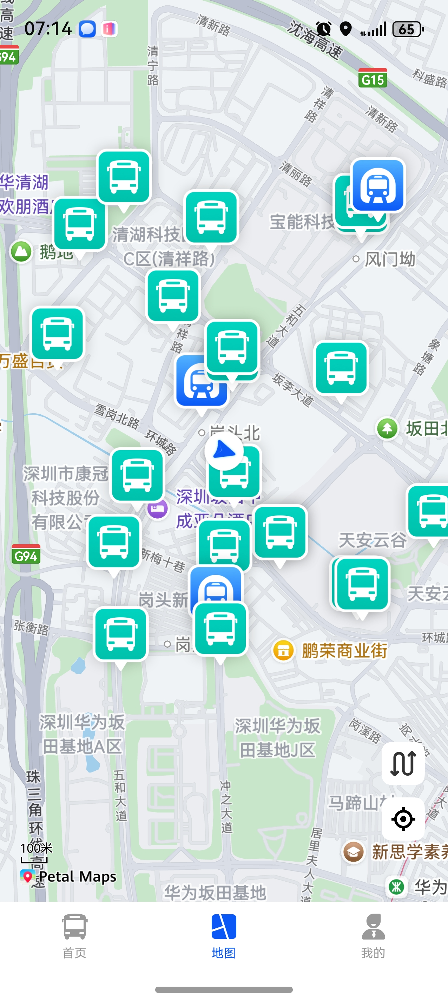

# 公交地铁站点地图组件快速入门

## 目录

- [简介](#简介)
- [约束与限制](#约束与限制)
- [使用](#使用)
- [API参考](#API参考)
- [示例代码](#示例代码)
- [开源许可协议](#开源许可协议)

## 简介

本组件提供了展示当前位置信息、附近站点、路线规划、导航功能


| 公交地铁站点地图                                    |
|---------------------------------------------|
|  |

## 约束与限制

### 环境

* DevEco Studio版本：DevEco Studio 5.0.5 Release及以上
* HarmonyOS SDK版本：HarmonyOS 5.0.5 Release SDK及以上
* 设备类型：华为手机(双折叠和阔折叠)
* 系统版本：HarmonyOS 5.0.5(17)及以上

### 权限

- 网络权限：ohos.permission.INTERNET

- 模糊位置权限: ohos.permission.APPROXIMATELY_LOCATION

- 位置权限: ohos.permission.LOCATION

- 传感器权限: ohos.permission.ACCELEROMETER

### 调试

只支持真机运行。

## 使用

1. 安装组件。

   如果是在DevEco Studio使用插件集成组件，则无需安装组件，请忽略此步骤。

   如果是从生态市场下载组件，请参考以下步骤安装组件。

   a. 解压下载的组件包，将包中所有文件夹拷贝至您工程根目录的XXX目录下。

   b. 在项目根目录build-profile.json5添加module_map_detail、module_station_line_detail模块。

    ```
    // 项目根目录下build-profile.json5填写module_map_detail、module_station_line_detail路径。其中XXX为组件存放的目录名
   "modules": [
      {
        "name": "module_map_detail",
        "srcPath": "./XXX/module_map_detail"
      },
      {
        "name": "module_station_line_detail",
        "srcPath": "./XXX/module_station_line_detail",
      }
   ]
    ```

   c. 在项目根目录oh-package.json5中添加依赖。
    ```
    // XXX为组件存放的目录名
    "dependencies": {
        "module_map_detail": "file:./XXX/module_map_detail"
    }
    ```

2. 引入组件。
    ```
   import {
     LocationUtils, MapComponents, MapSettingModel, TransitDetailModel
   } from 'module_map_detail'
   import { StopDetailModel } from 'module_station_line_detail'
   ```

3. 申请定位权限。

   a. 在调用线路详情组件aboutToAppear判读是否有定位权限
   ```
   SystemSceneUtils.checkPermissionGrant('ohos.permission.LOCATION').then((granted: boolean) => {
      this.settingInfo.locationHasPermission = granted
      this.settingInfo.locationShowPrompt = !granted
      if (granted) {
        LocationUtils.getGCJ02CurrentLocation().then((location: mapCommon.LatLng) => {
          this.location = location
        })
      }
    })
   ```
   b. 用户未授权，点击开启定位，向用户申请权限
   ```
   // 向用户申请位置权限
   private async requestLocationPermissionAgain(): Promise<void> {
    const granted: boolean = await this.applyLocationPermission()
    this.settingInfo.locationHasPermission = granted
    this.settingInfo.locationShowPrompt = !granted
    if (granted) {
      LocationUtils.getGCJ02CurrentLocation().then((location: mapCommon.LatLng) => {
        this.location = location
      })
    }
   }
   
   private applyLocationPermission(): Promise<boolean> {
    const permissions: Permissions[] = [
      'ohos.permission.APPROXIMATELY_LOCATION',
      'ohos.permission.LOCATION'
    ];

    if (!this.context) {
      this.context = getContext() as common.UIAbilityContext;
    }
    // 向用户申请
    const atManager = abilityAccessCtrl.createAtManager();
    return atManager.requestPermissionsFromUser(this.context, permissions)
      .then(async (result: PermissionRequestResult) => {
        if (result.authResults.every(v => v === 0)) {
          return true;
        }
        // 二次向用户申请
        else if (result.dialogShownResults && result.dialogShownResults.every(v => v === false)) {
          const resp = await atManager.requestPermissionOnSetting(this.context, permissions);
          return resp.every(v => v === abilityAccessCtrl.GrantStatus.PERMISSION_GRANTED);
        }
        return false;
      });
   }
    ```

4. 使用地图组件。详细参数配置说明参见[API参考](#API参考)。
    ```
    MapComponents()
   ```

## API参考

### 接口

MapComponents(options?: MapOptions)

地图组件。

**参数：**

| 参数名     | 类型                            | 是否必填 | 说明         |
|---------|-------------------------------|------|------------|
| options | [MapOptions](#MapOptions对象说明) | 是    | 配置地图组件的参数。 |

### MapOptions对象说明

| 名称                      | 类型                                                                                                                     | 是否必填 | 说明                  |
|-------------------------|------------------------------------------------------------------------------------------------------------------------|------|---------------------|
| currentLocation         | [mapCommon.LatLng](https://developer.huawei.com/consumer/cn/doc/harmonyos-references/map-common#section20691173773810) | 是    | 默认坐标信息              |
| isOpenOnePlanning       | boolean                                                                                                                | 否    | 是否打开路线详情页面          |
| mapSettingModel         | [MapSettingModel](#MapSettingModel对象说明)                                                                                | 否    | 地图到站提醒刷新类           |
| arrivalReminderStations | number                                                                                                                 | 是    | 剩余到达的站点数目           |
| onNearbyStopsRequested  | (location: string) => Promise<[StopDetailModel](#StopDetailModel对象说明)[]>                                               | 是    | 回调函数返回站点详情模型列表      |
| routeStopDetailPage     | (stopId: string) => void                                                                                               | 是    | 实现站点详情搜索回调（调用高德API） |
| onFavoriteClick         | () => void                                                                                                             | 是    | 收藏按钮点击事件            |
| onSearchStop            | (keyWord: string) => Promise<[StopDetailModel](#StopDetailModel对象说明)[]>                                                | 是    | 搜索站点回调函数            |
| onNavigateToStopDetail  | (stopDetailModel: [StopDetailModel](#StopDetailModel对象说明)) => void                                                     | 是    | 页面跳转回调函数            |
| getTransitRoutes        | (origin: string, destination: string, currentIndex: number) => Promise<[TransitDetailModel](#TransitDetailModel对象说明)>  | 是    | 路线规划回调函数            |
| onInterceptLogin        | (cb: (isLogin: boolean) => void) => void = () => {}                                                                    | 是    | 登录拦截回调函数            |

### TransitDetailModel对象说明

| 名称    | 类型                                | 是否必填 | 说明        |
|-------|-----------------------------------|------|-----------|
| route | [TransitRoute](#TransitRoute对象说明) | 是    | 返回的规划方案列表 |

### TransitRoute对象说明

| 名称          | 类型                                                | 是否必填 | 说明     |
|-------------|---------------------------------------------------|------|--------|
| origin      | string                                            | 否    | 起点经纬度  |
| destination | string                                            | 否    | 终点经纬度  |
| transits    | [TransitRouteTransit](#TransitRouteTransit对象说明)[] | 否    | 公交方案列表 |

### TransitRouteTransit对象说明

| 名称       | 类型                                                              | 是否必填 | 说明            |
|----------|-----------------------------------------------------------------|------|---------------|
| distance | string                                                          | 否    | 本条路线的总距离，单位：米 |
| cost     | [TransitRouteCost](#TransitRouteCost对象说明)                       | 否    | 路线费用信息        |
| segments | [TransitRouteTransitSegment](#TransitRouteTransitSegment对象说明)[] | 否    | 路线分段列表        |

### TransitRouteTransitSegment对象说明

| 名称      | 类型                                                                    | 是否必填 | 说明            |
|---------|-----------------------------------------------------------------------|------|---------------|
| walking | [TransitRouteTransitSegmentWork](#TransitRouteTransitSegmentWork对象说明) | 否    | 此分段中需要步行导航的信息 |
| bus     | [TransitRouteTransitSegmentBus](#TransitRouteTransitSegmentBus对象说明)   | 否    | 公交信息          |
| taxi    | [TransitRouteTransitSegmentTaxi](#TransitRouteTransitSegmentTaxi对象说明) | 否    | 出租车信息         |

### TransitRouteTransitSegmentTaxi对象说明

| 名称         | 类型                                                | 是否必填 | 说明    |
|------------|---------------------------------------------------|------|-------|
| distance   | number                                            | 否    | 距离    |
| polyline   | [TransitRoutePolyline](#TransitRoutePolyline对象说明) | 否    | 路线坐标点 |
| startpoint | string                                            | 否    | 起点坐标  |
| endpoint   | string                                            | 否    | 终点坐标  |

### TransitRouteTransitSegmentBus对象说明

| 名称       | 类型                                                                                  | 是否必填 | 说明     |
|----------|-------------------------------------------------------------------------------------|------|--------|
| buslines | [TransitRouteTransitSegmentBusBusline](#TransitRouteTransitSegmentBusBusline对象说明)[] | 否    | 公交线路列表 |

### TransitRouteTransitSegmentBusBusline对象说明

| 名称            | 类型                                                                                                          | 是否必填 | 说明     |
|---------------|-------------------------------------------------------------------------------------------------------------|------|--------|
| departureStop | [TransitRouteTransitSegmentBusBuslineDepartureStop](#TransitRouteTransitSegmentBusBuslineDepartureStop对象说明) | 否    | 出发站信息  |
| arrivalStop   | [TransitRouteTransitSegmentBusBuslineArrivalStop](#TransitRouteTransitSegmentBusBuslineArrivalStop对象说明)     | 否    | 到达站信息  |
| name          | string                                                                                                      | 否    | 线路名称   |
| id            | string                                                                                                      | 否    | 线路ID   |
| type          | string                                                                                                      | 否    | 线路类型   |
| distance      | number                                                                                                      | 否    | 距离     |
| cost          | [TransitRouteCost](#TransitRouteCost对象说明)                                                                   | 否    | 费用信息   |
| polyline      | [TransitRoutePolyline](#TransitRoutePolyline对象说明)                                                           | 否    | 路线坐标点  |
| viaStops      | [TransitRouteTransitSegmentBusBuslineViaStop](#TransitRouteTransitSegmentBusBuslineViaStop对象说明)[]           | 否    | 途径站点列表 |
| endStop       | string                                                                                                      | 否    | 末站     |
| uicolor       | string                                                                                                      | 否    | 线路颜色   |
| basicPrice    | string                                                                                                      | 否    | 起步价    |
| totalPrice    | string                                                                                                      | 否    | 全程票价   |

### TransitRouteTransitSegmentBusBuslineViaStop对象说明

| 名称       | 类型     | 是否必填 | 说明   |
|----------|--------|------|------|
| name     | string | 否    | 站点名称 |
| id       | string | 否    | 站点ID |
| location | string | 否    | 站点位置 |

### TransitRouteTransitSegmentBusBuslineArrivalStop对象说明

| 名称       | 类型     | 是否必填 | 说明    |
|----------|--------|------|-------|
| name     | string | 否    | 站点名称  |
| id       | string | 否    | 站点ID  |
| location | string | 否    | 站点位置  |
| entrance | string | 否    | 出入口信息 |

### TransitRouteTransitSegmentBusBuslineDepartureStop对象说明

| 名称       | 类型     | 是否必填 | 说明    |
|----------|--------|------|-------|
| name     | string | 否    | 站点名称  |
| id       | string | 否    | 站点ID  |
| location | string | 否    | 站点位置  |
| entrance | string | 否    | 出入口信息 |

### TransitRouteTransitSegmentWork对象说明

| 名称          | 类型                                                                              | 是否必填 | 说明           |
|-------------|---------------------------------------------------------------------------------|------|--------------|
| origin      | string                                                                          | 否    | 起点坐标         |
| destination | string                                                                          | 否    | 终点坐标         |
| distance    | number                                                                          | 否    | 每段线路步行距离     |
| cost        | [TransitRouteCost](#TransitRouteCost对象说明)                                       | 否    | 每段线路步行时间(费用) |
| steps       | [TransitRouteTransitSegmentWorkStep](#TransitRouteTransitSegmentWorkStep对象说明)[] | 否    | 步行路段列表       |

### TransitRouteTransitSegmentWorkStep对象说明

| 名称          | 类型                                                | 是否必填 | 说明      |
|-------------|---------------------------------------------------|------|---------|
| instruction | string                                            | 否    | 步行导航信息  |
| distance    | number                                            | 否    | 步行导航距离  |
| duration    | number                                            | 否    | 步行导航时间  |
| polyline    | [TransitRoutePolyline](#TransitRoutePolyline对象说明) | 否    | 步行导航经纬度 |

### TransitRoutePolyline对象说明

| 名称       | 类型     | 是否必填 | 说明     |
|----------|--------|------|--------|
| polyline | string | 否    | 此路段坐标集 |

### TransitRouteCost对象说明

| 名称         | 类型     | 是否必填 | 说明   |
|------------|--------|------|------|
| duration   | string | 否    | 花费时间 |
| transitFee | string | 否    | 公交费用 |

### MapSettingModel对象说明

| 名称                | 类型       | 是否必填 | 说明                      |
|-------------------|----------|------|-------------------------|
| SETTING_SPEED     | number[] | 是    | 刷新速度单位                  |
| warnType          | number   | 是    | 提醒类型：0-提前分钟数，1-提前站点     |
| warnValue         | number   | 是    | 提醒数值：1-5                |
| speedType         | number   | 是    | 刷新频率选择：0-10秒，1-30秒，2-1分钟 |
| isArrivalReminder | boolean  | 是    | 是否开启到站提醒                |

### StopDetailModel对象说明

| 名称            | 类型                                        | 是否必填 | 说明                  |
|---------------|-------------------------------------------|------|---------------------|
| siteId        | string                                    | 否    | 站点ID                |
| name          | string                                    | 否    | 站点名称                |
| address       | string                                    | 否    | 站点地址                |
| distance      | number                                    | 否    | 距离（米）               |
| sameNameCount | number                                    | 否    | 同名站台数量              |
| isFavorited   | boolean                                   | 否    | 是否已收藏               |
| latitude      | number                                    | 否    | 站点纬度                |
| longitude     | number                                    | 否    | 站点经度                |
| busLines      | [LineDetailModel[]](#LineDetailModel对象说明) | 否    | 经过的公交线路列表           |
| subwayLines   | [SubwayLineInfo[]](#SubwayLineInfo对象说明)   | 否    | 经过的地铁线路列表           |
| stopType      | string                                    | 否    | 站点类型（公交站：'bus_stop',地铁站：'subway_station'） |

### SubwayLineInfo对象说明

| 名称         | 类型                                        | 是否必填 | 说明     |
|------------|-------------------------------------------|------|--------|
| lineName   | string                                    | 否    | 线路名称   |
| lineNumber | string                                    | 否    | 线路编号   |
| lineColor  | string                                    | 否    | 线路颜色   |
| directions | [LineDetailModel[]](#LineDetailModel对象说明) | 否    | 双向信息列表 |

### LineDetailModel对象说明

| 名称            | 类型                                            | 是否必填 | 说明      |
|---------------|-----------------------------------------------|------|---------|
| busSubwayType | string                                        | 否    | 公交地铁类型  |
| id            | string                                        | 否    | 线路ID    |
| name          | string                                        | 否    | 线路名称    |
| polyline      | string                                        | 否    | 线路经纬度   |
| startStop     | string                                        | 否    | 首发站     |
| endStop       | string                                        | 否    | 末站      |
| startTime     | string                                        | 否    | 首班车时间   |
| endTime       | string                                        | 否    | 末班车时间   |
| direc         | string                                        | 否    | 反向线路 id |
| basicPrice    | string                                        | 否    | 起步价     |
| totalPrice    | string                                        | 否    | 全程票价    |
| interval      | string                                        | 否    | 发车间隔    |
| uicolor       | string                                        | 否    | 颜色      |
| busstops      | [LineDetailBusstop](#LineDetailBusstop对象说明)[] | 否    | 途径站列表   |
| currentStop   | [CurrentBusstop](#CurrentBusstop对象说明)         | 否    | 最近站点    |
| switchDirec   | () => void                                    | 否    | 切换路线的方法 |

### CurrentBusstop对象说明

| 名称                  | 类型                                      | 是否必填 | 说明         |
|---------------------|-----------------------------------------|------|------------|
| id                  | string                                  | 否    | 站点ID       |
| name                | string                                  | 否    | 公交站名       |
| stopOffsetIndex     | number                                  | 否    | 离起始站的索引    |
| location            | string                                  | 否    | 公交站经纬度     |
| comingBusList       | [ComingBus[]](#ComingBus对象说明)           | 否    | 快到站公交列表    |
| comingSubwayCarList | [SubwayCarState[]](#SubwayCarState对象说明) | 否    | 最近地铁车厢状态列表 |

### SubwayCarState对象说明

| 名称              | 类型     | 是否必填 | 说明 |
|-----------------|--------|------|----|
| crowdState      | string | 否    | 公交车拥挤状态（轻松舒适：'0'，轻微拥堵：'1'，严重拥堵：'2'） |
| tempretureState | string | 否    | 车厢状态（弱冷车厢：'0'，强冷车厢：'1'，商务车厢：'2' |

### ComingBus对象说明

| 名称          | 类型     | 是否必填 | 说明     |
|-------------|--------|------|--------|
| stations    | number | 否    | 站数     |
| time        | number | 否    | 时间     |
| distance    | number | 否    | 距离     |
| numberplate | string | 否    | 车牌     |
| crowdState  | string | 否    | 公交车拥挤状态（轻松舒适：'0'，轻微拥堵：'1'，严重拥堵：'2'） |
| offsetX     | number | 否    | 距离起始站点像素值 |

### LineDetailBusstop对象说明

| 名称            | 类型                                              | 是否必填 | 说明       |
|---------------|-------------------------------------------------|-|----------|
| id            | string                                          | 否 | 站点ID     |
| name          | string                                          | 否 | 公交站名     |
| location      | string                                          | 否  | 公交站经纬度   |
| transferLines | [TransferDetailLine[]](#TransferDetailLine对象说明) | 否   | 换乘线路名称列表 |
| congestion    | string                                          | 否    | 路线拥堵状况（轻松舒适：'0'，轻微拥堵：'1'，严重拥堵：'2'）     |

### TransferDetailLine对象说明

| 名称    | 类型     | 是否必填 | 说明 |
|-------|--------|------|----|
| name  | string | 否    | 名称 |
| color | string | 否    | 颜色 |

## 示例代码

本示例通过MapComponents实现地图组件的功能。

```
import { mapCommon } from '@kit.MapKit'
import {
  LocationUtils, MapComponents, MapSettingModel, TransitDetailModel,StopDetailModel
} from 'module_map_detail'
import { hilog } from '@kit.PerformanceAnalysisKit'
import { abilityAccessCtrl, bundleManager, common, PermissionRequestResult, Permissions } from '@kit.AbilityKit'
import { BusinessError } from '@kit.BasicServicesKit'

@Entry
@ComponentV2
struct Index {
  @Consumer() latitude: number | undefined = undefined
  @Consumer() longitude: number | undefined = undefined
  @Consumer() address?: string = '我的位置'
  @Consumer() addressAction?: string = ''
  @Consumer() selectAddress?: string = '你要去哪'
  @Consumer() selectedLatitude: number | undefined = undefined
  @Consumer() selectedLongitude: number | undefined = undefined
  @Consumer() isShowPlanning: boolean = false;
  @Consumer() selectedIndex: number = 0;
  @Provider() isShowSave: boolean = false;
  @Param isShow: boolean = false
  @Local location: mapCommon.LatLng = { longitude: 116.397463, latitude: 39.909187 }
  private mapSettingModel: MapSettingModel = new MapSettingModel();
  private TAG = '[HomeMap]'
  // 站点一半的距离 单位公里
  private readonly HALF_TIME_BETWEEN_STOP: number = 1
  @Local arrivalReminderStations: number = 5
  @Local locationHasPermission: boolean = false
  @Local locationShowPrompt: boolean = false // 是否显示未授权提示
  private context: Context = getContext() as common.UIAbilityContext;

  /**
   * 检查用户是否授权
   * @param permission
   * @returns
   */
  private async checkPermissionGrant(permission: Permissions): Promise<boolean> {
    let atManager: abilityAccessCtrl.AtManager = abilityAccessCtrl.createAtManager();
    let grantStatus: abilityAccessCtrl.GrantStatus = abilityAccessCtrl.GrantStatus.PERMISSION_DENIED;

    // 获取应用程序的accessTokenID
    let tokenId: number = 0;
    try {
      let bundleInfo: bundleManager.BundleInfo =
        await bundleManager.getBundleInfoForSelf(bundleManager.BundleFlag.GET_BUNDLE_INFO_WITH_APPLICATION);
      tokenId = bundleInfo.appInfo.accessTokenId;
    } catch (error) {
      const err: BusinessError = error as BusinessError;
    }

    // 校验应用是否被授予权限
    try {
      grantStatus = await atManager.checkAccessToken(tokenId, permission);
    } catch (error) {
      const err: BusinessError = error as BusinessError;
    }

    return grantStatus === abilityAccessCtrl.GrantStatus.PERMISSION_GRANTED;
  }

  /**
   * 向用户申请位置权限
   * @returns
   */
  private applyLocationPermission(): Promise<boolean> {
    const permissions: Permissions[] = [
      'ohos.permission.APPROXIMATELY_LOCATION',
      'ohos.permission.LOCATION'
    ];

    if (!this.context) {
      this.context = getContext() as common.UIAbilityContext;
    }
    // 向用户申请
    const atManager = abilityAccessCtrl.createAtManager();
    return atManager.requestPermissionsFromUser(this.context, permissions)
      .then(async (result: PermissionRequestResult) => {
        if (result.authResults.every(v => v === 0)) {
          return true;
        }
        // 二次向用户申请
        else if (result.dialogShownResults && result.dialogShownResults.every(v => v === false)) {
          const resp = await atManager.requestPermissionOnSetting(this.context, permissions);
          return resp.every(v => v === abilityAccessCtrl.GrantStatus.PERMISSION_GRANTED);
        }
        return false;
      });
  }

  private async requestLocationPermissionAgain(): Promise<void> {
    const granted: boolean = await this.applyLocationPermission()
    this.locationHasPermission = granted
    this.locationShowPrompt = !granted
    if (granted) {
      LocationUtils.getGCJ02CurrentLocation().then((location: mapCommon.LatLng) => {
        this.location = location
      })
    }
  }

  aboutToAppear(): void {
    this.checkPermissionGrant('ohos.permission.LOCATION').then((granted: boolean) => {
      this.locationHasPermission = granted
      this.locationShowPrompt = !granted
      if (granted) {
        LocationUtils.getGCJ02CurrentLocation().then((location: mapCommon.LatLng) => {
          this.location = location
        })
      }
    })

  }

  @Builder
  LocationPermissionPrompt() {
    Column() {
      Image($r('app.media.location_not'))
        .width(120)
        .aspectRatio(1)
      Text('无法获取当前位置')
        .fontSize(16)
        .fontWeight(FontWeight.Medium)
        .margin({ top: 16 })

      Text('请开启精确定位权限，以获取附近站点与路线信息')
        .fontSize(14)
        .fontColor('#666666')
        .margin({ top: 8 })

      Text('开启定位')
        .width(120)
        .height(40)
        .backgroundColor('#e5e7e9')
        .fontColor('#0A59F7')
        .margin({ top: 24 })
        .textAlign(TextAlign.Center)
        .borderRadius(30)
        .onClick(() => {
          this.requestLocationPermissionAgain()
        })
    }
    .width('100%')
    .height('100%')
    .justifyContent(FlexAlign.Center)
  }

  build() {
    Stack() {
      if (this.locationShowPrompt) {
        this.LocationPermissionPrompt()
      } else {
        MapComponents({
          currentLocation: this.location,
          isVip: false,
          isOpenOnePlanning: this.isShow,
          mapSettingModel: this.mapSettingModel,
          arrivalReminderStations: this.arrivalReminderStations,
          // 绑定数据回调
          onNearbyStopsRequested: async (location: string) => {
            return await this.handleNearbyStopsRequested(location)
          },
          routeStopDetailPage: (stopId: string) => {
            this.routeStopDetailPage(stopId)
          },
          onFavoriteClick: () => {
            this.clickFavorite()
          },
          onSettingClick: () => {
            this.getUIContext().getPromptAction().showDialog({
              title: '跳转设置页面',
            })
          },
          onSearchStop: async (keyWord: string) => {
            const stopDetailModel: StopDetailModel = {
              "name": "南京南站(地铁站)",
              "address": "南京南站(地铁站)",
              "longitude": 118.796786,
              "latitude": 31.970968,
              "stopType": "1"
            }
            return [stopDetailModel]
          },
          // 绑定页面跳转回调
          onNavigateToStopDetail: (stopDetailModel: StopDetailModel) => {
            this.handleNavigateToStopDetail(stopDetailModel)
          },
          getTransitRoutes: async (origin: string, destination: string, currentIndex: number) => {
            const transitDetailModel: TransitDetailModel = {
              "route": {
                "origin": "118.8532586186181,31.928698983340134",
                "destination": "118.796786,31.970968",
                "transits": [
                  {
                    "distance": "10202",
                    "cost": {
                      "duration": "2382",
                      "transitFee": "3.0"
                    },
                    "segments": [
                      {
                        "walking": {
                          "origin": "118.852989,31.928450",
                          "destination": "118.844460,31.931967",
                          "distance": 1284,
                          "cost": {
                            "duration": "1100"
                          },
                          "steps": [
                            {
                              "instruction": "步行109米向右前方行走",
                              "distance": 109,
                              "polyline": {
                                "polyline": "118.852989,31.928450;118.852989,31.928450;118.852875,31.928411;118.852760,31.928276;118.852623,31.928102;118.852310,31.927691"
                              }
                            },
                            {
                              "instruction": "沿科建路步行420米右转",
                              "distance": 420,
                              "polyline": {
                                "polyline": "118.852303,31.927683;118.851189,31.927483;118.850349,31.927258;118.850098,31.927187;118.849335,31.926983;118.848938,31.926870;118.848015,31.926611"
                              }
                            },
                            {
                              "instruction": "沿竹山路步行339米向左前方行走",
                              "distance": 339,
                              "polyline": {
                                "polyline": "118.848015,31.926605;118.847603,31.927374;118.847305,31.927898;118.847214,31.928085;118.847115,31.928276;118.847008,31.928473;118.846825,31.928806;118.846794,31.928841;118.846573,31.929245;118.846481,31.929415"
                              }
                            },
                            {
                              "instruction": "沿科苑路步行7米右转",
                              "distance": 7,
                              "polyline": {
                                "polyline": "118.846481,31.929415;118.846405,31.929401"
                              }
                            },
                            {
                              "instruction": "沿竹山路步行260米右转",
                              "distance": 260,
                              "polyline": {
                                "polyline": "118.846397,31.929398;118.846214,31.929565;118.846199,31.929605;118.845947,31.930065;118.845932,31.930092;118.845917,31.930113;118.845863,31.930212;118.845795,31.930368;118.845703,31.930576;118.845673,31.930655;118.845642,31.930759;118.845627,31.930817;118.845604,31.930964;118.845596,31.931028;118.845589,31.931133;118.845581,31.931358;118.845314,31.931341;118.845276,31.931341"
                              }
                            },
                            {
                              "instruction": "步行71米右转",
                              "distance": 71,
                              "polyline": {
                                "polyline": "118.845276,31.931337;118.845276,31.931658;118.845253,31.931698;118.845184,31.931723;118.844940,31.931662"
                              }
                            },
                            {
                              "instruction": "步行4米",
                              "distance": 4,
                              "polyline": {
                                "polyline": "118.844940,31.931658;118.844925,31.931692"
                              }
                            },
                            {
                              "instruction": "步行75米到达竹山路",
                              "distance": 75,
                              "polyline": {
                                "polyline": "118.844925,31.931692;118.844673,31.931637;118.844551,31.931988;118.844460,31.931967"
                              }
                            }
                          ]
                        },
                        "bus": {
                          "buslines": [
                            {
                              "departureStop": {
                                "name": "竹山路",
                                "id": "320100022330007",
                                "location": "118.844454,31.931965",
                              },
                              "arrivalStop": {
                                "name": "南京南站",
                                "id": "320100022330013",
                                "location": "118.797957,31.968749"
                              },
                              "name": "地铁1号线(中国药科大学--八卦洲大桥南)",
                              "id": "320100022330",
                              "type": "地铁线路",
                              "distance": 8542,
                              "cost": {
                                "duration": "960"
                              },
                              "polyline": {
                                "polyline": "118.844454,31.931965;118.843650,31.931765;118.843239,31.931680;118.842910,31.931606;118.842571,31.931526;118.842162,31.931432;118.841769,31.931335;118.841007,31.931157;118.840431,31.931020;118.839870,31.930879;118.839696,31.930842;118.839540,31.930813;118.839387,31.930788;118.839214,31.930765;118.839032,31.930748;118.838833,31.930737;118.838639,31.930729;118.838435,31.930720;118.838251,31.930715;118.838037,31.930710;118.837818,31.930709;118.837609,31.930710;118.837423,31.930714;118.837300,31.930714;118.837177,31.930708;118.836984,31.930691;118.836696,31.930651;118.836406,31.930599;118.836069,31.930527;118.835668,31.930430;118.835167,31.930308;118.833682,31.929954;118.832734,31.929735;118.832734,31.929735;118.831852,31.929530;118.831660,31.929478;118.831469,31.929421;118.831277,31.929352;118.831082,31.929278;118.830781,31.929157;118.830440,31.929011;118.830239,31.928933;118.830059,31.928870;118.829838,31.928803;118.829603,31.928737;118.829344,31.928670;118.828908,31.928565;118.827893,31.928318;118.827390,31.928198;118.827054,31.928151;118.826627,31.928141;118.826203,31.928161;118.825723,31.928202;118.825250,31.928256;118.824785,31.928324;118.824254,31.928409;118.823848,31.928492;118.823393,31.928591;118.823018,31.928691;118.822689,31.928796;118.822315,31.928940;118.822084,31.929049;118.821860,31.929167;118.821685,31.929288;118.821540,31.929417;118.821272,31.929708;118.821063,31.930000;118.820950,31.930319;118.820886,31.930628;118.820859,31.930933;118.820848,31.931256;118.820843,31.931941;118.820843,31.931941;118.820846,31.932651;118.820867,31.933798;118.820932,31.935168;118.821017,31.936643;118.821232,31.939079;118.821307,31.940035;118.821366,31.941095;118.821398,31.942253;118.821393,31.943549;118.821393,31.943549;118.821386,31.944723;118.821254,31.945968;118.821063,31.947124;118.820284,31.951363;118.820141,31.952092;118.820141,31.952092;118.820006,31.952759;118.818783,31.960353;118.818640,31.960993;118.818360,31.961594;118.817622,31.963017;118.817196,31.963833;118.817196,31.963833;118.816636,31.964920;118.814741,31.967764;118.814527,31.967965;118.814191,31.968230;118.813792,31.968378;118.813005,31.968538;118.812496,31.968570;118.811946,31.968589;118.811313,31.968545;118.810680,31.968442;118.804232,31.965460;118.803542,31.965195;118.803216,31.965174;118.802825,31.965187;118.802407,31.965244;118.801789,31.965371;118.801324,31.965500;118.800826,31.965658;118.800300,31.965812;118.799888,31.966009;118.799578,31.966263;118.799378,31.966485;118.799198,31.966732;118.799012,31.967021;118.797957,31.968749"
                              },
                              "viaStops": [
                                {
                                  "name": "小龙湾",
                                  "id": "320100022330008",
                                  "location": "118.832734,31.929735"
                                },
                                {
                                  "name": "百家湖",
                                  "id": "320100022330009",
                                  "location": "118.820843,31.931941"
                                },
                                {
                                  "name": "胜太路",
                                  "id": "320100022330010",
                                  "location": "118.821393,31.943549"
                                },
                                {
                                  "name": "河定桥",
                                  "id": "320100022330011",
                                  "location": "118.820141,31.952092"
                                },
                                {
                                  "name": "双龙大道",
                                  "id": "320100022330012",
                                  "location": "118.817196,31.963833"
                                }
                              ],
                              "endStop": "八卦洲大桥南",
                              "uicolor": "#01A2E2",
                              "basicPrice": "2",
                              "totalPrice": "8"
                            }
                          ]
                        }
                      },
                      {
                        "walking": {
                          "origin": "118.797951,31.968746",
                          "destination": "118.796921,31.970860",
                          "distance": 376,
                          "cost": {
                            "duration": "322"
                          },
                          "steps": [
                            {
                              "instruction": "步行259米右转",
                              "distance": 259,
                              "polyline": {
                                "polyline": "118.797951,31.968746;118.797813,31.968971;118.797417,31.969631;118.796974,31.970316;118.796959,31.970339;118.797012,31.970369;118.797523,31.970594"
                              }
                            },
                            {
                              "instruction": "步行15米右转",
                              "distance": 15,
                              "polyline": {
                                "polyline": "118.797523,31.970594;118.797600,31.970472"
                              }
                            },
                            {
                              "instruction": "步行20米右转",
                              "distance": 20,
                              "polyline": {
                                "polyline": "118.797600,31.970469;118.797417,31.970387"
                              }
                            },
                            {
                              "instruction": "步行67米左转",
                              "distance": 67,
                              "polyline": {
                                "polyline": "118.797409,31.970383;118.797302,31.970556;118.797058,31.970924"
                              }
                            },
                            {
                              "instruction": "步行15米",
                              "distance": 15,
                              "polyline": {
                                "polyline": "118.797050,31.970924;118.796921,31.970860"
                              }
                            }
                          ]
                        }
                      }
                    ]
                  },
                ]
              }
            }
            return transitDetailModel
          },
          onInterceptLogin: (loginInterceptCb: (isLogin: boolean) => void) => {
            loginInterceptCb(true)
          },
        })
      }
    }
  }

  clickFavorite() {
    this.isShowSave = true

  }

  // 实现附近站点搜索回调（调用高德API）
  private async handleNearbyStopsRequested(location: string): Promise<StopDetailModel[]> {
    try {
      hilog.info(0x0000, this.TAG, `获取附近站点: ${location}`)
      // 转换为StopDetailModel格式
      const stopDetailModels: StopDetailModel[] = [
        {
          "siteId": "BV10053260",
          "name": "兴民南路(公交站)",
          "longitude": 118.850856,
          "latitude": 31.927393,
          "stopType": "bus_stop",
          "isFavorited": false
        },
        {
          "siteId": "BV10054309",
          "name": "竹山路(地铁站)",
          "longitude": 118.845709,
          "latitude": 31.931865,
          "stopType": "subway_station",
          "isFavorited": false
        }
      ]

      hilog.info(0x0000, this.TAG, `获取到 ${stopDetailModels.length} 个附近站点`)
      return stopDetailModels

    } catch (error) {
      hilog.error(0x0000, this.TAG, `获取附近站点失败: ${JSON.stringify(error)}`)
      return []
    }
  }

  // 实现站点详情搜索回调（调用高德API）
  private async routeStopDetailPage(stopId: string) {
    try {
      hilog.info(0x0000, this.TAG, `获取站点详情: ${stopId}`)
      this.getUIContext().getPromptAction().showDialog({
        title: '跳转站点详情页面',
      })
      hilog.info(0x0000, this.TAG, `站点详情获取成功`)
    } catch (error) {
      hilog.error(0x0000, this.TAG, `获取站点详情失败: ${JSON.stringify(error)}`)
    }
  }

  // 实现站点详情页面跳转回调
  private handleNavigateToStopDetail(stopDetailModel: StopDetailModel) {
    try {
      hilog.info(0x0000, this.TAG, `跳转到站点详情页面: ${stopDetailModel.name}`)
      this.getUIContext().getPromptAction().showDialog({
        title: '跳转到站点详情页面',
      })
    } catch (error) {
      hilog.error(0x0000, this.TAG, `跳转站点详情页面失败: ${JSON.stringify(error)}`)
    }
  }
}
```

## 开源许可协议

该代码经过[Apache 2.0 授权许可](http://www.apache.org/licenses/LICENSE-2.0)。