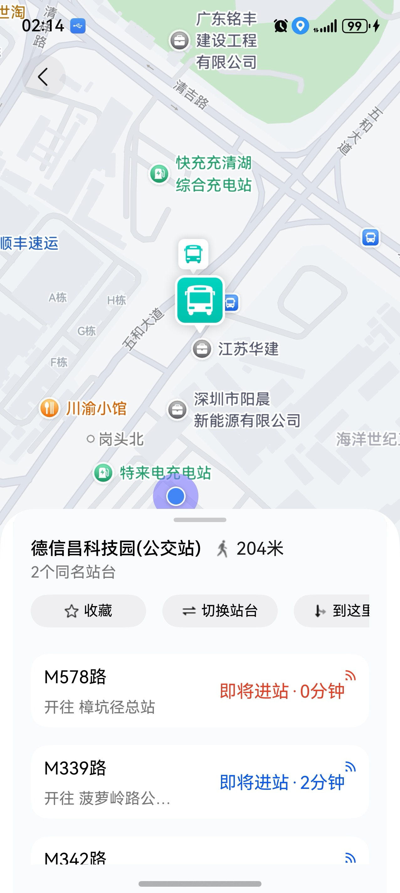
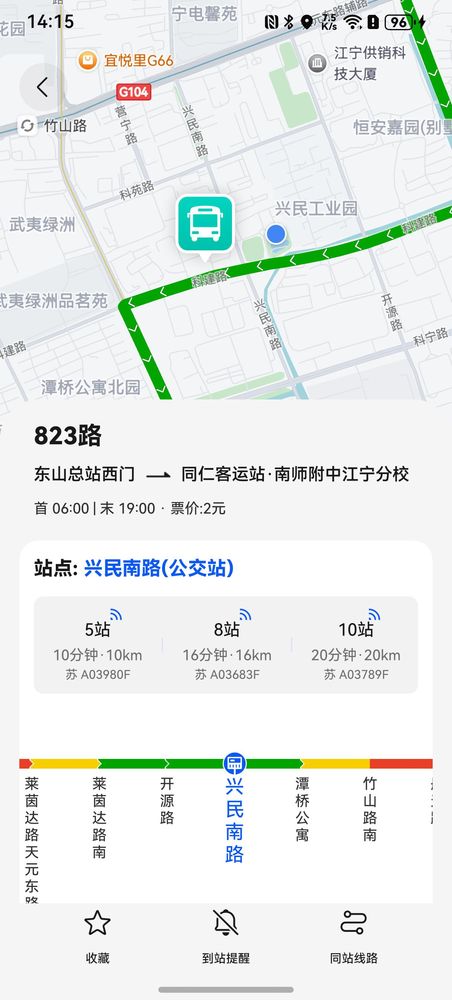
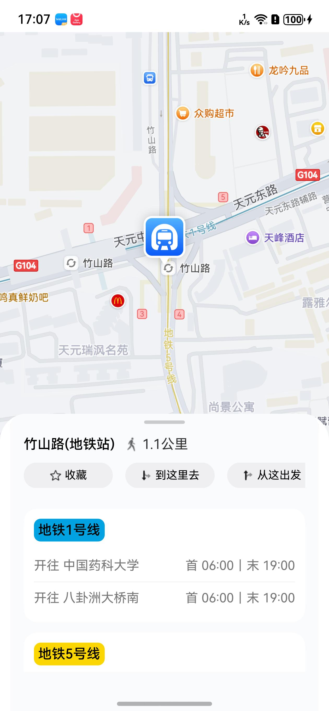
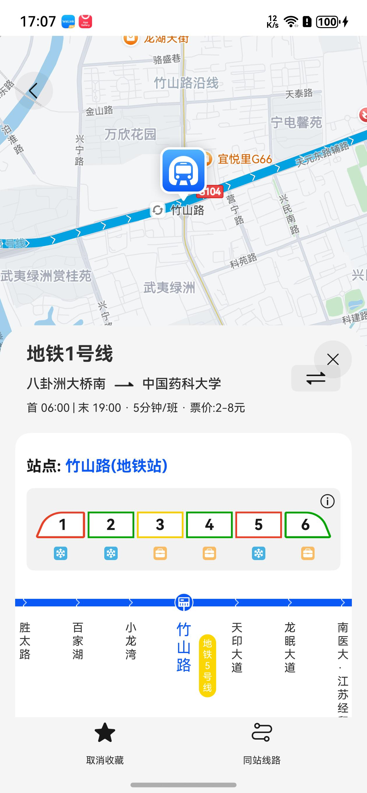

# 站点线路组件快速入门

## 目录

- [简介](#简介)
- [约束与限制](#约束与限制)
- [使用](#使用)
- [API参考](#API参考)
- [示例代码](#示例代码)
- [开源许可协议](#开源许可协议)

## 简介

本组件提供公交地铁站点和线路的综合信息展示功能，支持导航、收藏、到站提醒及地图轨迹展示，还可查看同站线路。

| 公交站点 | 公交线路详情 | 地铁站点 | 地铁线路详情 |
| -------- | -------- | -------- | -------- |
|          |          |          |          |

# 约束与限制

### 环境

* DevEco Studio版本：DevEco Studio 5.0.5 Release及以上
* HarmonyOS SDK版本：HarmonyOS 5.0.5 Release SDK及以上
* 设备类型：华为手机(双折叠和阔折叠)
* 系统版本：HarmonyOS 5.0.5(17)及以上

### 权限

- 网络权限：ohos.permission.INTERNET

- 模糊位置权限: ohos.permission.APPROXIMATELY_LOCATION

- 位置权限: ohos.permission.LOCATION

### 调试

只支持真机运行。

## 使用

1. 安装组件。

   如果是在DevEco Studio使用插件集成组件，则无需安装组件，请忽略此步骤。

   如果是从生态市场下载组件，请参考以下步骤安装组件。

   a. 解压下载的组件包，将包中所有文件夹拷贝至您工程根目录的XXX目录下。

   b. 在项目根目录build-profile.json5添加module_station_line_detail模块。

    ```
    // 项目根目录下build-profile.json5填写module_station_line_detail路径。其中XXX为组件存放的目录名
   "modules": [
      {
        "name": "module_station_line_detail",
        "srcPath": "./XXX/module_station_line_detail",
      }
   ]
    ```

   c. 在项目根目录oh-package.json5中添加依赖。
    ```
    // XXX为组件存放的目录名
    "dependencies": {
        "module_station_line_detail": "file:./XXX/module_station_line_detail"
    }
    ```

2. 引入组件。
    ```
   import {
     BusSubwaySetting,
     CollectionServiceApi,
     CurrentLineDetailModel,
     CurrentStopDetailModel,
     LineCollectionInnerModel,
     LineCollectionModel,
     LineDetailModel,
     LineDetailView,
     MapStopDetailView,
     SameStopDetailModel,
     StationCollectionInnerModel,
     StationCollectionModel,
     StopDetailModel,
     StopLinesBundle,
     StopNavigation
   } from 'module_station_line_detail';

   ```

3. 使用站点详情详细参数配置说明参见[API参考](#API参考)。
    ```
   MapStopDetailView()
   LineDetailView()
    ```

## API参考

### 接口

MapStopDetailView(options?: MapStopDetailOptions)

站点详情组件。

**参数：**

| 参数名     | 类型                                                | 是否必填 | 说明           |
|---------|---------------------------------------------------|------|--------------|
| options | [MapStopDetailOptions](#MapStopDetailOptions对象说明) | 是    | 配置站点详情组件的参数。 |

### MapStopDetailOptions对象说明

| 名称                      | 类型                                                                                                                              | 是否必填 | 说明             |
|-------------------------|---------------------------------------------------------------------------------------------------------------------------------|------|----------------|
| initialSiteId           | string                                                                                                                          | 是    | 外部传入的信息        |
| sameStopDetailModel     | [SameStopDetailModel](#SameStopDetailModel对象说明)                                                                                 | 是    | 站点模型           |
| sameNameLinesMap        | Map<string, [StopLinesBundle](#StopLinesBundle对象说明)>                                                                            | 否    | 站点线路信息         |
| stopDetailModel         | [StopDetailModel](#StopDetailModel对象说明)                                                                                         | 否    | 当前站点信息         |
| collectionStationTags   | string[]                                                                                                                        | 否    | 收藏相关参数         |
| arrivalReminderStations | number                                                                                                                          | 否    | 还有多少站台需要提醒     |
| setting                 | [BusSubwaySetting](#BusSubwaySetting对象说明)                                                                                       | 否    | 公交地铁全局设置       |
| collectStation          | (tag: string) => void                                                                                                           | 否    | 收藏站点信息         |
| routeLineDetailPage     | (lineDetailModel: [LineDetailModel](#LineDetailModel对象说明)) => void                                                              | 否    | 经过的公交线路列表      |
| onNavigate              | (stopNavigation: StopNavigation) => void                                                                                        | 否    | 跳转回调方法         |
| routerMap               | [NavPathStack](https://developer.huawei.com/consumer/cn/doc/harmonyos-references/ts-basic-components-navigation#navpathstack10) | 否    | 管理nv所有的子页面     |
| onFavoriteClick         | () => void                                                                                                                      | 否    | 收藏按钮点击事件用于登录校验 |
| onInterceptLogin        | (cb: (isLogin: boolean) => void) => void                                                                                        | 否    | 登录拦截事件         |
| addCollectionStopTag    | (tagName: string) => void                                                                                                       | 否    | 添加收藏栏目拦截事件     |

### StopNavigation对象说明

| 名称         | 类型                                      | 是否必填 | 说明     |
|------------|-----------------------------------------|------|--------|
| chooseType | string                                  | 否    | 选择类型   |
| stopDetail | [StopDetailModel](#StopDetailModel对象说明) | 否    | 站点详情信息 |

### BusSubwaySetting对象说明

| 名称                | 类型      | 是否必填 | 说明                       |
|-------------------|---------|------|--------------------------|
| warnType          | number  | 否    | 提醒类型：0-提前分钟数，1-提前站点      |
| warnValue         | number  | 否    | 提醒数值：1-5                 |
| accessType        | number  | 否    | 交通方式选择：0-地铁，1-公交         |
| speedType         | number  | 否    | 刷新频率选择：0-10秒，1-30秒，2-1分钟 |
| isArrivalReminder | boolean | 否    | 是否开启到站提醒                 |

### StopDetailModel对象说明

| 名称            | 类型                                        | 是否必填 | 说明        |
|---------------|-------------------------------------------|------|-----------|
| siteId        | string                                    | 否    | 站点ID      |
| name          | string                                    | 否    | 站点名称      |
| address       | string                                    | 否    | 站点地址      |
| distance      | number                                    | 否    | 距离（米）     |
| sameNameCount | number                                    | 否    | 同名站台数量    |
| isFavorited   | boolean                                   | 否    | 是否已收藏     |
| latitude      | number                                    | 否    | 纬度        |
| longitude     | number                                    | 否    | 经度        |
| busLines      | [LineDetailModel](#LineDetailModel对象说明)[] | 否    | 经过的公交线路列表 |
| subwayLines   | [SubwayLineInfo](#SubwayLineInfo对象说明)[]   | 否    | 经过的地铁线路列表 |
| stopType      | string                                    | 否    | 站点类型      |

### StopLinesBundle对象说明

| 名称          | 类型                                      | 是否必填 | 说明     |
|-------------|-----------------------------------------|------|--------|
| busLines    | [BusLineInfo](#BusLineInfo对象说明)[]       | 否    | 公交线路列表 |
| subwayLines | [SubwayLineInfo](#SubwayLineInfo对象说明)[] | 否    | 地铁线路列表 |

### SubwayLineInfo对象说明

| 名称         | 类型                                        | 是否必填 | 说明     |
|------------|-------------------------------------------|------|--------|
| lineName   | string                                    | 否    | 线路名称   |
| lineNumber | string                                    | 否    | 线路编号   |
| lineColor  | string                                    | 否    | 线路颜色   |
| directions | [LineDetailModel](#LineDetailModel对象说明)[] | 否    | 双向信息列表 |

### BusLineInfo对象说明

| 名称            | 类型     | 是否必填 | 说明       |
|---------------|--------|------|----------|
| id            | string | 否    | 线路ID     |
| lineName      | string | 否    | 线路名称     |
| lineNumber    | string | 否    | 线路编号     |
| destination   | string | 否    | 开往方向     |
| stationCount  | number | 否    | 距离站数     |
| estimatedTime | number | 否    | 预计时间（分钟） |
| arrivalTime   | string | 否    | 预计到站时间   |
| lineColor     | string | 否    | 线路颜色     |

### SameStopDetailModel对象说明

| 名称              | 类型                                      | 是否必填 | 说明                 |
|-----------------|-----------------------------------------|------|--------------------|
| siteId          | string                                  | 否    | 站点ID               |
| name            | string                                  | 否    | 站点名称               |
| address         | string                                  | 否    | 站点地址               |
| distance        | number                                  | 否    | 距离（米）              |
| isFavorited     | boolean                                 | 否    | 是否已收藏              |
| latitude        | number                                  | 否    | 纬度                 |
| longitude       | number                                  | 否    | 经度                 |
| mainStopId      | string                                  | 否    | 主站台ID, 放在外部便于主站点切换 |
| sameStopDetails | [SameStopDetail](#SameStopDetail对象说明)[] | 否    | 同站点详情列表            |

### SameStopDetail对象说明

| 名称               | 类型                                        | 是否必填 | 说明       |
|------------------|-------------------------------------------|------|----------|
| id               | string                                    | 否    | 站点ID     |
| latitude         | number                                    | 否    | 纬度       |
| longitude        | number                                    | 否    | 经度       |
| lineDetailModels | [LineDetailModel](#LineDetailModel对象说明)[] | 否    | 线路详情模型列表 |

### LineDetailModel对象说明

| 名称            | 类型                                            | 是否必填 | 说明                        |
|---------------|-----------------------------------------------|------|---------------------------|
| busSubwayType | string                                        | 否    | 公交地铁类型（公交类型：'0',地铁类型：'1'） |
| id            | string                                        | 否    | 线路ID                      |
| name          | string                                        | 否    | 线路名称                      |
| polyline      | string                                        | 否    | 线路经纬度                     |
| startStop     | string                                        | 否    | 首发站                       |
| endStop       | string                                        | 否    | 末站                        |
| startTime     | string                                        | 否    | 首班车时间                     |
| endTime       | string                                        | 否    | 末班车时间                     |
| direc         | string                                        | 否    | 反向线路 id                   |
| basicPrice    | string                                        | 否    | 起步价                       |
| totalPrice    | string                                        | 否    | 全程票价                      |
| interval      | string                                        | 否    | 发车间隔                      |
| uicolor       | string                                        | 否    | 颜色                        |
| busstops      | [LineDetailBusstop](#LineDetailBusstop对象说明)[] | 否    | 途径站列表                     |
| currentStop   | [CurrentBusstop](#CurrentBusstop对象说明)         | 否    | 最近站点                      |
| switchDirec   | () => void                                    | 否    | 切换路线回调函数                  |

### CurrentBusstop对象说明

| 名称                  | 类型                                      | 是否必填 | 说明         |
|---------------------|-----------------------------------------|------|------------|
| id                  | string                                  | 否    | 站点ID       |
| name                | string                                  | 否    | 公交站名       |
| stopOffsetIndex     | number                                  | 否    | 离起始站的索引    |
| location            | string                                  | 否    | 公交站经纬度     |
| comingBusList       | [ComingBus](#ComingBus对象说明)[]           | 否    | 快到站公交列表    |
| comingSubwayCarList | [SubwayCarState](#SubwayCarState对象说明)[] | 否    | 最近地铁车厢状态列表 |

### SubwayCarState对象说明

| 名称              | 类型     | 是否必填 | 说明                                  |
|-----------------|--------|------|-------------------------------------|
| crowdState      | string | 否    | 公交车拥挤状态（轻松舒适：'0'，轻微拥堵：'1'，严重拥堵：'2'） |
| tempretureState | string | 否    | 车厢状态（弱冷车厢：'0'，强冷车厢：'1'，商务车厢：'2'）    |

### ComingBus对象说明

| 名称          | 类型     | 是否必填 | 说明                                  |
|-------------|--------|------|-------------------------------------|
| stations    | number | 否    | 站数                                  |
| time        | number | 否    | 时间                                  |
| distance    | number | 否    | 距离                                  |
| numberplate | string | 否    | 车牌                                  |
| crowdState  | string | 否    | 公交车拥挤状态（轻松舒适：'0'，轻微拥堵：'1'，严重拥堵：'2'） |
| offsetX     | number | 否    | 距离起始站点像素值                           |

### LineDetailBusstop对象说明

| 名称            | 类型                                              | 是否必填 | 说明                                 |
|---------------|-------------------------------------------------|------|------------------------------------|
| id            | string                                          | 否    | 站点ID                               |
| name          | string                                          | 否    | 公交站名                               |
| location      | string                                          | 否    | 公交站经纬度                             |
| transferLines | [TransferDetailLine](#TransferDetailLine对象说明)[] | 否    | 换乘线路名称列表                           |
| congestion    | string                                          | 否    | 路线拥堵状况（轻松舒适：'0'，轻微拥堵：'1'，严重拥堵：'2'） |

### TransferDetailLine对象说明

| 名称    | 类型     | 是否必填 | 说明 |
|-------|--------|------|----|
| name  | string | 否    | 名称 |
| color | string | 否    | 颜色 |

LineDetailView(options?: LineDetailViewOptions)

线路详情组件。

**参数：**

| 参数名     | 类型                                                  | 是否必填 | 说明         |
|---------|-----------------------------------------------------|------|------------|
| options | [LineDetailViewOptions](#LineDetailViewOptions对象说明) | 是    | 配置线路组件的参数。 |

### LineDetailViewOptions对象说明

| 名称                    | 类型                                        | 是否必填 | 说明                |
|-----------------------|-------------------------------------------|------|-------------------|
| lineDetailModel       | [LineDetailModel](#LineDetailModel对象说明)   | 是    | 线路详情数据模型          |
| collectionLineTags    | string[]                                  | 是    | 收藏线路标签列表          |
| setting               | [BusSubwaySetting](#BusSubwaySetting对象说明) | 是    | 线路设置（到站提醒等）       |
| isLineDetailSheetShow | boolean                                   | 否    | 线路详情半模态显示状态（默认显示） |

**事件：**

| 名称                   | 类型                                       | 说明                    |
|----------------------|------------------------------------------|-----------------------|
| onBack               | () => void                               | 返回事件回调                |
| onInterceptLogin     | (cb: (isLogin: boolean) => void) => void | 登录拦截回调，用于收藏等功能需要登录时触发 |
| addCollectionLineTag | (tagName: string) => void                | 添加收藏标签回调              |
| collectLine          | (tag: string) => void                    | 收藏线路回调                |
| opeArrivalReminder   | (isArrivalReminder: boolean) => void     | 开启/关闭到站提醒回调           |
| routeSameStop        | (id: string) => void                     | 跳转到同站详情回调             |
| switchDirec          | () => void                               | 切换线路方向回调              |
| routeSettingPage     | () => void                               | 跳转到设置页面回调             |

### LineDetailModel对象说明

| 名称            | 类型                                            | 是否必填 | 说明                       |
|---------------|-----------------------------------------------|------|--------------------------|
| busSubwayType | string                                        | 否    | 公交地铁类型（公交类型：'0',地铁类型：'1'） |
| id            | string                                        | 否    | 线路ID                     |
| name          | string                                        | 否    | 线路名称                     |
| polyline      | string                                        | 否    | 线路经纬度                    |
| startStop     | string                                        | 否    | 首发站                      |
| endStop       | string                                        | 否    | 末站                       |
| startTime     | string                                        | 否    | 首班车时间                    |
| endTime       | string                                        | 否    | 末班车时间                    |
| direc         | string                                        | 否    | 反向线路 id                  |
| basicPrice    | string                                        | 否    | 起步价                      |
| totalPrice    | string                                        | 否    | 全程票价                     |
| interval      | string                                        | 否    | 发车间隔                     |
| uicolor       | string                                        | 否    | 颜色                       |
| busstops      | [LineDetailBusstop](#LineDetailBusstop对象说明)[] | 否    | 途径站列表                    |
| currentStop   | [CurrentBusstop](#CurrentBusstop对象说明)         | 否    | 最近站点                     |
| switchDirec   | () => void                                    | 否    | 切换路线的方法                  |

### BusSubwaySetting对象说明

| 名称                | 类型      | 是否必填 | 说明                       |
|-------------------|---------|------|--------------------------|
| warnType          | number  | 是    | 提醒类型：0-提前分钟数，1-提前站点      |
| warnValue         | number  | 是    | 提醒数值：1-5                 |
| accessType        | number  | 是    | 交通方式选择：0-地铁，1-公交         |
| speedType         | number  | 是    | 刷新频率选择：0-10秒，1-30秒，2-1分钟 |
| isArrivalReminder | boolean | 是    | 是否开启到站提醒                 |

### CurrentBusstop对象说明

| 名称                  | 类型                                      | 是否必填 | 说明         |
|---------------------|-----------------------------------------|------|------------|
| id                  | string                                  | 否    | 站点ID       |
| name                | string                                  | 否    | 公交站名       |
| stopOffsetIndex     | number                                  | 否    | 离起始站的索引    |
| location            | string                                  | 否    | 公交站经纬度     |
| comingBusList       | [ComingBus](#ComingBus对象说明)[]           | 否    | 快到站公交列表    |
| comingSubwayCarList | [SubwayCarState](#SubwayCarState对象说明)[] | 否    | 最近地铁车厢状态列表 |

### ComingBus对象说明

| 名称          | 类型     | 是否必填 | 说明                                  |
|-------------|--------|------|-------------------------------------|
| stations    | number | 否    | 站数                                  |
| time        | number | 否    | 时间                                  |
| distance    | number | 否    | 距离                                  |
| numberplate | string | 否    | 车牌                                  |
| crowdState  | string | 否    | 公交车拥挤状态（轻松舒适：'0'，轻微拥堵：'1'，严重拥堵：'2'） |
| offsetX     | number | 否    | 距离起始站点像素值                           |

### SubwayCarState对象说明

| 名称              | 类型     | 是否必填 | 说明     |
|-----------------|--------|------|--------|
| crowdState      | string | 否    | 车厢拥挤状态（轻松舒适：'0'，轻微拥堵：'1'，严重拥堵：'2'） |
| tempretureState | string | 否    | 温度状态   |

### LineDetailBusstop对象说明

| 名称            | 类型                                              | 是否必填 | 说明       |
|---------------|-------------------------------------------------|------|----------|
| id            | string                                          | 否    | 站点ID     |
| name          | string                                          | 否    | 公交站名     |
| location      | string                                          | 否    | 公交站经纬度   |
| transferLines | [TransferDetailLine](#TransferDetailLine对象说明)[] | 否    | 换乘线路名称列表 |
| congestion    | string                                          | 否    | 路线拥堵状况（轻松舒适：'0'，轻微拥堵：'1'，严重拥堵：'2'）|

### TransferDetailLine对象说明

| 名称    | 类型     | 是否必填 | 说明 |
|-------|--------|------|----|
| name  | string | 否    | 名称 |
| color | string | 否    | 颜色 |

## 示例代码

本示例通过MapStopDetailView实现站点详情的展示

```
import {
  BusSubwaySetting,
  CollectionServiceApi,
  CurrentLineDetailModel,
  CurrentStopDetailModel,
  LineCollectionInnerModel,
  LineCollectionModel,
  LineDetailModel,
  LineDetailView,
  MapStopDetailView,
  SameStopDetailModel,
  StationCollectionInnerModel,
  StationCollectionModel,
  StopDetailModel,
  StopDetailViewModel,
  StopLinesBundle,
  StopNavigation
} from 'module_station_line_detail';
import { AppStorageV2, PromptAction } from '@kit.ArkUI';

@Entry
@ComponentV2
struct StopDetailPage {
  // 当前站点信息
  @Local stopDetailModel?: StopDetailModel
  // 同名站台信息
  @Local sameStopDetailModel: SameStopDetailModel = new SameStopDetailModel();
  @Local sameNameLinesMap: Map<string, StopLinesBundle> = new Map<string, StopLinesBundle>()
  // 还有多少站台需要提醒
  @Local arrivalReminderStations: number = 0
  @Local tagNames: string[] = ['家', '公司']
  @Local setting: BusSubwaySetting = new BusSubwaySetting();
  @Local lineDetailModel: LineDetailModel = new LineDetailModel()
  @Provider() isStopDetailPanelVisible: boolean = true
  @Provider() isFavoriteSheetVisible: boolean = false // 控制收藏弹窗显示
  @Provider() isLineDetailSheetShow: boolean = true
  private currentStopDetailModel: CurrentStopDetailModel =
    AppStorageV2.connect(CurrentStopDetailModel, () => new CurrentStopDetailModel())!;
  promptAction: PromptAction = this.getUIContext().getPromptAction();
  private pathStack: NavPathStack = new NavPathStack();
  // 站点收藏相关
  private stationCollectionModel: StationCollectionModel =
    AppStorageV2.connect(StationCollectionModel,
      (): StationCollectionModel => new StationCollectionModel())!;
  private lineCollectionModel: LineCollectionModel =
    AppStorageV2.connect(LineCollectionModel, () => CollectionServiceApi.getLineCollectionList())!;
  private currentLineDetailModel: CurrentLineDetailModel =
    AppStorageV2.connect(CurrentLineDetailModel, () => new CurrentLineDetailModel())!;
  @Local showStation: boolean = true
  private stopDetailViewModel: StopDetailViewModel =
    AppStorageV2.connect(StopDetailViewModel, () => new StopDetailViewModel())!;

  build() {
    NavDestination() {
      // 使用 MapStopDetailView，它内部包含了地图和站点详情
      if (this.showStation) {
        MapStopDetailView({
          initialSiteId: this.stopDetailModel?.siteId,
          sameStopDetailModel: this.sameStopDetailModel,
          sameNameLinesMap: this.sameNameLinesMap,
          stopDetailModel: this.stopDetailModel,
          collectionStationTags: this.tagNames,
          arrivalReminderStations: this.arrivalReminderStations,
          setting: this.setting,
          collectStation: (tag: string) => {
            this.collectStation(tag)
          },
          routeLineDetailPage: (lineDetailModel: LineDetailModel) => {
            this.showStation = false;
            this.isLineDetailSheetShow = true
          },
          onNavigate: (stopNavigation: StopNavigation) => {
            let routerParam: Record<string, Object> = {}
            routerParam.stopNavigation = stopNavigation
            this.getUIContext().getPromptAction().showDialog({
              title: '跳转路线规划页面',
            })
          },
          routerMap: this.pathStack,
          onFavoriteClick: () => {
            this.onFavoriteButtonClick()
          },
          onInterceptLogin: (loginInterceptCb: (isLogin: boolean) => void) => {
            // 已登录，传递登录状态
            loginInterceptCb(true)
          },
          addCollectionStopTag: (tag: string) => {
            this.tagNames.push(tag)
          },
        })
      } else {
        LineDetailView({
          lineDetailModel: this.lineDetailModel,
          setting: this.setting,
          collectionLineTags: this.tagNames,
          onBack: () => {
            this.showStation = true
          },
          onInterceptLogin: (loginInterceptCb: (isLogin: boolean) => void) => {
            loginInterceptCb(true)
          },
          addCollectionLineTag: (tagName: string) => {
            this.tagNames.push(tagName)
          },
          collectLine: (tag: string) => {
            let lineCollectionInnerModel: LineCollectionInnerModel | undefined
            this.lineCollectionModel.lineCollectionInnerModels.forEach(innerModel => {
              if (innerModel.tag === tag) {
                lineCollectionInnerModel = innerModel
                return
              }
            })
            if (lineCollectionInnerModel) {
              lineCollectionInnerModel.lineDetailList.push(this.lineDetailModel)
            } else {
              lineCollectionInnerModel = new LineCollectionInnerModel()
              lineCollectionInnerModel.tag = tag
              lineCollectionInnerModel.lineDetailList.push(this.lineDetailModel)
              this.lineCollectionModel.lineCollectionInnerModels.push(lineCollectionInnerModel)
            }
          },
          opeArrivalReminder: (isArrivalReminder: boolean) => {
            this.setting.isArrivalReminder = isArrivalReminder
          },
          routeSameStop: async (id: string) => {
            this.showStation = true
            this.isStopDetailPanelVisible = true
          },
          routeSettingPage: () => {
            this.getUIContext().getPromptAction().showDialog({
              title: '跳转设置页面',
            })
          },
          switchDirec: async () => {
          },
        })
      }
    }
    .onReady(async (context) => {
      this.pathStack = context.pathStack
      this.stopDetailModel = {
        "siteId": "BV10054309",
        "name": "竹山路(地铁站)",
        "longitude": 118.845709,
        "latitude": 31.931865,
        "stopType": "subway_station",
        "busLines": [],
        "subwayLines": [
          {
            "directions": [
              {
                "busSubwayType": "1",
                "id": "320100022331",
                "name": "地铁1号线",
                "polyline": "118.842255,32.145568;118.84141,32.144782;118.841182,32.144604;118.840983,32.144485;118.840802,32.14437;118.840609,32.144266;118.840412,32.144167;118.840209,32.144075;118.84003,32.144009;118.839771,32.143928;118.839502,32.143877;118.839249,32.14385;118.838855,32.143831;118.838412,32.143833;118.837965,32.143849;118.837555,32.143895;118.837179,32.143943;118.83657,32.144056;118.835924,32.144181;118.835408,32.144265;118.835078,32.144302;118.834747,32.14433;118.834449,32.144335;118.833921,32.144329;118.833459,32.144313;118.833041,32.144279;118.832666,32.14423;118.832207,32.144139;118.831521,32.143963;118.829597,32.143424;118.828264,32.143045;118.826194,32.142509;118.822837,32.141568;118.822661,32.141467;118.822485,32.141366;118.822231,32.141188;118.822058,32.140965;118.821572,32.140293;118.821247,32.139621;118.821036,32.138964;118.820962,32.138356;118.820999,32.137977;118.821015,32.137779;118.821072,32.137586;118.821283,32.137178;118.821861,32.136208;118.821914,32.136112;118.822502,32.135119;118.822695,32.134818;118.822791,32.134642;118.822879,32.13445;118.822937,32.13424;118.822978,32.13402;118.823004,32.133817;118.823009,32.133612;118.822994,32.133387;118.822959,32.133033;118.82292,32.132688;118.822854,32.132221;118.822776,32.131777;118.822683,32.131315;118.822563,32.130757;118.822451,32.130277;118.822314,32.129802;118.821749,32.127785;118.821339,32.126634;118.82103,32.125731;118.820603,32.124608;118.818925,32.118997;118.818517,32.117229;118.818479,32.11709;118.817504,32.115641;118.817244,32.115357;118.814613,32.112413;118.812964,32.110398;118.81265,32.110012;118.812434,32.109711;118.812268,32.109441;118.812125,32.109155;118.811992,32.108853;118.811134,32.106509;118.810034,32.10365;118.809677,32.102712;118.809315,32.10175;118.809032,32.101138;118.808561,32.100283;118.808147,32.099534;118.807878,32.099169;118.807568,32.098866;118.807239,32.09858;118.806736,32.098277;118.806287,32.098072;118.805851,32.097921;118.804317,32.097549;118.803848,32.097402;118.803418,32.09718;118.803037,32.096909;118.802428,32.09625;118.802053,32.095774;118.801594,32.095197;118.801082,32.094422;118.800271,32.093231;118.79932,32.09154;118.798214,32.089119;118.79777,32.088244;118.79742,32.087742;118.796703,32.086701;118.796009,32.085691;118.795373,32.084778;118.795153,32.084614;118.79492,32.084533;118.794542,32.084446;118.794109,32.08439;118.79312,32.084368;118.791257,32.084295;118.789925,32.084163;118.788482,32.083975;118.787472,32.08385;118.78649,32.083669;118.785618,32.083384;118.784756,32.083059;118.784465,32.082877;118.784181,32.082614;118.784054,32.082407;118.783982,32.082217;118.783835,32.081417;118.783759,32.08097;118.783721,32.080636;118.783716,32.080565;118.783716,32.080396;118.783714,32.079871;118.783717,32.079342;118.783731,32.0786;118.783783,32.077826;118.783917,32.07614;118.784024,32.074755;118.784094,32.074076;118.784163,32.07345;118.784177,32.073211;118.784184,32.072989;118.784218,32.071025;118.784221,32.070381;118.78422,32.069766;118.784209,32.06941;118.784192,32.068952;118.784172,32.068383;118.784149,32.0678;118.784126,32.067173;118.784091,32.066515;118.78377,32.061362;118.783746,32.060674;118.783718,32.060009;118.783708,32.059559;118.783701,32.058667;118.783702,32.057732;118.783706,32.057345;118.783725,32.056796;118.783752,32.056283;118.783812,32.055762;118.783889,32.055203;118.784004,32.054301;118.78406,32.053799;118.784103,32.053351;118.784136,32.052983;118.784166,32.05249;118.7842,32.052001;118.784207,32.051633;118.784208,32.050974;118.784216,32.049831;118.784159,32.049259;118.784113,32.043365;118.784133,32.042421;118.784136,32.041806;118.78413,32.038412;118.784002,32.032731;118.783895,32.031698;118.783837,32.030966;118.783775,32.030235;118.783782,32.029271;118.783793,32.029062;118.783771,32.028807;118.783712,32.028534;118.783594,32.028121;118.783285,32.027157;118.782936,32.026128;118.782307,32.024651;118.781913,32.023736;118.781583,32.023021;118.781093,32.021968;118.780912,32.021283;118.780749,32.020512;118.780625,32.019959;118.780474,32.019388;118.780116,32.017912;118.780029,32.017544;118.779998,32.017425;118.779962,32.017329;118.779897,32.017183;118.779809,32.017012;118.779737,32.016899;118.779554,32.016641;118.779252,32.01623;118.778978,32.015837;118.778307,32.014837;118.778121,32.014521;118.777986,32.014242;118.777657,32.013399;118.777278,32.012377;118.776852,32.011141;118.776501,32.010106;118.776184,32.009377;118.776037,32.009069;118.775644,32.008373;118.775474,32.0081;118.775284,32.007803;118.774898,32.007314;118.774447,32.006748;118.773882,32.006032;118.77258,32.004712;118.772186,32.004298;118.771712,32.003861;118.771376,32.003517;118.770915,32.002986;118.76961,32.00133;118.768321,31.999541;118.767511,31.998442;118.767427,31.998349;118.767139,31.997978;118.76668,31.997334;118.766278,31.996772;118.766201,31.996683;118.766051,31.996504;118.765875,31.99633;118.765729,31.996186;118.765448,31.995949;118.765067,31.995689;118.763668,31.994689;118.763506,31.994566;118.763259,31.994357;118.762866,31.99395;118.762293,31.993079;118.762124,31.992779;118.761922,31.992357;118.761876,31.992246;118.761645,31.991702;118.761418,31.991167;118.761315,31.990926;118.761217,31.990691;118.761118,31.990427;118.761042,31.990205;118.760991,31.990013;118.760941,31.98982;118.760904,31.989609;118.760876,31.989403;118.760878,31.98918;118.760907,31.988934;118.762557,31.981947;118.762983,31.979993;118.763131,31.979272;118.763271,31.978568;118.763393,31.978262;118.763484,31.978087;118.763581,31.977922;118.763788,31.97762;118.764018,31.977307;118.764311,31.976966;118.76456,31.976683;118.764795,31.976515;118.765084,31.97637;118.765681,31.976219;118.766387,31.97609;118.768049,31.976234;118.774029,31.976749;118.774598,31.976801;118.775189,31.976858;118.783803,31.977553;118.784101,31.977579;118.784361,31.977606;118.784617,31.977635;118.784873,31.977669;118.785648,31.977795;118.786411,31.977915;118.788507,31.97829;118.789015,31.978329;118.789592,31.978305;118.7904,31.978193;118.790809,31.978118;118.79121,31.97803;118.791548,31.977891;118.791878,31.977724;118.792449,31.977431;118.793022,31.976888;118.793308,31.976597;118.793579,31.976306;118.796537,31.971075;118.797957,31.968749;118.799012,31.967021;118.799198,31.966732;118.799378,31.966485;118.799578,31.966263;118.799888,31.966009;118.8003,31.965812;118.800826,31.965658;118.801324,31.9655;118.801789,31.965371;118.802407,31.965244;118.802825,31.965187;118.803216,31.965174;118.803542,31.965195;118.804232,31.96546;118.81068,31.968442;118.811313,31.968545;118.811946,31.968589;118.812496,31.96857;118.813005,31.968538;118.813792,31.968378;118.814191,31.96823;118.814527,31.967965;118.814741,31.967764;118.816636,31.96492;118.817196,31.963833;118.817622,31.963017;118.81836,31.961594;118.81864,31.960993;118.818783,31.960353;118.820006,31.952759;118.820141,31.952092;118.820284,31.951363;118.821063,31.947124;118.821254,31.945968;118.821386,31.944723;118.821393,31.943549;118.821398,31.942253;118.821366,31.941095;118.821307,31.940035;118.821232,31.939079;118.821017,31.936643;118.820932,31.935168;118.820867,31.933798;118.820846,31.932651;118.820843,31.931941;118.820848,31.931256;118.820859,31.930933;118.820886,31.930628;118.82095,31.930319;118.821063,31.93;118.821272,31.929708;118.82154,31.929417;118.821685,31.929288;118.82186,31.929167;118.822084,31.929049;118.822315,31.92894;118.822689,31.928796;118.823018,31.928691;118.823393,31.928591;118.823848,31.928492;118.824254,31.928409;118.824785,31.928324;118.82525,31.928256;118.825723,31.928202;118.826203,31.928161;118.826627,31.928141;118.827054,31.928151;118.82739,31.928198;118.827893,31.928318;118.828908,31.928565;118.829344,31.92867;118.829603,31.928737;118.829838,31.928803;118.830059,31.92887;118.830239,31.928933;118.83044,31.929011;118.830781,31.929157;118.831082,31.929278;118.831277,31.929352;118.831469,31.929421;118.83166,31.929478;118.831852,31.92953;118.832734,31.929735;118.833682,31.929954;118.835167,31.930308;118.835668,31.93043;118.836069,31.930527;118.836406,31.930599;118.836696,31.930651;118.836984,31.930691;118.837177,31.930708;118.8373,31.930714;118.837423,31.930714;118.837609,31.93071;118.837818,31.930709;118.838037,31.93071;118.838251,31.930715;118.838435,31.93072;118.838639,31.930729;118.838833,31.930737;118.839032,31.930748;118.839214,31.930765;118.839387,31.930788;118.83954,31.930813;118.839696,31.930842;118.83987,31.930879;118.840431,31.93102;118.841007,31.931157;118.841769,31.931335;118.842162,31.931432;118.842571,31.931526;118.84291,31.931606;118.843239,31.93168;118.84365,31.931765;118.844454,31.931965;118.845241,31.932156;118.85965,31.936652;118.861548,31.937208;118.862526,31.937448;118.862756,31.937493;118.863561,31.937638;118.86444,31.9378;118.876389,31.939781;118.877156,31.939902;118.877955,31.940026;118.879687,31.940322;118.880345,31.940395;118.880937,31.940368;118.881406,31.940298;118.881891,31.9402;118.882602,31.939926;118.883361,31.939426;118.883994,31.93892;118.884583,31.938389;118.889705,31.933947;118.890239,31.933475;118.890872,31.932905;118.895101,31.929211;118.896076,31.928279;118.896416,31.92786;118.896927,31.927042;118.897269,31.926305;118.897566,31.925407;118.899078,31.920421;118.899431,31.919465;118.8999,31.918566;118.900473,31.917744;118.901178,31.916925;118.904286,31.913419;118.904804,31.91286;118.905315,31.912313;118.906098,31.911462;118.906623,31.910733;118.907035,31.909995;118.907508,31.908848;118.90793,31.907822;118.908504,31.906341;118.908744,31.905155;118.908935,31.903935;118.909081,31.903108;118.909315,31.902303;118.909832,31.901263;118.910223,31.900649;118.910707,31.90006;118.911505,31.899302;118.912373,31.898677;118.913418,31.898095;118.914127,31.897684",
                "startStop": "八卦洲大桥南",
                "endStop": "中国药科大学",
                "startTime": "06:00",
                "endTime": "19:00",
                "direc": "320100022330",
                "basicPrice": "2",
                "totalPrice": "8",
                "interval": "5",
                "uicolor": "#01A2E2",
                "busstops": [
                  {
                    "id": "BV10854643",
                    "name": "八卦洲大桥南",
                    "location": "118.842255,32.145568",
                    "transferLines": []
                  },
                  {
                    "id": "BV10854645",
                    "name": "笆斗山",
                    "location": "118.829597,32.143424",
                    "transferLines": []
                  },
                  {
                    "id": "BV10854642",
                    "name": "燕子矶",
                    "location": "118.821914,32.136112",
                    "transferLines": []
                  },
                  {
                    "id": "BV10854644",
                    "name": "吉祥庵",
                    "location": "118.821339,32.126634",
                    "transferLines": []
                  },
                  {
                    "id": "BV10053901",
                    "name": "晓庄",
                    "location": "118.818517,32.117229",
                    "transferLines": [
                      {
                        "name": "地铁7号线",
                        "color": "#818530"
                      }
                    ]
                  },
                  {
                    "id": "BV10053853",
                    "name": "迈皋桥",
                    "location": "118.809677,32.102712",
                    "transferLines": []
                  },
                  {
                    "id": "BV10055589",
                    "name": "红山动物园",
                    "location": "118.802053,32.095774",
                    "transferLines": []
                  },
                  {
                    "id": "BV10057660",
                    "name": "南京站",
                    "location": "118.796703,32.086701",
                    "transferLines": [
                      {
                        "name": "地铁3号线",
                        "color": "#018237"
                      }
                    ]
                  },
                  {
                    "id": "BV10057776",
                    "name": "新模范马路",
                    "location": "118.783714,32.079871",
                    "transferLines": []
                  },
                  {
                    "id": "BV10055207",
                    "name": "玄武门",
                    "location": "118.784221,32.070381",
                    "transferLines": []
                  },
                  {
                    "id": "BV10054808",
                    "name": "鼓楼",
                    "location": "118.783701,32.058667",
                    "transferLines": [
                      {
                        "name": "地铁4号线",
                        "color": "#786DAF"
                      }
                    ]
                  },
                  {
                    "id": "BV10053754",
                    "name": "珠江路",
                    "location": "118.784208,32.050974",
                    "transferLines": []
                  },
                  {
                    "id": "BV10057753",
                    "name": "新街口",
                    "location": "118.784136,32.041806",
                    "transferLines": [
                      {
                        "name": "地铁2号线",
                        "color": "#C5003E"
                      }
                    ]
                  },
                  {
                    "id": "BV10056864",
                    "name": "张府园",
                    "location": "118.783837,32.030966",
                    "transferLines": []
                  },
                  {
                    "id": "BV10904099",
                    "name": "三山街",
                    "location": "118.781583,32.023021",
                    "transferLines": [
                      {
                        "name": "地铁5号线",
                        "color": "#FCD600"
                      }
                    ]
                  },
                  {
                    "id": "BV10057718",
                    "name": "中华门",
                    "location": "118.774447,32.006748",
                    "transferLines": []
                  },
                  {
                    "id": "BV10053938",
                    "name": "安德门",
                    "location": "118.761645,31.991702",
                    "transferLines": [
                      {
                        "name": "地铁10号线",
                        "color": "#DAC17D"
                      }
                    ]
                  },
                  {
                    "id": "BV10057775",
                    "name": "天隆寺",
                    "location": "118.763131,31.979272",
                    "transferLines": []
                  },
                  {
                    "id": "BV10054620",
                    "name": "软件大道",
                    "location": "118.774598,31.976801",
                    "transferLines": []
                  },
                  {
                    "id": "BV10056973",
                    "name": "花神庙",
                    "location": "118.785648,31.977795",
                    "transferLines": []
                  },
                  {
                    "id": "BV10053672",
                    "name": "南京南站",
                    "location": "118.797957,31.968749",
                    "transferLines": [
                      {
                        "name": "地铁S1号线",
                        "color": "#00AD8E"
                      },
                      {
                        "name": "地铁S3号线",
                        "color": "#B97CAF"
                      },
                      {
                        "name": "地铁3号线",
                        "color": "#018237"
                      }
                    ]
                  },
                  {
                    "id": "BV10057774",
                    "name": "双龙大道",
                    "location": "118.817196,31.963833",
                    "transferLines": []
                  },
                  {
                    "id": "BV10052941",
                    "name": "河定桥",
                    "location": "118.820141,31.952092",
                    "transferLines": []
                  },
                  {
                    "id": "BV10052586",
                    "name": "胜太路",
                    "location": "118.821393,31.943549",
                    "transferLines": []
                  },
                  {
                    "id": "BV10052577",
                    "name": "百家湖",
                    "location": "118.820843,31.931941",
                    "transferLines": []
                  },
                  {
                    "id": "BV10057773",
                    "name": "小龙湾",
                    "location": "118.832734,31.929735",
                    "transferLines": []
                  },
                  {
                    "id": "BV10054309",
                    "name": "竹山路",
                    "location": "118.844454,31.931965",
                    "transferLines": [
                      {
                        "name": "地铁5号线",
                        "color": "#FCD600"
                      }
                    ]
                  },
                  {
                    "id": "BV10052719",
                    "name": "天印大道",
                    "location": "118.863561,31.937638",
                    "transferLines": []
                  },
                  {
                    "id": "BV10052599",
                    "name": "龙眠大道",
                    "location": "118.877156,31.939902",
                    "transferLines": []
                  },
                  {
                    "id": "BV10057772",
                    "name": "南医大·江苏经贸学院",
                    "location": "118.890239,31.933475",
                    "transferLines": []
                  },
                  {
                    "id": "BV10057771",
                    "name": "南京交院",
                    "location": "118.904804,31.91286",
                    "transferLines": []
                  },
                  {
                    "id": "BV10056133",
                    "name": "中国药科大学",
                    "location": "118.914127,31.897684",
                    "transferLines": []
                  }
                ],
                "currentStop": {
                  "comingBusList": [],
                  "comingSubwayCarList": [
                    {
                      "crowdState": "0",
                      "tempretureState": "2"
                    },
                    {
                      "crowdState": "0",
                      "tempretureState": "2"
                    },
                    {
                      "crowdState": "1",
                      "tempretureState": "2"
                    },
                    {
                      "crowdState": "0",
                      "tempretureState": "1"
                    },
                    {
                      "crowdState": "1",
                      "tempretureState": "1"
                    },
                    {
                      "crowdState": "1",
                      "tempretureState": "2"
                    }
                  ],
                  "id": "BV10054309",
                  "name": "竹山路(地铁站)",
                  "location": "118.845709,31.931865",
                  "stopOffsetIndex": 26
                }
              },
              {
                "busSubwayType": "1",
                "id": "320100022330",
                "name": "地铁1号线",
                "polyline": "118.914127,31.897684;118.913418,31.898095;118.912373,31.898677;118.911505,31.899302;118.910707,31.90006;118.910223,31.900649;118.909832,31.901263;118.909315,31.902303;118.909081,31.903108;118.908935,31.903935;118.908744,31.905155;118.908504,31.906341;118.90793,31.907822;118.907508,31.908848;118.907035,31.909995;118.906623,31.910733;118.906098,31.911462;118.905315,31.912313;118.904804,31.91286;118.904286,31.913419;118.901178,31.916925;118.900473,31.917744;118.8999,31.918566;118.899431,31.919465;118.899078,31.920421;118.897566,31.925407;118.897269,31.926305;118.896927,31.927042;118.896416,31.92786;118.896076,31.928279;118.895101,31.929211;118.890872,31.932905;118.890239,31.933475;118.889705,31.933947;118.884583,31.938389;118.883994,31.93892;118.883361,31.939426;118.882602,31.939926;118.881891,31.9402;118.881406,31.940298;118.880937,31.940368;118.880345,31.940395;118.879687,31.940322;118.877955,31.940026;118.877156,31.939902;118.876389,31.939781;118.86444,31.9378;118.863561,31.937638;118.862756,31.937493;118.862526,31.937448;118.861548,31.937208;118.85965,31.936652;118.845241,31.932156;118.844454,31.931965;118.84365,31.931765;118.843239,31.93168;118.84291,31.931606;118.842571,31.931526;118.842162,31.931432;118.841769,31.931335;118.841007,31.931157;118.840431,31.93102;118.83987,31.930879;118.839696,31.930842;118.83954,31.930813;118.839387,31.930788;118.839214,31.930765;118.839032,31.930748;118.838833,31.930737;118.838639,31.930729;118.838435,31.93072;118.838251,31.930715;118.838037,31.93071;118.837818,31.930709;118.837609,31.93071;118.837423,31.930714;118.8373,31.930714;118.837177,31.930708;118.836984,31.930691;118.836696,31.930651;118.836406,31.930599;118.836069,31.930527;118.835668,31.93043;118.835167,31.930308;118.833682,31.929954;118.832734,31.929735;118.831852,31.92953;118.83166,31.929478;118.831469,31.929421;118.831277,31.929352;118.831082,31.929278;118.830781,31.929157;118.83044,31.929011;118.830239,31.928933;118.830059,31.92887;118.829838,31.928803;118.829603,31.928737;118.829344,31.92867;118.828908,31.928565;118.827893,31.928318;118.82739,31.928198;118.827054,31.928151;118.826627,31.928141;118.826203,31.928161;118.825723,31.928202;118.82525,31.928256;118.824785,31.928324;118.824254,31.928409;118.823848,31.928492;118.823393,31.928591;118.823018,31.928691;118.822689,31.928796;118.822315,31.92894;118.822084,31.929049;118.82186,31.929167;118.821685,31.929288;118.82154,31.929417;118.821272,31.929708;118.821063,31.93;118.82095,31.930319;118.820886,31.930628;118.820859,31.930933;118.820848,31.931256;118.820843,31.931941;118.820846,31.932651;118.820867,31.933798;118.820932,31.935168;118.821017,31.936643;118.821232,31.939079;118.821307,31.940035;118.821366,31.941095;118.821398,31.942253;118.821393,31.943549;118.821386,31.944723;118.821254,31.945968;118.821063,31.947124;118.820284,31.951363;118.820141,31.952092;118.820006,31.952759;118.818783,31.960353;118.81864,31.960993;118.81836,31.961594;118.817622,31.963017;118.817196,31.963833;118.816636,31.96492;118.814741,31.967764;118.814527,31.967965;118.814191,31.96823;118.813792,31.968378;118.813005,31.968538;118.812496,31.96857;118.811946,31.968589;118.811313,31.968545;118.81068,31.968442;118.804232,31.96546;118.803542,31.965195;118.803216,31.965174;118.802825,31.965187;118.802407,31.965244;118.801789,31.965371;118.801324,31.9655;118.800826,31.965658;118.8003,31.965812;118.799888,31.966009;118.799578,31.966263;118.799378,31.966485;118.799198,31.966732;118.799012,31.967021;118.797957,31.968749;118.796537,31.971075;118.793579,31.976306;118.793308,31.976597;118.793022,31.976888;118.792449,31.977431;118.791878,31.977724;118.791548,31.977891;118.79121,31.97803;118.790809,31.978118;118.7904,31.978193;118.789592,31.978305;118.789015,31.978329;118.788507,31.97829;118.786411,31.977915;118.785648,31.977795;118.784873,31.977669;118.784617,31.977635;118.784361,31.977606;118.784101,31.977579;118.783803,31.977553;118.775189,31.976858;118.774598,31.976801;118.774029,31.976749;118.768049,31.976234;118.766387,31.97609;118.765681,31.976219;118.765084,31.97637;118.764795,31.976515;118.76456,31.976683;118.764311,31.976966;118.764018,31.977307;118.763788,31.97762;118.763581,31.977922;118.763484,31.978087;118.763393,31.978262;118.763271,31.978568;118.763131,31.979272;118.762983,31.979993;118.762557,31.981947;118.760907,31.988934;118.760878,31.98918;118.760876,31.989403;118.760904,31.989609;118.760941,31.98982;118.760991,31.990013;118.761042,31.990205;118.761118,31.990427;118.761217,31.990691;118.761315,31.990926;118.761418,31.991167;118.761645,31.991702;118.761876,31.992246;118.761922,31.992357;118.762124,31.992779;118.762293,31.993079;118.762866,31.99395;118.763259,31.994357;118.763506,31.994566;118.763668,31.994689;118.765067,31.995689;118.765448,31.995949;118.765729,31.996186;118.765875,31.99633;118.766051,31.996504;118.766201,31.996683;118.766278,31.996772;118.76668,31.997334;118.767139,31.997978;118.767427,31.998349;118.767511,31.998442;118.768321,31.999541;118.76961,32.00133;118.770915,32.002986;118.771376,32.003517;118.771712,32.003861;118.772186,32.004298;118.77258,32.004712;118.773882,32.006032;118.774447,32.006748;118.774898,32.007314;118.775284,32.007803;118.775474,32.0081;118.775644,32.008373;118.776037,32.009069;118.776184,32.009377;118.776501,32.010106;118.776852,32.011141;118.777278,32.012377;118.777657,32.013399;118.777986,32.014242;118.778121,32.014521;118.778307,32.014837;118.778978,32.015837;118.779252,32.01623;118.779554,32.016641;118.779737,32.016899;118.779809,32.017012;118.779897,32.017183;118.779962,32.017329;118.779998,32.017425;118.780029,32.017544;118.780116,32.017912;118.780474,32.019388;118.780625,32.019959;118.780749,32.020512;118.780912,32.021283;118.781093,32.021968;118.781583,32.023021;118.781913,32.023736;118.782307,32.024651;118.782936,32.026128;118.783285,32.027157;118.783594,32.028121;118.783712,32.028534;118.783771,32.028807;118.783793,32.029062;118.783782,32.029271;118.783775,32.030235;118.783837,32.030966;118.783895,32.031698;118.784002,32.032731;118.78413,32.038412;118.784136,32.041806;118.784133,32.042421;118.784113,32.043365;118.784159,32.049259;118.784216,32.049831;118.784208,32.050974;118.784207,32.051633;118.7842,32.052001;118.784166,32.05249;118.784136,32.052983;118.784103,32.053351;118.78406,32.053799;118.784004,32.054301;118.783889,32.055203;118.783812,32.055762;118.783752,32.056283;118.783725,32.056796;118.783706,32.057345;118.783702,32.057732;118.783701,32.058667;118.783708,32.059559;118.783718,32.060009;118.783746,32.060674;118.78377,32.061362;118.784091,32.066515;118.784126,32.067173;118.784149,32.0678;118.784172,32.068383;118.784192,32.068952;118.784209,32.06941;118.78422,32.069766;118.784221,32.070381;118.784218,32.071025;118.784184,32.072989;118.784177,32.073211;118.784163,32.07345;118.784094,32.074076;118.784024,32.074755;118.783917,32.07614;118.783783,32.077826;118.783731,32.0786;118.783717,32.079342;118.783714,32.079871;118.783716,32.080396;118.783716,32.080565;118.783721,32.080636;118.783759,32.08097;118.783835,32.081417;118.783982,32.082217;118.784054,32.082407;118.784181,32.082614;118.784465,32.082877;118.784756,32.083059;118.785618,32.083384;118.78649,32.083669;118.787472,32.08385;118.788482,32.083975;118.789925,32.084163;118.791257,32.084295;118.79312,32.084368;118.794109,32.08439;118.794542,32.084446;118.79492,32.084533;118.795153,32.084614;118.795373,32.084778;118.796009,32.085691;118.796703,32.086701;118.79742,32.087742;118.79777,32.088244;118.798214,32.089119;118.79932,32.09154;118.800271,32.093231;118.801082,32.094422;118.801594,32.095197;118.802053,32.095774;118.802428,32.09625;118.803037,32.096909;118.803418,32.09718;118.803848,32.097402;118.804317,32.097549;118.805851,32.097921;118.806287,32.098072;118.806736,32.098277;118.807239,32.09858;118.807568,32.098866;118.807878,32.099169;118.808147,32.099534;118.808561,32.100283;118.809032,32.101138;118.809315,32.10175;118.809677,32.102712;118.810034,32.10365;118.811134,32.106509;118.811992,32.108853;118.812125,32.109155;118.812268,32.109441;118.812434,32.109711;118.81265,32.110012;118.812964,32.110398;118.814613,32.112413;118.817244,32.115357;118.817504,32.115641;118.818479,32.11709;118.818517,32.117229;118.818925,32.118997;118.820603,32.124608;118.82103,32.125731;118.821339,32.126634;118.821749,32.127785;118.822314,32.129802;118.822451,32.130277;118.822563,32.130757;118.822683,32.131315;118.822776,32.131777;118.822854,32.132221;118.82292,32.132688;118.822959,32.133033;118.822994,32.133387;118.823009,32.133612;118.823004,32.133817;118.822978,32.13402;118.822937,32.13424;118.822879,32.13445;118.822791,32.134642;118.822695,32.134818;118.822502,32.135119;118.821914,32.136112;118.821861,32.136208;118.821283,32.137178;118.821072,32.137586;118.821015,32.137779;118.820999,32.137977;118.820962,32.138356;118.821036,32.138964;118.821247,32.139621;118.821572,32.140293;118.822058,32.140965;118.822231,32.141188;118.822485,32.141366;118.822661,32.141467;118.822837,32.141568;118.826194,32.142509;118.828264,32.143045;118.829597,32.143424;118.831521,32.143963;118.832207,32.144139;118.832666,32.14423;118.833041,32.144279;118.833459,32.144313;118.833921,32.144329;118.834449,32.144335;118.834747,32.14433;118.835078,32.144302;118.835408,32.144265;118.835924,32.144181;118.83657,32.144056;118.837179,32.143943;118.837555,32.143895;118.837965,32.143849;118.838412,32.143833;118.838855,32.143831;118.839249,32.14385;118.839502,32.143877;118.839771,32.143928;118.84003,32.144009;118.840209,32.144075;118.840412,32.144167;118.840609,32.144266;118.840802,32.14437;118.840983,32.144485;118.841182,32.144604;118.84141,32.144782;118.842255,32.145568",
                "startStop": "中国药科大学",
                "endStop": "八卦洲大桥南",
                "startTime": "06:00",
                "endTime": "19:00",
                "direc": "320100022331",
                "basicPrice": "2",
                "totalPrice": "8",
                "interval": "5",
                "uicolor": "#01A2E2",
                "busstops": [
                  {
                    "id": "BV10056133",
                    "name": "中国药科大学",
                    "location": "118.914127,31.897684",
                    "transferLines": []
                  },
                  {
                    "id": "BV10057771",
                    "name": "南京交院",
                    "location": "118.904804,31.91286",
                    "transferLines": []
                  },
                  {
                    "id": "BV10057772",
                    "name": "南医大·江苏经贸学院",
                    "location": "118.890239,31.933475",
                    "transferLines": []
                  },
                  {
                    "id": "BV10052599",
                    "name": "龙眠大道",
                    "location": "118.877156,31.939902",
                    "transferLines": []
                  },
                  {
                    "id": "BV10052719",
                    "name": "天印大道",
                    "location": "118.863561,31.937638",
                    "transferLines": []
                  },
                  {
                    "id": "BV10054309",
                    "name": "竹山路",
                    "location": "118.844454,31.931965",
                    "transferLines": [
                      {
                        "name": "地铁5号线",
                        "color": "#FCD600"
                      }
                    ]
                  },
                  {
                    "id": "BV10057773",
                    "name": "小龙湾",
                    "location": "118.832734,31.929735",
                    "transferLines": []
                  },
                  {
                    "id": "BV10052577",
                    "name": "百家湖",
                    "location": "118.820843,31.931941",
                    "transferLines": []
                  },
                  {
                    "id": "BV10052586",
                    "name": "胜太路",
                    "location": "118.821393,31.943549",
                    "transferLines": []
                  },
                  {
                    "id": "BV10052941",
                    "name": "河定桥",
                    "location": "118.820141,31.952092",
                    "transferLines": []
                  },
                  {
                    "id": "BV10057774",
                    "name": "双龙大道",
                    "location": "118.817196,31.963833",
                    "transferLines": []
                  },
                  {
                    "id": "BV10053672",
                    "name": "南京南站",
                    "location": "118.797957,31.968749",
                    "transferLines": [
                      {
                        "name": "地铁S1号线",
                        "color": "#00AD8E"
                      },
                      {
                        "name": "地铁S3号线",
                        "color": "#B97CAF"
                      },
                      {
                        "name": "地铁3号线",
                        "color": "#018237"
                      }
                    ]
                  },
                  {
                    "id": "BV10056973",
                    "name": "花神庙",
                    "location": "118.785648,31.977795",
                    "transferLines": []
                  },
                  {
                    "id": "BV10054620",
                    "name": "软件大道",
                    "location": "118.774598,31.976801",
                    "transferLines": []
                  },
                  {
                    "id": "BV10057775",
                    "name": "天隆寺",
                    "location": "118.763131,31.979272",
                    "transferLines": []
                  },
                  {
                    "id": "BV10053938",
                    "name": "安德门",
                    "location": "118.761645,31.991702",
                    "transferLines": [
                      {
                        "name": "地铁10号线",
                        "color": "#DAC17D"
                      }
                    ]
                  },
                  {
                    "id": "BV10057718",
                    "name": "中华门",
                    "location": "118.774447,32.006748",
                    "transferLines": []
                  },
                  {
                    "id": "BV10904099",
                    "name": "三山街",
                    "location": "118.781583,32.023021",
                    "transferLines": [
                      {
                        "name": "地铁5号线",
                        "color": "#FCD600"
                      }
                    ]
                  },
                  {
                    "id": "BV10056864",
                    "name": "张府园",
                    "location": "118.783837,32.030966",
                    "transferLines": []
                  },
                  {
                    "id": "BV10057753",
                    "name": "新街口",
                    "location": "118.784136,32.041806",
                    "transferLines": [
                      {
                        "name": "地铁2号线",
                        "color": "#C5003E"
                      }
                    ]
                  },
                  {
                    "id": "BV10053754",
                    "name": "珠江路",
                    "location": "118.784208,32.050974",
                    "transferLines": []
                  },
                  {
                    "id": "BV10054808",
                    "name": "鼓楼",
                    "location": "118.783701,32.058667",
                    "transferLines": [
                      {
                        "name": "地铁4号线",
                        "color": "#786DAF"
                      }
                    ]
                  },
                  {
                    "id": "BV10055207",
                    "name": "玄武门",
                    "location": "118.784221,32.070381",
                    "transferLines": []
                  },
                  {
                    "id": "BV10057776",
                    "name": "新模范马路",
                    "location": "118.783714,32.079871",
                    "transferLines": []
                  },
                  {
                    "id": "BV10057660",
                    "name": "南京站",
                    "location": "118.796703,32.086701",
                    "transferLines": [
                      {
                        "name": "地铁3号线",
                        "color": "#018237"
                      }
                    ]
                  },
                  {
                    "id": "BV10055589",
                    "name": "红山动物园",
                    "location": "118.802053,32.095774",
                    "transferLines": []
                  },
                  {
                    "id": "BV10053853",
                    "name": "迈皋桥",
                    "location": "118.809677,32.102712",
                    "transferLines": []
                  },
                  {
                    "id": "BV10053901",
                    "name": "晓庄",
                    "location": "118.818517,32.117229",
                    "transferLines": [
                      {
                        "name": "地铁7号线",
                        "color": "#818530"
                      }
                    ]
                  },
                  {
                    "id": "BV10854644",
                    "name": "吉祥庵",
                    "location": "118.821339,32.126634",
                    "transferLines": []
                  },
                  {
                    "id": "BV10854642",
                    "name": "燕子矶",
                    "location": "118.821914,32.136112",
                    "transferLines": []
                  },
                  {
                    "id": "BV10854645",
                    "name": "笆斗山",
                    "location": "118.829597,32.143424",
                    "transferLines": []
                  },
                  {
                    "id": "BV10854643",
                    "name": "八卦洲大桥南",
                    "location": "118.842255,32.145568",
                    "transferLines": []
                  }
                ],
                "currentStop": {
                  "comingBusList": [],
                  "comingSubwayCarList": [
                    {
                      "crowdState": "1",
                      "tempretureState": "1"
                    },
                    {
                      "crowdState": "2",
                      "tempretureState": "0"
                    },
                    {
                      "crowdState": "1",
                      "tempretureState": "2"
                    },
                    {
                      "crowdState": "1",
                      "tempretureState": "1"
                    },
                    {
                      "crowdState": "1",
                      "tempretureState": "1"
                    },
                    {
                      "crowdState": "0",
                      "tempretureState": "1"
                    }
                  ],
                  "id": "BV10054309",
                  "name": "竹山路(地铁站)",
                  "location": "118.845709,31.931865",
                  "stopOffsetIndex": 5
                }
              }
            ],
            "lineName": "地铁1号线",
            "lineNumber": "地铁1号线",
            "lineColor": "#01A2E2"
          },
          {
            "directions": [
              {
                "busSubwayType": "1",
                "id": "320100021572",
                "name": "地铁5号线",
                "polyline": "118.795378,31.886312;118.795884,31.8868;118.798307,31.889147;118.799064,31.889858;118.799889,31.890641;118.800276,31.890991;118.801153,31.89177;118.801445,31.892003;118.801735,31.892178;118.802073,31.89234;118.80251,31.892472;118.802905,31.892577;118.803433,31.892684;118.803869,31.892734;118.80862,31.892895;118.80988,31.892996;118.811359,31.893099;118.812747,31.893213;118.81373,31.893344;118.814215,31.893559;118.814851,31.894054;118.815209,31.894623;118.815635,31.895909;118.815641,31.89806;118.815688,31.899366;118.816031,31.900622;118.816472,31.902695;118.817224,31.904805;118.81782,31.905445;118.818942,31.906075;118.823448,31.907719;118.82407,31.90796;118.825297,31.90839;118.827195,31.908978;118.827717,31.909091;118.828046,31.909156;118.828356,31.909181;118.828892,31.909166;118.829435,31.909165;118.829902,31.909151;118.831717,31.909256;118.831718,31.90925;118.833874,31.909368;118.834962,31.909432;118.84097,31.909872;118.841944,31.909904;118.842423,31.909945;118.842703,31.909995;118.842939,31.910053;118.844315,31.91044;118.845528,31.910772;118.846565,31.911029;118.847249,31.911204;118.8479,31.91137;118.84852,31.911527;118.849108,31.911676;118.849666,31.911818;118.850193,31.911953;118.85069,31.912083;118.851157,31.912208;118.851595,31.912329;118.852005,31.912446;118.852386,31.912561;118.852739,31.912674;118.853066,31.912785;118.853365,31.912896;118.853638,31.913008;118.853885,31.91312;118.854106,31.913235;118.854303,31.913352;118.854475,31.913472;118.854622,31.913597;118.854746,31.913726;118.854847,31.913861;118.854925,31.914002;118.854981,31.91415;118.855015,31.914306;118.855027,31.914471;118.855019,31.914645;118.85499,31.914829;118.854941,31.915024;118.854872,31.91523;118.854784,31.915449;118.854678,31.915681;118.854553,31.915927;118.854411,31.916187;118.851417,31.920583;118.850083,31.922947;118.848837,31.925166;118.847179,31.928059;118.846446,31.929398;118.846223,31.929796;118.845971,31.930288;118.845831,31.930548;118.84575,31.930783;118.845733,31.930908;118.845709,31.931865;118.845685,31.932788;118.845631,31.937691;118.845614,31.941231;118.845547,31.94243;118.845503,31.943526;118.845444,31.946727;118.845424,31.948389;118.845416,31.948681;118.845408,31.948779;118.845397,31.948875;118.845305,31.949339;118.845197,31.949803;118.845137,31.950047;118.845071,31.950269;118.844968,31.950539;118.844859,31.950815;118.844129,31.952593;118.843859,31.953364;118.843825,31.953461;118.843578,31.954136;118.842945,31.955781;118.842251,31.9571;118.841695,31.958314;118.841198,31.959415;118.840805,31.960447;118.840357,31.962228;118.840142,31.963136;118.840002,31.963796;118.839139,31.967641;118.839123,31.967813;118.839214,31.970418;118.839312,31.971435;118.839414,31.972362;118.839479,31.973102;118.839344,31.974537;118.839108,31.975684;118.838571,31.977231;118.838271,31.978114;118.83796,31.978623;118.837488,31.979069;118.83694,31.979342;118.832369,31.980653;118.831661,31.981035;118.830781,31.981854;118.828678,31.984584;118.826814,31.987066;118.825286,31.988989;118.824529,31.9899;118.82379,31.990806;118.823552,31.991113;118.82332,31.991385;118.82292,31.991991;118.822808,31.992168;118.822683,31.992372;118.822628,31.992485;118.822578,31.992586;118.82253,31.992698;118.822488,31.992802;118.822442,31.992906;118.822393,31.99301;118.822345,31.993113;118.822299,31.993217;118.822254,31.993321;118.822212,31.993424;118.822171,31.993528;118.822131,31.993632;118.821928,31.994144;118.821766,31.994524;118.821669,31.994813;118.82159,31.995105;118.821558,31.995252;118.82154,31.995402;118.82153,31.995543;118.821525,31.995684;118.821519,31.995789;118.821525,31.995893;118.821542,31.995999;118.821561,31.996105;118.821601,31.996249;118.821658,31.996397;118.821719,31.996532;118.821867,31.996848;118.82195,31.997044;118.822044,31.997214;118.822552,31.997965;118.822776,31.998291;118.823238,31.998992;118.823325,31.999134;118.823409,31.999277;118.823492,31.999421;118.823572,31.999565;118.823651,31.999711;118.823727,31.999856;118.823802,32.000003;118.823875,32.00015;118.823946,32.000298;118.824015,32.000446;118.824082,32.000596;118.824147,32.000745;118.824258,32.001106;118.824334,32.001474;118.824363,32.001638;118.824384,32.001802;118.82439,32.00237;118.824392,32.00252;118.824395,32.00263;118.824405,32.002854;118.824442,32.003071;118.824465,32.003179;118.82449,32.003289;118.825187,32.006295;118.825276,32.006866;118.82535,32.007622;118.825358,32.008009;118.825353,32.008765;118.825359,32.009457;118.825325,32.009935;118.825293,32.010302;118.82511,32.011735;118.824799,32.013659;118.824697,32.0147;118.824687,32.015837;118.824718,32.016258;118.824782,32.017169;118.824845,32.017989;118.825056,32.019499;118.824944,32.020196;118.824745,32.020672;118.82423,32.021218;118.82231,32.022308;118.821334,32.022658;118.820454,32.022881;118.819654,32.023031;118.818893,32.023154;118.818093,32.023239;118.81581,32.023395;118.814737,32.02349;118.813772,32.023572;118.812826,32.023626;118.812358,32.023661;118.811939,32.023709;118.811396,32.023805;118.811136,32.023866;118.810834,32.023954;118.809885,32.024225;118.807203,32.025024;118.80685,32.025115;118.806541,32.025197;118.805583,32.025428;118.804716,32.025633;118.803936,32.025821;118.803425,32.025917;118.803244,32.025953;118.803063,32.025987;118.802882,32.026019;118.802702,32.026049;118.802522,32.026076;118.802342,32.026102;118.802163,32.026124;118.801984,32.026144;118.801806,32.026161;118.801628,32.026176;118.801452,32.026186;118.801276,32.026194;118.801101,32.026198;118.800927,32.026198;118.800755,32.026195;118.800583,32.026187;118.800413,32.026175;118.800244,32.02616;118.800076,32.026139;118.79991,32.026114;118.799746,32.026084;118.799583,32.02605;118.799422,32.02601;118.799263,32.025965;118.799105,32.025915;118.79895,32.025859;118.798796,32.025798;118.798645,32.02573;118.798496,32.025657;118.798349,32.025578;118.798205,32.025492;118.798063,32.0254;118.797923,32.025301;118.797786,32.025195;118.797571,32.025051;118.797364,32.024917;118.797166,32.024792;118.796975,32.024676;118.796792,32.024569;118.796615,32.024471;118.796445,32.02438;118.79628,32.024298;118.79612,32.024222;118.795964,32.024153;118.795813,32.024091;118.795665,32.024035;118.795521,32.023985;118.795378,32.02394;118.795238,32.023901;118.795099,32.023865;118.794961,32.023835;118.794824,32.023808;118.794686,32.023784;118.794547,32.023764;118.794408,32.023746;118.794267,32.023731;118.794123,32.023718;118.793977,32.023707;118.793828,32.023696;118.793674,32.023687;118.793517,32.023678;118.793354,32.02367;118.793187,32.023661;118.793013,32.023652;118.792838,32.023648;118.792648,32.023647;118.792421,32.023657;118.792126,32.023661;118.791907,32.023663;118.791714,32.023654;118.791453,32.02363;118.791072,32.023567;118.790046,32.023367;118.789459,32.023244;118.789205,32.023191;118.788966,32.023162;118.788733,32.023136;118.788507,32.023113;118.788286,32.023093;118.78807,32.023077;118.78786,32.023063;118.787653,32.023052;118.78745,32.023045;118.787251,32.02304;118.787054,32.023038;118.78686,32.02304;118.786668,32.023044;118.786477,32.023052;118.7863,32.02305;118.786107,32.023048;118.78584,32.023049;118.785582,32.023054;118.785359,32.023062;118.785059,32.023077;118.784869,32.023101;118.784583,32.023151;118.78435,32.023213;118.784029,32.023294;118.78378,32.023366;118.783336,32.023486;118.782665,32.02371;118.782615,32.023731;118.781975,32.023951;118.780682,32.024426;118.777739,32.025511;118.776723,32.025939;118.776141,32.026224;118.775776,32.026416;118.775158,32.026769;118.774635,32.027069;118.773334,32.027889;118.773015,32.028171;118.772868,32.028338;118.772725,32.028523;118.772621,32.028658;118.772525,32.028798;118.772443,32.028953;118.77237,32.029108;118.77227,32.029329;118.772168,32.029568;118.77208,32.029791;118.772013,32.030021;118.771983,32.030114;118.771963,32.030213;118.771945,32.030331;118.771936,32.030446;118.771946,32.030588;118.771971,32.030736;118.771999,32.031054;118.772051,32.031372;118.772087,32.031544;118.772138,32.03172;118.772276,32.032058;118.772653,32.032653;118.772978,32.033217;118.773105,32.033406;118.773239,32.033582;118.773455,32.033789;118.773693,32.034053;118.773922,32.034284;118.774025,32.034446;118.774094,32.034667;118.774324,32.03544;118.77457,32.036309;118.77461,32.03648;118.774708,32.036956;118.774867,32.03777;118.774901,32.03794;118.774913,32.038033;118.774934,32.038267;118.774978,32.038511;118.775059,32.038847;118.77523,32.039334;118.775398,32.039766;118.77567,32.040396;118.77584,32.040827;118.776208,32.04228;118.776364,32.042967;118.776612,32.043983;118.776669,32.044266;118.776716,32.044504;118.776743,32.044683;118.776762,32.044913;118.776787,32.045293;118.776798,32.045823;118.776811,32.04605;118.776833,32.046179;118.77687,32.046283;118.776927,32.046376;118.777037,32.046527;118.777265,32.046857;118.777372,32.047089;118.777499,32.047421;118.777663,32.047943;118.777695,32.048119;118.777701,32.048267;118.777686,32.048451;118.777636,32.048684;118.777552,32.048912;118.777404,32.049176;118.777278,32.049346;118.776964,32.04971;118.776762,32.049867;118.776234,32.050428;118.775739,32.050968;118.775519,32.051255;118.775419,32.051397;118.775284,32.051594;118.774723,32.052764;118.774486,32.053259;118.774186,32.053917;118.774053,32.054277;118.774001,32.054468;118.77397,32.054662;118.773952,32.054876;118.773954,32.05506;118.77397,32.055301;118.773997,32.055516;118.774115,32.056183;118.774252,32.057152;118.77452,32.058391;118.774562,32.058554;118.774602,32.058764;118.774624,32.058984;118.77459,32.059362;118.77454,32.060115;118.774494,32.060731;118.774484,32.060936;118.774481,32.061076;118.774475,32.06119;118.774482,32.061338;118.774543,32.061704;118.774595,32.061879;118.774668,32.062106;118.77476,32.062279;118.774848,32.062434;118.77502,32.062724;118.775054,32.062796;118.775086,32.062875;118.775111,32.062967;118.775139,32.063088;118.775156,32.06326;118.77516,32.063401;118.775155,32.063558;118.77507,32.065449;118.775026,32.065821;118.774965,32.066138;118.77485,32.06654;118.774785,32.066704;118.77472,32.066832;118.774643,32.066967;118.774541,32.067123;118.774462,32.067221;118.774388,32.067298;118.773454,32.068136;118.772813,32.068654;118.772232,32.069147;118.76848,32.072462;118.766718,32.074009;118.766291,32.074405;118.765561,32.075026;118.764848,32.075627;118.761526,32.078471;118.760705,32.079194;118.760126,32.079653;118.759964,32.079785;118.759961,32.079792;118.759654,32.080033;118.758629,32.080974;118.755955,32.083297;118.754718,32.084489;118.754432,32.084798;118.754276,32.084972;118.754064,32.085173;118.75385,32.085309;118.753536,32.085466;118.752812,32.085793;118.752145,32.08609;118.751991,32.086131;118.751828,32.08617;118.751625,32.086211;118.751427,32.086238;118.750974,32.086285;118.750019,32.086345;118.749776,32.086371;118.746927,32.086662;118.745921,32.086674;118.744852,32.086626;118.743907,32.086556;118.743472,32.086582;118.742954,32.08666;118.742027,32.086836;118.741135,32.087006;118.740771,32.087092;118.740479,32.087201;118.740156,32.087395;118.73994,32.087557;118.739689,32.087781;118.739471,32.087954;118.738891,32.088483;118.738409,32.089025;118.738305,32.08913;118.738215,32.089246;118.738139,32.089371;118.738055,32.0895;118.737989,32.089615;118.737908,32.089752;118.737882,32.089822;118.737873,32.089894;118.73787,32.089965;118.73787,32.090037;118.737934,32.090697;118.738007,32.091352;118.738048,32.091991;118.738044,32.092051;118.738085,32.09258;118.73816,32.093004;118.738236,32.093246;118.738334,32.093477;118.738433,32.093708;118.738549,32.093938;118.738719,32.094185;118.7389,32.094428;118.739108,32.094657;118.739343,32.094881;118.740106,32.095351;118.740892,32.095789;118.741442,32.096106;118.741958,32.096381;118.743813,32.097428;118.744135,32.097659;118.744505,32.098178;118.744738,32.098626;118.744959,32.099084;118.745175,32.099584;118.745322,32.100073;118.745573,32.101113;118.745761,32.101623;118.746021,32.102137;118.746811,32.103289;118.747806,32.104575",
                "startStop": "吉印大道",
                "endStop": "方家营",
                "startTime": "06:00",
                "endTime": "19:00",
                "direc": "320100021571",
                "basicPrice": "2",
                "totalPrice": "7",
                "interval": "5",
                "uicolor": "#FCD600",
                "busstops": [
                  {
                    "id": "BV10420612",
                    "name": "吉印大道",
                    "location": "118.795378,31.886312",
                    "transferLines": [
                      {
                        "name": "地铁S1号线",
                        "color": "#00AD8E"
                      }
                    ]
                  },
                  {
                    "id": "BV10872969",
                    "name": "九龙湖南",
                    "location": "118.80988,31.892996",
                    "transferLines": []
                  },
                  {
                    "id": "BV10054962",
                    "name": "诚信大道",
                    "location": "118.831717,31.909256",
                    "transferLines": [
                      {
                        "name": "地铁3号线",
                        "color": "#018237"
                      }
                    ]
                  },
                  {
                    "id": "BV10872966",
                    "name": "前庄",
                    "location": "118.844315,31.91044",
                    "transferLines": []
                  },
                  {
                    "id": "BV10053248",
                    "name": "科宁路",
                    "location": "118.850083,31.922947",
                    "transferLines": []
                  },
                  {
                    "id": "BV10054309",
                    "name": "竹山路",
                    "location": "118.845709,31.931865",
                    "transferLines": [
                      {
                        "name": "地铁1号线",
                        "color": "#01A2E2"
                      }
                    ]
                  },
                  {
                    "id": "BV10052724",
                    "name": "新亭路",
                    "location": "118.845547,31.94243",
                    "transferLines": []
                  },
                  {
                    "id": "BV10057762",
                    "name": "东山",
                    "location": "118.843859,31.953364",
                    "transferLines": []
                  },
                  {
                    "id": "BV10057761",
                    "name": "文靖路",
                    "location": "118.841695,31.958314",
                    "transferLines": []
                  },
                  {
                    "id": "BV10052309",
                    "name": "东山香樟园",
                    "location": "118.839312,31.971435",
                    "transferLines": []
                  },
                  {
                    "id": "BV10053620",
                    "name": "神机营",
                    "location": "118.825286,31.988989",
                    "transferLines": []
                  },
                  {
                    "id": "BV10872968",
                    "name": "大校场",
                    "location": "118.822552,31.997965",
                    "transferLines": [
                      {
                        "name": "地铁10号线",
                        "color": "#DAC17D"
                      }
                    ]
                  },
                  {
                    "id": "BV10057760",
                    "name": "七桥瓮",
                    "location": "118.825353,32.008765",
                    "transferLines": []
                  },
                  {
                    "id": "BV11332447",
                    "name": "石门坎",
                    "location": "118.824782,32.017169",
                    "transferLines": []
                  },
                  {
                    "id": "BV10054610",
                    "name": "光华门",
                    "location": "118.814737,32.02349",
                    "transferLines": []
                  },
                  {
                    "id": "BV10056631",
                    "name": "通济门",
                    "location": "118.804716,32.025633",
                    "transferLines": []
                  },
                  {
                    "id": "BV10055550",
                    "name": "夫子庙",
                    "location": "118.791072,32.023567",
                    "transferLines": [
                      {
                        "name": "地铁3号线",
                        "color": "#018237"
                      }
                    ]
                  },
                  {
                    "id": "BV10904099",
                    "name": "三山街",
                    "location": "118.782665,32.02371",
                    "transferLines": [
                      {
                        "name": "地铁1号线",
                        "color": "#01A2E2"
                      }
                    ]
                  },
                  {
                    "id": "BV10055309",
                    "name": "朝天宫",
                    "location": "118.772653,32.032653",
                    "transferLines": []
                  },
                  {
                    "id": "BV10054819",
                    "name": "上海路",
                    "location": "118.776208,32.04228",
                    "transferLines": [
                      {
                        "name": "地铁2号线",
                        "color": "#C5003E"
                      }
                    ]
                  },
                  {
                    "id": "BV10055306",
                    "name": "五台山",
                    "location": "118.776234,32.050428",
                    "transferLines": []
                  },
                  {
                    "id": "BV10054821",
                    "name": "云南路",
                    "location": "118.77454,32.060115",
                    "transferLines": [
                      {
                        "name": "地铁4号线",
                        "color": "#786DAF"
                      }
                    ]
                  },
                  {
                    "id": "BV10054811",
                    "name": "青春广场",
                    "location": "118.772813,32.068654",
                    "transferLines": []
                  },
                  {
                    "id": "BV10054813",
                    "name": "虹桥",
                    "location": "118.765561,32.075026",
                    "transferLines": []
                  },
                  {
                    "id": "BV10056053",
                    "name": "福建路",
                    "location": "118.759961,32.079792",
                    "transferLines": [
                      {
                        "name": "地铁7号线",
                        "color": "#818530"
                      }
                    ]
                  },
                  {
                    "id": "BV10052204",
                    "name": "盐仓桥",
                    "location": "118.752812,32.085793",
                    "transferLines": []
                  },
                  {
                    "id": "BV10057723",
                    "name": "下关",
                    "location": "118.742027,32.086836",
                    "transferLines": []
                  },
                  {
                    "id": "BV10054676",
                    "name": "静海寺",
                    "location": "118.738048,32.091991",
                    "transferLines": []
                  },
                  {
                    "id": "BV10872967",
                    "name": "南京西站",
                    "location": "118.741442,32.096106",
                    "transferLines": []
                  },
                  {
                    "id": "BV10054669",
                    "name": "方家营",
                    "location": "118.747806,32.104575",
                    "transferLines": []
                  }
                ],
                "currentStop": {
                  "comingBusList": [],
                  "comingSubwayCarList": [
                    {
                      "crowdState": "2",
                      "tempretureState": "1"
                    },
                    {
                      "crowdState": "2",
                      "tempretureState": "2"
                    },
                    {
                      "crowdState": "1",
                      "tempretureState": "1"
                    },
                    {
                      "crowdState": "2",
                      "tempretureState": "2"
                    },
                    {
                      "crowdState": "0",
                      "tempretureState": "0"
                    },
                    {
                      "crowdState": "1",
                      "tempretureState": "1"
                    }
                  ],
                  "id": "BV10054309",
                  "name": "竹山路(地铁站)",
                  "location": "118.845709,31.931865",
                  "stopOffsetIndex": 5
                }
              },
              {
                "busSubwayType": "1",
                "id": "320100021571",
                "name": "地铁5号线",
                "polyline": "118.747806,32.104575;118.746811,32.103289;118.746021,32.102137;118.745761,32.101623;118.745573,32.101113;118.745322,32.100073;118.745175,32.099584;118.744959,32.099084;118.744738,32.098626;118.744505,32.098178;118.744135,32.097659;118.743813,32.097428;118.741958,32.096381;118.741442,32.096106;118.740892,32.095789;118.740106,32.095351;118.739343,32.094881;118.739108,32.094657;118.7389,32.094428;118.738719,32.094185;118.738549,32.093938;118.738433,32.093708;118.738334,32.093477;118.738236,32.093246;118.73816,32.093004;118.738085,32.09258;118.738044,32.092051;118.738048,32.091991;118.738007,32.091352;118.737934,32.090697;118.73787,32.090037;118.73787,32.089965;118.737873,32.089894;118.737882,32.089822;118.737908,32.089752;118.737989,32.089615;118.738055,32.0895;118.738139,32.089371;118.738215,32.089246;118.738305,32.08913;118.738409,32.089025;118.738891,32.088483;118.739471,32.087954;118.739689,32.087781;118.73994,32.087557;118.740156,32.087395;118.740479,32.087201;118.740771,32.087092;118.741135,32.087006;118.742027,32.086836;118.742954,32.08666;118.743472,32.086582;118.743907,32.086556;118.744852,32.086626;118.745921,32.086674;118.746927,32.086662;118.749776,32.086371;118.750019,32.086345;118.750974,32.086285;118.751427,32.086238;118.751625,32.086211;118.751828,32.08617;118.751991,32.086131;118.752145,32.08609;118.752812,32.085793;118.753536,32.085466;118.75385,32.085309;118.754064,32.085173;118.754276,32.084972;118.754432,32.084798;118.754718,32.084489;118.755955,32.083297;118.758629,32.080974;118.759654,32.080033;118.759961,32.079792;118.759964,32.079785;118.760126,32.079653;118.760705,32.079194;118.761526,32.078471;118.764848,32.075627;118.765561,32.075026;118.766291,32.074405;118.766718,32.074009;118.76848,32.072462;118.772232,32.069147;118.772813,32.068654;118.773454,32.068136;118.774388,32.067298;118.774462,32.067221;118.774541,32.067123;118.774643,32.066967;118.77472,32.066832;118.774785,32.066704;118.77485,32.06654;118.774965,32.066138;118.775026,32.065821;118.77507,32.065449;118.775155,32.063558;118.77516,32.063401;118.775156,32.06326;118.775139,32.063088;118.775111,32.062967;118.775086,32.062875;118.775054,32.062796;118.77502,32.062724;118.774848,32.062434;118.77476,32.062279;118.774668,32.062106;118.774595,32.061879;118.774543,32.061704;118.774482,32.061338;118.774475,32.06119;118.774481,32.061076;118.774484,32.060936;118.774494,32.060731;118.77454,32.060115;118.77459,32.059362;118.774624,32.058984;118.774602,32.058764;118.774562,32.058554;118.77452,32.058391;118.774252,32.057152;118.774115,32.056183;118.773997,32.055516;118.77397,32.055301;118.773954,32.05506;118.773952,32.054876;118.77397,32.054662;118.774001,32.054468;118.774053,32.054277;118.774186,32.053917;118.774486,32.053259;118.774723,32.052764;118.775284,32.051594;118.775419,32.051397;118.775519,32.051255;118.775739,32.050968;118.776234,32.050428;118.776762,32.049867;118.776964,32.04971;118.777278,32.049346;118.777404,32.049176;118.777552,32.048912;118.777636,32.048684;118.777686,32.048451;118.777701,32.048267;118.777695,32.048119;118.777663,32.047943;118.777499,32.047421;118.777372,32.047089;118.777265,32.046857;118.777037,32.046527;118.776927,32.046376;118.77687,32.046283;118.776833,32.046179;118.776811,32.04605;118.776798,32.045823;118.776787,32.045293;118.776762,32.044913;118.776743,32.044683;118.776716,32.044504;118.776669,32.044266;118.776612,32.043983;118.776364,32.042967;118.776208,32.04228;118.77584,32.040827;118.77567,32.040396;118.775398,32.039766;118.77523,32.039334;118.775059,32.038847;118.774978,32.038511;118.774934,32.038267;118.774913,32.038033;118.774901,32.03794;118.774867,32.03777;118.774708,32.036956;118.77461,32.03648;118.77457,32.036309;118.774324,32.03544;118.774094,32.034667;118.774025,32.034446;118.773922,32.034284;118.773693,32.034053;118.773455,32.033789;118.773239,32.033582;118.773105,32.033406;118.772978,32.033217;118.772653,32.032653;118.772276,32.032058;118.772138,32.03172;118.772087,32.031544;118.772051,32.031372;118.771999,32.031054;118.771971,32.030736;118.771946,32.030588;118.771936,32.030446;118.771945,32.030331;118.771963,32.030213;118.771983,32.030114;118.772013,32.030021;118.77208,32.029791;118.772168,32.029568;118.77227,32.029329;118.77237,32.029108;118.772443,32.028953;118.772525,32.028798;118.772621,32.028658;118.772725,32.028523;118.772868,32.028338;118.773015,32.028171;118.773334,32.027889;118.774635,32.027069;118.775158,32.026769;118.775776,32.026416;118.776141,32.026224;118.776723,32.025939;118.777739,32.025511;118.780682,32.024426;118.781975,32.023951;118.782615,32.023731;118.782665,32.02371;118.783336,32.023486;118.78378,32.023366;118.784029,32.023294;118.78435,32.023213;118.784583,32.023151;118.784869,32.023101;118.785059,32.023077;118.785359,32.023062;118.785582,32.023054;118.78584,32.023049;118.786107,32.023048;118.7863,32.02305;118.786477,32.023052;118.786668,32.023044;118.78686,32.02304;118.787054,32.023038;118.787251,32.02304;118.78745,32.023045;118.787653,32.023052;118.78786,32.023063;118.78807,32.023077;118.788286,32.023093;118.788507,32.023113;118.788733,32.023136;118.788966,32.023162;118.789205,32.023191;118.789459,32.023244;118.790046,32.023367;118.791072,32.023567;118.791453,32.02363;118.791714,32.023654;118.791907,32.023663;118.792126,32.023661;118.792421,32.023657;118.792648,32.023647;118.792838,32.023648;118.793013,32.023652;118.793187,32.023661;118.793354,32.02367;118.793517,32.023678;118.793674,32.023687;118.793828,32.023696;118.793977,32.023707;118.794123,32.023718;118.794267,32.023731;118.794408,32.023746;118.794547,32.023764;118.794686,32.023784;118.794824,32.023808;118.794961,32.023835;118.795099,32.023865;118.795238,32.023901;118.795378,32.02394;118.795521,32.023985;118.795665,32.024035;118.795813,32.024091;118.795964,32.024153;118.79612,32.024222;118.79628,32.024298;118.796445,32.02438;118.796615,32.024471;118.796792,32.024569;118.796975,32.024676;118.797166,32.024792;118.797364,32.024917;118.797571,32.025051;118.797786,32.025195;118.797923,32.025301;118.798063,32.0254;118.798205,32.025492;118.798349,32.025578;118.798496,32.025657;118.798645,32.02573;118.798796,32.025798;118.79895,32.025859;118.799105,32.025915;118.799263,32.025965;118.799422,32.02601;118.799583,32.02605;118.799746,32.026084;118.79991,32.026114;118.800076,32.026139;118.800244,32.02616;118.800413,32.026175;118.800583,32.026187;118.800755,32.026195;118.800927,32.026198;118.801101,32.026198;118.801276,32.026194;118.801452,32.026186;118.801628,32.026176;118.801806,32.026161;118.801984,32.026144;118.802163,32.026124;118.802342,32.026102;118.802522,32.026076;118.802702,32.026049;118.802882,32.026019;118.803063,32.025987;118.803244,32.025953;118.803425,32.025917;118.803936,32.025821;118.804716,32.025633;118.805583,32.025428;118.806541,32.025197;118.80685,32.025115;118.807203,32.025024;118.809885,32.024225;118.810834,32.023954;118.811136,32.023866;118.811396,32.023805;118.811939,32.023709;118.812358,32.023661;118.812826,32.023626;118.813772,32.023572;118.814737,32.02349;118.81581,32.023395;118.818093,32.023239;118.818893,32.023154;118.819654,32.023031;118.820454,32.022881;118.821334,32.022658;118.82231,32.022308;118.82423,32.021218;118.824745,32.020672;118.824944,32.020196;118.825056,32.019499;118.824845,32.017989;118.824782,32.017169;118.824718,32.016258;118.824687,32.015837;118.824697,32.0147;118.824799,32.013659;118.82511,32.011735;118.825293,32.010302;118.825325,32.009935;118.825359,32.009457;118.825353,32.008765;118.825358,32.008009;118.82535,32.007622;118.825276,32.006866;118.825187,32.006295;118.82449,32.003289;118.824465,32.003179;118.824442,32.003071;118.824405,32.002854;118.824395,32.00263;118.824392,32.00252;118.82439,32.00237;118.824384,32.001802;118.824363,32.001638;118.824334,32.001474;118.824258,32.001106;118.824147,32.000745;118.824082,32.000596;118.824015,32.000446;118.823946,32.000298;118.823875,32.00015;118.823802,32.000003;118.823727,31.999856;118.823651,31.999711;118.823572,31.999565;118.823492,31.999421;118.823409,31.999277;118.823325,31.999134;118.823238,31.998992;118.822776,31.998291;118.822552,31.997965;118.822044,31.997214;118.82195,31.997044;118.821867,31.996848;118.821719,31.996532;118.821658,31.996397;118.821601,31.996249;118.821561,31.996105;118.821542,31.995999;118.821525,31.995893;118.821519,31.995789;118.821525,31.995684;118.82153,31.995543;118.82154,31.995402;118.821558,31.995252;118.82159,31.995105;118.821669,31.994813;118.821766,31.994524;118.821928,31.994144;118.822131,31.993632;118.822171,31.993528;118.822212,31.993424;118.822254,31.993321;118.822299,31.993217;118.822345,31.993113;118.822393,31.99301;118.822442,31.992906;118.822488,31.992802;118.82253,31.992698;118.822578,31.992586;118.822628,31.992485;118.822683,31.992372;118.822808,31.992168;118.82292,31.991991;118.82332,31.991385;118.823552,31.991113;118.82379,31.990806;118.824529,31.9899;118.825286,31.988989;118.826814,31.987066;118.828678,31.984584;118.830781,31.981854;118.831661,31.981035;118.832369,31.980653;118.83694,31.979342;118.837488,31.979069;118.83796,31.978623;118.838271,31.978114;118.838571,31.977231;118.839108,31.975684;118.839344,31.974537;118.839479,31.973102;118.839414,31.972362;118.839312,31.971435;118.839214,31.970418;118.839123,31.967813;118.839139,31.967641;118.840002,31.963796;118.840142,31.963136;118.840357,31.962228;118.840805,31.960447;118.841198,31.959415;118.841695,31.958314;118.842251,31.9571;118.842945,31.955781;118.843578,31.954136;118.843825,31.953461;118.843859,31.953364;118.844129,31.952593;118.844859,31.950815;118.844968,31.950539;118.845071,31.950269;118.845137,31.950047;118.845197,31.949803;118.845305,31.949339;118.845397,31.948875;118.845408,31.948779;118.845416,31.948681;118.845424,31.948389;118.845444,31.946727;118.845503,31.943526;118.845547,31.94243;118.845614,31.941231;118.845631,31.937691;118.845685,31.932788;118.845709,31.931865;118.845733,31.930908;118.84575,31.930783;118.845831,31.930548;118.845971,31.930288;118.846223,31.929796;118.846446,31.929398;118.847179,31.928059;118.848837,31.925166;118.850083,31.922947;118.851417,31.920583;118.854411,31.916187;118.854553,31.915927;118.854678,31.915681;118.854784,31.915449;118.854872,31.91523;118.854941,31.915024;118.85499,31.914829;118.855019,31.914645;118.855027,31.914471;118.855015,31.914306;118.854981,31.91415;118.854925,31.914002;118.854847,31.913861;118.854746,31.913726;118.854622,31.913597;118.854475,31.913472;118.854303,31.913352;118.854106,31.913235;118.853885,31.91312;118.853638,31.913008;118.853365,31.912896;118.853066,31.912785;118.852739,31.912674;118.852386,31.912561;118.852005,31.912446;118.851595,31.912329;118.851157,31.912208;118.85069,31.912083;118.850193,31.911953;118.849666,31.911818;118.849108,31.911676;118.84852,31.911527;118.8479,31.91137;118.847249,31.911204;118.846565,31.911029;118.845528,31.910772;118.844315,31.91044;118.842939,31.910053;118.842703,31.909995;118.842423,31.909945;118.841944,31.909904;118.84097,31.909872;118.834962,31.909432;118.833874,31.909368;118.831718,31.90925;118.831717,31.909256;118.829902,31.909151;118.829435,31.909165;118.828892,31.909166;118.828356,31.909181;118.828046,31.909156;118.827717,31.909091;118.827195,31.908978;118.825297,31.90839;118.82407,31.90796;118.823448,31.907719;118.818942,31.906075;118.81782,31.905445;118.817224,31.904805;118.816472,31.902695;118.816031,31.900622;118.815688,31.899366;118.815641,31.89806;118.815635,31.895909;118.815209,31.894623;118.814851,31.894054;118.814215,31.893559;118.81373,31.893344;118.812747,31.893213;118.811359,31.893099;118.80988,31.892996;118.80862,31.892895;118.803869,31.892734;118.803433,31.892684;118.802905,31.892577;118.80251,31.892472;118.802073,31.89234;118.801735,31.892178;118.801445,31.892003;118.801153,31.89177;118.800276,31.890991;118.799889,31.890641;118.799064,31.889858;118.798307,31.889147;118.795884,31.8868;118.795378,31.886312",
                "startStop": "方家营",
                "endStop": "吉印大道",
                "startTime": "06:00",
                "endTime": "19:00",
                "direc": "320100021572",
                "basicPrice": "2",
                "totalPrice": "7",
                "interval": "5",
                "uicolor": "#FCD600",
                "busstops": [
                  {
                    "id": "BV10054669",
                    "name": "方家营",
                    "location": "118.747806,32.104575",
                    "transferLines": []
                  },
                  {
                    "id": "BV10872967",
                    "name": "南京西站",
                    "location": "118.741442,32.096106",
                    "transferLines": []
                  },
                  {
                    "id": "BV10054676",
                    "name": "静海寺",
                    "location": "118.738048,32.091991",
                    "transferLines": []
                  },
                  {
                    "id": "BV10057723",
                    "name": "下关",
                    "location": "118.742027,32.086836",
                    "transferLines": []
                  },
                  {
                    "id": "BV10052204",
                    "name": "盐仓桥",
                    "location": "118.752812,32.085793",
                    "transferLines": []
                  },
                  {
                    "id": "BV10056053",
                    "name": "福建路",
                    "location": "118.759961,32.079792",
                    "transferLines": [
                      {
                        "name": "地铁7号线",
                        "color": "#818530"
                      }
                    ]
                  },
                  {
                    "id": "BV10054813",
                    "name": "虹桥",
                    "location": "118.765561,32.075026",
                    "transferLines": []
                  },
                  {
                    "id": "BV10054811",
                    "name": "青春广场",
                    "location": "118.772813,32.068654",
                    "transferLines": []
                  },
                  {
                    "id": "BV10054821",
                    "name": "云南路",
                    "location": "118.77454,32.060115",
                    "transferLines": [
                      {
                        "name": "地铁4号线",
                        "color": "#786DAF"
                      }
                    ]
                  },
                  {
                    "id": "BV10055306",
                    "name": "五台山",
                    "location": "118.776234,32.050428",
                    "transferLines": []
                  },
                  {
                    "id": "BV10054819",
                    "name": "上海路",
                    "location": "118.776208,32.04228",
                    "transferLines": [
                      {
                        "name": "地铁2号线",
                        "color": "#C5003E"
                      }
                    ]
                  },
                  {
                    "id": "BV10055309",
                    "name": "朝天宫",
                    "location": "118.772653,32.032653",
                    "transferLines": []
                  },
                  {
                    "id": "BV10904099",
                    "name": "三山街",
                    "location": "118.782665,32.02371",
                    "transferLines": [
                      {
                        "name": "地铁1号线",
                        "color": "#01A2E2"
                      }
                    ]
                  },
                  {
                    "id": "BV10055550",
                    "name": "夫子庙",
                    "location": "118.791072,32.023567",
                    "transferLines": [
                      {
                        "name": "地铁3号线",
                        "color": "#018237"
                      }
                    ]
                  },
                  {
                    "id": "BV10056631",
                    "name": "通济门",
                    "location": "118.804716,32.025633",
                    "transferLines": []
                  },
                  {
                    "id": "BV10054610",
                    "name": "光华门",
                    "location": "118.814737,32.02349",
                    "transferLines": []
                  },
                  {
                    "id": "BV11332447",
                    "name": "石门坎",
                    "location": "118.824782,32.017169",
                    "transferLines": []
                  },
                  {
                    "id": "BV10057760",
                    "name": "七桥瓮",
                    "location": "118.825353,32.008765",
                    "transferLines": []
                  },
                  {
                    "id": "BV10872968",
                    "name": "大校场",
                    "location": "118.822552,31.997965",
                    "transferLines": [
                      {
                        "name": "地铁10号线",
                        "color": "#DAC17D"
                      }
                    ]
                  },
                  {
                    "id": "BV10053620",
                    "name": "神机营",
                    "location": "118.825286,31.988989",
                    "transferLines": []
                  },
                  {
                    "id": "BV10052309",
                    "name": "东山香樟园",
                    "location": "118.839312,31.971435",
                    "transferLines": []
                  },
                  {
                    "id": "BV10057761",
                    "name": "文靖路",
                    "location": "118.841695,31.958314",
                    "transferLines": []
                  },
                  {
                    "id": "BV10057762",
                    "name": "东山",
                    "location": "118.843859,31.953364",
                    "transferLines": []
                  },
                  {
                    "id": "BV10052724",
                    "name": "新亭路",
                    "location": "118.845547,31.94243",
                    "transferLines": []
                  },
                  {
                    "id": "BV10054309",
                    "name": "竹山路",
                    "location": "118.845709,31.931865",
                    "transferLines": [
                      {
                        "name": "地铁1号线",
                        "color": "#01A2E2"
                      }
                    ]
                  },
                  {
                    "id": "BV10053248",
                    "name": "科宁路",
                    "location": "118.850083,31.922947",
                    "transferLines": []
                  },
                  {
                    "id": "BV10872966",
                    "name": "前庄",
                    "location": "118.844315,31.91044",
                    "transferLines": []
                  },
                  {
                    "id": "BV10054962",
                    "name": "诚信大道",
                    "location": "118.831717,31.909256",
                    "transferLines": [
                      {
                        "name": "地铁3号线",
                        "color": "#018237"
                      }
                    ]
                  },
                  {
                    "id": "BV10872969",
                    "name": "九龙湖南",
                    "location": "118.80988,31.892996",
                    "transferLines": []
                  },
                  {
                    "id": "BV10420612",
                    "name": "吉印大道",
                    "location": "118.795378,31.886312",
                    "transferLines": [
                      {
                        "name": "地铁S1号线",
                        "color": "#00AD8E"
                      }
                    ]
                  }
                ],
                "currentStop": {
                  "comingBusList": [],
                  "comingSubwayCarList": [
                    {
                      "crowdState": "0",
                      "tempretureState": "0"
                    },
                    {
                      "crowdState": "1",
                      "tempretureState": "0"
                    },
                    {
                      "crowdState": "1",
                      "tempretureState": "0"
                    },
                    {
                      "crowdState": "2",
                      "tempretureState": "0"
                    },
                    {
                      "crowdState": "2",
                      "tempretureState": "2"
                    },
                    {
                      "crowdState": "0",
                      "tempretureState": "1"
                    }
                  ],
                  "id": "BV10054309",
                  "name": "竹山路(地铁站)",
                  "location": "118.845709,31.931865",
                  "stopOffsetIndex": 24
                }
              }
            ],
            "lineName": "地铁5号线",
            "lineNumber": "地铁5号线",
            "lineColor": "#FCD600"
          }
        ],
        "distance": 1108,
        "isFavorited": false
      } as StopDetailModel

      // 如果有站点详情数据，设置初始位置
      if (this.stopDetailModel && this.stopDetailModel.latitude && this.stopDetailModel.longitude) {
        // 检查并同步收藏状态
        this.syncFavoriteStatus();

        // 计算还省多少站警告
        this.arrivalReminderStations = 2
      }
      this.setting.isArrivalReminder = true

      this.lineDetailModel = {
        "busSubwayType": "1",
        "id": "320100022331",
        "name": "地铁1号线",
        "polyline": "118.842255,32.145568;118.84141,32.144782;118.841182,32.144604;118.840983,32.144485;118.840802,32.14437;118.840609,32.144266;118.840412,32.144167;118.840209,32.144075;118.84003,32.144009;118.839771,32.143928;118.839502,32.143877;118.839249,32.14385;118.838855,32.143831;118.838412,32.143833;118.837965,32.143849;118.837555,32.143895;118.837179,32.143943;118.83657,32.144056;118.835924,32.144181;118.835408,32.144265;118.835078,32.144302;118.834747,32.14433;118.834449,32.144335;118.833921,32.144329;118.833459,32.144313;118.833041,32.144279;118.832666,32.14423;118.832207,32.144139;118.831521,32.143963;118.829597,32.143424;118.828264,32.143045;118.826194,32.142509;118.822837,32.141568;118.822661,32.141467;118.822485,32.141366;118.822231,32.141188;118.822058,32.140965;118.821572,32.140293;118.821247,32.139621;118.821036,32.138964;118.820962,32.138356;118.820999,32.137977;118.821015,32.137779;118.821072,32.137586;118.821283,32.137178;118.821861,32.136208;118.821914,32.136112;118.822502,32.135119;118.822695,32.134818;118.822791,32.134642;118.822879,32.13445;118.822937,32.13424;118.822978,32.13402;118.823004,32.133817;118.823009,32.133612;118.822994,32.133387;118.822959,32.133033;118.82292,32.132688;118.822854,32.132221;118.822776,32.131777;118.822683,32.131315;118.822563,32.130757;118.822451,32.130277;118.822314,32.129802;118.821749,32.127785;118.821339,32.126634;118.82103,32.125731;118.820603,32.124608;118.818925,32.118997;118.818517,32.117229;118.818479,32.11709;118.817504,32.115641;118.817244,32.115357;118.814613,32.112413;118.812964,32.110398;118.81265,32.110012;118.812434,32.109711;118.812268,32.109441;118.812125,32.109155;118.811992,32.108853;118.811134,32.106509;118.810034,32.10365;118.809677,32.102712;118.809315,32.10175;118.809032,32.101138;118.808561,32.100283;118.808147,32.099534;118.807878,32.099169;118.807568,32.098866;118.807239,32.09858;118.806736,32.098277;118.806287,32.098072;118.805851,32.097921;118.804317,32.097549;118.803848,32.097402;118.803418,32.09718;118.803037,32.096909;118.802428,32.09625;118.802053,32.095774;118.801594,32.095197;118.801082,32.094422;118.800271,32.093231;118.79932,32.09154;118.798214,32.089119;118.79777,32.088244;118.79742,32.087742;118.796703,32.086701;118.796009,32.085691;118.795373,32.084778;118.795153,32.084614;118.79492,32.084533;118.794542,32.084446;118.794109,32.08439;118.79312,32.084368;118.791257,32.084295;118.789925,32.084163;118.788482,32.083975;118.787472,32.08385;118.78649,32.083669;118.785618,32.083384;118.784756,32.083059;118.784465,32.082877;118.784181,32.082614;118.784054,32.082407;118.783982,32.082217;118.783835,32.081417;118.783759,32.08097;118.783721,32.080636;118.783716,32.080565;118.783716,32.080396;118.783714,32.079871;118.783717,32.079342;118.783731,32.0786;118.783783,32.077826;118.783917,32.07614;118.784024,32.074755;118.784094,32.074076;118.784163,32.07345;118.784177,32.073211;118.784184,32.072989;118.784218,32.071025;118.784221,32.070381;118.78422,32.069766;118.784209,32.06941;118.784192,32.068952;118.784172,32.068383;118.784149,32.0678;118.784126,32.067173;118.784091,32.066515;118.78377,32.061362;118.783746,32.060674;118.783718,32.060009;118.783708,32.059559;118.783701,32.058667;118.783702,32.057732;118.783706,32.057345;118.783725,32.056796;118.783752,32.056283;118.783812,32.055762;118.783889,32.055203;118.784004,32.054301;118.78406,32.053799;118.784103,32.053351;118.784136,32.052983;118.784166,32.05249;118.7842,32.052001;118.784207,32.051633;118.784208,32.050974;118.784216,32.049831;118.784159,32.049259;118.784113,32.043365;118.784133,32.042421;118.784136,32.041806;118.78413,32.038412;118.784002,32.032731;118.783895,32.031698;118.783837,32.030966;118.783775,32.030235;118.783782,32.029271;118.783793,32.029062;118.783771,32.028807;118.783712,32.028534;118.783594,32.028121;118.783285,32.027157;118.782936,32.026128;118.782307,32.024651;118.781913,32.023736;118.781583,32.023021;118.781093,32.021968;118.780912,32.021283;118.780749,32.020512;118.780625,32.019959;118.780474,32.019388;118.780116,32.017912;118.780029,32.017544;118.779998,32.017425;118.779962,32.017329;118.779897,32.017183;118.779809,32.017012;118.779737,32.016899;118.779554,32.016641;118.779252,32.01623;118.778978,32.015837;118.778307,32.014837;118.778121,32.014521;118.777986,32.014242;118.777657,32.013399;118.777278,32.012377;118.776852,32.011141;118.776501,32.010106;118.776184,32.009377;118.776037,32.009069;118.775644,32.008373;118.775474,32.0081;118.775284,32.007803;118.774898,32.007314;118.774447,32.006748;118.773882,32.006032;118.77258,32.004712;118.772186,32.004298;118.771712,32.003861;118.771376,32.003517;118.770915,32.002986;118.76961,32.00133;118.768321,31.999541;118.767511,31.998442;118.767427,31.998349;118.767139,31.997978;118.76668,31.997334;118.766278,31.996772;118.766201,31.996683;118.766051,31.996504;118.765875,31.99633;118.765729,31.996186;118.765448,31.995949;118.765067,31.995689;118.763668,31.994689;118.763506,31.994566;118.763259,31.994357;118.762866,31.99395;118.762293,31.993079;118.762124,31.992779;118.761922,31.992357;118.761876,31.992246;118.761645,31.991702;118.761418,31.991167;118.761315,31.990926;118.761217,31.990691;118.761118,31.990427;118.761042,31.990205;118.760991,31.990013;118.760941,31.98982;118.760904,31.989609;118.760876,31.989403;118.760878,31.98918;118.760907,31.988934;118.762557,31.981947;118.762983,31.979993;118.763131,31.979272;118.763271,31.978568;118.763393,31.978262;118.763484,31.978087;118.763581,31.977922;118.763788,31.97762;118.764018,31.977307;118.764311,31.976966;118.76456,31.976683;118.764795,31.976515;118.765084,31.97637;118.765681,31.976219;118.766387,31.97609;118.768049,31.976234;118.774029,31.976749;118.774598,31.976801;118.775189,31.976858;118.783803,31.977553;118.784101,31.977579;118.784361,31.977606;118.784617,31.977635;118.784873,31.977669;118.785648,31.977795;118.786411,31.977915;118.788507,31.97829;118.789015,31.978329;118.789592,31.978305;118.7904,31.978193;118.790809,31.978118;118.79121,31.97803;118.791548,31.977891;118.791878,31.977724;118.792449,31.977431;118.793022,31.976888;118.793308,31.976597;118.793579,31.976306;118.796537,31.971075;118.797957,31.968749;118.799012,31.967021;118.799198,31.966732;118.799378,31.966485;118.799578,31.966263;118.799888,31.966009;118.8003,31.965812;118.800826,31.965658;118.801324,31.9655;118.801789,31.965371;118.802407,31.965244;118.802825,31.965187;118.803216,31.965174;118.803542,31.965195;118.804232,31.96546;118.81068,31.968442;118.811313,31.968545;118.811946,31.968589;118.812496,31.96857;118.813005,31.968538;118.813792,31.968378;118.814191,31.96823;118.814527,31.967965;118.814741,31.967764;118.816636,31.96492;118.817196,31.963833;118.817622,31.963017;118.81836,31.961594;118.81864,31.960993;118.818783,31.960353;118.820006,31.952759;118.820141,31.952092;118.820284,31.951363;118.821063,31.947124;118.821254,31.945968;118.821386,31.944723;118.821393,31.943549;118.821398,31.942253;118.821366,31.941095;118.821307,31.940035;118.821232,31.939079;118.821017,31.936643;118.820932,31.935168;118.820867,31.933798;118.820846,31.932651;118.820843,31.931941;118.820848,31.931256;118.820859,31.930933;118.820886,31.930628;118.82095,31.930319;118.821063,31.93;118.821272,31.929708;118.82154,31.929417;118.821685,31.929288;118.82186,31.929167;118.822084,31.929049;118.822315,31.92894;118.822689,31.928796;118.823018,31.928691;118.823393,31.928591;118.823848,31.928492;118.824254,31.928409;118.824785,31.928324;118.82525,31.928256;118.825723,31.928202;118.826203,31.928161;118.826627,31.928141;118.827054,31.928151;118.82739,31.928198;118.827893,31.928318;118.828908,31.928565;118.829344,31.92867;118.829603,31.928737;118.829838,31.928803;118.830059,31.92887;118.830239,31.928933;118.83044,31.929011;118.830781,31.929157;118.831082,31.929278;118.831277,31.929352;118.831469,31.929421;118.83166,31.929478;118.831852,31.92953;118.832734,31.929735;118.833682,31.929954;118.835167,31.930308;118.835668,31.93043;118.836069,31.930527;118.836406,31.930599;118.836696,31.930651;118.836984,31.930691;118.837177,31.930708;118.8373,31.930714;118.837423,31.930714;118.837609,31.93071;118.837818,31.930709;118.838037,31.93071;118.838251,31.930715;118.838435,31.93072;118.838639,31.930729;118.838833,31.930737;118.839032,31.930748;118.839214,31.930765;118.839387,31.930788;118.83954,31.930813;118.839696,31.930842;118.83987,31.930879;118.840431,31.93102;118.841007,31.931157;118.841769,31.931335;118.842162,31.931432;118.842571,31.931526;118.84291,31.931606;118.843239,31.93168;118.84365,31.931765;118.844454,31.931965;118.845241,31.932156;118.85965,31.936652;118.861548,31.937208;118.862526,31.937448;118.862756,31.937493;118.863561,31.937638;118.86444,31.9378;118.876389,31.939781;118.877156,31.939902;118.877955,31.940026;118.879687,31.940322;118.880345,31.940395;118.880937,31.940368;118.881406,31.940298;118.881891,31.9402;118.882602,31.939926;118.883361,31.939426;118.883994,31.93892;118.884583,31.938389;118.889705,31.933947;118.890239,31.933475;118.890872,31.932905;118.895101,31.929211;118.896076,31.928279;118.896416,31.92786;118.896927,31.927042;118.897269,31.926305;118.897566,31.925407;118.899078,31.920421;118.899431,31.919465;118.8999,31.918566;118.900473,31.917744;118.901178,31.916925;118.904286,31.913419;118.904804,31.91286;118.905315,31.912313;118.906098,31.911462;118.906623,31.910733;118.907035,31.909995;118.907508,31.908848;118.90793,31.907822;118.908504,31.906341;118.908744,31.905155;118.908935,31.903935;118.909081,31.903108;118.909315,31.902303;118.909832,31.901263;118.910223,31.900649;118.910707,31.90006;118.911505,31.899302;118.912373,31.898677;118.913418,31.898095;118.914127,31.897684",
        "startStop": "八卦洲大桥南",
        "endStop": "中国药科大学",
        "startTime": "06:00",
        "endTime": "19:00",
        "direc": "320100022330",
        "basicPrice": "2",
        "totalPrice": "8",
        "interval": "5",
        "uicolor": "#01A2E2",
        "busstops": [
          {
            "id": "BV10854643",
            "name": "八卦洲大桥南",
            "location": "118.842255,32.145568",
            "transferLines": []
          },
          {
            "id": "BV10854645",
            "name": "笆斗山",
            "location": "118.829597,32.143424",
            "transferLines": []
          },
          {
            "id": "BV10854642",
            "name": "燕子矶",
            "location": "118.821914,32.136112",
            "transferLines": []
          },
          {
            "id": "BV10854644",
            "name": "吉祥庵",
            "location": "118.821339,32.126634",
            "transferLines": []
          },
          {
            "id": "BV10053901",
            "name": "晓庄",
            "location": "118.818517,32.117229",
            "transferLines": [
              {
                "name": "地铁7号线",
                "color": "#818530"
              }
            ]
          },
          {
            "id": "BV10053853",
            "name": "迈皋桥",
            "location": "118.809677,32.102712",
            "transferLines": []
          },
          {
            "id": "BV10055589",
            "name": "红山动物园",
            "location": "118.802053,32.095774",
            "transferLines": []
          },
          {
            "id": "BV10057660",
            "name": "南京站",
            "location": "118.796703,32.086701",
            "transferLines": [
              {
                "name": "地铁3号线",
                "color": "#018237"
              }
            ]
          },
          {
            "id": "BV10057776",
            "name": "新模范马路",
            "location": "118.783714,32.079871",
            "transferLines": []
          },
          {
            "id": "BV10055207",
            "name": "玄武门",
            "location": "118.784221,32.070381",
            "transferLines": []
          },
          {
            "id": "BV10054808",
            "name": "鼓楼",
            "location": "118.783701,32.058667",
            "transferLines": [
              {
                "name": "地铁4号线",
                "color": "#786DAF"
              }
            ]
          },
          {
            "id": "BV10053754",
            "name": "珠江路",
            "location": "118.784208,32.050974",
            "transferLines": []
          },
          {
            "id": "BV10057753",
            "name": "新街口",
            "location": "118.784136,32.041806",
            "transferLines": [
              {
                "name": "地铁2号线",
                "color": "#C5003E"
              }
            ]
          },
          {
            "id": "BV10056864",
            "name": "张府园",
            "location": "118.783837,32.030966",
            "transferLines": []
          },
          {
            "id": "BV10904099",
            "name": "三山街",
            "location": "118.781583,32.023021",
            "transferLines": [
              {
                "name": "地铁5号线",
                "color": "#FCD600"
              }
            ]
          },
          {
            "id": "BV10057718",
            "name": "中华门",
            "location": "118.774447,32.006748",
            "transferLines": []
          },
          {
            "id": "BV10053938",
            "name": "安德门",
            "location": "118.761645,31.991702",
            "transferLines": [
              {
                "name": "地铁10号线",
                "color": "#DAC17D"
              }
            ]
          },
          {
            "id": "BV10057775",
            "name": "天隆寺",
            "location": "118.763131,31.979272",
            "transferLines": []
          },
          {
            "id": "BV10054620",
            "name": "软件大道",
            "location": "118.774598,31.976801",
            "transferLines": []
          },
          {
            "id": "BV10056973",
            "name": "花神庙",
            "location": "118.785648,31.977795",
            "transferLines": []
          },
          {
            "id": "BV10053672",
            "name": "南京南站",
            "location": "118.797957,31.968749",
            "transferLines": [
              {
                "name": "地铁S1号线",
                "color": "#00AD8E"
              },
              {
                "name": "地铁S3号线",
                "color": "#B97CAF"
              },
              {
                "name": "地铁3号线",
                "color": "#018237"
              }
            ]
          },
          {
            "id": "BV10057774",
            "name": "双龙大道",
            "location": "118.817196,31.963833",
            "transferLines": []
          },
          {
            "id": "BV10052941",
            "name": "河定桥",
            "location": "118.820141,31.952092",
            "transferLines": []
          },
          {
            "id": "BV10052586",
            "name": "胜太路",
            "location": "118.821393,31.943549",
            "transferLines": []
          },
          {
            "id": "BV10052577",
            "name": "百家湖",
            "location": "118.820843,31.931941",
            "transferLines": []
          },
          {
            "id": "BV10057773",
            "name": "小龙湾",
            "location": "118.832734,31.929735",
            "transferLines": []
          },
          {
            "id": "BV10054309",
            "name": "竹山路",
            "location": "118.844454,31.931965",
            "transferLines": [
              {
                "name": "地铁5号线",
                "color": "#FCD600"
              }
            ]
          },
          {
            "id": "BV10052719",
            "name": "天印大道",
            "location": "118.863561,31.937638",
            "transferLines": []
          },
          {
            "id": "BV10052599",
            "name": "龙眠大道",
            "location": "118.877156,31.939902",
            "transferLines": []
          },
          {
            "id": "BV10057772",
            "name": "南医大·江苏经贸学院",
            "location": "118.890239,31.933475",
            "transferLines": []
          },
          {
            "id": "BV10057771",
            "name": "南京交院",
            "location": "118.904804,31.91286",
            "transferLines": []
          },
          {
            "id": "BV10056133",
            "name": "中国药科大学",
            "location": "118.914127,31.897684",
            "transferLines": []
          }
        ],
        "currentStop": {
          "comingBusList": [],
          "comingSubwayCarList": [
            {
              "crowdState": "2",
              "tempretureState": "0"
            },
            {
              "crowdState": "0",
              "tempretureState": "0"
            },
            {
              "crowdState": "1",
              "tempretureState": "2"
            },
            {
              "crowdState": "0",
              "tempretureState": "2"
            },
            {
              "crowdState": "2",
              "tempretureState": "0"
            },
            {
              "crowdState": "0",
              "tempretureState": "2"
            }
          ],
          "id": "BV10054309",
          "name": "竹山路(地铁站)",
          "location": "118.845709,31.931865",
          "stopOffsetIndex": 26
        }
      }
      // 设置
      this.setting.warnType = 1
      this.setting.warnValue = 2
      this.setting.speedType = 1
      this.setting.isArrivalReminder = true
      this.stopDetailViewModel.stopDetailModel = this.stopDetailModel
      this.stopDetailViewModel.isFavorited = this.stopDetailModel.isFavorited
    })
    .onWillShow(() => {
      this.isStopDetailPanelVisible = true
      this.isLineDetailSheetShow = true
    })
    .onWillHide(() => {
      this.isStopDetailPanelVisible = false
      if (this.currentStopDetailModel.stopDetailList.length > 0) {
        this.currentStopDetailModel.stopDetailList.pop()
      }
      if (this.currentLineDetailModel.lineDetailList.length > 0) {
        this.currentLineDetailModel.lineDetailList.pop()
      }
      this.isLineDetailSheetShow = false
    })
    .hideTitleBar(true)

  }

  // 收藏站点（收藏所有同名站台）
  private collectStation(tag: string) {
    if (!this.stopDetailModel) {
      return;
    }

    let stationCollectionInnerModel: StationCollectionInnerModel | undefined;

    // 查找是否已存在该标签
    this.stationCollectionModel.stationCollectionInnerModels.forEach(innerModel => {
      if (innerModel.tag === tag) {
        stationCollectionInnerModel = innerModel;
        return;
      }
    });

    if (stationCollectionInnerModel) {
      // 标签已存在，检查是否已收藏该站点（使用站点名称判断）
      stationCollectionInnerModel!.stopDetailList.push(this.stopDetailModel);
      // 更新当前站台的收藏状态
      this.stopDetailModel.isFavorited = true;
    } else {
      // 标签不存在，创建新标签并添加所有同名站台
      stationCollectionInnerModel = new StationCollectionInnerModel();
      stationCollectionInnerModel.tag = tag;
      stationCollectionInnerModel!.stopDetailList.push(this.stopDetailModel);
      this.stationCollectionModel.stationCollectionInnerModels.push(stationCollectionInnerModel);
      // 更新当前站台的收藏状态
      this.stopDetailModel.isFavorited = true;
    }
    this.stopDetailViewModel.isFavorited = this.stopDetailModel.isFavorited
    this.promptAction.showToast({ message: '收藏成功' })

  }

  // 处理收藏按钮
  private onFavoriteButtonClick() {
    // 已登录，打开收藏标签选择弹窗
    this.isFavoriteSheetVisible = true;
  }

  // 同步收藏状态（使用站点名称判断）
  private syncFavoriteStatus() {
    if (!this.stopDetailModel) {
      return;
    }

    // 检查该站点是否已被收藏（使用站点名称判断，因为同名站台共享收藏状态）
    let isFavorited = false;
    this.stationCollectionModel.stationCollectionInnerModels.forEach(innerModel => {
      const existingIndex = innerModel.stopDetailList.findIndex(
        stop => stop.name === this.stopDetailModel?.name
      );
      if (existingIndex !== -1) {
        isFavorited = true;
      }
    });

    // 更新收藏状态
    this.stopDetailModel.isFavorited = isFavorited;
  }
}

```

## 开源许可协议

该代码经过[Apache 2.0 授权许可](http://www.apache.org/licenses/LICENSE-2.0)。