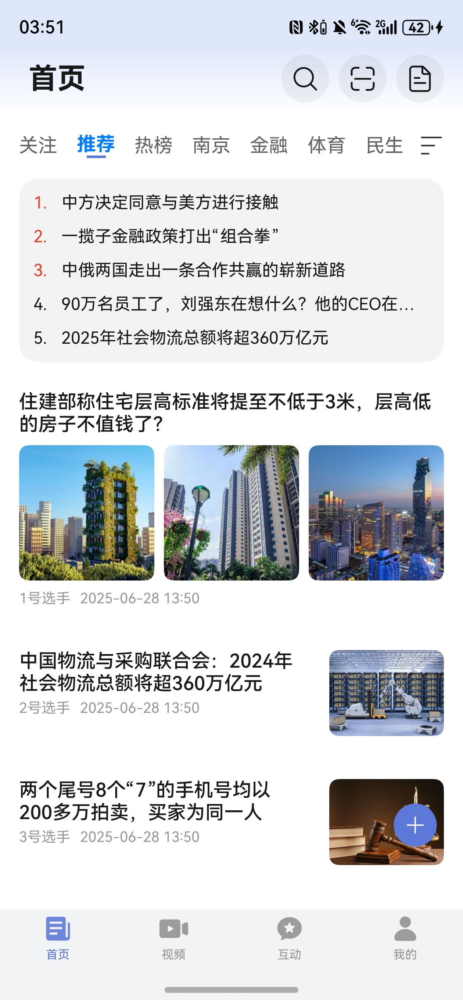
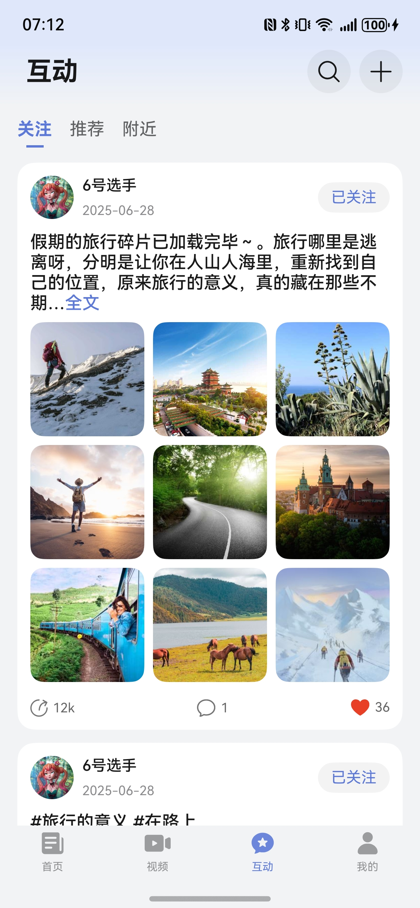
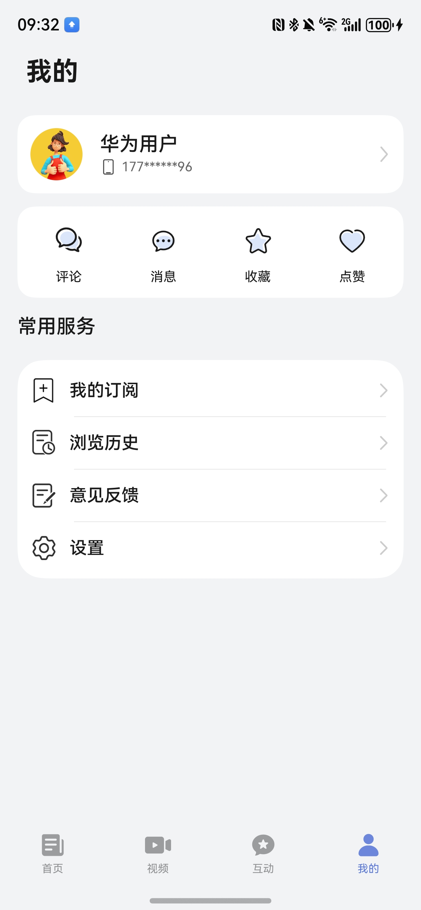

# 新闻（新闻）应用模板快速入门

## 目录

- [功能介绍](#功能介绍)
- [约束与限制](#约束与限制)
- [快速入门](#快速入门)
- [示例效果](#示例效果)
- [开源许可协议](#开源许可协议)
- [附录](#附录)

## 功能介绍

您可以基于此模板直接定制应用，也可以挑选此模板中提供的多种组件使用，从而降低您的开发难度，提高您的开发效率。

此模板提供如下组件，所有组件存放在工程根目录的components下，如果您仅需使用组件，可参考对应组件的指导链接；如果您使用此模板，请参考本文档。

| 组件                                | 描述                                          | 使用指导                                                  |
|:----------------------------------|:--------------------------------------------|:------------------------------------------------------|
| 通用登录组件（module_login）              | 支持华为账号一键登录及其他方式登录（微信、手机号登录）                 | [使用指导](components/module_login/README.md)             |
| 通用分享组件（module_share）              | 支持分享到微信好友、朋友圈、QQ、微博等方式，支持碰一碰分享、生成海报、系统分享等功能 | [使用指导](components/module_share/README.md)             |
| 通用应用内设置组件（module_app_setting）     | 支持设置开关切换、下拉选择、页面跳转、文本刷新等基础设置项               | [使用指导](components/module_app_setting/README.md)       |
| 通用问题反馈组件（module_feedback）         | 支持提交问题反馈、查看反馈记录                             | [使用指导](components/module_feedback/README.md)          |
| 通用朗读组件（module_text_reader）        | 支持文本朗读                                      | [使用指导](components/module_text_reader/README.md)       |
| 通用个人信息组件（module_personal_info）    | 支持编辑头像、昵称、姓名、性别、手机号、生日、个人简介等                | [使用指导](components/module_personal_info/README.md)     |
| 通用隐私同意弹窗组件（module_consent_dialog） | 支持全屏、弹窗、半模态等形式的隐私弹窗                         | [使用指导](components/module_consent_dialog/README.md)    |
| 新闻广告组件（module_advertisement）      | 支持全屏广告、横幅广告                                 | [使用指导](components/module_advertisement/README.md)     |
| 频道编辑组件（module_channeledit）        | 支持频道添加、删除、拖拽排序                              | [使用指导](components/module_channeledit/README.md)       |
| 高亮组件（module_highlight）            | 支持根据关键字高亮显示文本中命中关键词的部分                      | [使用指导](components/module_highlight/README.md)         |
| 图片预览组件（module_imagepreview）       | 支持预览图片、双指放大、缩小，滑动预览                         | [使用指导](components/module_imagepreview/README.md)      |
| 发帖组件（module_post）                 | 支持编辑互动发帖                                    | [使用指导](components/module_post/README.md)              |
| 字体大小调节组件（module_setfontsize）      | 支持实时查看字体大小调整效果                              | [使用指导](components/module_setfontsize/README.md)       |
| 短视频滑动组件（module_swipeplayer）       | 支持短视频上下滑动、横竖屏切换、长按倍速、播放进度条拖动等能力             | [使用指导](components/module_swipeplayer/README.md)       |
| 一镜到底组件（module_transition）         | 支持卡片展开、搜索、查看大图一镜到底                          | [使用指导](components/module_transition/README.md)        |
| 新闻发布组件（module_articlepost）        | 支持富文本发表新闻                                   | [使用指导](components/module_articlepost/README.md)       |
| 动态布局组件（module_flexlayout）         | 支持根据描述文件动态布局                                | [使用指导](components/module_flexlayout/README.md)        |
| 数字报纸组件（module_digital_newspaper）  | 支持浏览传统报纸                                    | [使用指导](components/module_digital_newspaper/README.md) |
| 音频广播组件（module_audioplayer）        | 音频广播组件                                      | [使用指导](components/module_audioplayer/README.md) |

本模板为新闻类应用提供了常用功能的开发样例，模板主要分首页、视频、互动和我的四大模块：

* 首页：提供推荐新闻信息流、搜索、扫码、热榜、本地、数字读报等功能。

* 视频：提供关注、精选、推荐短视频以及直播等功能。

* 互动：支持查看关注、推荐、附近博主发文、支持一键发帖。

* 我的：提供个人主页查看、评论、消息、管理收藏/点赞/浏览历史、意见反馈、设置等功能。

本模板已集成华为账号、推送、预加载、广告、朗读、无障碍屏幕朗读、适老化、深色模式、微信登录分享等服务，适配平板一多布局、视频悬停态播放，支持不同设备间同步新闻浏览进度，提供首页新闻动态布局能力，只需做少量配置和定制即可快速实现华为账号的登录、新闻阅读等功能。

| 首页                                             | 视频                                              | 互动                                                    | 我的                                             |
|------------------------------------------------|-------------------------------------------------|-------------------------------------------------------|------------------------------------------------|
|  |  |  |  |

本模板主要页面及核心功能如下所示：

```text
综合新闻模板
  ├──首页                           
  │   ├──顶部栏-搜索  
  │   │   ├── 历史搜索                          
  │   │   └── 热门搜索                      
  │   │         
  │   ├──顶部栏-扫码    
  │   ├──顶部栏-数字报纸     
  │   │                    
  │   ├──顶部栏-导航栏    
  │   │   ├── 关注、推荐、热榜、本地等                                             
  │   │   └── 频道编辑、顺序调整
  │   │
  │   ├──新闻列表    
  │   │   ├── 动态布局                                             
  │   │   ├── 信息流                         
  │   │   └── 广告 
  │   │
  │   └──新闻详情    
  │       ├── 图文                                             
  │       ├── 视频文                         
  │       ├── 听新闻
  │       ├── 收藏、点赞、评论                         
  │       ├── 分享（微信、朋友圈、QQ、生成海报、复制链接等）
  │       └── 相关推荐 
  │
  ├──视频                           
  │   ├──顶部栏  
  │   │   ├── 关注 
  │   │   ├── 精选
  │   │   ├── 推荐 
  │   │   ├── 直播 
  │   │   ├── 电视
  │   │   ├── 广播                       
  │   │   └── 搜索                      
  │   │         
  │   └──视频详情页         
  │       ├── 竖屏播放
  │       ├── 横屏播放
  │       ├── 播放、暂停、音量/亮度/进度调节、倍速
  │       └── 关注、点赞、收藏、评论、分享                            
  │                        
  ├──互动                           
  │   ├──顶部栏  
  │   │   ├── 搜索                          
  │   │   ├── 发帖                                                   
  │   │   ├── 关注
  │   │   ├── 推荐                       
  │   │   └── 附近                      
  │   │         
  │   ├──帖子列表         
  │   │   ├── 图文                               
  │   │   └── 关注、点赞、评论、分享                            
  │   │                    
  │   └──帖子详情    
  │       ├── 图文                                             
  │       ├── 语音播报                         
  │       ├── 收藏/点赞/评论/分享                                 
  │       └── 相关推荐                       
  │
  └──我的                           
      ├──登录  
      │   ├── 华为账号一键登录                          
      │   ├── 微信登录                                                   
      │   ├── 账密登录
      │   └── 用户隐私协议同意                       
      │         
      ├──个人主页         
      │   ├── 头像、昵称、简介
      │   ├── 关注、粉丝、获赞
      │   └── 文章、视频、动态
      │                    
      ├──分类导航栏    
      │   ├── 评论                                        
      │   ├── 消息                   
      │   ├── 收藏                             
      │   └── 点赞
      │
      └──常用服务  
          ├── 我的订阅  
          ├── 浏览历史                                        
          ├── 意见反馈                   
          └── 设置
               ├── 编辑个人信息             
               ├── 隐私设置           
               ├── 通知开关  
               ├── 播放与网络设置             
               ├── 清理缓存           
               ├── 夜间模式 
               ├── 字体大小 
               ├── 检测版本 
               ├── 关于我们 
               └── 退出登录                               
```

本模板工程代码结构如下所示：

```text
ComprehensiveNews
├──commons
│  ├──lib_account/src/main/ets                            // 账号登录模块             
│  │    ├──constants
│  │    │   └──ErrorCode.ets                              // 错误码文件                  
│  │    ├──services  
│  │    │   ├──mockdata/ProtocolData.ets                  // 协议mock数据
│  │    │   └──AccountApi.ets                             // 账号API                  
│  │    └──utils  
│  │        ├──LoginParam.ets                             // 登录参数类
│  │        └──LoginUtils.ets                             // 登录方法类 
│  │ 
│  ├──lib_av_details/src/main/ets                         // 音视频模块             
│  │    ├──components                                     // 音视频组件                  
│  │    ├──constants                                      // 音视频常量                 
│  │    ├──model                                          // 音视频模型   
│  │    ├──utils                                          // 音视频工具类   
│  │    ├──viewmodel                                      // 音视频逻辑层
│  │    └──views                                          // 主页面   
│  │
│  ├──lib_common/src/main/ets                             // 基础模块             
│  │    ├──constants                                      // 通用常量 
│  │    ├──datasource                                     // 懒加载数据模型
│  │    ├──dialogs                                        // 通用弹窗 
│  │    ├──models                                         // 状态观测模型
│  │    ├──push                                           // 推送
│  │    ├──styles                                         // 样式
│  │    └──utils                                          // 通用方法     
│  │
│  ├──lib_flex_layout/src/main/ets                        // 动态布局模块             
│  │    ├──components
│  │    │   ├──LoadMoreFooter.ets                         // 加载更多
│  │    │   ├──NewsTabContent.ets                         // Tab视图
│  │    │   ├──NoLoginPage.ets                            // 未登录视图
│  │    │   └──FlexLayoutPage.ets                         // 动态布局入口    
│  │    └──views
│  │        └──FlexLayout.ets                             // 动态布局列表页 
│  │
│  ├──lib_native_components/src/main/ets                  // 动态布局-原生模块             
│  │    ├──components
│  │    │   ├──AdvertisementCard.ets                      // 广告卡片
│  │    │   ├──FeedDetailsCard.ets                        // 动态卡片
│  │    │   ├──HotListServiceSwitchCard.ets               // 热榜切换组件
│  │    │   ├──HotNewsServiceCard.ets                     // 热榜新闻
│  │    │   ├──LeftTextRightImageCard.ets                 // 左文右图卡片
│  │    │   ├──TopTextBottomBigImageCard.ets              // 上文下图大卡
│  │    │   ├──TopTextBottomImageCard.ets                 // 上文下图卡片
│  │    │   ├──TopTextBottomVideoCard.ets                 // 上文下视频卡片
│  │    │   └──VerticalBigImageCard.ets                   // 上下布局大图
│  │    └─utils 
│  │        ├──CardRegisterEngine.ets                     // 样式modifier
│  │        ├──Modifier.ets                               // 工具方法    
│  │        └──Utils.ets                                  // 卡片注册类         
│  │
│  ├──lib_news_api/src/main/ets                           // 服务端api模块             
│  │    ├──common                                         // 基础文件    
│  │    ├──constants                                      // 常量文件 
│  │    ├──database                                       // 数据库 
│  │    ├──https                                          // 云侧请求 
│  │    ├──httpsmock                                      // 云侧请求mock 
│  │    ├──observedmodels                                 // 状态模型  
│  │    ├──params                                         // 请求响应参数 
│  │    └──utils                                          // 工具utils 
│  │
│  ├──lib_news_feed_details/src/main/ets                  // 新闻详情模块             
│  │    ├──components
│  │    │   ├──ArticleDetailsFooter.ets                   // 文章底部区域
│  │    │   ├──NewsContent.ets                            // 新闻主体内容
│  │    │   └──RecommendArea.ets                          // 相关推荐                  
│  │    └──views  
│  │        └──ArticleFeedDetails.ets                     // 新闻详情页      
│  │
│  ├──lib_preview_page/src/main/ets                       // 预览模块             
│  │    └───components
│  │        └──ImagePreviewPage.ets                       // 图片预览视图                  
│  │ 
│  └──lib_widget/src/main/ets                             // 通用UI模块             
│       └──components
│           ├──BaseImage.ets                              // 基础图片组件
│           ├──BaseShare.ets                              // 基础分享组件
│           ├──ButtonGroup.ets                            // 组合按钮
│           ├──CustomBadge.ets                            // 自定义信息标记组件
│           ├──EmptyBuilder.ets                           // 空白组件
│           ├──NavHeaderBar.ets                           // 自定义标题栏
│           ├──NetworkExceptionView.ets                   // 网络异常组件
│           └──NewsSearchTransition.ets                   // 搜索动画
│
├──components
│  ├──module_advertisement                                // 广告组件 
│  ├──module_app_setting                                  // 应用内设置组件   
│  ├──module_articlepost                                  // 富文本发帖组件       
│  ├──module_audioplayer                                  // 音频组件             
│  ├──module_channeledit                                  // 频道编辑组件
│  ├──module_consent_dialog                               // 隐私弹窗组件
│  ├──module_digital_newspaper                            // 数字报纸组件
│  ├──module_feedback                                     // 意见反馈组件 
│  ├──module_feedcomment                                  // 评论组件
│  ├──module_flexlayout                                   // 动态布局渲染组件 
│  ├──module_highlight                                    // 高亮组件
│  ├──module_imagepreview                                 // 图片预览组件
│  ├──module_login                                        // 登录组件
│  ├──module_newsfeed                                     // 动态卡片组件
│  ├──module_personal_info                                // 个人信息组件
│  ├──module_post                                         // 发帖组件
│  ├──module_setfontsize                                  // 字体大小调节组件
│  ├──module_share                                        // 分享组件
│  ├──module_swipeplayer                                  // 视频组件
│  ├──module_text_reader                                  // 朗读组件
│  └──module_transition                                   // 一镜到底组件             
│      
├──features
│  ├──business_home/src/main/ets                          // 首页模块             
│  │    ├──components
│  │    │   ├──FloatingPublishBtn.ets                     // 悬浮按钮
│  │    │   ├──NewspaperShare.ets                         // 数字报纸分享
│  │    │   ├──UploadCover.ets                            // 上传遮罩
│  │    │   └──VideoPost.ets                              // 发布视频                  
│  │    └──pages
│  │        ├──ENewsPage.ets                              // 数字报纸页面
│  │        ├──HomePage.ets                               // 首页页面
│  │        ├──NewsPost.ets                               // 新闻发布入口页面
│  │        ├──NewsPublishSelect.ets                      // 新闻发布图片选择页面
│  │        ├──NewsSearch.ets                             // 搜索页面
│  │        └──VideoPreview.ets                           // 视频预览页面
│  │
│  ├──business_interaction/src/main/ets                   // 互动模块             
│  │    ├─components
│  │    │   ├──InteractionFeedCard.ets                    // 动态卡片
│  │    │   ├──InterActionTabContent.ets                  // 动态列表
│  │    │   ├──NoWatcher.ets                              // 暂无关注
│  │    │   └──TopBar.ets                                 // 顶部Tab                  
│  │    └──pages 
│  │        ├──InteractionPage.ets                        // 互动主页面
│  │        └──PublishPostPage.ets                        // 发帖页面                  
│  │
│  ├──business_mine/src/main/ets                          // 我的模块             
│  │    ├──components
│  │    │   ├──BaseHistoryComment.ets                     // 历史、评论基础页面
│  │    │   ├──BaseMarkLikePage.ets                       // 收藏、点赞基础页面
│  │    │   ├──CancelDialogBuilder.ets                    // 取消收藏点赞弹窗
│  │    │   ├──CommentRoot.ets                            // 主评论
│  │    │   ├──CommentSub.ets                             // 从属评论
│  │    │   ├──FanItem.ets                                // 粉丝单元
│  │    │   ├──IMItem.ets                                 // 私信单元
│  │    │   ├──MessageItem.ets                            // 消息单元
│  │    │   ├──SetReadIcon.ets                            // 标记已读
│  │    │   └──UniformNewsCard.ets                        // 统一新闻卡片                
│  │    └──pages 
│  │        ├──CommentPage.ets                            // 评论页面
│  │        ├──HistoryPage.ets                            // 我的历史
│  │        ├──LikePage.ets                               // 我的点赞
│  │        ├──MarkPage.ets                               // 我的收藏
│  │        ├──MessageCommentReplyPage.ets                // 评论与回复
│  │        ├──MessageFansPage.ets                        // 新增粉丝
│  │        ├──MessageIMChatPage.ets                      // 聊天页面
│  │        ├──MessageIMListPage.ets                      // 私信列表
│  │        ├──MessagePage.ets                            // 消息页面
│  │        ├──MessageSingleCommentList.ets               // 全部回复页面
│  │        ├──MessageSystemPage.ets                      // 系统消息
│  │        └──MinePage.ets                               // 我的页面              
│  │
│  ├──business_profile/src/main/ets                       // 个人主页模块             
│  │    ├──components
│  │    │   ├──AuthorItem.ets                             // 作者单元
│  │    │   ├──BaseFollowWatchPage.ets                    // 关注粉丝基础页面
│  │    │   ├──DialogLikeNum.ets                          // 获赞弹窗
│  │    │   ├──TabBar.ets                                 // 顶部Tab
│  │    │   ├──UniformNews.ets                            // 统一新闻卡片
│  │    │   ├──UserIntro.ets                              // 用户信息
│  │    │   └──WatchButton.ets                            // 关注按钮                
│  │    └──pages
│  │        ├──FollowerPage.ets                           // 粉丝页面
│  │        ├──PersonalHomePage.ets                       // 个人主页
│  │        └──WatchPage.ets                              // 关注页面  
│  │
│  ├──business_setting/src/main/ets                       // 设置模块             
│  │    └──pages
│  │        ├──SettingFont.ets                            // 字体大小设置页面
│  │        ├──SettingNetwork.ets                         // 播放与网络设置页面
│  │        ├──SettingPage.ets                            // 设置页面
│  │        ├──SettingPersonal.ets                        // 编辑个人信息页面
│  │        └──SettingPrivacy.ets                         // 隐私设置页面   
│  │ 
│  └──business_video/src/main/ets                         // 视频模块             
│       ├──components
│       │   ├──CommentView.ets                            // 评论视图
│       │   ├──LiveHighlightsView.ets                     // 直播回放视图
│       │   ├──LiveNoticePreview.ets                      // 直播公告视图
│       │   ├──LivestreamCard.ets                         // 直播卡片视图
│       │   ├──LivestreamFooterView.ets                   // 直播底部视图
│       │   ├──Sidebar.ets                                // 侧边栏视图
│       │   ├──TabHeaderView.ets                          // 顶部Tab视图
│       │   └──VideoLayerView.ets                         // 视频外层操作层视图
│       ├──pages
│       │   ├──CommentViewPage.ets                        // 评论页面
│       │   ├──LivestreamDetailPage.ets                   // 直播详情页面
│       │   ├──VideoDetailPage.ets                        // 视频详情页
│       │   └──VideoPage.ets                              // 视频首页
│       └──views
│           ├──BroadcastPage.ets                          // 广播页面     
│           ├──FeaturedPage.ets                           // 精选页面               
│           ├──FollowPage.ets                             // 关注页面
│           ├──IntroductionView.ets                       // 直播介绍视图
│           ├──LiveCommentView.ets                        // 直播评论视图
│           ├──LivestreamPage.ets                         // 直播列表页面
│           ├──RecommendPage.ets                          // 推荐页面
│           ├──TelevisionPage.ets                         // 电视页面
│           └──VideoSwiperPage.ets                        // 短视频轮播页面
│
└──products
   └──phone/src/main/ets                                  // phone模块
        ├──common                        
        │   ├──AppTheme.ets                               // 应用主题色
        │   ├──AppUtils.ets                               // 应用设置工具类
        │   ├──CloudPrefetchUtils.ets                     // 预加载工具类
        │   ├──Constants.ets                              // 业务常量
        │   ├──ContinueUtils.ets                          // 自由流转应用接续工具类
        │   ├──FormUtils.ets                              // 卡片工具类
        │   ├──NetworkUtils.ets                           // 网络工具类
        │   ├──PrivacyConsentUtils.ets                    // 隐私弹窗类
        │   ├──Types.ets                                  // 数据模型
        │   ├──WantUtils.ets                              // want工具类
        │   └──WindowUtils.ets                            // 窗口工具类
        ├──components                    
        │   └──CustomTabBar.ets                           // 应用底部Tab
        ├──pages   
        │   ├──Index.ets                                  // 入口页面
        │   ├──IndexPage.ets                              // 应用主页面
        │   ├──SafePage.ets                               // 隐私同意页面
        │   └──SplashPage.ets                             // 开屏广告页面
        └──widget                                         // 服务卡片
 
```

## 约束与限制

### 环境

- DevEco Studio版本：DevEco Studio 6.0.1 Release及以上
- HarmonyOS SDK版本：HarmonyOS 6.0.1 Release SDK及以上
- 设备类型：华为手机（包括双折叠和阔折叠）、平板
- 系统版本：HarmonyOS 5.1.1(19)及以上

### 权限

- 网络权限: ohos.permission.INTERNET, ohos.permission.GET_NETWORK_INFO
- 跨应用关联权限: ohos.permission.APP_TRACKING_CONSENT
- 位置权限: ohos.permission.APPROXIMATELY_LOCATION
- 后台运行权限: ohos.permission.KEEP_BACKGROUND_RUNNING
- 隐私窗口权限: ohos.permission.PRIVACY_WINDOW

### 使用约束
1. 跨设备同步新闻浏览进度，使用约束如下，详细参考：[应用接续开发指导](https://developer.huawei.com/consumer/cn/doc/harmonyos-guides/app-continuation-guide#section17575828642)
   - 双端设备需要登录同一华为账号
   - 双端设备需要打开 WLAN 和蓝牙开关，或者在设置中的“多设备协同 > 高级”中启用“多设备协同增强服务”功能
   - 双端设备需要在“设置”应用中开启“多设备协同 > 接续”功能
   - 双端设备都需要安装该应用

2. 碰一碰分享，使用约束如下，详细参考：[手机与手机碰一碰分享](https://developer.huawei.com/consumer/cn/doc/harmonyos-guides/knock-share-between-phones-overview#section184317615456)
   - 任意一端设备不支持碰一碰能力时，轻碰无任何响应

3. 暂不支持模拟器的功能：小艺朗读

## 快速入门

### 配置工程

在运行此模板前，需要完成以下配置：

1. 在AppGallery Connect创建应用，将包名配置到模板中。

   a. 参考[创建HarmonyOS应用](https://developer.huawei.com/consumer/cn/doc/app/agc-help-create-app-0000002247955506)为应用创建APP ID，并将APP ID与应用进行关联。

   b. 返回应用列表页面，查看应用的包名。

   c. 将模板工程根目录下AppScope/app.json5文件中的bundleName替换为创建应用的包名。

2. 配置华为账号服务。

   a. 将应用的Client ID配置到products/phone/src/main路径下的module.json5文件中，详细参考：[配置Client ID](https://developer.huawei.com/consumer/cn/doc/harmonyos-guides/account-client-id)。

   b. 申请华为账号一键登录所需的权限，详细参考：[申请账号权限](https://developer.huawei.com/consumer/cn/doc/harmonyos-guides/account-config-permissions)。

3. 配置地图服务，详细参考：[开通地图服务](https://developer.huawei.com/consumer/cn/doc/harmonyos-guides/map-config-agc)。

4. 配置推送服务。

   a. [开启推送服务](https://developer.huawei.com/consumer/cn/doc/harmonyos-guides/push-config-setting)。

   b. 按照需要的权益[申请通知消息自分类权益](https://developer.huawei.com/consumer/cn/doc/harmonyos-guides/push-apply-right)。

   c. [端云调试](https://developer.huawei.com/consumer/cn/doc/harmonyos-guides/push-server)。

5. 配置广告服务。

   a. 如果仅调测广告，可使用测试广告位ID：开屏广告：testd7c5cewoj6、横幅广告：testw6vs28auh3。

   b. 申请正式的广告位ID。登录[鲸鸿动能媒体服务平台](https://developer.huawei.com/consumer/cn/service/ads/publisher/html/index.html?lang=zh)进行申请，具体操作详情请参见[展示位创建](https://developer.huawei.com/consumer/cn/doc/distribution/monetize/zhanshiweichuangjian-0000001132700049)。

6. 配置预加载服务。

   a. [开通预加载](https://developer.huawei.com/consumer/cn/doc/harmonyos-guides/cloudfoundation-enable-prefetch)。

   b. [开通云函数](https://developer.huawei.com/consumer/cn/doc/harmonyos-guides/cloudfoundation-enable-function)。

   c. 打包云函数包：进入工程preload目录，将目录下的文件压缩为zip文件，注意进入文件夹中，全选文件，右击压缩。

   d. [创建云函数](https://developer.huawei.com/consumer/cn/doc/harmonyos-guides/cloudfoundation-create-and-config-function)。

    * “函数名称”为“preload”
    * “触发方式”为“事件调用”
    * “触发器类型”为“HTTP触发器”，其他保持默认
    * “代码输入类型”为“*.zip文件”，代码文件上传上一步打包的zip文件

    

   e. [配置安装预加载](https://developer.huawei.com/consumer/cn/doc/harmonyos-guides/cloudfoundation-prefetch-config)

   安装预加载函数名称配置为上一步创建的云函数

    

7. 接入微信SDK。
   前往微信开放平台申请AppID并配置鸿蒙应用信息，详情参考：[鸿蒙接入指南](https://developers.weixin.qq.com/doc/oplatform/Mobile_App/Access_Guide/ohos.html)。

8. 接入QQ。
   前往QQ开放平台申请AppID并配置鸿蒙应用信息，详情参考：[鸿蒙接入指南](https://wiki.connect.qq.com/sdk%e4%b8%8b%e8%bd%bd)。

9. 对应用进行[手工签名](https://developer.huawei.com/consumer/cn/doc/harmonyos-guides/ide-signing#section297715173233)。

10. 添加手工签名所用证书对应的公钥指纹，详细参考：[配置公钥指纹](https://developer.huawei.com/consumer/cn/doc/app/agc-help-cert-fingerprint-0000002278002933)

### 运行调试工程

1. 连接调试手机和PC。

2. 菜单选择“Run > Run 'phone' ”或者“Run > Debug 'phone' ”，运行或调试模板工程。

## 示例效果

1. [首页](./screenshots/home.mp4)
2. [视频](./screenshots/video.mp4)
3. [发帖](./screenshots/post.jpg)
4. [我的](./screenshots/mine.mp4)
5. [广播电视](./screenshots/broadcast_television.mp4)
6. [深色模式](./screenshots/darkmode.jpg)
7. [大字体](./screenshots/fontsetting.jpg)
8. [折叠屏-首页](./screenshots/homefold.jpg)
9. [折叠屏-新闻详情页](./screenshots/newsdetailfold.jpg)
10. [折叠屏-悬停态播放视频](./screenshots/videofold.mp4)
11. [跨设备同步新闻浏览进度](./screenshots/syncnews.mp4)
12. [一镜到底动效](./screenshots/longtake.mp4)

## 开源许可协议

该代码经过[Apache 2.0 授权许可](http://www.apache.org/licenses/LICENSE-2.0)。

## 附录

### 常用三方SDK

| 分类   | 三方库名称                                                                                                                                                                                                                                                                                                                                                                                                                                                                                                                                                                                                                                                                                                                                                                                                                                                                                                                                      | 功能描述          |
|------|--------------------------------------------------------------------------------------------------------------------------------------------------------------------------------------------------------------------------------------------------------------------------------------------------------------------------------------------------------------------------------------------------------------------------------------------------------------------------------------------------------------------------------------------------------------------------------------------------------------------------------------------------------------------------------------------------------------------------------------------------------------------------------------------------------------------------------------------------------------------------------------------------------------------------------------------|---------------|
| 登录认证 | [阿里云号码认证SDK](https://help.aliyun.com/zh/pnvs/developer-reference/harmony-client-access?spm=5176.21213303.J_ZGek9Blx07Hclc3Ddt9dg.1.382e2f3da3ZL7I&scm=20140722.S_help@@%E6%96%87%E6%A1%A3@@2853932._.ID_help@@%E6%96%87%E6%A1%A3@@2853932-RL_%E9%B8%BF%E8%92%99-LOC_2024SPHelpResult-OR_ser-PAR1_2150446a17564540220258611e6859-V_4-PAR3_o-RE_new9-P0_0-P1_0) / [中国电信一键登录SDK](https://developer.huawei.com/consumer/cn/market/prod-detail/f5770bbdb7d84c47a0887d9b99d3a5d9/1) /  [极光安全认证 (JVerification)](https://developer.huawei.com/consumer/cn/market/prod-detail/589f0f55d91d47419edd8156b7c2d35f/88795a04fdac4c0a903c893bde1c9b4a) / [极光安全认证 (JVerification)](https://developer.huawei.com/consumer/cn/market/prod-detail/589f0f55d91d47419edd8156b7c2d35f/88795a04fdac4c0a903c893bde1c9b4a) / [创蓝闪验](https://developer.huawei.com/consumer/cn/market/prod-detail/3bf7d42b9e074362b866f2c3cf0a3592/202ad06fc59c4a19adbce1248af9d8d2) | 登录认证          |
| 分享   | [MobLink ](https://developer.huawei.com/consumer/cn/market/prod-detail/c88909dd0c9146dc87d675038773ccd2/f897ac2dbdde447180e9bb61dc4eb0d1)/ [微信分享](https://developers.weixin.qq.com/doc/oplatform/Mobile_App/Share_and_Favorites/ohos.html) / [QQ分享](https://wiki.connect.qq.com/harmonyos_sdk%e7%8e%af%e5%a2%83%e6%90%ad%e5%bb%ba) / [新浪微博SDK](https://developer.huawei.com/consumer/cn/market/prod-detail/7afe7ff8e74e4585941f738c09e7c06f/PLATFORM)                                                                                                                                                                                                                                                                                                                                                                                                                                                                                      | 推送/分享         |
| 支付   | [支付宝支付](https://opendocs.alipay.com/open/02e7gu) / [微信支付 ](https://developers.weixin.qq.com/doc/oplatform/Mobile_App/WeChat_Pay/Android.html)/ [银联支付 (云闪付)](https://open.unionpay.com/tjweb/doc/mchnt/list?id=2981)                                                                                                                                                                                                                                                                                                                                                                                                                                                                                                                                                                                                                                                                                                                        | 支付            |
| 数据分析 | [神策分析](https://developer.huawei.com/consumer/cn/market/prod-detail/a629e0eeab9c44f9a6f15e0727bc92ca/PLATFORM) / [友盟common SDK ](https://developer.huawei.com/consumer/cn/market/prod-detail/14d21b00a4d34ff3be00dec7597ab5d7/0277100bd59f45e38d8a0de52e1119b2)                                                                                                                                                                                                                                                                                                                                                                                                                                                                                                                                                                                                                                                                             | 数据收集、处理、分析、运用 |
| 性能监控 | [腾讯Bugly ](https://developer.huawei.com/consumer/cn/market/prod-detail/94a9ca3772a745dbb4992ffb9fd44f49/PLATFORM)/ [听云SDK](https://developer.huawei.com/consumer/cn/market/prod-detail/2acb6ccef6a04820a230627ab1ee87b9/03d0f883f0c54f1aa97cb895ac68fb3a)                                                                                                                                                                                                                                                                                                                                                                                                                                                                                                                                                                                                                                                                                  | 异常上报和运营统计     |
| 推送   | [阿里推送SDK](https://developer.huawei.com/consumer/cn/market/prod-detail/bacc457d60bf4daf9def11e1e5ddc1c6/PLATFORM) / [极光推送](https://developer.huawei.com/consumer/cn/market/prod-detail/eb15c8034a7540c7a62ea765c4baae2b/88795a04fdac4c0a903c893bde1c9b4a) / [个推 (每日互动)](https://developer.huawei.com/consumer/cn/market/prod-detail/5e5944b551ca462993d58dad106c5700/f3c76ca47db845f0b8cdf53af50aa74c)                                                                                                                                                                                                                                                                                                                                                                                                                                                                                                                                      | 消息推送          |
| 媒体   | [阿里云视频播放器SDK](https://developer.huawei.com/consumer/cn/market/prod-detail/56a72aaa18b94e6aaa78b88150d18207/PLATFORM)                                                                                                                                                                                                                                                                                                                                                                                                                                                                                                                                                                                                                                                                                                                                                                                                                                     | 音视频           |
| 地图   | [高德地图SDK](https://lbs.amap.com/api/harmonyos-sdk/summary)                                                                                                                                                                                                                                                                                                                                                                                                                                                                                                                                                                                                                                                                                                                                                                                                                                                                                  | 地图            |
