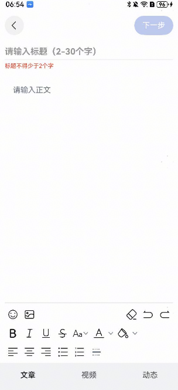

# 新闻发布组件快速入门

## 目录

- [简介](#简介)
- [约束与限制](#约束与限制)
- [使用](#使用)
- [API参考](#API参考)
- [示例代码](#示例代码)

## 简介

本组件支持新闻发布，包括富文本编辑。



## 约束与限制

### 环境

- DevEco Studio版本：DevEco Studio 5.0.3 Release及以上
- HarmonyOS SDK版本：HarmonyOS 5.0.3 Release SDK及以上
- 设备类型：华为手机（包括双折叠和阔折叠）、平板
- 系统版本：HarmonyOS 5.0.1(13)及以上

### 权限

- 网络权限：ohos.permission.INTERNET

## 使用

1. 安装组件。

   如果是在DevEco Studio使用插件集成组件，则无需安装组件，请忽略此步骤。

   如果是从生态市场下载组件，请参考以下步骤安装组件。

   a. 解压下载的组件包，将包中所有文件夹拷贝至您工程根目录的XXX目录下。

   b. 在项目根目录build-profile.json5添加module_articlepost模块。

   ```
   // 项目根目录下build-profile.json5填写module_articlepost路径。其中XXX为组件存放的目录名
   "modules": [
     {
       "name": "module_articlepost",
       "srcPath": "./XXX/module_articlepost"
     }
   ]
   ```

   c. 在项目根目录oh-package.json5添加依赖。

   ```
   // XXX为组件存放的目录名称
   "dependencies": {
     "module_articlepost": "file:./XXX/module_articlepost"
   }
   ```

2. 引入组件。

   ```
   import { ArticlePost } from 'module_articlepost';
   ```

3. 调用组件，详细组件调用参见[示例代码](#示例代码)。

   ```ts
   import { ArticlePost } from 'module_articlepost'
   
   @Entry
   @ComponentV2
   struct Index {
     build() {
       Column(){
         ArticlePost({
           ...
         })
       }
     }
   }
   ```

## API参考

### 接口

ArticlePost(option: [ArticlePostOptions](#ArticlePostOptions对象说明))

新闻发布组件的参数

**参数：**

| 参数名     | 类型                                                    | 是否必填 | 说明         |
|:--------|:------------------------------------------------------|:-----|:-----------|
| options | [ArticlePostOptions](#ArticlePostOptions对象说明) | 否    | 新闻发布组件的参数。 |

#### ArticlePostOptions对象说明

| 参数名        | 类型     | 是否必填 | 说明     |
|:-----------|:-------|:-----|:-------|
| fontSizeRatio  | string | 是    | 字体缩放倍率 |
| darkMode       | string | 是    | 深色模式   |


### 事件

支持以下事件：

#### onTitleChange

onTitleChange: (value: string) => void = () => {}

标题输入回调

#### onContentChange

onContentChange: (value: string) => void = () => {}

富文本输入回调

## 示例代码

```ts
import { ArticlePost } from 'module_articlepost'

@Entry
@ComponentV2
struct Index {
  build() {
    Column(){
      ArticlePost({
        fontSizeRatio: 1,
        darkMode:false,
        onTitleChange: (value: string) => {
          console.log('标题输入'+ value)
        },
        onContentChange: (value: string) => {
          console.log('富文本输入'+ value)
        },
      })
    }
  }
}
```