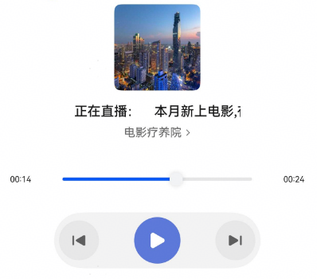

# 音频广播组件快速入门

## 目录

- [简介](#简介)
- [约束与限制](#约束与限制)
- [使用](#使用)
- [API参考](#API参考)
- [示例代码](#示例代码)

## 简介

本组件支持广播相关音频播放。


## 约束与限制

### 环境

- DevEco Studio版本：DevEco Studio 6.0.0 Release及以上
- HarmonyOS SDK版本：HarmonyOS 6.0.0 Release SDK及以上
- 设备类型：华为手机（包括双折叠和阔折叠）、平板
- 系统版本：HarmonyOS 6.0.0(20)及以上

### 权限

- 网络权限：ohos.permission.INTERNET

## 使用

1. 安装组件。

   如果是在DevEco Studio使用插件集成组件，则无需安装组件，请忽略此步骤。

   如果是从生态市场下载组件，请参考以下步骤安装组件。

   a. 解压下载的组件包，将包中所有文件夹拷贝至您工程根目录的XXX目录下。

   b. 在项目根目录build-profile.json5添加module_audioplayer模块。

   ```
   // 项目根目录下build-profile.json5填写module_articlepost路径。其中XXX为组件存放的目录名
      "modules": [
            {
               "name": "module_audioplayer",
               "srcPath": "./XXX/module_audioplayer"
            }
      ]
   ```

   c. 在项目根目录oh-package.json5添加依赖。

   ```
   // XXX为组件存放的目录名称
   "dependencies": {
      "module_audioplayer": "file:./XXX/module_audioplayer"
   }
   ```

2. 引入组件。

   ```
   import { AudioItem, AudioPlayer, AudioPlayerState, MediaController } from 'module_audioplayer';
   ```

3. 调用组件，详细组件调用参见[示例代码](#示例代码)。

   ```ts
   import { common } from '@kit.AbilityKit';
   import { AudioItem, AudioPlayer, AudioPlayerState, MediaController } from 'module_audioplayer';


   @Entry
   @ComponentV2
   struct Index {
     @Local audioList: AudioItem[] = [
       {
         'id': 'broadcast_1',
         'audioId': 'section_1',
         'mainTitle': '电影疗养院',
         'title': '本月新上电影,有你想看的吗?',
         'description': '电影是以运动影像为核心，结合声音的艺术形式，通过光化学记录或数字化技术实现影像创作与传播。电影是以运动影像为核心，结合声音的艺术形式，通过光化学记录或数字化技术实现影像创作与传播。',
         'mark': 'https://agc-storage-drcn.platform.dbankcloud.cn/v0/news-hnp2d/news_3.jpg',
         'label': '电影疗养院',
         'src': 'https://agc-storage-drcn.platform.dbankcloud.cn/v0/news-hnp2d/audio%2F124-Mark-Humble-Free-Happy-Birthday(chosic.com).mp3',
         'index': 0,
       },
       {
         'id': 'broadcast_1',
         'audioId': 'section_2',
         'mainTitle': '电影疗养院',
         'title': '精彩不能停,最新精彩悬疑影片再来一波!',
         'description': '电影是以运动影像为核心，结合声音的艺术形式，通过光化学记录或数字化技术实现影像创作与传播。电影是以运动影像为核心，结合声音的艺术形式，通过光化学记录或数字化技术实现影像创作与传播。',
         'mark': 'https://agc-storage-drcn.platform.dbankcloud.cn/v0/news-hnp2d/news_3.jpg',
         'label': '电影疗养院',
         'src': 'https://agc-storage-drcn.platform.dbankcloud.cn/v0/news-hnp2d/audio%2Fpower.wav',
         'index': 1,
       },
     ]
     @Local audioIndex: number = 0
     async aboutToAppear() {
      MediaController.initAudioList(this.getUIContext().getHostContext() as common.UIAbilityContext)
       MediaController.setAudioList(this.audioList)
       MediaController.setAlbumId(this.audioList[this.audioIndex].id);
     }
   
     build() {
       Column() {
         AudioPlayer({
           audioGroupIndex: 0,
           hasOperation: false,
           onAudioStateChange: (state: AudioPlayerState) => {
             this.getUIContext().getPromptAction().showToast({ message: '播放器当前状态'+ state })
           },
           onAudioTitle: () => {
             this.getUIContext().getPromptAction().showToast({ message: '播放器标题点击' })
           },
         })
       }
     }
   }
   ```

## API参考

### 接口

AudioPlayer(option: [AudioPlayerOptions](#AudioPlayerOptions对象说明))

新闻发布组件的参数

**参数：**

| 参数名  | 类型                                              | 是否必填 | 说明                 |
| :------ | :------------------------------------------------ | :------- | :------------------- |
| options | [AudioPlayerOptions](#AudioPlayerOptions对象说明) | 否       | 广播播放组件的参数。 |

#### ArticlePostOptions对象说明

| 参数名        | 类型     | 是否必填 | 说明     |
|:-----------|:-------|:-----|:-------|
| coverWidth | number | 否    | 封面宽度 |
| coverHeight | number | 否   | 封面高度 |
| audioGroupIndex | number | 否 | 音频组索引 |
| audioIndex | number | 否 | 音频组单个音频索引 |
| hasOperation | boolean | 否 | 是否需要底部操作栏 |
| fontSizeRatio | number | 否 | 字体缩放倍率 |

####  AudioPlayerState对象说明

| 参数名      | 类型   | 是否必填 | 说明   |
| :---------- | :----- | :------- | :----- |
| idle        | string | 否       | 空闲   |
| initialized | string | 否       | 初始化 |
| prepared    | string | 否       | 准备   |
| playing     | string | 否       | 播放   |
| paused      | string | 否       | 暂停   |
| completed   | string | 否       | 完成   |
| stopped     | string | 否       | 停止   |
| released    | string | 否       | 释放   |
| error       | string | 否       | 错误   |

### 事件

支持以下事件：

#### onAudioTitle

onAudioTitle: () => void = () => {}

标题点击回调

#### onAudioStateChange

onAudioStateChange: (state: [AudioPlayerState](#AudioPlayerState对象说明)) => void = () => {}

播放器状态回调

### 句柄

```
/**
 * 设置窗口管理实例
 * @param windowStage 窗口管理实例
 */
public static setWindowStage(windowStage: window.WindowStage)

/**
 * 设置音频列表
 * @param list 音频列表
 */
public static setAudioList(list: AudioItem[])

/**
 * 根据索引播放音频
 * @param audioIndex
 * @param isNeedPlay
 */
public static loadAssent(audioIndex: number, loadOnly?: boolean) 

/**
 * 设置专辑id
 * @param albumId 专辑id
 */
public static setAlbumId(albumId: string)

/**
 * 判断当前播放专辑是否参入的专辑id
 * @param albumId 专辑id
 */
public static isSameCurrentPlay(albumId: string): boolean

/**
 * 音频初始化
 * @param context 上下文
 */
public static async initAudioList(context: common.UIAbilityContext)

/**
 * 根据id判断当前播放的是否是专辑的某个音频
 * @param playerId 音频id
 * @param playingId 当前播放的视频id
 */
public static isSameCurrentPlayWithIndex(albumId: string, playingId: string): boolean
```

## 示例代码

1.显示底部操作栏



```ts
import { common } from '@kit.AbilityKit';
import { AudioItem, AudioPlayer, AudioPlayerState, MediaController } from 'module_audioplayer';


@Entry
@ComponentV2
struct Index {
  @Local audioList: AudioItem[] = [
    {
      'id': 'broadcast_1',
      'audioId': 'section_1',
      'mainTitle': '电影疗养院',
      'title': '本月新上电影,有你想看的吗?',
      'description': '电影是以运动影像为核心，结合声音的艺术形式，通过光化学记录或数字化技术实现影像创作与传播。电影是以运动影像为核心，结合声音的艺术形式，通过光化学记录或数字化技术实现影像创作与传播。',
      'mark': 'https://agc-storage-drcn.platform.dbankcloud.cn/v0/news-hnp2d/news_3.jpg',
      'label': '电影疗养院',
      'src': 'https://agc-storage-drcn.platform.dbankcloud.cn/v0/news-hnp2d/audio%2F124-Mark-Humble-Free-Happy-Birthday(chosic.com).mp3',
      'index': 0,
    },
    {
      'id': 'broadcast_1',
      'audioId': 'section_2',
      'mainTitle': '电影疗养院',
      'title': '精彩不能停,最新精彩悬疑影片再来一波!',
      'description': '电影是以运动影像为核心，结合声音的艺术形式，通过光化学记录或数字化技术实现影像创作与传播。电影是以运动影像为核心，结合声音的艺术形式，通过光化学记录或数字化技术实现影像创作与传播。',
      'mark': 'https://agc-storage-drcn.platform.dbankcloud.cn/v0/news-hnp2d/news_3.jpg',
      'label': '电影疗养院',
      'src': 'https://agc-storage-drcn.platform.dbankcloud.cn/v0/news-hnp2d/audio%2Fpower.wav',
      'index': 1,
    },
  ]
  @Local audioIndex: number = 0
  async aboutToAppear() {
   MediaController.initAudioList(this.getUIContext().getHostContext() as common.UIAbilityContext)
    MediaController.setAudioList(this.audioList)
    MediaController.setAlbumId(this.audioList[this.audioIndex].id);
  }

  build() {
    Column() {
      AudioPlayer({
        audioGroupIndex: 0,
        hasOperation: true,
        onAudioStateChange: (state: AudioPlayerState) => {
          this.getUIContext().getPromptAction().showToast({ message: '播放器当前状态'+ state })
        },
        onAudioTitle: () => {
          this.getUIContext().getPromptAction().showToast({ message: '播放器标题点击' })
        },
      })
    }
  }
}

```

2.唤醒小窗播放


```
// 初始化播放前WindowStage
onWindowStageCreate(windowStage: window.WindowStage): void {
  // Main window is created, set main page for this ability
  hilog.info(DOMAIN, 'testTag', '%{public}s', 'Ability onWindowStageCreate');
  windowStage.loadContent('pages/Index', (err) => {
    if (err.code) {
      hilog.error(DOMAIN, 'testTag', 'Failed to load the content. Cause: %{public}s', JSON.stringify(err));
      return;
    }
    MediaController.setWindowStage(windowStage)
    hilog.info(DOMAIN, 'testTag', 'Succeeded in loading the content.');
  });
}
```

```
import { common } from '@kit.AbilityKit';
import { AudioItem, AudioPlayer, AudioPlayerState, MediaController, AudioService } from 'module_audioplayer';


@Entry
@ComponentV2
struct Index {
  @Local audioList: AudioItem[] = [
    {
      'id': 'broadcast_1',
      'audioId': 'section_1',
      'mainTitle': '电影疗养院',
      'title': '本月新上电影,有你想看的吗?',
      'description': '电影是以运动影像为核心，结合声音的艺术形式，通过光化学记录或数字化技术实现影像创作与传播。电影是以运动影像为核心，结合声音的艺术形式，通过光化学记录或数字化技术实现影像创作与传播。',
      'mark': 'https://agc-storage-drcn.platform.dbankcloud.cn/v0/news-hnp2d/news_3.jpg',
      'label': '电影疗养院',
      'src': 'https://agc-storage-drcn.platform.dbankcloud.cn/v0/news-hnp2d/audio%2F124-Mark-Humble-Free-Happy-Birthday(chosic.com).mp3',
      'index': 0,
    },
    {
      'id': 'broadcast_1',
      'audioId': 'section_2',
      'mainTitle': '电影疗养院',
      'title': '精彩不能停,最新精彩悬疑影片再来一波!',
      'description': '电影是以运动影像为核心，结合声音的艺术形式，通过光化学记录或数字化技术实现影像创作与传播。电影是以运动影像为核心，结合声音的艺术形式，通过光化学记录或数字化技术实现影像创作与传播。',
      'mark': 'https://agc-storage-drcn.platform.dbankcloud.cn/v0/news-hnp2d/news_3.jpg',
      'label': '电影疗养院',
      'src': 'https://agc-storage-drcn.platform.dbankcloud.cn/v0/news-hnp2d/audio%2Fpower.wav',
      'index': 1,
    },
  ]
  @Local audioIndex: number = 0

  async aboutToAppear() {
    MediaController.initAudioList(this.getUIContext().getHostContext() as common.UIAbilityContext)
    MediaController.setAudioList(this.audioList)
    MediaController.setAlbumId(this.audioList[this.audioIndex].id);
  }

  build() {
    Column({ space: 24 }) {
      AudioPlayer({
        audioGroupIndex: 0,
        hasOperation: true,
        onAudioStateChange: (state: AudioPlayerState) => {
          this.getUIContext().getPromptAction().showToast({ message: '播放器当前状态' + state })
        },
        onAudioTitle: () => {
          this.getUIContext().getPromptAction().showToast({ message: '播放器标题点击' })
        },
      })
      Button('点击唤醒小窗')
        .onClick(() => {
          AudioService.createSubWindow(this.getUIContext())
        })
    }
  }
}
```