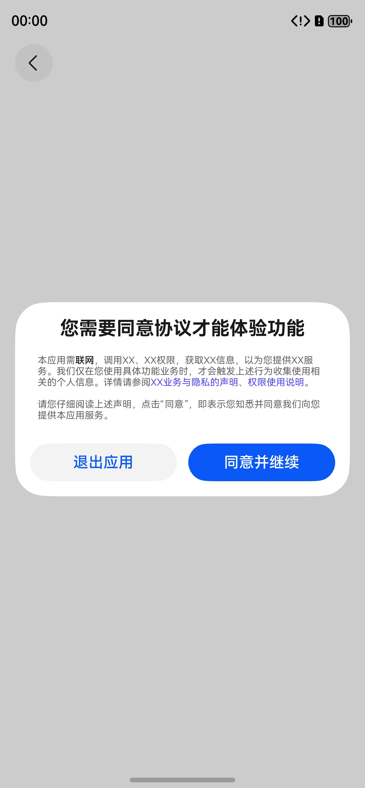
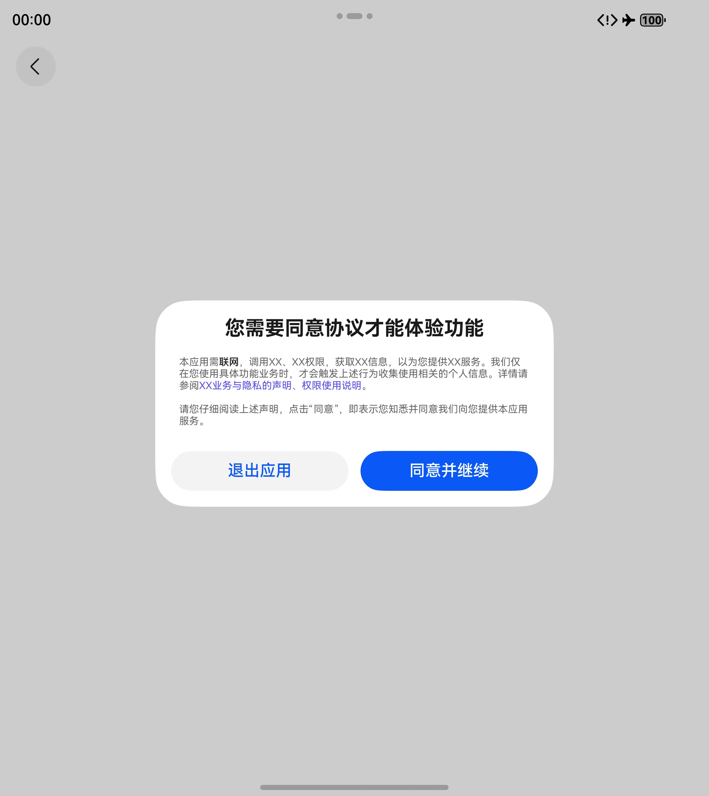
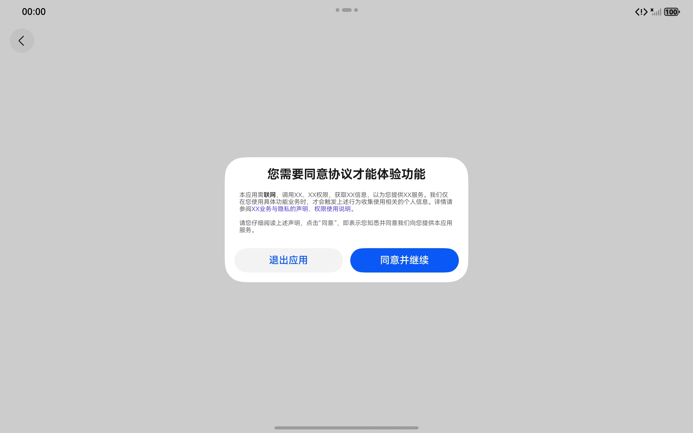
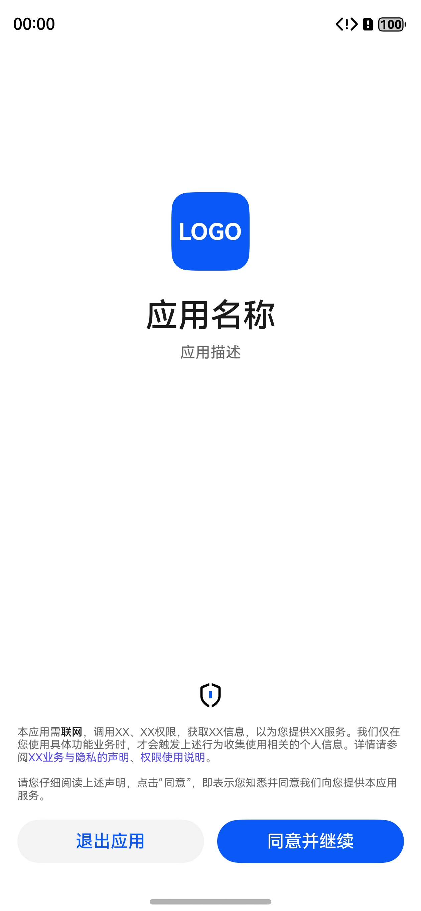
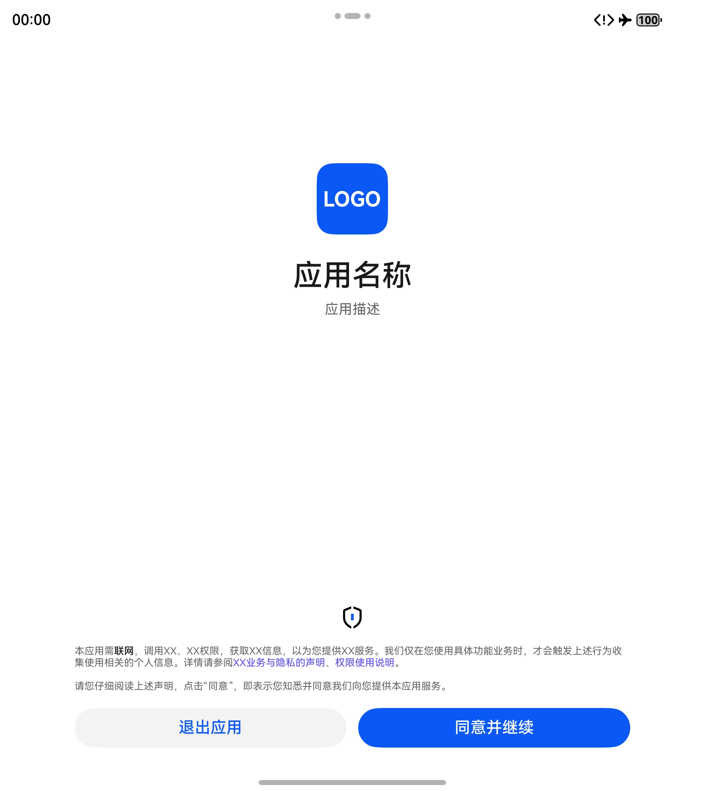
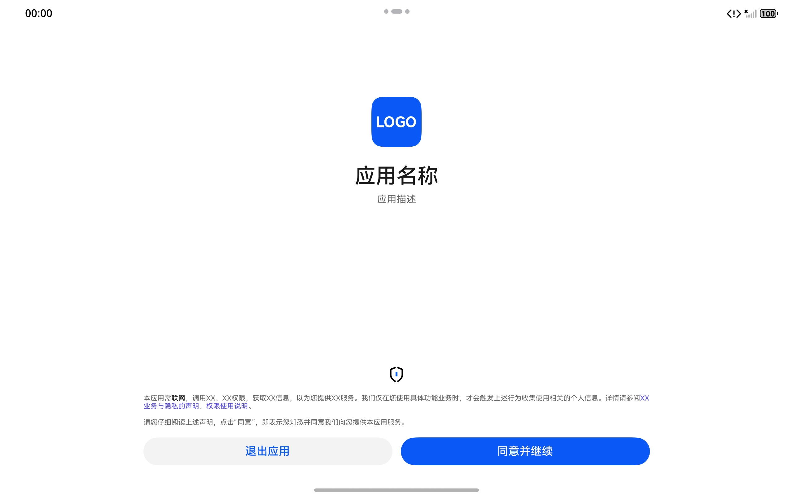
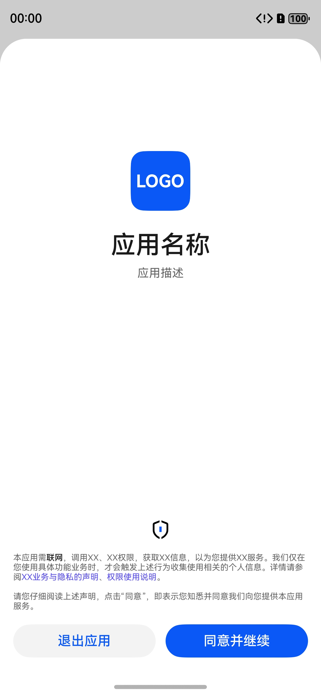
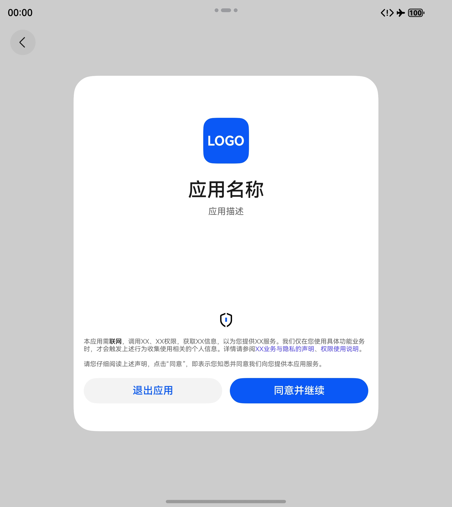
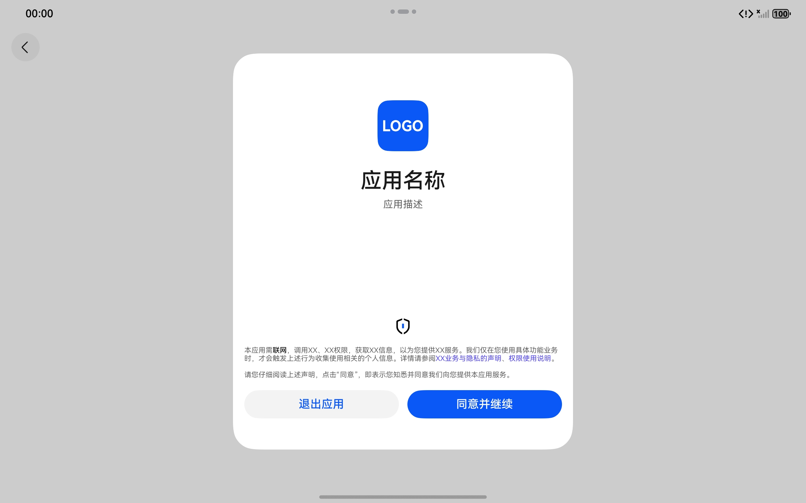

# 通用隐私同意弹窗组件快速入门

## 目录

- [简介](#简介)
- [约束与限制](#约束与限制)
- [使用](#使用)
- [API参考](#API参考)
- [示例代码](#示例代码)

## 简介

本组件提供了多种类型的隐私弹窗封装，支持配置标题、应用信息、隐私政策描述及样式，同时支持为不同文本配置跳转链接或点击事件。

<div style='overflow-x:auto'>
  <table style='min-width:800px'>
    <tr>
      <th></th>
      <th>直板机</th>
      <th>折叠屏</th>
      <th>平板</th>
    </tr>
    <tr>
      <th scope='row'>常规弹窗</th>
      <td valign='top'></td>
      <td valign='top'></td>
      <td valign='top'></td>
    </tr>
    <tr>
      <th scope='row'>全屏弹窗</th>
      <td valign='top'></td>
      <td valign='top'></td>
      <td valign='top'></td>
    </tr>
    <tr>
      <th scope='row'>模态弹窗</th>
      <td valign='top'></td>
      <td valign='top'></td>
      <td valign='top'></td>
    </tr>
  </table>
</div>

## 约束与限制

### 环境

- DevEco Studio版本：DevEco Studio 5.0.5 Release及以上
- HarmonyOS SDK版本：HarmonyOS 5.0.5 Release SDK及以上
- 设备类型：华为手机（包括双折叠和阔折叠）、华为平板
- 系统版本：HarmonyOS 5.0.3(15)及以上

### 权限

- 网络权限：ohos.permission.INTERNET

## 使用

1. 安装组件

   如果是在 DevEco Studio 使用插件集成组件，则无需安装组件，请忽略此步骤。

   如果是从生态市场下载组件，请参考以下步骤安装组件。

   a. 解压下载的组件包，将包中所有文件夹拷贝至您工程根目录的 XXX 目录下。

   b. 在项目根目录 build-profile.json5 添加 privacy_consent_dialog 模块。

    ```
    // 在项目根目录 build-profile.json5 填写 privacy_consent_dialog 路径。其中 XXX 为组件存放的目录名
    "modules": [
      {
        "name": "privacy_consent_dialog",
        "srcPath": "./XXX/privacy_consent_dialog"
      }
    ]
    ```

   c. 在项目根目录 oh-package.json5 中添加依赖。

    ```
    // XXX 为组件存放的目录名称
    {
      "dependencies": {
        "privacy_consent_dialog": "file:./XXX/privacy_consent_dialog"
      }
    }
    ```

2. 引入组件。

    ```
    import { PrivacyConsentController, PrivacyDocument, TextType } from 'privacy_consent_dialog';
    ```

## API参考

### 子组件

无

### 接口

### PrivacyConsentController

#### constructor(uiContext: UIContext)

PrivacyConsentController 的构造函数。

**参数：**

| 参数名       | 类型                                                                                                            | 是否必填   | 说明        |
|-----------|---------------------------------------------------------------------------------------------------------------|--------|-----------|
| uiContext | [UIContext](https://developer.huawei.com/consumer/cn/doc/harmonyos-references/arkts-apis-uicontext-uicontext) | 是      | 应用 UI 上下文 |

#### setDocument(doc: PrivacyText[]): PrivacyConsentController

设置隐私政策描述文档。

**参数**

| 参数名  | 类型                            | 是否必填  | 说明                            |
|------|-------------------------------|-------|-------------------------------|
| doc  | [PrivacyText](#PrivacyText)[] | 是     | 由多段文本构成的描述文档，各文本段支持配置样式、链接或事件 |

**返回值**

| 类型                                                    | 说明               |
|-------------------------------------------------------|------------------|
| [PrivacyConsentController](#PrivacyConsentController) | 隐私弹窗控制器自身，用于链式调用 |

#### setTitle(title: string): PrivacyConsentController

设置弹窗标题。

**参数**

| 参数名   | 类型     | 是否必填  | 说明              |
|-------|--------|-------|-----------------|
| title | string | 是     | 弹窗标题 (仅在常规弹窗显示) |

**返回值**

| 类型                                                    | 说明               |
|-------------------------------------------------------|------------------|
| [PrivacyConsentController](#PrivacyConsentController) | 隐私弹窗控制器自身，用于链式调用 |

#### setAppIcon(icon: ResourceStr): PrivacyConsentController

设置应用图标。

**参数**

| 参数名  | 类型                                                                                                      | 是否必填  | 说明                 |
|------|---------------------------------------------------------------------------------------------------------|-------|--------------------|
| icon | [ResourceStr](https://developer.huawei.com/consumer/cn/doc/harmonyos-references/ts-types#resourcestr)[] | 是     | 应用图标 (仅在全屏/模态弹窗显示) |

**返回值**

| 类型                                                    | 说明               |
|-------------------------------------------------------|------------------|
| [PrivacyConsentController](#PrivacyConsentController) | 隐私弹窗控制器自身，用于链式调用 |

#### setAppName(name: string): PrivacyConsentController

设置应用名称。

**参数**

| 参数名  | 类型     | 是否必填  | 说明                 |
|------|--------|-------|--------------------|
| name | string | 是     | 应用名称 (仅在全屏/模态弹窗显示) |

**返回值**

| 类型                                                    | 说明               |
|-------------------------------------------------------|------------------|
| [PrivacyConsentController](#PrivacyConsentController) | 隐私弹窗控制器自身，用于链式调用 |

#### setAppDescription(desc: string): PrivacyConsentController

设置应用描述。

**参数**

| 参数名  | 类型     | 是否必填  | 说明                 |
|------|--------|-------|--------------------|
| desc | string | 是     | 应用描述 (仅在全屏/模态弹窗显示) |

**返回值**

| 类型                                                    | 说明               |
|-------------------------------------------------------|------------------|
| [PrivacyConsentController](#PrivacyConsentController) | 隐私弹窗控制器自身，用于链式调用 |

#### onAccept(callback: Callback\<void\>): PrivacyConsentController

监听隐私政策同意事件。

**参数**

| 参数名      | 类型               | 是否必填  | 说明           |
|----------|------------------|-------|--------------|
| callback | Callback\<void\> | 是     | 隐私政策同意事件回调方法 |

**返回值**

| 类型                                                    | 说明               |
|-------------------------------------------------------|------------------|
| [PrivacyConsentController](#PrivacyConsentController) | 隐私弹窗控制器自身，用于链式调用 |

#### onReject(callback: Callback\<void\>): PrivacyConsentController

监听隐私政策拒绝事件。

**参数**

| 参数名      | 类型               | 是否必填  | 说明           |
|----------|------------------|-------|--------------|
| callback | Callback\<void\> | 是     | 隐私政策拒绝事件回调方法 |

**返回值**

| 类型                                                    | 说明               |
|-------------------------------------------------------|------------------|
| [PrivacyConsentController](#PrivacyConsentController) | 隐私弹窗控制器自身，用于链式调用 |

#### openDialog(): Promise\<boolean\>

拉起常规弹窗。

**返回值**

| 类型                 | 说明       |
|--------------------|----------|
| Promise\<boolean\> | 常规弹窗拉起结果 |

#### openFullScreenDialog(): Promise\<boolean\>

拉起全屏弹窗。

**返回值**

| 类型                 | 说明       |
|--------------------|----------|
| Promise\<boolean\> | 全屏弹窗拉起结果 |

#### openSheetDialog(): Promise\<boolean\>

拉起模态弹窗。

**返回值**

| 类型                 | 说明       |
|--------------------|----------|
| Promise\<boolean\> | 模态弹窗拉起结果 |

#### close(): void

关闭弹窗。

### PrivacyText

隐私政策描述文本，不同的文本类型有各自的默认样式，支持覆盖。

| 字段名        | 类型                                                                                                        | 是否必填  | 说明                    |
|------------|-----------------------------------------------------------------------------------------------------------|-------|-----------------------|
| text       | string                                                                                                    | 是     | 文本内容                  |
| type       | [TextType](#TextType)                                                                                     | 是     | 文本类型                  |
| href       | string                                                                                                    | 否     | 文本跳转链接 (文本类型为链接文本时生效) |
| onAction   | Callback\<void\>                                                                                          | 否     | 文本事件监听 (文本类型为事件文本时生效) |
| color      | [ResourceColor](https://developer.huawei.com/consumer/cn/doc/harmonyos-references/ts-types#resourcecolor) | 否     | 文本颜色                  |
| fontSize   | Length                                                                                                    | 否     | 文本字号                  |
| fontWeight | FontWeight \| number \| string                                                                            | 否     | 文本字体粗细                |

### TextType

文本类型枚举。

| 名称     | 说明   |
|--------|------|
| PLAIN  | 普通文本 |
| LINK   | 链接文本 |
| ACTION | 事件文本 |

## 示例代码

```
import { PrivacyConsentController, PrivacyDocument, TextType } from 'privacy_consent_dialog';
import { common } from '@kit.AbilityKit';
import { BusinessError } from '@kit.BasicServicesKit';

const TAG: string = '[PrivacyConsentDialog] ';

@Entry
@ComponentV2
struct Index {

  private navPathStack: NavPathStack = new NavPathStack();

  private document: PrivacyDocument = [
    {
      text: '本应用需',
      type: TextType.PLAIN
    },
    {
      text: '联网',
      type: TextType.PLAIN,
      color: $r('sys.color.font_primary'),
      fontWeight: FontWeight.Medium
    },
    {
      text: '，调用XX、XX权限，获取XX信息，以为您提供XX服务。我们仅在您使用具体功能业务时，才会触发上述行为收集使用相关的个人信息。详情请参阅',
      type: TextType.PLAIN
    },
    {
      text: 'XX业务与隐私的声明',
      type: TextType.LINK,
      href: 'https://privacy.consumer.huawei.com/legal/id/authentication-terms.htm?code=CN&language=zh-CN'
    },
    {
      text: '、',
      type: TextType.PLAIN
    },
    {
      text: '权限使用说明',
      type: TextType.ACTION,
      onAction: () => this.showToast('事件：\'权限使用说明\' 被点击')
    },
    {
      text: '。\n\n请您仔细阅读上述声明，点击“同意”，即表示您知悉并同意我们向您提供本应用服务。',
      type: TextType.PLAIN
    }
  ];

  private controller: PrivacyConsentController = new PrivacyConsentController(this.getUIContext())
    .setTitle('您需要同意协议才能体验功能')
    //.setAppIcon($r('app.media.xxx')) // todo: 将 xxx 改为您的应用图标资源名后，取消注释
    .setAppName('应用名称')
    .setAppDescription('应用描述')
    .setDocument(this.document)
    .onAccept(() => {
      this.controller.close();
    })
    .onReject(() => {
      const ctx: common.UIAbilityContext = this.getUIContext().getHostContext() as common.UIAbilityContext;
      ctx.terminateSelf().catch((e: BusinessError<void>) => console.log(TAG, e));
    });

  public build(): void {
    Navigation(this.navPathStack) {
      Column({ space: 25 }) {
        Button('隐私弹窗：常规')
          .onClick(() => this.controller.openDialog())
        Button('隐私弹窗：全屏')
          .onClick(() => this.controller.openFullScreenDialog())
        Button('隐私弹窗：模态')
          .onClick(() => this.controller.openSheetDialog())
      }
      .width('100%')
      .height('100%')
      .justifyContent(FlexAlign.Center)
    }
    .hideTitleBar(true)
    .mode(NavigationMode.Stack)
  }

  private showToast(msg: string): void {
    try {
      this.getUIContext().getPromptAction().showToast({ message: msg });
    } catch (e) {
      console.log(TAG, e);
    }
  }
}
```
