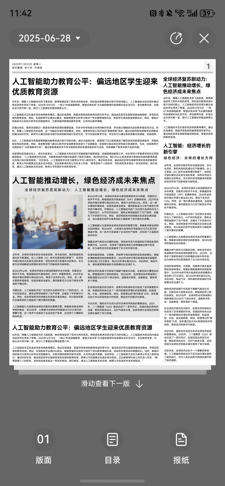

# 数字报纸组件快速入门

## 目录

- [简介](#简介)
- [约束与限制](#约束与限制)
- [使用](#使用)
- [API参考](#API参考)
- [示例代码](#示例代码)

## 简介

本组件为数字报纸组件，支持点击新闻区域，支持切换日期、版面、报纸来源等。



## 约束与限制

### 环境

- DevEco Studio版本：DevEco Studio 5.0.3 Release及以上
- HarmonyOS SDK版本：HarmonyOS 5.0.3 Release SDK及以上
- 设备类型：华为手机（包括双折叠和阔折叠）、平板
- 系统版本：HarmonyOS 5.0.1(13)及以上

### 权限

- 网络权限：ohos.permission.INTERNET

## 使用

1. 安装组件。

   如果是在DevEco Studio使用插件集成组件，则无需安装组件，请忽略此步骤。

   如果是从生态市场下载组件，请参考以下步骤安装组件。

   a. 解压下载的组件包，将包中所有文件夹拷贝至您工程根目录的XXX目录下。

   b. 在项目根目录build-profile.json5添加module_digital_newspaper模块。

   ```
   // 项目根目录下build-profile.json5填写module_digital_newspaper路径。其中XXX为组件存放的目录名
   "modules": [
     {
       "name": "module_digital_newspaper",
       "srcPath": "./XXX/module_digital_newspaper"
     }
   ]
   ```

   c. 在项目根目录oh-package.json5添加依赖。

   ```
   // XXX为组件存放的目录名称
   "dependencies": {
     "module_digital_newspaper": "file:./XXX/module_digital_newspaper"
   }
   ```

2. 引入组件。

   ```
   import { DigitalNews } from 'module_digital_newspaper';
   ```

3. 调用组件，详细组件调用参见[示例代码](#示例代码)。

   ```ts
   @ComponentV2
   export struct Index {
     build() {
       Column() {
         DigitalNews({
           ...,
         })
       }
     }
   }
   ```

## API参考

### 接口

DigitalNews(options: [DigitalNewsOptions](#DigitalNews对象说明))

数字报纸组件。

**参数：**

| 参数名     | 类型                                     | 是否必填 | 说明         |
|:--------|:---------------------------------------|:-----|:-----------|
| options | [DigitalNewsOptions](#DigitalNews对象说明) | 是    | 数字报纸组件的参数。 |

#### DigitalNews对象说明

| 参数名                | 类型                                                                                                        | 是否必填 | 说明                         |
|:-------------------|:----------------------------------------------------------------------------------------------------------|:-----|:---------------------------|
| newspaperPages     | [NewsPage](#NewsPage)[]                                                                                   | 是    | 报纸版面列表。                    |
| newsSourceList     | [NewsSource](#NewsSource)[]                                                                               | 是    | 报纸来源列表。                    |
| themeColor         | [ResourceColor](https://developer.huawei.com/consumer/cn/doc/harmonyos-references/ts-types#resourcecolor) | 否    | 主题色，默认值#0A59F7。            |
| selectDate         | Date                                                                                                      | 否    | 当前所选择的日期，默认值为当天。           |
| selectNewsSource   | [NewsSource](#NewsSource)                                                                                 | 否    | 当前所选择的报纸来源，默认值为来源列表中第一个元素。 |
| onDateChange       | (date: Date) => void                                                                                      | 否    | 日期变化回调。                    |
| onNewsSourceChange | (source: [NewsSource](#NewsSource)) => void                                                               | 否    | 新闻来源变化回调。                  |
| onLayoutPageChange | (pageNum: number) => void                                                                                 | 否    | 版面数字变化回调。                  |
| onAreaClick        | (area: [NewsArea](#NewsArea)) => void                                                                     | 否    | 新闻区域点击回调。                  |
| onClose            | () => void                                                                                                | 否    | 关闭回调。                      |
| shareBuilder       | ($$: [NewsShareData](#NewsShareData)) => void                                                             | 否    | 自定义分享区域。                   |

#### NewsPage

| 参数名        | 类型                                                                                                                  | 是否必填 | 说明       |
|:-----------|:--------------------------------------------------------------------------------------------------------------------|:-----|:---------|
| id         | number                                                                                                              | 是    | 版面id     |
| newsImg    | string                                                                                                              | 是    | 版面图片链接   |
| preloadImg | [PixelMap](https://developer.huawei.com/consumer/cn/doc/harmonyos-references/ts-image-common#pixelmap) \| undefined | 否    | 预加载的版面图片 |
| newsName   | string                                                                                                              | 是    | 版面名称     |
| position   | string                                                                                                              | 是    | 新闻区域位置信息 |
| width      | string                                                                                                              | 否    | 版面宽度     |
| height     | string                                                                                                              | 否    | 版面高度     |
| paperId    | number                                                                                                              | 是    | 报纸id     |
| paperTime  | string                                                                                                              | 是    | 报纸日期     |

#### NewsArea

| 参数名     | 类型     | 是否必填 | 说明        |
|:--------|:-------|:-----|:----------|
| newsId  | string | 是    | 新闻ID      |
| title   | string | 是    | 新闻标题      |
| newsUrl | string | 否    | 新闻链接      |
| left    | number | 是    | 区域左上顶点x坐标 |
| right   | number | 是    | 区域右上顶点x坐标 |
| top     | number | 是    | 区域左上顶点y坐标 |
| bottom  | number | 是    | 区域左下顶点y坐标 |

#### NewsSource

| 参数名  | 类型     | 是否必填 | 说明     |
|:-----|:-------|:-----|:-------|
| id   | string | 是    | 报纸来源id |
| name | string | 是    | 报纸来源名称 |

#### NewsShareData

| 参数名  | 类型                    | 是否必填 | 说明   |
|:-----|:----------------------|:-----|:-----|
| data | [NewsPage](#NewsPage) | 是    | 报纸信息 |

## 示例代码

```ts
import { promptAction, window } from '@kit.ArkUI';
import { hilog } from '@kit.PerformanceAnalysisKit';
import { BusinessError } from '@kit.BasicServicesKit';
import { NewsPage, NewsShareData, NewsSource, DigitalNews } from 'module_digital_newspaper';

@Entry
@ComponentV2
struct Sample1 {
  @Local newspaperPages: NewsPage[] = [];
  @Local newsSourceList: NewsSource[] = [];
  @Local date: Date = new Date();
  @Local source: NewsSource = new NewsSource();

  aboutToAppear(): void {
    this.newsSourceList = SOURCE_SAMPLE_LIST;
    this.newspaperPages = NEWS_SAMPLE_LIST;
    // todo: 由于组件内部使用SheetMode.EMBEDDED，为避免底部安全区域没有覆盖的问题，需要设置窗口沉浸式
    this.setWindowLayoutFullScreen(true);
  }

  aboutToDisappear(): void {
    // todo: 还原设置
    this.setWindowLayoutFullScreen(false);
  }

  setWindowLayoutFullScreen(isLayoutFullScreen: boolean) {
    window.getLastWindow(this.getUIContext().getHostContext()).then((lastWindow) => {
      lastWindow.setWindowLayoutFullScreen(isLayoutFullScreen).catch((e: BusinessError) => {
        hilog.info(0, 'testTag', '%{public}s', 'setWindowLayoutFullScreen fail, error: ' + JSON.stringify(e));
      });
    });
  }

  showToast(options: promptAction.ShowToastOptions) {
    try {
      this.getUIContext().getPromptAction().showToast(options);
    } catch (e) {
      hilog.info(0, 'testTag', '%{public}s', 'showToast fail, error: ' + JSON.stringify(e));
    }
  }

  build() {
    NavDestination() {
      Scroll() {
        Column() {
          DigitalNews({
            newspaperPages: this.newspaperPages,
            newsSourceList: this.newsSourceList,
            selectNewsSource: this.source,
            selectDate: this.date,
            shareBuilder: (data: NewsShareData) => {
              this.shareBuilder();
            },
            onDateChange: (date) => {
              this.showToast({ message: '切换日期：' + date.toLocaleDateString() });
              this.date = date;
            },
            onNewsSourceChange: (source) => {
              this.showToast({ message: '切换报纸来源：' + source.name });
              this.source = source;
            },
            onAreaClick: (area) => {
              this.showToast({ message: '跳转到新闻详情页：' + area.title });
            },
            onClose: () => {
              this.showToast({ message: '点击关闭' });
            },
          })
        }
        .padding({
          left: 16,
          right: 16,
          top: 40,
          bottom: 28,
        })
      }
      .layoutWeight(1)
    }
    .hideTitleBar(true)
    // todo 深色模式下可以使用#000000
    .backgroundColor('#666666')
  }

  @Builder
  shareBuilder() {
    Button() {
      SymbolGlyph($r('sys.symbol.share'))
        .fontSize(24)
        .fontColor([$r('sys.color.font_on_primary')])
    }
    .width(40)
    .height(40)
    .type(ButtonType.Circle)
    .backgroundColor($r('sys.color.comp_background_tertiary'))
    .onClick(() => {
      this.showToast({ message: '点击分享' });
    })
  }
}

// 新闻版面sample数据
const NEWS_SAMPLE_LIST: NewsPage[] = [
  {
    id: 1,
    newsImg: 'https://agc-storage-drcn.platform.dbankcloud.cn/v0/template-thwjd/ComprehensiveNews%2Fdigital_1.png',
    newsName: '第01版：头版',
    position: '10,56,510,56,510,379,10,379,,https://www.example.com,,article_digital_1,,人工智能助力教育公平：偏远地区学生迎来优质教育资源||521,56,691,56,691,269,521,269,,https://www.example.com,,article_digital_2,,全球经济复苏新动力：人工智能推动增长，绿色经济成未来焦点||10,391,510,391,510,875,10,875,,https://www.example.com,,article_digital_3,,人工智能推动增长，绿色经济成未来焦点||521,281,691,281,691,1026,521,1026,,https://www.example.com,,article_digital_4,,人工智能：经济增长的新引擎||10,895,510,895,510,1026,10,1026,,https://www.example.com,,article_digital_1,,人工智能助力教育公平：偏远地区学生迎来优质教育资源',
    width: '700',
    height: '1036',
    paperId: 1,
    paperTime: '2025-06-28',
  },
  {
    id: 2,
    newsImg: 'https://agc-storage-drcn.platform.dbankcloud.cn/v0/template-thwjd/ComprehensiveNews%2Fdigital_2.png',
    newsName: '第02版：要闻',
    position: '10,56,690,56,690,252,10,252,,https://www.example.com,,article_digital_1,,人工智能助力教育公平：偏远地区学生迎来优质教育资源||10,265,464,265,464,729,10,729,,https://www.example.com,,article_digital_2,,全球经济复苏新动力：人工智能推动增长，绿色经济成未来焦点||476,264,690,264,690,729,476,729,,https://www.example.com,,article_digital_4,,人工智能：经济增长的新引擎||10,752,380,752,380,861,10,861,,https://www.example.com,,article_digital_3,,人工智能推动增长，绿色经济成未来焦点||392,752,692,752,692,1024,392,1024,,https://www.example.com,,article_digital_1,,人工智能助力教育公平：偏远地区学生迎来优质教育资源||10,869,380,869,380,1024,10,1024,,https://www.example.com,,article_digital_5,,绿色经济：未来的增长方向',
    width: '700',
    height: '1036',
    paperId: 1,
    paperTime: '2025-06-28',
  },
  {
    id: 3,
    newsImg: 'https://agc-storage-drcn.platform.dbankcloud.cn/v0/template-thwjd/ComprehensiveNews%2Fdigital_3.png',
    newsName: '第03版：国内',
    position: '10,56,510,56,510,379,10,379,,https://www.example.com,,article_digital_1,,人工智能助力教育公平：偏远地区学生迎来优质教育资源||521,56,691,56,691,269,521,269,,https://www.example.com,,article_digital_2,,全球经济复苏新动力：人工智能推动增长，绿色经济成未来焦点||10,391,510,391,510,875,10,875,,https://www.example.com,,article_digital_3,,人工智能推动增长，绿色经济成未来焦点||521,281,691,281,691,1026,521,1026,,https://www.example.com,,article_digital_4,,人工智能：经济增长的新引擎||10,895,510,895,510,1026,10,1026,,https://www.example.com,,article_digital_1,,人工智能助力教育公平：偏远地区学生迎来优质教育资源',
    width: '700',
    height: '1036',
    paperId: 1,
    paperTime: '2025-06-28',
  },
  {
    id: 4,
    newsImg: 'https://agc-storage-drcn.platform.dbankcloud.cn/v0/template-thwjd/ComprehensiveNews%2Fdigital_4.png',
    newsName: '第04版：天下',
    position: '10,56,690,56,690,252,10,252,,https://www.example.com,,article_digital_1,,人工智能助力教育公平：偏远地区学生迎来优质教育资源||10,265,464,265,464,729,10,729,,https://www.example.com,,article_digital_2,,全球经济复苏新动力：人工智能推动增长，绿色经济成未来焦点||476,264,690,264,690,729,476,729,,https://www.example.com,,article_digital_4,,人工智能：经济增长的新引擎||10,752,380,752,380,861,10,861,,https://www.example.com,,article_digital_3,,人工智能推动增长，绿色经济成未来焦点||392,752,692,752,692,1024,392,1024,,https://www.example.com,,article_digital_1,,人工智能助力教育公平：偏远地区学生迎来优质教育资源||10,869,380,869,380,1024,10,1024,,https://www.example.com,,article_digital_5,,绿色经济：未来的增长方向',
    width: '700',
    height: '1036',
    paperId: 1,
    paperTime: '2025-06-28',
  },
  {
    id: 5,
    newsImg: 'https://agc-storage-drcn.platform.dbankcloud.cn/v0/template-thwjd/ComprehensiveNews%2Fdigital_5.png',
    newsName: '第05版：视线',
    position: '10,56,510,56,510,379,10,379,,https://www.example.com,,article_digital_1,,人工智能助力教育公平：偏远地区学生迎来优质教育资源||521,56,691,56,691,269,521,269,,https://www.example.com,,article_digital_2,,全球经济复苏新动力：人工智能推动增长，绿色经济成未来焦点||10,391,510,391,510,875,10,875,,https://www.example.com,,article_digital_3,,人工智能推动增长，绿色经济成未来焦点||521,281,691,281,691,1026,521,1026,,https://www.example.com,,article_digital_4,,人工智能：经济增长的新引擎||10,895,510,895,510,1026,10,1026,,https://www.example.com,,article_digital_1,,人工智能助力教育公平：偏远地区学生迎来优质教育资源',
    width: '700',
    height: '1036',
    paperId: 1,
    paperTime: '2025-06-28',
  },
  {
    id: 6,
    newsImg: 'https://agc-storage-drcn.platform.dbankcloud.cn/v0/template-thwjd/ComprehensiveNews%2Fdigital_6.png',
    newsName: '第06版：资讯',
    position: '10,56,690,56,690,252,10,252,,https://www.example.com,,article_digital_1,,人工智能助力教育公平：偏远地区学生迎来优质教育资源||10,265,464,265,464,729,10,729,,https://www.example.com,,article_digital_2,,全球经济复苏新动力：人工智能推动增长，绿色经济成未来焦点||476,264,690,264,690,729,476,729,,https://www.example.com,,article_digital_4,,人工智能：经济增长的新引擎||10,752,380,752,380,861,10,861,,https://www.example.com,,article_digital_3,,人工智能推动增长，绿色经济成未来焦点||392,752,692,752,692,1024,392,1024,,https://www.example.com,,article_digital_1,,人工智能助力教育公平：偏远地区学生迎来优质教育资源||10,869,380,869,380,1024,10,1024,,https://www.example.com,,article_digital_5,,绿色经济：未来的增长方向',
    width: '700',
    height: '1036',
    paperId: 1,
    paperTime: '2025-06-28',
  },
];

// 来源sample数据
const SOURCE_SAMPLE_LIST: NewsSource[] = [
  {
    id: '1',
    name: '人民日报',
  },
  {
    id: '2',
    name: '光明日报',
  },
  {
    id: '3',
    name: '经济日报',
  },
  {
    id: '4',
    name: '南方日报',
  },
  {
    id: '5',
    name: '广州日报',
  },
];

```