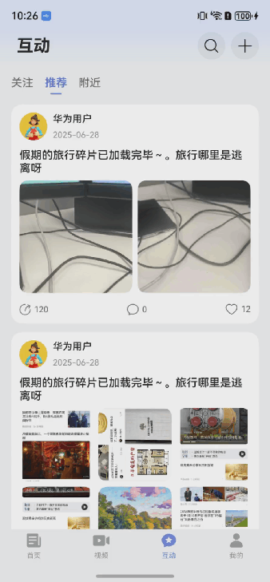
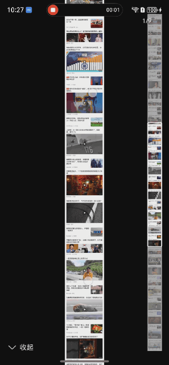
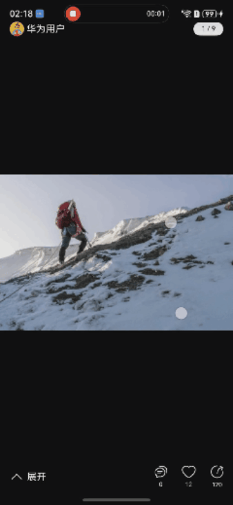

# 通用图片预览组件快速入门

## 目录

- [简介](#简介)
- [约束与限制](#约束与限制)
- [使用](#使用)
- [导入模块](#导入模块)
- [API参考](#API参考)
- [示例代码](#示例代码)

## 简介

本组件提供了图片预览相关功能。
1.支持图片打开关闭一镜到底效果
2.支持预览长图，横图，并提供缩略图展示
3.支持动图，包括沙箱地址，动图网络地址，鸿蒙动图MovingPhoto对象
3.双击缩放图片
4.双指捏合对图片进行缩放
5.图片在放大模式下，滑动图片查看图片的对应位置
6.提供一些自定义属性和事件监听。
7.适配直板机，折叠屏，平板设备

<div style='overflow-x:auto'>
  <table style='min-width:800px'>
    <tr>
      <th></th>
      <th>一镜到底</th>
      <th>动图</th>
      <th>缩略图</th>
      <th>缩放</th>
    </tr>
    <tr>
      <th scope='row'>页面</th>
      <td valign='top'></td>
      <td valign='top'></td>
      <td valign='top'></td>
      <td valign='top'></td>
    </tr>
  </table>
</div>

## 约束与限制

### 环境

- DevEco Studio版本：DevEco Studio 6.0.1 Release及以上
- HarmonyOS SDK版本：HarmonyOS 6.0.1 Release SDK及以上
- 设备类型：华为手机（包括双折叠和阔折叠）、平板
- 系统版本：HarmonyOS 6.0.1(21)及以上

### 权限

- 网络权限：ohos.permission.INTERNET

## 使用

1. 安装组件。

   如果是在DevEco Studio使用插件集成组件，则无需安装组件，请忽略此步骤。

   如果是从生态市场下载组件，请参考以下步骤安装组件。

   a. 解压下载的组件包，将包中所有文件夹拷贝至您工程根目录的XXX目录下。

   b. 在项目根目录build-profile.json5添加module_imagepreview模块。

   ```
   // 项目根目录下build-profile.json5填写module_imagepreview路径。其中XXX为组件存放的目录名
   "modules": [
     {
       "name": "module_imagepreview",
       "srcPath": "./XXX/module_imagepreview"
     }
   ]
   ```

   c. 在项目根目录oh-package.json5添加依赖。

   ```
   // XXX为组件存放的目录名称
   "dependencies": {
     "module_imagepreview": "file:./XXX/module_imagepreview"
   }
   ```

2. 引入组件。

   ```
   import { ImagePreview } from 'module_imagepreview';
   ```

3. 调用组件，详细组件调用参见[API参考](#API参考)。


## 导入模块

### ImagePreview对象说明

| 名称  | 参数                                                                               | 说明       |
| ----- |----------------------------------------------------------------------------------| ---------- |
| open  | (uiContext: UIContext, options: [ImagePreviewOptions](#ImagePreviewOptions对象说明)) | 显示预览器 |
| close | (params?: [PreviewCloseParam](#PreviewCloseParam对象说明))                            | 关闭预览器 |


### PreviewCloseParam对象说明

| 参数名   | 类型    | 是否必填 | 说明             |
| :------- | :------ | :------- | :--------------- |
| dialogId | string  | 否       | 关闭弹窗的id     |
| animated | boolean | 否       | 是否需要关闭动画 |


## API参考

### 接口

ImagePreviewOptions(option: [ImagePreviewOptions](#ImagePreviewOptions对象说明))

图片预览组件的参数。支持[基础属性](#BaseOptions对象说明)和[拓展属性](#ImagePreviewOptions对象说明)配置

**参数：**

| 参数名  | 类型                                                | 是否必填 | 说明             |
| ------- | --------------------------------------------------- | -------- | ---------------- |
| options | [ImagePreviewOptions](#ImagePreviewOptions对象说明) | 否       | 图片预览的参数。 |

### BaseOptions对象说明

| 名称                | 类型                                                         | 是否必填 | 说明                                                                                                                                                                                                                 |
| ------------------- | ------------------------------------------------------------ | -------- |--------------------------------------------------------------------------------------------------------------------------------------------------------------------------------------------------------------------|
| loop                | boolean                                                      | 否       | 是否循环，默认值false                                                                                                                                                                                                      |
| minScale            | number                                                       | 否       | 最小缩放比例， 默认值1，设置小于1时，按照默认值1处理。                                                                                                                                                                                      |
| maxScale            | number                                                       | 否       | 最大缩放比例， 默认值15，设置小于1时，按照默认值1处理。                                                                                                                                                                                     |
| indicator           | [DotIndicator](https://developer.huawei.com/consumer/cn/doc/harmonyos-references/ts-container-swiper#dotindicator10)\| [DigitIndicator](https://developer.huawei.com/consumer/cn/doc/harmonyos-references/ts-container-swiper#digitindicator10)\|boolean | 否       | 指示器，[Swiper](https://developer.huawei.com/consumer/cn/doc/harmonyos-references/ts-container-swiper)组件中的[indicator](https://developer.huawei.com/consumer/cn/doc/harmonyos-references/ts-container-swiper#indicator) |
| startIndex          | number                                                       | 否       | 设置首次显示时当前导航点的索引值。设置小于0或大于等于导航点数量时，按照默认值0处理。                                                                                                                                                                        |
| duration            | number                                                       | 否       | 动画时长,预览器打开关闭的动画时长，默认值200ms                                                                                                                                                                                         |
| doubleScale         | boolean                                                      | 否       | 是否启用双击缩放手势，禁用后，点击时会立即关闭图片预览， 默认值true                                                                                                                                                                               |
| levelMode           | [LevelMode](https://developer.huawei.com/consumer/cn/doc/harmonyos-references/js-apis-promptaction#levelmode15枚举说明) | 否       | 弹窗显示层级模式                                                                                                                                                                                                           |
| levelUniqueId       | number \|  string                                            | 否       | 对话框需要显示的层级下的节点uniqueId                                                                                                                                                                                             |
| immersiveMode       | [ImmersiveMode](https://developer.huawei.com/consumer/cn/doc/harmonyos-references/ts-methods-action-sheet#immersivemode15) | 否       | 设置页面内对话框蒙层效果                                                                                                                                                                                                       |
| backgroundColor     | [ResourceColor](https://developer.huawei.com/consumer/cn/doc/harmonyos-references/ts-types#resourcecolor) | 否       | 背景色，默认值#000000                                                                                                                                                                                                     |
| dismissOnSystemBack | boolean                                                      | 否       | 设置是否可以通过系统返回关闭preview，与closeOnClickImage相互独立，默认值true                                                                                                                                                               |
| closeOnClickImage   | boolean                                                      | 否       | 是否在点击图片后关闭图片预览， 默认值true                                                                                                                                                                                            |
### ImagePreviewOptions对象说明

| 名称                | 类型                                                         | 是否必填 | 说明                                                                                                                                                                                                           |
| ------------------- | ------------------------------------------------------------ | -------- |--------------------------------------------------------------------------------------------------------------------------------------------------------------------------------------------------------------|
| dataList            | [SourceImageModel](#SourceImageModel对象说明)[]              | 否       | 数据源，静态图片传入imageUrl，动图需要传入静态图片imageUrl，以及videoUrl网络地址或者沙箱地址。支持传入[photoAccessHelper.MovingPhoto](https://developer.huawei.com/consumer/cn/doc/harmonyos-references/arkts-apis-photoaccesshelper-movingphoto)对象 |
| dialogId            | string                                                       | 否       | 弹窗ID,可通过ID关闭指定弹窗                                                                                                                                                                                             |
| longTake            | boolean                                                      | 否       | 是否开启一镜到底效果，默认值true，longTake需配合snapshotId结合使用，详情见[示例代码](#示例代码)                                                                                                                                                |
| snapshotId          | (item: PreviewImgType, index: number) => string = (item, index) => JSON.stringify(item) + index | 否       | 设置item的id 默认值JSON.stringify(item) + index，配置一镜到底效果使用，建议保证id唯一性，详情见[示例代码](#示例代码)                                                                                                                        |
| showPageText        | boolean                                                      | 否       | 是否显示分页文字，默认值true                                                                                                                                                                                             |
| dismissAnimation    | boolean                                                      | 否       | 关闭预览动画是否开启， 默认值true                                                                                                                                                                                          |
| movingPhotoAutoPlay | boolean                                                      | 否       | 动图是否自动播放，false状态下手指按压触发播放， 默认值true                                                                                                                                                                           |
| builder             | [PreviewCustomBuilder](#PreviewCustomBuilder对象说明)         | 否       | 自定义插槽，提供顶部和底部自定义builder                                                                                                                                                                                      |
| previewListener     | [previewListener](#previewListener对象说明)                   | 否       | 预览器状态回调，预览器生命周期回调                                                                                                                                                                                            |
| movingPhotoListener | [movingPhotoListener](#movingPhotoListener对象说明)           | 否       | 动图状态监听回调，动态生命周期回调                                                                                                                                                                                            |
| imageActionListener | [imageActionListener](#imageActionListener对象说明)           | 否       | 图片操作监听回调，图片所有操作状态回调                                                                                                                                                                                          |

### SourceImageModel对象说明

| 参数名      | 类型                                                         | 是否必填 | 说明     |
| :---------- | :----------------------------------------------------------- | :------- | :------- |
| imageUrl    | [PreviewImgType](#PreviewImgType对象说明)                    | 是       | 图片资源 |
| videoUrl    | string                                                       | 否       | 视频资源 |
| movingPhoto | [photoAccessHelper.MovingPhoto](https://developer.huawei.com/consumer/cn/doc/harmonyos-references/arkts-apis-photoaccesshelper-movingphoto) \| undefined | 否       | 动图资源 |

### PreviewImgType对象说明

| 参数名         | 类型                                                         | 是否必填 | 说明     |
| :------------- | :----------------------------------------------------------- | :------- | :------- |
| PreviewImgType | [PixelMap](https://developer.huawei.com/consumer/cn/doc/harmonyos-references/arkts-apis-image-pixelmap)\| [ResourceStr](https://developer.huawei.com/consumer/cn/doc/harmonyos-references/ts-types#resourcestr)\| [DrawableDescriptor](https://developer.huawei.com/consumer/cn/doc/harmonyos-references/ts-basic-components-image#drawabledescriptor10) | 是       | 图片资源 |

### 
### 自定义builder

#### PreviewCustomBuilder对象说明

| 参数名        | 类型       | 是否必填 | 说明           |
| :------------ | :--------- | :------- | :------------- |
| topBuilder    | () => void | 否       | 顶部自定义插槽 |
| bottomBuilder | () => void | 否       | 底部自定义插槽 |


### 事件监听

#### previewListener对象说明

| 名称                  | 类型                                                         | 是否必填 | 说明                                 |
| --------------------- | ------------------------------------------------------------ | -------- |------------------------------------|
| onOpen  | () => void                             | 否       | 预览器打开回调                            |
| onBack | () => void                             | 否       | 预览器关闭回调                            |


#### imageActionListener对象说明

| 名称                  | 类型                                                         | 是否必填 | 说明                                            |
| --------------------- | ------------------------------------------------------------ | -------- |-----------------------------------------------|
| onScale | (index: number, curScale: number) => void = () => {} | 否       | 图片缩放事件                                        |
| onClick | onImgClickListener: (index: number) => void = () => {} | 否       | 图片点击事件，图片点击事件需要在closeOnClickImage在false的情况下生效 |
| onLongPress | (index: number) => void = () => { } | 否 | 图片长按事件回调                                      |
| onPageChanged | (item: [SourceImageModel](#SourceImageModel对象说明), index: number) => void = () => {} | 否 | 图片切换回调                                        |

#### movingPhotoListener对象说明

| 名称                  | 类型                                                         | 是否必填 | 说明                                 |
| --------------------- | ------------------------------------------------------------ | -------- |------------------------------------|
| onStart | (item: [SourceImageModel](#SourceImageModel对象说明), index: number) => void = () => {} | 否       | 动图播放时触发该事件            |
| onPause | (item: [SourceImageModel](#SourceImageModel对象说明), index: number) => void = () => {} | 否       | 动图播放暂停时触发该事件 |
| onFinish | (item: [SourceImageModel](#SourceImageModel对象说明), index: number) => void = () => {} | 否 | 动图播放结束时触发该事件 |
| onStop | (item: [SourceImageModel](#SourceImageModel对象说明), index: number) => void = () => {} | 否 | 动图播放停止时触发该事件，当前只有动图传入的是沙箱路径或者MovingPhoto对象才会触发此事件 |
| onPrepared | (item: [SourceImageModel](#SourceImageModel对象说明), index: number) => void = () => {} | 否 | 动态照片准备播放时触发该事件 |

---
### setImageList

setImageList(imageList: [SourceImageModel](#SourceImageModel对象说明)[]): [ImagePreviewOptions](#ImagePreviewOptions对象说明)
设置数据源

##### 注：当前使用componentV1动画的限制，链式调用setImageList必须在setInitIndex之前

### setLoop

setLoop(loop: boolean): [ImagePreviewOptions](#ImagePreviewOptions对象说明)
设置是否滑动循环

### setInitIndex

setInitIndex(initIndex: number): [ImagePreviewOptions](#ImagePreviewOptions对象说明)
设置初始化index

### setMinScale

setMinScale(minScale: number): [ImagePreviewOptions](#ImagePreviewOptions对象说明)
设置最小缩放比例

### setMaxScale

setMaxScale(maxScale: number): [ImagePreviewOptions](#ImagePreviewOptions对象说明)
设置最大缩放比例

### setIndicator

setIndicator(indicator: [DotIndicator](https://developer.huawei.com/consumer/cn/doc/harmonyos-references/ts-container-swiper#dotindicator10)\| [DigitIndicator](https://developer.huawei.com/consumer/cn/doc/harmonyos-references/ts-container-swiper#digitindicator10)\|boolean): [ImagePreviewOptions](#ImagePreviewOptions对象说明)
设置指示器

### setBackgroundColor

setBackgroundColor(backgroundColor: [ResourceColor](https://developer.huawei.com/consumer/cn/doc/harmonyos-references/ts-types#resourcecolor)): [ImagePreviewOptions](#ImagePreviewOptions对象说明)
设置背景色

### setSnapshotId

setSnapshotId(snapshotId: (item: [PreviewImgType](#PreviewImgType对象说明), index: number) => string): [ImagePreviewOptions](#ImagePreviewOptions对象说明)
设置组件快照id

### setDuration

setDuration(duration: number): [ImagePreviewOptions](#ImagePreviewOptions对象说明)
设置动画时长,预览器打开关闭的动画时长

### setShowPageText

setShowPageText(showPageText: boolean): [ImagePreviewOptions](#ImagePreviewOptions对象说明)
设置是否显示分页文字

### setCloseOnClickImage

setCloseOnClickImage(closeOnClickImage: boolean): [ImagePreviewOptions](#ImagePreviewOptions对象说明)
设置是否在点击图片后关闭图片预览

### setDoubleScale

setDoubleScale(setDoubleScale: boolean): [ImagePreviewOptions](#ImagePreviewOptions对象说明)
是否启用双击缩放手势，禁用后，点击时会立即关闭图片预览

### setDismissAnimation

setDismissAnimation(setDismissAnimation: boolean): [ImagePreviewOptions](#ImagePreviewOptions对象说明)
关闭预览动画是否开启

### setDismissOnSystemBack

setDismissOnSystemBack(dismissOnSystemBack: boolean): [ImagePreviewOptions](#ImagePreviewOptions对象说明)
设置是否可以通过系统返回关闭preview

### setLevelMode

setLevelMode(levelMode?: [LevelMode](https://developer.huawei.com/consumer/cn/doc/harmonyos-references/js-apis-promptaction#levelmode15枚举说明)): [ImagePreviewOptions](#ImagePreviewOptions对象说明)
设置levelMode

### setLevelUniqueId

setLevelUniqueId(levelUniqueId?: number | string): [ImagePreviewOptions](#ImagePreviewOptions对象说明)
设置页面id

### setImmersiveMode

setImmersiveMode(immersiveMode?: [ImmersiveMode](https://developer.huawei.com/consumer/cn/doc/harmonyos-references/ts-methods-action-sheet#immersivemode15)): [ImagePreviewOptions](#ImagePreviewOptions对象说明)
设置immersiveMode

### setLongTake

setLongTake(longTake: boolean): [ImagePreviewOptions](#ImagePreviewOptions对象说明)
设置是否开启一镜到底效果

### setMovingPhotoAutoPlay

setMovingPhotoAutoPlay(movingPhotoAutoPlay: boolean): [ImagePreviewOptions](#ImagePreviewOptions对象说明)
设置动图是否自动播放

### setCustomBuilder

setBottomBuilder(builder: [PreviewCustomBuilder]()): [ImagePreviewOptions](#ImagePreviewOptions对象说明)
自定义插槽构建

### setPreviewListener

setBackListener( callbacks: [previewListener](#previewListener对象说明)): [ImagePreviewOptions](#ImagePreviewOptions对象说明)
预览器状态回调

### setImageActionListener

setImageActionListener(callbacks: [imageActionListener](#imageActionListener对象说明)): [ImagePreviewOptions](#ImagePreviewOptions对象说明)
图片操作监听回调


### setMovingPhotoListener

setMovingPhotoListener(callbacks: [movingPhotoListener](#movingPhotoListener对象说明)): [ImagePreviewOptions](#ImagePreviewOptions对象说明)
动图状态监听回调


---
### 初始化工具类
#### PreviewUtils
##### initStage(windowStage: [window.WindowStage](https://developer.huawei.com/consumer/cn/doc/harmonyos-references/arkts-apis-window-windowstage))
初始化WindowStage，当前预览图片的背景是黑色的时候，需要手动修改顶部状态栏的颜色为白色，返回则重置颜色


## 示例代码

### 示例1（静态图预览）

```ts
import { ImagePreview, ImagePreviewOptions, SourceImageModel } from 'module_imagepreview'

@Entry
@ComponentV2
struct Index {
  @Local resources: SourceImageModel[] = []
  options: ImagePreviewOptions = new ImagePreviewOptions()
  @Local index: number = -1

  aboutToAppear(): void {
    this.resources = [
      new SourceImageModel({
        imageUrl: 'https://agc-storage-drcn.platform.dbankcloud.cn/v0/news-hnp2d/news_tra_2.jpg',
      }),
      new SourceImageModel({
        imageUrl: 'https://agc-storage-drcn.platform.dbankcloud.cn/v0/news-hnp2d/news_tra_3.jpg',
      }),
      new SourceImageModel({
        imageUrl: 'https://agc-storage-drcn.platform.dbankcloud.cn/v0/news-hnp2d/news_tra_4.jpg',
      }),
      new SourceImageModel({
        imageUrl: 'https://agc-storage-drcn.platform.dbankcloud.cn/v0/news-hnp2d/news_tra_5.jpg',
      }),
      new SourceImageModel({
        imageUrl: 'https://agc-storage-drcn.platform.dbankcloud.cn/v0/news-hnp2d/news_tra_6.jpg',
      }),
      new SourceImageModel({
        imageUrl: 'https://agc-storage-drcn.platform.dbankcloud.cn/v0/news-hnp2d/news_tra_7.jpg',
      }),
      new SourceImageModel({
        imageUrl: 'https://agc-storage-drcn.platform.dbankcloud.cn/v0/news-hnp2d/news_tra_8.jpg',
      }),
      new SourceImageModel({
        imageUrl: 'https://agc-storage-drcn.platform.dbankcloud.cn/v0/news-hnp2d/news_tra_9.jpg',
      }),
      new SourceImageModel({
        imageUrl: 'https://agc-storage-drcn.platform.dbankcloud.cn/v0/news-hnp2d/news_tra_10.jpg',
      }),
      new SourceImageModel({
        imageUrl: 'https://agc-storage-drcn.platform.dbankcloud.cn/v0/news-hnp2d/news_tra_1.jpg',
      }),
    ]

    this.options
      .setImageActionListener({
        onPageChanged: (item: SourceImageModel, index: number) => {
          this.index = index
        },
        onLongPress: (index: number) => {
          console.log(`长按了第${index + 1}个资源`)
        },
      })
      .setPreviewListener({
        onBack: () => {
          this.index = -1
        },
      })
  }

  build() {
    List({ space: 10 }) {
      ForEach(this.resources, (item: SourceImageModel, index: number) => {
        ListItem() {
          Stack({ alignContent: Alignment.Center }) {
            Image(item.imageUrl)
              .width('100%')
              .height('100%')
              .objectFit(ImageFit.Cover)
              .borderRadius(6)
              .clip(true)
          }
        }
        /**
         * 设置id，显示一镜到底效果
         * id作用是为了获取组件快照，建议保证id的唯一性
         * 这里是方便演示，选择是item.imageUrl+index组合
         * 如果当前组件被当成子组件渲染，就会产生两个相同id的组件快照，会导致一镜到底效果错乱
         * */
        .id(this.options.snapshotId(item.imageUrl, index))
        .aspectRatio(1)
        /**
         * 设置隐藏式为了增强一镜到底效果
         * */
        .visibility(index == this.index ? Visibility.Hidden : Visibility.Visible)
        .onClick(() => {
          this.options
            .setImageList(this.resources)
            .setInitIndex(index)
          ImagePreview.open(this.getUIContext(), this.options)
        })
      }, (item: SourceImageModel, index: number) => JSON.stringify(item) + index)
    }
    .width('100%')
    .height('100%')
    .lanes(3, 10)
    .padding(10)
  }
}
```
### 示例2（动图预览）
```ts
import { ImagePreview, ImagePreviewOptions, SourceImageModel } from 'module_imagepreview'

@Entry
@ComponentV2
struct Index {
  @Local resources: SourceImageModel[] = []
  options: ImagePreviewOptions = new ImagePreviewOptions()

  aboutToAppear(): void {
    /**
     * 动图可以传入静态图片，动态视频的网络地址进行组合播放
     * 也可以传入静态图片，动态视频的沙箱地址
     * 也可以直接传入本地相册picker选择的动图对象movingPhoto对象
     * */
    this.resources = [
      new SourceImageModel({
        imageUrl: 'https://agc-storage-drcn.platform.dbankcloud.cn/v0/news-hnp2d/suo%2Fmoving_image1.jpg',
        videoUrl: 'https://agc-storage-drcn.platform.dbankcloud.cn/v0/news-hnp2d/suo%2FMoving%20Video.mp4',
      }),
    ]

    this.options
      .setMovingPhotoListener({
        onPrepared: (item: SourceImageModel, index: number) => {
          console.log(`动图准备播放----第${index}个资源,资源信息是${item}`)
        },
        onStart: (item: SourceImageModel, index: number) => {
          console.log(`动图开始播放----第${index}个资源,资源信息是${item}`)
        },
        onPause: (item: SourceImageModel, index: number) => {
          console.log(`动图暂停播放----第${index}个资源,资源信息是${item}`)
        },
        onFinish: (item: SourceImageModel, index: number) => {
          console.log(`动图播放结束----第${index}个资源,资源信息是${item}`)
        },
      })
  }

  build() {
    List({ space: 10 }) {
      ForEach(this.resources, (item: SourceImageModel, index: number) => {
        ListItem() {
          Stack({ alignContent: Alignment.Center }) {
            Image(item.imageUrl)
              .width('100%')
              .height('100%')
              .objectFit(ImageFit.Cover)
              .borderRadius(6)
              .clip(true)
          }
        }
        .aspectRatio(1)
        .onClick(() => {
          this.options
            .setImageList(this.resources)
            .setInitIndex(index)
          ImagePreview.open(this.getUIContext(), this.options)
        })
      }, (item: SourceImageModel, index: number) => JSON.stringify(item) + index)
    }
    .width('100%')
    .height('100%')
    .lanes(3, 10)
    .padding(10)
  }
}
```