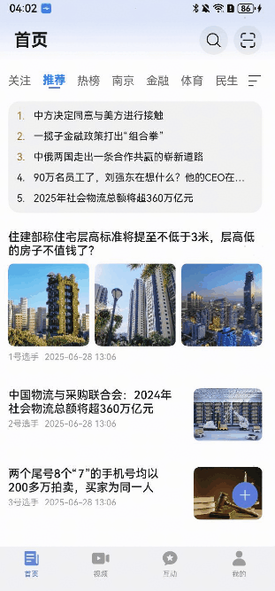

# 一镜到底组件快速入门

 ## 目录

- [简介](#简介)
- [约束与限制](#约束与限制)
- [快速入门](#快速入门)
- [API参考](#API参考)
- [示例代码](#示例代码)

## 简介

  本组件支持卡片展开、搜索、查看大图一镜到底效果。

  

## 约束与限制

### 环境

  - DevEco Studio版本：DevEco Studio 5.0.3 Release及以上
  - HarmonyOS SDK版本：HarmonyOS 5.0.3 Release SDK及以上
  - 设备类型：华为手机（包括双折叠和阔折叠）、平板
  - 系统版本：HarmonyOS 5.0.1(13)及以上

### 权限

- 网络权限：ohos.permission.INTERNET

## 快速入门

1. 安装组件。

   如果是在DevEco Studio使用插件集成组件，则无需安装组件，请忽略此步骤。

   如果是从生态市场下载组件，请参考以下步骤安装组件。

   a. 解压下载的组件包，将包中所有文件夹拷贝至您工程根目录的XXX目录下。

   b. 在项目根目录build-profile.json5添加module_transition模块。

   ```
   // 项目根目录下build-profile.json5填写module_transition路径。其中XXX为组件存放的目录名
   "modules": [
     {
       "name": "module_transition",
       "srcPath": "./XXX/module_transition"
     }
   ]
   ```

   c. 在项目根目录oh-package.json5添加依赖。

   ```
   // XXX为组件存放的目录名称
   "dependencies": {
     "module_transition": "file:./XXX/module_transition"
   }
   ```

2. 集成步骤

   在EntryAbility.ets的onWindowStageCreate函数中添加如下调用：
   
      ```typescript
     onWindowStageCreate(windowStage: window.WindowStage): void {
          ...
          LoneTakeAnimationsTransition.init(windowStage);
          ...
        }
      ```
   
   Navigation组件修改
   
   ```typescript
   Navigation(RouterUtils.getStack()) {
   }
   .hideNavBar(true)
   .enabled(this.isEnabled)
   .hideTitleBar(true)
   .customNavContentTransition((from: NavContentInfo, to: NavContentInfo, operation: NavigationOperation) => {
     return LoneTakeAnimationsTransition.customNavContentTransition(from, to, operation, {
       // 自定义转场过程中禁用手势，避免出现体验问题
       onTransitionStart: () => {
         this.isEnabled = false;
       },
       onTransitionEnd: () => {
         this.isEnabled = true;
       }
     });
   })
   ```
   
   触发页的修改,路由集成
   
   ```typescript
   // 在点击触发页的组件后，通过generateLongTakeParam接口创建LongTakeTransitionParam对象
   let longTakeTransitionParam: LongTakeTransitionParam | undefined =
     LoneTakeAnimationsTransition.generateLongTakeParam(this.uiContext,
       componentId ??
         'news_flow_' + cardData.extraInfo.channelId + '_' + cardData.extraInfo.flowIndex + '_' +
         cardData.extraInfo.flexId, 9);
   if (longTakeTransitionParam) {
     params.longTakeTransitionParam = longTakeTransitionParam;
   }
   RouterToNews.pushToNewsDetails<NewsResponse>(params)
   ```
   
   目标页的修改
   
   ```typescript
   NavDestination() {
     if (this.longTakeSession) {
       CardLongTakeDelegate({
         longTakeSession: this.longTakeSession,
         contentBuilder: (): void => {
           this.ContentBuilder()
         },
       })
     } else {
       this.ContentBuilder()
     }
   }
   .backgroundColor(this.longTakeSession.navDestinationBgColor)
   .hideTitleBar(true)
   .id('ArticleFeedDetails')
   .onSizeChange((oldValue: SizeOptions, newValue: SizeOptions) => {
     this.longTakeSession.setNewSize(newValue);
   })
   .onReady((navDestContext: NavDestinationContext) => {
     let param = navDestContext.pathInfo?.param as Record<string, Object>;
       let longTakeTransitionParam = param.longTakeTransitionParam as LongTakeTransitionParam;
       if (longTakeTransitionParam) {
         longTakeSession.init(navDestContext, longTakeTransitionParam, {
           pop: () => {
             navDestContext.pathStack.pop()
           },
         });
       }
   })
   ```

3. 引入组件。

   ```
   import { CardLongTakeDelegate,ImageLongTakeDelegate } from 'module_transition';
   ```

4. 调用组件，详细组件调用参见[示例代码](#示例代码)。

## API参考

### 接口

CardLongTakeDelegate(option: [LongTakeTransitionDelegateOptions](#LongTakeTransitionDelegateOptions对象说明))

一镜到底组件的参数

**参数：**

| 参数名  | 类型                                                         | 是否必填 | 说明                     |
   | ------- | ------------------------------------------------------------ | -------- | ------------------------ |
| options | [LongTakeTransitionDelegateOptions](#LongTakeTransitionDelegateOptions对象说明) | 否       | 配置一镜到底组件的参数。 |

#### LongTakeTransitionDelegateOptions对象说明

| 参数名          | 类型                                                         | 是否必填 | 说明               |
   | --------------- | ------------------------------------------------------------ | -------- | ------------------ |
| contentBuilder  | CustomBuilder                                                | 是       | 一镜到底自定义组件 |
| longTakeSession | [LongTakeAnimationProperties](#LongTakeAnimationProperties对象说明) | 是       | 一镜到底配置       |

#### LongTakeAnimationProperties对象说明

| 参数名                    | 类型                      | 是否必填 | 说明                                                |
   | ------------------------- |-------------------------| -------- | --------------------------------------------------- |
| navDestinationBgColor     | ResourceColor           | 否       | 导航目标页面的背景色 |
| snapShotOpacity           | number                  | 否       | 快照（页面截图 / 预览图）的透明度 |
| postPageOpacity           | number                  | 否       | 目标页面（跳转后页面）的透明度|
| translateX                | number                  | 否       | 横向平移距离 |
| translateY                | number                  | 否       | 纵向平移距离|
| scaleValue                | number                  | 否       | 缩放比例值|
| clipWidth                 | Dimension               | 否       | 裁剪区域的宽度|
| clipHeight                | Dimension               | 否       | 裁剪区域的高度 |
| radius                    | number                  | 否       | 圆角半径|
| positionXValue            | number                  | 否       | X 轴位置值|
| positionYValue            | number                  | 否       | Y 轴位置值|
| navDestSize               | SizeOptions             | 否       | 导航目标页面的尺寸配置|
| snapShotSize              | SizeOptions             | 否       | 快照（页面截图 / 预览图）的尺寸配置|
| snapShotPositionX         | number                  | 否       | 快照的 X 轴位置|
| snapShotPositionY         | number                  | 否       | 快照的 Y 轴位置|
| options                   | LongTakeSessionOptions  | 否       | 一镜到底会话的全局配置选项|
| type                      | LongTakeTransitionType  | 否       | 一镜到底过渡动画的类型|
| finalBgColor              | ResourceColor           | 否       | 过渡动画结束后目标页面的最终背景色|
| animationCount            | number                  | 否       | 动画执行的次数|
| initScale                 | number                  | 否       | 初始缩放比例|
| initTranslateX            | number                  | 否       | 初始横向平移距离|
| initTranslateY            | number                  | 否       | 初始纵向平移距离|
| initClipWidth             | Dimension               | 否       | 初始裁剪宽度|
| initClipHeight            | Dimension               | 否       | 初始裁剪高度|
| initPositionValueX        | number                  | 否       | 初始 X 轴位置值|
| initPositionValueY        | number                  | 否       | 初始 Y 轴位置值|
| cardItemInfoPx            | RectInfoPx              | 否       | 卡片类组件的信息区域像素值|
| postPageSharedComponentId | string                  | 否       | 目标页面共享组件的唯一标识 ID|
| navPathStack              | NavPathStack            | 否       | 导航路径栈|
| transitionParam           | LongTakeTransitionParam | 否       | 过渡动画的参数集合|


## 示例代码

### 运行配置（以示例1举例，示例2同理）
```typescript
// 在项目src/main/resources/base/profile目录下新建route_map.json文件
{
  "routerMap": [
    {
      "name": "CardLongTakePageOne",
      "pageSourceFile": "src/main/ets/pages/CardLongTakePageOne.ets",
      "buildFunction": "CardLongTakePageOneBuilder",
      "data": {
        "description": "this is CardLongTakePageOne"
      }
    },
    {
      "name": "CardLongTakePageTwo",
      "pageSourceFile": "src/main/ets/pages/CardLongTakePageTwo.ets",
      "buildFunction": "CardLongTakePageTwoBuilder"
    }
  ]
}
```

```typescript
// 在src/main/module.json5中集成routerMap
{
  "module": {
    ....
    "routerMap": "$profile:route_map"
    ...
  }
}
```

### 示例1（卡片一镜到底）
```typescript
// index.ets
import { LoneTakeAnimationsTransition } from 'module_transition';

@Entry
@ComponentV2
struct Index {
  private pageInfos: NavPathStack = new NavPathStack();

   @Local isEnabled: boolean = true;

  aboutToAppear(): void {
    this.pageInfos.replacePath({ name: 'CardLongTakePageOne' });
  }

  build() {
    Navigation(this.pageInfos)
      .hideNavBar(true)
      .customNavContentTransition((from: NavContentInfo, to: NavContentInfo, operation: NavigationOperation) => {
        return LoneTakeAnimationsTransition.customNavContentTransition(from, to, operation, {
          // 自定义转场过程中禁用手势，避免出现体验问题
          onTransitionStart: () => {
            this.isEnabled = false;
          },
          onTransitionEnd: () => {
            this.isEnabled = true;
          }
        });
      })
      .enabled(this.isEnabled)
  }
}
```

```typescript
 // CardLongTakePageOne.ets
  import { LoneTakeAnimationsTransition, LongTakeTransitionParam } from 'module_transition';

  const TAG: string = 'CardLongTakePageOne';

  const RADIUS: number = 9;

  @Builder
  export function CardLongTakePageOneBuilder() {
    CardLongTakePageOne();
  }

  @ComponentV2
  export struct CardLongTakePageOne {
     private pageInfos: NavPathStack = new NavPathStack();
  
     build() {
        NavDestination() {
           Home({
              pageInfos: this.pageInfos,
           })
        }
        .title('卡片一镜到底首页')
           .onReady((context: NavDestinationContext) => {
              this.pageInfos = context.pathStack;
           })
     }
  }
  
  @ComponentV2
  struct Home {
     @Param pageInfos: NavPathStack = new NavPathStack();
     @Local dataSource: number[] = []
     @Local columnWidth: number = 0;
     @Local columnType: string = '';
  
     aboutToAppear(): void {
        for (let i = 0; i < 100; i++) {
        this.dataSource.push(i);
     }
  }
  
  private onColumnClicked(indexValue: string, snapShotComponentId: string): void {
       let param: Record<string, Object> = {};
      let clickedIndex = parseInt(indexValue);
      param['indexValue'] = clickedIndex;
      param['snapShotId'] = snapShotComponentId;
      
      let longTakeTransitionParam: LongTakeTransitionParam | undefined =
         LoneTakeAnimationsTransition.generateLongTakeParam(this.getUIContext(), snapShotComponentId, RADIUS);
      if (longTakeTransitionParam) {
         param['longTakeTransitionParam'] = longTakeTransitionParam;
      }
      this.pageInfos.pushPath({ name: 'CardLongTakePageTwo', param: param })
  }
  
  @Builder
  cardBuilder(item: number) {
     Row({ space: 20 }) {
        Image($r('app.media.startIcon'))
           .height(80)
           .width(80)
        Text(item.toString())
     }
     .width('100%')
        .height('100%')
        .justifyContent(FlexAlign.Center)
        .backgroundColor($r('sys.color.background_secondary'))
  }
  
  build() {
     Stack() {
        WaterFlow() {
           ForEach(this.dataSource, (item: number, index: number) => {
              FlowItem() {
                 Column() {
                    this.cardBuilder(item)
                 }
                 .width('100%')
                    .height(200)
              }
              .borderRadius(RADIUS)
                 .onClick(() => {
                    this.onColumnClicked(index.toString(), 'demo_' + index)
                 })
                 .clip(true)
                 .id('demo_' + index)
           }, (item: string) => item)
        }
        .columnsTemplate(this.columnType)
           .columnsGap(5)
           .rowsGap(5)
           .width('100%')
           .height('100%')
     }
     .size({ width: '100%', height: '100%' })
        .padding({ left: 10, right: 10 })
  }
  }
   ```

```typescript
// CardLongTakePageTwo.ets
import { LongTakeAnimationProperties, CardLongTakeDelegate, LongTakeTransitionParam } from 'module_transition';

@Builder
export function CardLongTakePageTwoBuilder() {
   CardLongTakePageTwo();
}

@ComponentV2
export struct CardLongTakePageTwo {
   @Local indexValue: number = -1;
   @Local pageInfos: NavPathStack = new NavPathStack();
   @Local longTakeSession: LongTakeAnimationProperties = new LongTakeAnimationProperties();
   @Local longTakeTransitionParam: LongTakeTransitionParam | undefined = undefined;

   private onBackPressed(): boolean {
      this.pageInfos.pop();
      return true;
   }

   @Builder
   ContentBuilder() {
      Column({ space: 50 }) {
         Image($r('app.media.startIcon')).width(200).height(200)
         Text(this.indexValue.toString())
      }
      .height('100%')
         .width('100%')
         .backgroundColor($r('sys.color.background_primary'))
         .expandSafeArea([SafeAreaType.SYSTEM], [SafeAreaEdge.TOP,SafeAreaEdge.BOTTOM])
   }

   build() {
      NavDestination() {
         CardLongTakeDelegate({
            longTakeSession: this.longTakeSession,
            contentBuilder: (): void => {
               this.ContentBuilder()
            },
         })
      }
      // 弹出页需要修改navDestination的背景颜色为session中的值
      .backgroundColor(this.longTakeSession.navDestinationBgColor)
         .onSizeChange((oldValue: SizeOptions, newValue: SizeOptions) => {
            this.longTakeSession.setNewSize(newValue);
         })
         .expandSafeArea([SafeAreaType.SYSTEM], [SafeAreaEdge.TOP,SafeAreaEdge.BOTTOM])
         .hideTitleBar(true)
         .onReady((navDestContext: NavDestinationContext) => {
            this.pageInfos = navDestContext.pathStack;
            console.log(JSON.stringify(navDestContext.pathStack.getAllPathName()), 'RouterUtils.getStack()')
            let param = navDestContext.pathInfo?.param as Record<string, Object>;
            this.indexValue = param['indexValue'] as number;
            this.longTakeTransitionParam = param['longTakeTransitionParam'] as LongTakeTransitionParam;
            if (this.longTakeTransitionParam) {
               this.longTakeSession.init(navDestContext, this.longTakeTransitionParam, {
                  pop: () => {
                     this.pageInfos.pop()
                  },
               });
            }
         })
         .onBackPressed(() => {
            return this.onBackPressed();
         })
   }
}
```

### 示例2（图片一镜到底）
```ts
// index.ets
import { LoneTakeAnimationsTransition } from 'module_transition';

@Entry
@ComponentV2
struct Index {
  private pageInfos: NavPathStack = new NavPathStack();

  @Local isEnabled: boolean = true;

  aboutToAppear(): void {
    this.pageInfos.replacePath({ name: 'ImageLongTakePageOne' });
  }

  build() {
    Navigation(this.pageInfos)
      .hideNavBar(true)
      .customNavContentTransition((from: NavContentInfo, to: NavContentInfo, operation: NavigationOperation) => {
        return LoneTakeAnimationsTransition.customNavContentTransition(from, to, operation, {
          // 自定义转场过程中禁用手势，避免出现体验问题
          onTransitionStart: () => {
            this.isEnabled = false;
          },
          onTransitionEnd: () => {
            this.isEnabled = true;
          }
        });
      })
      .enabled(this.isEnabled)
  }
}
```

```ts
import { LoneTakeAnimationsTransition, LongTakeTransitionParam } from 'module_transition';
const RADIUS: number = 9;

@Builder
export function ImageLongTakePageOneBuilder() {
  ImageLongTakePageOne();
}

@ComponentV2
export struct ImageLongTakePageOne {
  private pageInfos: NavPathStack = new NavPathStack();

  build() {
    NavDestination() {
      Home({
        pageInfos: this.pageInfos,
      })
    }
    .title('图片一镜到底首页')
    .onReady((context: NavDestinationContext) => {
      this.pageInfos = context.pathStack;
    })
  }
}

@ComponentV2
struct Home {
  @Param pageInfos: NavPathStack = new NavPathStack();
  @Local clickedIndex:number = 0
  @Local componentId:string = 'demo_image'
  @Local isFirstPageShow: boolean = true;
  @Local dataSource: string[] = [
    'https://agc-storage-drcn.platform.dbankcloud.cn/v0/news-hnp2d/news_tra_2.jpg',
    'https://agc-storage-drcn.platform.dbankcloud.cn/v0/news-hnp2d/news_tra_3.jpg',
    'https://agc-storage-drcn.platform.dbankcloud.cn/v0/news-hnp2d/news_tra_4.jpg',
    'https://agc-storage-drcn.platform.dbankcloud.cn/v0/news-hnp2d/news_tra_5.jpg',
    'https://agc-storage-drcn.platform.dbankcloud.cn/v0/news-hnp2d/news_tra_6.jpg',
    'https://agc-storage-drcn.platform.dbankcloud.cn/v0/news-hnp2d/news_tra_7.jpg',
    'https://agc-storage-drcn.platform.dbankcloud.cn/v0/news-hnp2d/news_tra_8.jpg',
    'https://agc-storage-drcn.platform.dbankcloud.cn/v0/news-hnp2d/news_tra_9.jpg',
    'https://agc-storage-drcn.platform.dbankcloud.cn/v0/news-hnp2d/news_tra_10.jpg',
  ]

  onIndexChange(index: number): void {
    this.clickedIndex = index;
  }

  onBack(): void {
    this.isFirstPageShow = true;
  }


  build() {
    Column() {
      Grid() {
        ForEach(this.dataSource,
          (item: string, index: number) => {
            GridItem() {
              if (this.clickedIndex !== index || (this.isFirstPageShow)) {
                Stack({ alignContent: Alignment.BottomEnd }) {
                  Image(item)
                    .objectFit(ImageFit.Cover)
                    .borderRadius(12)
                    .clip(true)
                    .aspectRatio(1)
                    .geometryTransition(item + this.componentId)
                    .transition(TransitionEffect.opacity(0.99))
                    .onClick(() => {
                      let param: Record<string, Object> = {};
                      /*
                       * 实际携带的transitionId需要全局唯一且保持一致
                      */
                      param.componentId = this.componentId
                      param.imageList = this.dataSource
                      this.clickedIndex = index;
                      param.selectedIndex = this.clickedIndex;
                      param.onBackToFirstPage = () => {
                        this.onBack();
                      }
                      param.onIndexChange = (index: number) => {
                        this.onIndexChange(index);
                      };
                      this.getUIContext().animateTo({
                        duration: 150,
                        curve: Curve.EaseIn,
                      }, () => {
                        this.pageInfos.pushPathByName('ImageLongTakePageTwo',param,() => {},false)
                      })
                      this.isFirstPageShow = false;
                    })
                }
              }
            }
          }, (item: string) => JSON.stringify(item))
      }
      .columnsTemplate('1fr '.repeat(3))
      .columnsGap(8)
    }
  }
}
```

```ts
import {
  ImageLongTakeDelegate} from 'module_transition';

@Builder
export function ImageLongTakePageTwoBuilder() {
  ImageLongTakePageTwo();
}

@ComponentV2
export struct ImageLongTakePageTwo {
  @Local componentId:string = ''
  @Local imageList:string[] = []
  @Local pageInfos: NavPathStack = new NavPathStack();
  private onIndexChange: (index: number) => void = (_index: number) => {}
  @Local selectedIndex: number = 0;
  private onFirstPageShow: () => void = () => {};
  backToFirstPage: () => void = () => {
    animateTo({
      duration: 200,
      curve: Curve.EaseIn,
    }, () => {
      this.onFirstPageShow();
      this.pageInfos.pop(false);
    })
  }

  build() {
    NavDestination() {
      Swiper() {
        ForEach(this.imageList, (item: string, index: number) => {
          ImageLongTakeDelegate({
            componentId: this.componentId,
            imageUrl: item,
            backToFirstPage: () => {
              this.backToFirstPage()
            },
          })
        }, (item: string) => item)
      }
      .transition(TransitionEffect.opacity(0.99))
      .width('100%')
      .height('100%')
      .clip(false)
      .index(this.selectedIndex)
      .onChange((index: number) => {
        this.selectedIndex = index;
        this.onIndexChange(index);
      })
      .onAnimationStart((_: number, targetIndex: number) => {
        this.onIndexChange(targetIndex);
      })
      .indicator(false)
    }
    .mode(NavDestinationMode.DIALOG)
    .expandSafeArea([SafeAreaType.SYSTEM], [SafeAreaEdge.TOP,SafeAreaEdge.BOTTOM])
    .hideTitleBar(true)
    .onBackPressed(() => {
      this.backToFirstPage();
      return true;
    })
    .transition(TransitionEffect.opacity(0.99))
    .onReady((navDestContext: NavDestinationContext) => {
      this.pageInfos = navDestContext.pathStack;
      let param = navDestContext.pathInfo?.param as Record<string, Object>;
      this.componentId = param.componentId as string
      this.imageList = param.imageList as string[]
      this.selectedIndex = param.selectedIndex as number
      this.onFirstPageShow = param.onBackToFirstPage as () => void;
      this.onIndexChange = param.onIndexChange as (index: number) => void;
    })
  }
}
```