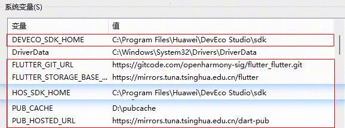
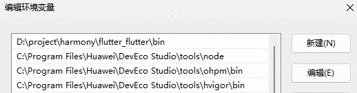
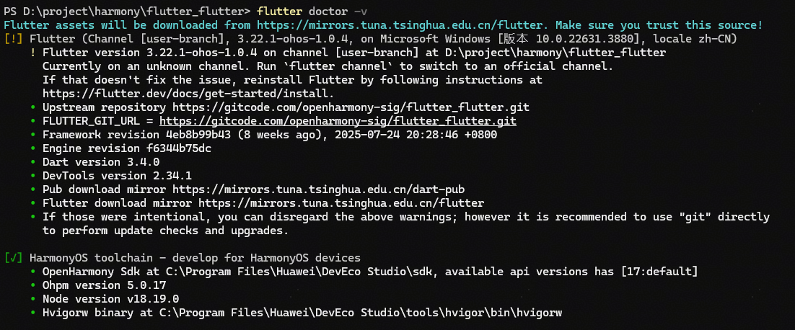

# 新闻（Flutter政务资讯）应用模板快速入门

## 目录

- [功能介绍](#功能介绍)
- [约束和限制](#约束和限制)
- [快速入门](#快速入门)
- [示例效果](#示例效果)
- [开源许可协议](#开源许可协议)
- [参考文档](#参考文档)

## 功能介绍

本模板是一个基于 Flutter 实现的政务帮办资讯类新闻模板，模板主要分为政务、问政和帮办三个模块：

- 政务：展示政务号新闻内容和推荐关注的政务号。
- 帮办：展示政府帮办事务进展信息列表。
- 问政：展示政务部门列表和问政事务信息，并支持搜索和部门选择。

| 政务（首页）                                       | 帮办                                           | 问政                                           |
|----------------------------------------------|----------------------------------------------|----------------------------------------------|
|  |  |  |

本模板主要页面及核心功能如下所示：

```ts
政务帮办资讯类新闻模板
├── 首页
│   ├── 政务标签页
│   │   ├── 推荐政务新闻列表
│   │   ├── 推荐关注横向滑动列表
│   │   └── 其他政务新闻列表
│   └── 其他标签页
├── 帮办
│   ├── 帮办图片展示
│   └── 政府帮办事务列表
└── 问政
    ├── 政务部门横向滑动列表
    ├── 发布和搜索按钮
    └── 问政事务信息
```

本模板工程代码结构如下所示：

```ts
├── lib /                                           // flutter代码目录
│   ├── constants.dart                             // 常量文件
│   ├── home_screen.dart                           // 导航栏主页面
│   ├── main.dart                                  // 程序入口
│   ├── data /                                      // 模拟数据
│   │   └── mock_data.dart
│   ├── models /
│   │   ├── account_model.dart                     // 账号模型
│   │   ├── post_model.dart                        // 发布模型
│   │   └── task_model.dart                        // 任务模型
│   ├── pages /
│   │   ├── assistant_page.dart                    // 帮办页面
│   │   ├── home_page.dart                         // 首页
│   │   ├── question_page.dart                     // 问政页面
│   │   └── others
│   │       ├── recommended_accounts_page.dart     // 推荐账号页面
│   │       ├── search_page.dart                   // 搜索页
│   │       └── select_department_page.dart        // 部门选择页
│   ├── utils /     
│   │   └── time_formatter.dart                    // 时间转换工具类
│   └── widgets /
│       ├── custom_tab_indicator.dart              // 自定义标签组件
│       ├── follow_button.dart                     // 关注组件
│       ├── recommended_section.dart               // 推荐区组件
│       ├── bar /  
│       │   ├── account_follow_bar.dart            // 账号关注横条
│       │   ├── custom_app_bar.dart                // 自定义应用横条
│       │   ├── home_app_bar.dart                  // 首页应用横条
│       │   ├── home_tab_bar.dart                  // 首页标签横条
│       │   └── publish_search_bar.dart            // 发布搜索横条
│       ├── cards /                                 
│       │   ├── account_horizontal_card.dart       // 账号竖向卡片
│       │   ├── assistant_item_card.dart           // 帮办事务卡片
│       │   ├── department_card.dart               // 部门卡片
│       │   └── question_card.dart                 // 问政信息卡片
│       └── list /
│           ├── department_list.dart               // 部门列表
│           ├── news_list.dart                     // 新闻列表
│           └── question_list.dart                 // 问政列表
├── assets /                                        // 资源文件
│   ├── images /                                    // 图片资源
│   │   ├── account.png
│   │   └── information.jpg
│   └─string.json                                  // 组件模板身份标识
├── ohos /                                          // openHarmony工程目录，只有entry    
└── pubspec.yaml                                   // flutter项目配置文件
```

## 约束和限制

### 环境

- DevEco Studio版本：DevEco Studio 5.0.5 Release及以上
- HarmonyOS SDK版本：HarmonyOS 5.0.5 Release SDK及以上
- 设备类型：华为手机（包括双折叠和阔折叠）
- 系统版本：HarmonyOS 5.0.5(17)及以上
- Flutter SDK版本：基于Flutter 3.22.0适配的OpenHarmony发行版本，tag:3.22-ohos-1.0.1

### 权限

- 网络权限：ohos.permission.INTERNET

## 快速入门

### 配置工程

#### 配置环境

以下环境变量配置，类似Unix系统（Linux、Mac），可参照配置，Windows下环境变量配置请在“编辑系统环境变量”中设置。

1. 配置HarmonyOS环境变量 (HarmonyOS SDK、node、ohpm、hvigor)。
    ```sh
    export TOOL_HOME=/Applications/DevEco-Studio.app/Contents # mac环境
    export DEVECO_SDK_HOME=$TOOL_HOME/sdk 
    export PATH=$TOOL_HOME/tools/ohpm/bin:$PATH 
    export PATH=$TOOL_HOME/tools/hvigor/bin:$PATH 
    export PATH=$TOOL_HOME/tools/node/bin:$PATH
    ```
   在 Windows 上还需要配置一个名为HOS_SDK_HOME的系统变量，值为DevEco Studio sdk的安装路径，示例如下：
   
   


2. 通过代码工具下载flutter sdk仓库代码，tag为`3.22.1-ohos-1.0.1`。

   ```sh
    git clone -b 3.22.1-ohos-1.0.1 https://gitcode.com/openharmony-tpc/flutter_flutter.git
   ```

   并配置如下环境：

   ```sh
    export PUB_CACHE=D:/PUB(自定义路径)
    export PATH=<flutter_flutter path>/bin:$PATH
    export FLUTTER_GIT_URL=https://gitcode.com/openharmony-tpc/flutter_flutter.git
    export PUB_HOSTED_URL=https://pub.flutter-io.cn #国内的镜像，也可以使用其他镜像，比如清华镜像源
    export FLUTTER_STORAGE_BASE_URL=https://storage.flutter-io.cn #国内的镜像，也可以使用其他镜像，比如清华镜像源
   ```
   Windows 环境变量配置示例如下（请按照实际安装目录配置）：
    - 系统变量

      
    - 环境变量

      

#### 检查环境

运行 `flutter doctor -v` 检查环境变量配置是否正确，**Futter**与**OpenHarmony**应都为ok标识，若两处提示缺少环境，按提示补充相应环境即可（
**Futter**处为感叹号标识无影响）。



### 运行调试工程

#### 方式一：基于本flutter工程直接运行

1. 进入本模板的flutter工程目录，通过终端执行`flutter pub get`和`flutter build hap`。
2. 通过DevEco Studio打开工程目录中`ohos`工程，连接模拟器或者真机，手工配置签名。
3. 在flutter工程目录或者子目录`ohos`中，通过`flutter devices`指令发现ohos设备。
4. 在flutter工程目录中，通过`flutter run -d <device-id>`指令运行调试，也可以通过DevEco Studio点击Run运行ohos工程（适合真机，模拟器不适用）。

#### 方式二：创建flutter工程运行

1. 创建工程。

   ```
   # 创建工程，工程名支持小写和下划线
   flutter create --platforms ohos <projectName>
   ```
2. 拷贝flutter工程内容和配置身份标识。

   将本模板flutter工程中`lib`、`assets`、`pubspec.yaml`等文件拷贝到当前新建工程中，并且将身份标识`assets/string.json`
   文件中的内容，附加在当前新建工程的文件`ohos/entry/src/main/resources/base/element/string.json`中。
3. 编译运行。

   在当前新建的flutter工程目录下，编译运行的详细步骤请参考 [运行调试工程](#运行调试工程) 的方式一。

## 示例效果

[功能展示录屏](screenshots/功能展示录屏.mp4)

## 开源许可协议

该代码经过[Apache 2.0 授权许可](http://www.apache.org/licenses/LICENSE-2.0)。

## 参考文档

[OpenHarmony Flutter SDK开发文档](https://gitcode.com/openharmony-tpc/flutter_flutter/blob/3.22.1-ohos-1.0.1/README.md)

[鸿蒙版Flutter环境搭建指导](https://gitcode.com/openharmony-tpc/flutter_samples/blob/master/ohos/docs/03_environment/openHarmony-flutter%E7%8E%AF%E5%A2%83%E6%90%AD%E5%BB%BA%E6%8C%87%E5%AF%BC.md)