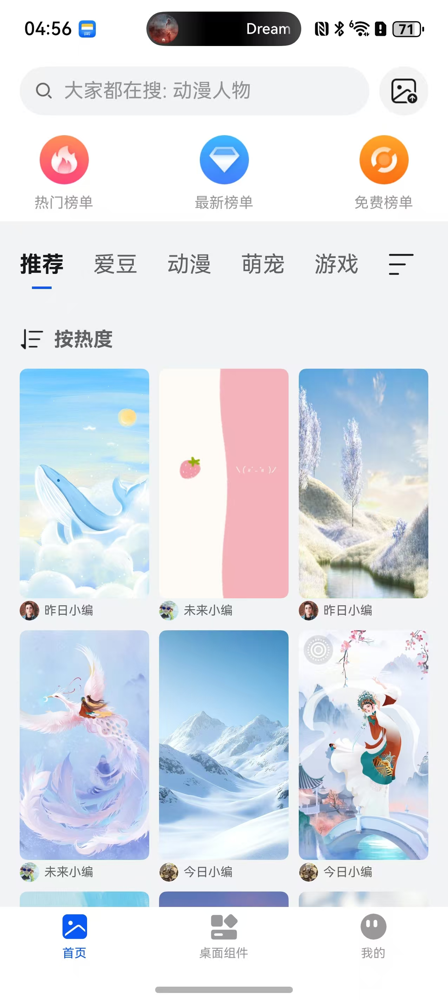
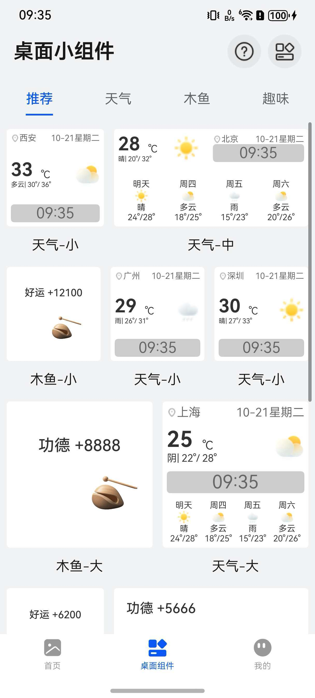
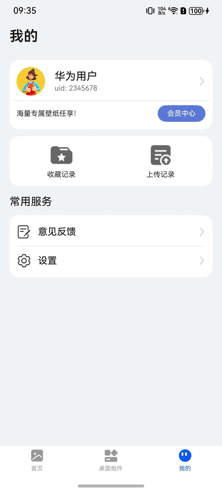

# 主题（壁纸）应用模板快速入门

## 目录
- [功能介绍](#功能介绍)
- [约束与限制](#约束与限制)
- [快速入门](#快速入门)
- [示例效果](#示例效果)
- [开源许可协议](#开源许可协议)

## 功能介绍

您可以基于此模板直接定制应用，也可以挑选此模板中提供的多种组件使用，从而降低您的开发难度，提高您的开发效率。

此模板提供如下组件，所有组件存放在工程根目录的components下，如果您仅需使用组件，可参考对应组件的指导链接；如果您使用此模板，请参考本文档。

| 组件                               | 描述                              | 使用指导                                     |
| -------------------------------- | ------------------------------- | :--------------------------------------- |
| 壁纸详情组件（module_wallpaper_details） | 支持壁纸详情展示、收藏、预览、下载及设为壁纸功能        | [使用指导](components/module_wallpaper_details/README.md) |
| 城市管理组件（module_city_manage）       | 支持城市的自动定位和刷新功能                  | [使用指导](components/module_city_manage/README.md) |
| 天气组件（module_weather_core）        | 支持浏览实时天气、24小时天气、15天天气和生活指数的相关能力 | [使用指导](components/module_weather_core/README.md) |
| 图片预览组件（module_imagepreview）      | 支持预览图片、双指放大、缩小，滑动预览             | [使用指导](components/module_imagepreview/README.md) |
| 上传菜谱组件（upload_recipe）            | 支持图片、视频上传功能                     | [使用指导](components/upload_recipe/README.md) |
| 会员中心组件（vip_center）               | 支持显示会员中心功能                      | [使用指导](components/vip_center/README.md)  |

本模板为壁纸类应用提供了常用功能的开发样例，模板主要分首页、桌面小组件和我的三大模块：

* 首页：提供壁纸搜索、壁纸榜单排序、壁纸上传、壁纸分类等功能。

* 桌面小组件：提供 组件分类、组件使用教程、我的组件等功能。

* 我的：提供个人主页查看、收藏记录、上传记录、会员中心、意见反馈、设置等功能。

本模板已集成华为账号、微信登录等服务，只需做少量配置和定制即可快速实现华为账号的登录、壁纸等功能。

| 首页                                       | 桌面小组件                                    | 我的                                       |
| ---------------------------------------- | ---------------------------------------- | :--------------------------------------- |
|  |  |  |

本模板主要页面及核心功能如下所示：

```text
壁纸模板
  ├──首页                           
  │   ├──顶部栏-搜索  
  │   │   ├── 壁纸搜索                          
  │   │   └── 上传壁纸                      
  │   │                    
  │   ├──壁纸榜单    
  │   │   ├── 热门榜单                                              
  │   │   ├── 最新榜单                                              
  │   │   └── 免费榜单
  │   │
  │   ├──壁纸分类    
  │   │   ├── 一级分类                                             
  │   │   ├── 二级分类                         
  │   │   ├── 最热壁纸                         
  │   │   └── 最新壁纸 
  │   │
  │   └──壁纸详情    
  │       ├── 展示个人头像                         
  │       ├── 展示个人名称
  │       ├── 展示壁纸分类    
  │       ├── 动态壁纸    
  │       ├── 壁纸效果图预览                     
  │       ├── 展示壁纸关键词                         
  │       ├── 收藏/取消收藏                         
  │       ├── 全屏预览                         
  │       ├── 下载壁纸                         
  │       ├── 壁纸左右切换                         
  │       └── 设为壁纸 
  │
  ├──桌面小组件                           
  │   ├──顶部栏 
  │   │    ├── 教程                         
  │   │    └── 我的组件 
  │   │          ├── 编辑
  │   │          ├── 删除
  │   │          └── 添加到桌面                   
  │   │         
  │   ├──桌面小组件分类  
  │   │    ├── 推荐 
  │   │    ├── 天气  
  │   │    ├── 木鱼                          
  │   │    └── 趣味  
  │   └──组件详情  
  │        ├──天气组件详情 
  │        │     ├── 地区  
  │        │     ├── 背景
  │        │     ├── 字体
  │        │     ├── 预览
  │        │     └── 添加到我的组件
  │        └── 木鱼组件详情                          
  │              ├── 自定义内容  
  │              ├── 点击音效  
  │              ├── 背景
  │              ├── 字体
  │              ├── 预览
  │              └── 添加到我的组件
  │                              
  └──我的                           
      ├──登录  
      │   ├── 华为账号一键登录                          
      │   ├── 微信登录                                                   
      │   ├── 账密登录
      │   └── 用户隐私协议同意                       
      │         
      ├──个人主页         
      │   └── 头像、昵称、uid
      │                    
      ├──收藏记录    
      │   ├── 分类                                        
      │   ├── 关键词  
      │   ├── 支持编辑                    
      │   └── 收藏时间
      │                    
      ├──上传记录    
      │   ├── 分类                                        
      │   ├── 关键词  
      │   ├── 支持编辑                  
      │   └── 上传时间
      │
      └──常用服务    
          ├── 意见反馈                   
          └── 设置
               ├── 动态壁纸背景音乐开关  
               ├── 清理缓存           
               ├── 关于我们 
               └── 退出登录                               
```

本模板工程代码结构如下所示：

```text
wallpaper
├──commons
│  ├──lib_account/src/main/ets                            // 账号登录模块             
│  │    ├──components
│  │    │   └──AgreePrivacyBox.ets                        // 隐私同意勾选       
│  │    │     
│  │    ├──constants  
│  │    │   ├──Constants.ets                              // 常量值
│  │    │   ├──ErrorCode.ets                              // 异常码
│  │    │   └──Types.ets                                  // 跳转登录路由参数
│  │    │
│  │    ├──pages  
│  │    │   ├──HuaweiLoginPage.ets                        // 华为账号登录页面
│  │    │   ├──OtherLoginPage.ets                         // 其他方式登录页面
│  │    │   └──ProtocolWebView.ets                        // 协议H5   
│  │    │               
│  │    └──utils  
│  │        ├──HuaweiAuthUtils.ets                        // 华为认证工具类
│  │        ├──LoginSheetUtils.ets                        // 统一登录半模态弹窗
│  │        └──WXApiUtils.ets                             // 微信登录事件处理类 
│  │
│  ├──lib_common/src/main/ets                             // 基础模块             
│  │    ├──constants                                      // 通用常量 
│  │    ├──datasource                                     // 懒加载数据模型
│  │    ├──dialogs                                        // 通用弹窗 
│  │    ├──models                                         // 状态观测模型
│  │    └──utils                                          // 通用方法     
│  │        
│  ├──lib_product_search/src/main/ets                     // 搜索模块 
│  │    ├──commons                                        // 公共常量 
│  │    ├──components                                     // 自定义组件 
│  │    ├──controller                                     // 搜索控制器
│  │    ├──data                                           // mock数据 
│  │    ├──https                                          // 网络请求
│  │    ├──utils                                          // 通用方法
│  │    ├──viewmodels                                     // 搜索逻辑处理类
│  │    └──views                                          // 通用方法
│  │ 
│  ├──lib_wallpaper_api/src/main/ets                      // 服务端api模块             
│  │    ├──database                                       // 数据库 
│  │    ├──observedmodels                                 // 状态模型  
│  │    ├──params                                         // 请求响应参数 
│  │    ├──services                                       // 服务api  
│  │    └──utils                                          // 工具utils  
│  │ 
│  └──lib_widget/src/main/ets                             // 通用UI模块             
│       └──components
│           ├──CustomBadge.ets                            // 自定义信息标记组件
│           ├──EmptyBuilder.ets                           // 空数据组件
│           └──NavHeaderBar.ets                           // 自定义标题栏
│           ├──WallpaperList.ets                          // 壁纸列表
│           └──WallpaperListItem.ets                      // 壁纸列表项
│
├──components   
│  ├──aggregated_payment                                  // 支付组件
│  ├──base_apis                                           // 集成能力组件
│  ├──module_city_manage                                  // 城市管理组件
│  ├──feedback                                            // 意见反馈组件 
│  ├──module_imagepreview                                 // 图片预览组件
│  ├──upload_recipe                                       // 上传壁纸组件
│  ├──vip_center                                          // 会员中心组件  
│  ├──module_wallpaper_details                            // 壁纸详情组件
│  ├──module_waterflow                                    // 桌面小组件破布流组件
│  └──module_weather_core                                 // 天气小组件
│     
├──features
│  ├──business_desktop/src/main/ets                       // 桌面小组件                      
│  │    ├──pages 
│  │    │   ├──ComponentDetailPage.ets                    // 组件详情页面
│  │    │   ├──DesktopComponentsPage.ets                  // 桌面小组件页面
│  │    │   ├──MyComponentPage.ets                        // 我的组件页面
│  │    │   └──TutorialPage.ets                           // 添加组件教程页面 
│  │    │  
│  │    └──viewmodels
│  │           └──DeskTopVM.ets                           // 桌面小组件逻辑处理类  
│  │     
│  ├──business_home/src/main/ets                          // 首页模块             
│  │    ├──data
│  │    │   └──mock                                       // mock数据
│  │    │       └──DataHelper.ets                         // 首页壁纸api 
│  │    │ 
│  │    ├──page
│  │    │   ├──Classification.ets                         // 桌面小组件分类
│  │    │   ├──Free.ets                                   // 热门榜单
│  │    │   ├──HomePage.ets                               // 首页
│  │    │   ├──Latest.ets                                 // 最新榜单
│  │    │   ├──NewUpLoadPage.ets                          // 壁纸上传页面
│  │    │   ├──NewUploadRecord.ets                        // 壁纸上传记录列表页面
│  │    │   ├──NewWallpaperDetailPage.ets                 // 壁纸详情页面
│  │    │   ├──Popular.ets                                // 壁纸排序
│  │    │   └──SearchPage.ets                             // 壁纸搜索
│  │    │ 
│  │    ├──utils
│  │    │   ├──GlobalState.ets                            // 全局状态管理
│  │    │   ├──ImageTools.ets                             // 图片处理工具类
│  │    │   └──UploadRecordManager.ets                    // 上传记录管理器
│  │    │ 
│  │    └──viewmodels
│  │        └──NewWallpaperDetailVM.ets                   // 壁纸详情页功能实现
│  │ 
│  ├──business_mine/src/main/ets                          // 我的模块             
│  │    ├──components
│  │    │   ├──CancelDialogBuilder.ets                    // 取消对话框构建器        
│  │    │   └──NewBaseMarkLikePage.ets                    // 收藏页面组件    
│  │    │                    
│  │    ├──constants 
│  │    │    └──Constants.ets                             // 常量定义文件
│  │    │ 
│  │    ├──pages
│  │    │   ├──MinePage.ets                               // 我的页面组件             
│  │    │   ├──NewMarkPage.ets                            // 收藏页面组件            
│  │    │   ├──Personal.ets                               // 个人信息页面组件            
│  │    │   └──VipCenterPage.ets                          // 会员中心页面组件
│  │    │  
│  │    ├──types
│  │    │   └──Types.ets                                  // 类型定义文件 
│  │    │ 
│  │    └──viewmodels         
│  │        ├──MineVM.ets                                 // 我的视图模型类            
│  │        ├──NewMarkVM.ets                              // 收藏视图模型类            
│  │        └──PersonalVM.ets                             // 个人信息视图模型类 
│  │    
│  └──business_setting/src/main/ets                       // 设置模块             
│       ├──components
│       │   ├──SettingCard.ets                            // 设置卡片
│       │   └──SettingSelectDialog.ets                    // 设置选项弹窗 
│       │               
│       ├──pages
│       │   ├──SettingAbout.ets                           // 关于页面
│       │   └──SettingPage.ets                            // 设置页面
│       │ 
│       ├──types
│       │   └──Types.ets                                  // 设置所数据类型 
│       │ 
│       └──viewmodels
│           ├──SettingAboutVM.ets                         // 个人信息处理类
│           └──SettingVM.ets                              // 设置处理类  
│ 
└──products
   └──phone/src/main/ets                                  // phone模块
        ├──common                        
        │   ├──AppTheme.ets                               // 应用主题色
        │   ├──Constants.ets                              // 业务常量
        │   └──Types.ets                                  // 数据模型
        │
        ├──components                    
        │   └──CustomTabBar.ets                           // 应用底部Tab
        │
        ├──pages   
        │   ├──AgreeDialogPage.ets                        // 隐私同意弹窗
        │   ├──Index.ets                                  // 入口页面
        │   ├──IndexPage.ets                              // 应用主页面
        │   ├──PrivacyPage.ets                            // 查看隐私协议页面
        │   ├──SafePage.ets                               // 隐私同意页面
        │   └──StartPage.ets                              // 应用启动页面
        │
        └──widget                                         // 服务卡片
            ├──common
            │   ├──Constants.ets                          // 业务常量
            │   ├──Logger.ets                             // 日志打印方法
            │   └──Types.ets                              // 数据模型    
            │
            ├──components                    
            │   ├──Weather.ets                            // 天气桌面卡片页面  
            │   └──WoodenFish.ets                         // 木鱼桌面卡片页面
            │
            ├──phoneability                                    
            │    └──PhoneAbility.ets                      // EntryAbility
            │
            ├──phonebackupability 
            │    └──PhoneBackupAbility.ets                // EntryBackupAbility
            │
            ├──large                    
            │   └──pages                           
            │       └──LargeCard.ets                      // 4*4桌面卡片页面
            │
            ├──medium                    
            │   └──pages                           
            │       └──MediumCard.ets                     // 2*4桌面卡片页面
            │
            └──medium                    
                └──pages                           
                    └──TrumpetCard.ets                    // 2*2桌面卡片页面
```
## 约束与限制
### 环境

- DevEco Studio版本：DevEco Studio 5.0.5 Release及以上
- HarmonyOS SDK版本：HarmonyOS 5.0.5 Release SDK及以上
- 设备类型：华为手机（包括双折叠和阔折叠）
- 系统版本：HarmonyOS 5.0.5(17)及以上

### 权限

- Internet网络权限: ohos.permission.INTERNET
- 允许应用获取数据网络信息: ohos.permission.GET_NETWORK_INFO
- 允许应用获取Wi-Fi信息: ohos.permission.GET_WIFI_INFO
- 后台持续运行权限: ohos.permission.KEEP_BACKGROUND_RUNNING

### 调试

由于模板引入会员中心组件，只能在真机上运行。如想在模拟器上运行可以将“module_vip_center”和“module_aggregated_payment”两个组件模块移除。

## 快速入门

### 配置工程

在运行此模板前，需要完成以下配置：

1. 在AppGallery Connect创建应用，将包名配置到模板中。

   a. 参考[创建HarmonyOS应用](https://developer.huawei.com/consumer/cn/doc/app/agc-help-create-app-0000002247955506)
   为应用创建APP ID，并将APP ID与应用进行关联。

   b. 返回应用列表页面，查看应用的包名。

   c. 将模板工程根目录下AppScope/app.json5文件中的bundleName替换为创建应用的包名。

2. 配置华为账号服务。

   a. 将应用的Client ID配置到products/phone/src/main路径下的module.json5文件中，
   详细参考：[配置Client ID](https://developer.huawei.com/consumer/cn/doc/harmonyos-guides/account-client-id)。

   b.
   申请华为账号一键登录所需的quickLoginMobilePhone权限，详细参考：[申请账号权限](https://developer.huawei.com/consumer/cn/doc/harmonyos-guides/account-config-permissions)。

3. 接入微信SDK。
   前往微信开放平台申请AppID并配置鸿蒙应用信息，详情参考：[鸿蒙接入指南](https://developers.weixin.qq.com/doc/oplatform/Mobile_App/Access_Guide/ohos.html)。

4. 对应用进行[手工签名](https://developer.huawei.com/consumer/cn/doc/harmonyos-guides/ide-signing#section297715173233)。

5. 添加手工签名所用证书对应的公钥指纹，详细参考：[配置公钥指纹](https://developer.huawei.com/consumer/cn/doc/app/agc-help-cert-fingerprint-0000002278002933)

### 运行调试工程

1. 连接调试手机和PC。

2. 菜单选择“Run > Run 'phone' ”或者“Run > Debug 'phone' ”，运行或调试模板工程。

## 示例效果
1. [首页](./screenshots/home.jpg)
2. [桌面组件](./screenshots/waterflow.jpg)
3. [我的](./screenshots/mine.jpg)

## 开源许可协议

该代码经过[Apache 2.0 授权许可](http://www.apache.org/licenses/LICENSE-2.0)。
