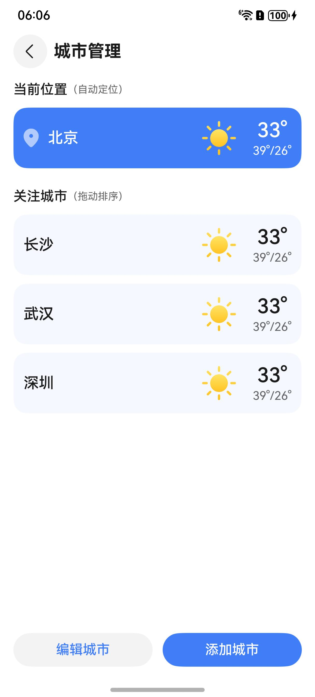

# 城市管理组件快速入门

## 目录

- [简介](#简介)
- [约束与限制](#约束与限制)
- [使用](#使用)
- [API参考](#API参考)
- [示例代码](#示例代码)

## 简介

本组件提供了当前城市的自动定位和刷新功能，提供热门城市的快捷选择以及区域搜索功能。并支持关注城市的拖拽排序以及增删等管理功能。



## 约束与限制
### 环境

* DevEco Studio版本：DevEco Studio 5.0.5 Release及以上
* HarmonyOS SDK版本：HarmonyOS 5.0.5 Release SDK及以上
* 设备类型：华为手机（包括双折叠和阔折叠）
* 系统版本：HarmonyOS 5.0.5(17)及以上

### 权限
* 获取位置权限：ohos.permission.APPROXIMATELY_LOCATION。

## 使用

1. 安装组件。

   如果是在DevEco Studio使用插件集成组件，则无需安装组件，请忽略此步骤。

   如果是从生态市场下载组件，请参考以下步骤安装组件。

   a. 解压下载的组件包，将包中所有文件夹拷贝至您工程根目录的XXX目录下。

   b. 在项目根目录build-profile.json5添加module_city_manage和module_weather_core模块。

    ```
    // 项目根目录下build-profile.json5填写module_city_manage和module_weather_core路径。其中XXX为组件存放的目录名
    "modules": [
        {
        "name": "module_city_manage",
        "srcPath": "./XXX/module_city_manage"
        },
        {
        "name": "module_weather_core",
        "srcPath": "./XXX/module_weather_core"
        }
    ]
    ```

   c. 在项目根目录oh-package.json5中添加依赖。
    ```
    // XXX为组件存放的目录名
    "dependencies": {
        "module_city_manage": "file:./XXX/module_city_manage"
    }
    ```

2. 使用该组件需要开通地图服务，详见[开通地图服务](https://developer.huawei.com/consumer/cn/doc/harmonyos-guides/map-config-agc)。

3. 引入组件句柄。
    ```
    import { CityPage } from 'module_city_manage';
    ```

4. 开启全局沉浸式布局。
    ```
    const win = await window.getLastWindow(getContext());
    win.setWindowLayoutFullScreen(true);
    ```

5. 跳转管理页面。详细参数配置说明参见[API参考](#API参考)。
    ```
    this.stack.pushPathByName(CityPage.MANAGED,null,(popRes) => {},true);
    ```


## API参考

### 子组件

无

### applyLocationPermission方法说明

CityManager.applyLocationPermission(): Promise<[IPosition](#IPostion对象说明)>

获取当前设备的大致位置。

### pushPathByName方法说明

[pushPathByName](https://developer.huawei.com/consumer/cn/doc/harmonyos-references/ts-basic-components-navigation#pushpathbyname11)(name: string, param: Object, onPop: Callback<[PopInfo](https://developer.huawei.com/consumer/cn/doc/harmonyos-references/ts-basic-components-navigation#popinfo11)>, animated?: boolean): void

系统跳转方法。可通过onPop回调，接收返回数据。

### CityPage对象说明

页面名枚举。

**枚举：**

| 枚举名     | 说明    |
|---------|-------|
| MANAGED | 城市管理页 |
| SEARCH  | 城市选择页 |

### IPostion对象说明

获取当前设备定位的数据类型，以及PopInfo的result字段实际数据类型。

**参数：**

| 参数名  | 类型     | 是否必填 | 说明   |
|------|--------|------|------|
| name | string | 是    | 位置名称 |
| code | string | 是    | 位置区码 |


## 示例代码

本示例通过pushPathByName实现城市管理页跳转。

```
import { window } from '@kit.ArkUI';
import { CityPage } from 'module_city_manage';

@Entry
@ComponentV2
struct CityManage {
  stack: NavPathStack = new NavPathStack();
  @Local fullScreen: boolean = false;

  async aboutToAppear() {
    const win = await window.getLastWindow(getContext());
    win.setWindowLayoutFullScreen(true);
    this.fullScreen = true;
  }

  build() {
    if (this.fullScreen) {
      Navigation(this.stack) {
        Column() {
          Button('跳转').onClick(() => {
            this.stack.pushPathByName(
              CityPage.MANAGED,
              null,
              (popRes) => {
                AlertDialog.show({ message: JSON.stringify(popRes.result) })
              },
              true,
            )
          })
        }
        .justifyContent(FlexAlign.Center)
          .width('100%')
          .height('100%')
      }
      .hideTitleBar(true)
    }
  }
}
```