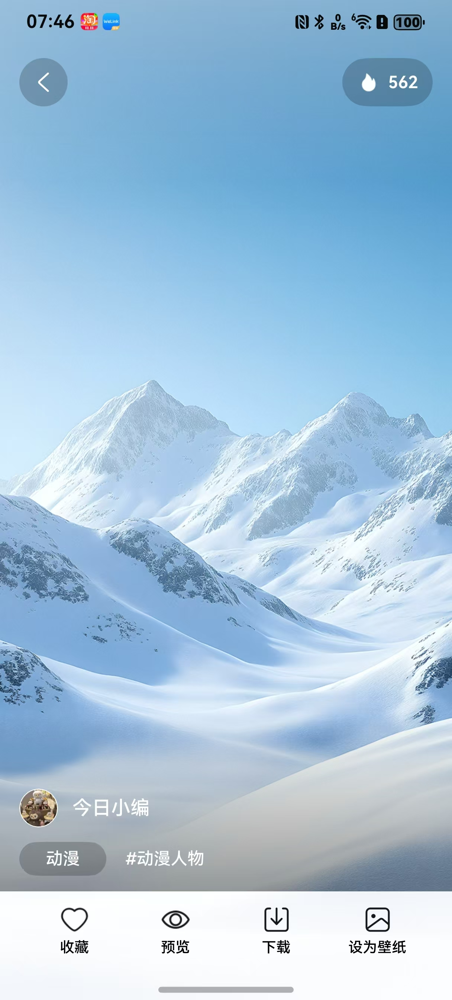

# 壁纸详情组件快速入门

## 目录

- [功能简介](#功能简介)
- [约束与限制](#环境)
- [快速入门](#快速入门)
- [API参考](#API参考)
- [示例代码](#示例代码)
- [开源许可协议](#开源许可协议)

## 功能简介

本组件提供了壁纸详情展示功能，其中包含：作者名称、作者头像、壁纸分类、壁纸关键词、以及收藏、取消收藏、预览、下载、设为壁纸、左右切换壁纸等功能。



### 环境

- DevEco Studio版本：DevEco Studio 5.0.5 Release及以上
- HarmonyOS SDK版本：HarmonyOS 5.0.5 Release SDK及以上
- 设备类型：华为手机（包括双折叠和阔折叠）
- 系统版本：HarmonyOS 5.0.5(17)及以上
### 权限

- 网络权限：ohos.permission.INTERNET


## 快速入门

1. 安装组件。

   如果是在DevEco Studio使用插件集成组件，则无需安装组件，请忽略此步骤。

   如果是从生态市场下载组件，请参考以下步骤安装组件。

   a. 解压下载的组件包，将包中所有文件夹拷贝至您工程根目录的XXX目录下。

   b. 在项目根目录build-profile.json5添加module_wallpaper_details模块。

   ```typescript
    // 在项目根目录build-profile.json5填写module_wallpaper_details路径。其中XXX为组件存放的目录名
    "modules": [
        {
        "name": "module_wallpaper_details",
        "srcPath": "./XXX/module_wallpaper_details",
        }
    ]
   ```
   c. 在项目根目录oh-package.json5中添加依赖。
   ```typescript
    // XXX为组件存放的目录名称
    "dependencies": {
      "module_wallpaper_details": "file:./XXX/module_wallpaper_details"
    }
   ```


2. 在EntryAbility的onWindowStageCreate中设置全屏模式

   ```typescript
   let windowClass: window.Window = windowStage.getMainWindowSync();

   await windowClass.setWindowLayoutFullScreen(true);
   ```

3. 引入组件。

   ```typescript
   import { NewWallpaperDetail } from 'module_wallpaper_details';
   ```


4. 调用组件，详细参数配置说明参见[API参考](#API参考)。

   ```typescript
    NewWallpaperDetail()
   ```

## API参考

### 接口

  NewWallpaperDetail(options?: WallpaperDetailOptions)

### WallpaperDetailOptions对象说明

| 名称         | 类型                                     | 是否必填 | 说明            |
| :--------- |:---------------------------------------| ---- | ------------- |
| imageInfos | [ImageInfos](#ImageInfos对象说明)          | 是    | URL和图片列表的数据容器 |
| listener   | [OnWallpaperDetailsListener](#OnWallpaperDetailsListener对象说明)    | 是    | 壁纸详情页面事件监听器   |
| audio      | boolean                                | 是    | 音频播放          |


### ImageInfos对象说明

| 参数名  | 类型                            | 是否必填 | 说明      |
| ---- | ----------------------------- | ---- | ------- |
| url  | string                        | 是    | 默认展示的图片 |
| list | [ImageInfo](#ImageInfo对象说明)[] | 是    | 壁纸数组    |

### ImageInfo对象说明

| 参数名        | 类型     | 是否必填 | 说明      |
| ---------- | ------ | ---- | ------- |
| id         | string | 是    | 图片唯一标识符 |
| type       | string | 是    | 类型      |
| keywords   | string | 是    | 关键词     |
| userAvatar | string | 是    | 用户头像URL |
| userName   | string | 是    | 用户名称    |
| url        | string | 是    | 壁纸资源URL |
| like       | string | 是    | 点赞状态    |
| hotValue   | string | 是    | 热度值     |
| time       | string | 是    | 时间戳     |
| isVideo    | string | 是    | 是否为视频资源 |
| src        | string | 是    | 资源源地址   |

### OnWallpaperDetailsListener对象说明

| 参数名  | 类型                                                       | 是否必填 | 说明                 |
| ---- |----------------------------------------------------------| ---- |--------------------|
| isFavorite  | (imageInfo: [ImageInfo](#ImageInfo对象说明)): boolean => {}  | 是    | 判断是否收藏(网络数据可忽略本回调) |
| onFavorite | (imageInfo: [ImageInfo](#ImageInfo对象说明)): boolean => {} | 是    | 收藏/取消收藏            |
| onDownload | (imageInfo: [ImageInfo](#ImageInfo对象说明)): void => {}     | 是    | 下载                 |
| onSetWallpaper | (imageInfo: [ImageInfo](#ImageInfo对象说明)): void => {}     | 是    | 设置为壁纸              |
| onPreview | (isPreviewing: boolean): void => {}                      | 是    | 预览               |
| onShare |(): void => {}                                                | 是    | 分享               |
| onBack | (): void => {}                                             | 是    | 返回               |

### 事件

支持以下事件：

#### isFavorite
isFavorite: (imageInfo: ImageInfo) => boolean;

判断是否收藏(网络数据可忽略本回调)

#### onFavorite
onFavorite: (imageInfo: ImageInfo) => boolean;

收藏/取消收藏

#### onDownload
onDownload: (imageInfo: ImageInfo) => void;

下载回调

#### onSetWallpaper
onSetWallpaper: (imageInfo: ImageInfo) => void;

设置壁纸回调

#### onPreview
onPreview: (isPreviewing: boolean) => void;

预览回调

#### onShare
onShare: () => void;

分享回调

### 示例代码

```
import { ImageInfo, ImageInfos, NewWallpaperDetail, OnWallpaperDetailsListener } from 'module_wallpaper_details'
import promptAction from '@ohos.promptAction';

@Entry
@ComponentV2
struct Index {
  pageInfo: NavPathStack = new NavPathStack()
  @Local listByIdIs0: ImageInfo[] = [
    {
      id: '',
      url: 'https://agc-storage-drcn.platform.dbankcloud.cn/v0/default-bucket-5xjsz/wallpapaer%2Fpicture%2F19.png?token=43f45e30-e3bd-4bd1-84b3-2e0fbf4ab6e9',
      src: 'first_wallpaper_video.mp4',
      userAvatar: 'https://agc-storage-drcn.platform.dbankcloud.cn/v0/default-bucket-5xjsz/wallpapaer%2Fpicture%2F8.png?token=57973a49-9d88-4d37-98a4-01fd5641fc3a',
      userName: '今日小编',
      type: '爱豆',
      hotValue: 465,
      time: 1758332621000,
      keywords: '#动态效果',
      like: false,
      isVideo: true
    },
    {
      id: '',
      url: 'https://agc-storage-drcn.platform.dbankcloud.cn/v0/default-bucket-5xjsz/wallpapaer%2Fpicture%2F22.png?token=7903895f-e5bc-4e03-a33f-fd692c5eb443',
      userAvatar: 'https://agc-storage-drcn.platform.dbankcloud.cn/v0/default-bucket-5xjsz/wallpapaer%2Fpicture%2F22.png?token=7903895f-e5bc-4e03-a33f-fd692c5eb443',
      userName: '今日小编',
      type: '爱豆',
      hotValue: 465,
      time: 1758332621000,
      keywords: '#动漫人物,#油画',
      like: false
    },
  ]
  @Local imageInfos: ImageInfos = {
    url: this.listByIdIs0[0].url,
    list: this.listByIdIs0
  };
  @Local listener: OnWallpaperDetailsListener = {
    onFavorite: (imageInfo: ImageInfo): boolean => {
      promptAction.showToast({ message: '收藏回调' })
      return true
    },
    onDownload: async (imageInfo: ImageInfo): Promise<void> => {
      promptAction.showToast({ message: '下载回调' })
    },
    onSetWallpaper: async (imageInfo: ImageInfo): Promise<void> => {
      promptAction.showToast({ message: '设置壁纸回调' })
    },
    onPreview: async (isPreviewing: boolean): Promise<void> => {
      promptAction.showToast({ message: '预览回调' })
    },
    onShare: async (): Promise<void> => {
      promptAction.showToast({ message: '开通会员' })
    },
    onBack: (): void => {
      promptAction.showToast({ message: '返回' })
    },
    isFavorite: (imageInfo: ImageInfo): boolean => {
      return false
    }
  };

  build() {
    Navigation(this.pageInfo) {
      NewWallpaperDetail({ audio: true, imageInfos: this.imageInfos, listener: this.listener })
    }
    .hideTitleBar(true)
  }
}
```


## 开源许可协议

该代码经过[Apache 2.0 授权许可](http://www.apache.org/licenses/LICENSE-2.0)。
