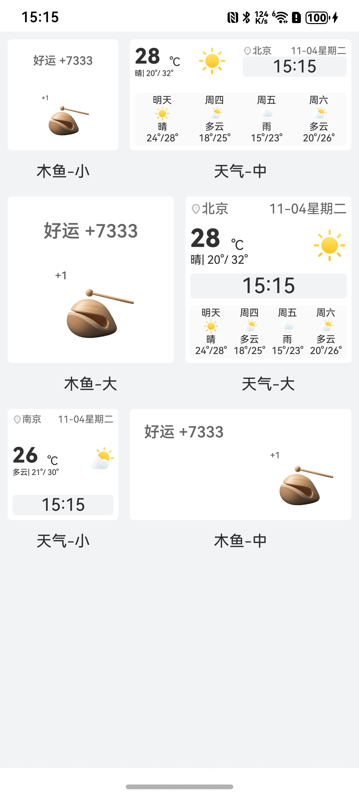

# 桌面小组件瀑布流组件快速入门

## 目录

- [功能简介](#功能简介)
- [约束与限制](#环境)
- [快速入门](#快速入门)
- [API参考](#API参考)
- [示例代码](#示例代码)
- [开源许可协议](#开源许可协议)

## 功能简介

本组件提供了桌面小组件瀑布流展示的功能。



### 环境

- DevEco Studio版本：DevEco Studio 5.0.5 Release及以上
- HarmonyOS SDK版本：HarmonyOS 5.0.5 Release SDK及以上
- 设备类型：华为手机（包括双折叠和阔折叠）
- 系统版本：HarmonyOS 5.0.5(17)及以上

## 快速入门

1. 安装组件。

   如果是在DevEco Studio使用插件集成组件，则无需安装组件，请忽略此步骤。

   如果是从生态市场下载组件，请参考以下步骤安装组件。

   a. 解压下载的组件包，将包中所有文件夹拷贝至您工程根目录的XXX目录下。

   b. 在项目根目录build-profile.json5添加module_waterflow模块。

   ```typescript
    // 在项目根目录build-profile.json5填写module_waterflow路径。其中XXX为组件存放的目录名
    "modules": [
        {
        "name": "module_waterflow",
        "srcPath": "./XXX/module_waterflow",
        }
    ]
   ```
   c. 在项目根目录oh-package.json5中添加依赖。
   ```typescript
    // XXX为组件存放的目录名称
    "dependencies": {
      "module_waterflow": "file:./XXX/module_waterflow"
    }
   ```

2. 引入组件。

   ```typescript
   import { WaterFlowComponent } from 'module_waterflow';
   ```

3. 调用组件，详细参数配置说明参见[API参考](#API参考)。

   ```
   WaterFlowComponent()
   ```


## API参考

### 接口

WaterFlowComponent(options?: WaterFlowComponent)

用户信息组件。

**参数：**

| 参数名     | 类型                                       | 是否必填   | 说明        |
| ------- | ---------------------------------------- | -- | --------- |
| options | [WaterFlowOptions](#WaterFlowOptions对象说明) | 是  | 桌面小组件瀑布流。 |

### WaterFlowOptions对象说明

| 名称                | 类型                          | 是否必填   | 说明      |
| :---------------- |:----------------------------| -- | ------- |
| dataSource        | [CardItem](#CardItem对象说明)[] | 是  | 数据源     |
| finished          | boolean                     | 否  | 是否是最后一页 |
| isLazy            | boolean                     | 否  | 是否是懒加载  |
| onLoad            | void                        | 是  | 回调函数    |
| toComponentDetail | void                        | 是  | 回调函数    |

### CardItem对象说明

| 名称                | 类型     | 是否必填   | 说明                            |
| :---------------- | :----- | -- |-------------------------------|
| cardType              | number | 否  | 卡片类型1: weather, 2: woodenFish |
| cards | [Card](#Card对象说明)[]   | 否  | 卡片数组                            |

### Card对象说明

| 名称                | 类型                                                                                                | 是否必填 | 说明                                       |
| :---------------- |:--------------------------------------------------------------------------------------------------|--|------------------------------------------|
| id              | number                                                                                            | 否 | 组件id                                     |
| type | string                                                                                            | 否 | 组件类型 天气：weather, 木鱼： woodenFish          |
| cardSize | string                                                                                            | 否 | 组件尺寸 small：2 *2 medium：2 * 4 large：4 * 4 |
| data | [WeatherCardOptions](#WeatherCardOptions对象说明),[WoodenFishCardOptions](#WoodenFishCardOptions对象说明) | 否  | 组件数据  天气：WeatherCardOptions 木鱼：WoodenFishCardOptions          |

### WeatherCardOptions对象说明

| 名称                  | 类型              | 是否必填   | 说明                        |
| :------------------ |:----------------| -- | ------------------------- |
| cardSize            | string          | 是  | 卡片尺寸，支持small/medium/large |
| location            | string          | 是  | 地理位置                      |
| weather             | string          | 是  | 天气                        |
| temp                | string          | 是  | 温度                        |
| highTemp            | string          | 是  | 最高温度                      |
| lowTemp             | string          | 是  | 最低温度                      |
| backgroundColorInfo | string          | 否  | 背景颜色                      |
| textColor           | string          | 否  | 文字颜色                      |
| futureWeatherColor  | string          | 否  | 未来天气颜色                    |
| backgroundImg       | string          | 否  | 背景图片                      |
| futureWeather       | [FutureWeather](#FutureWeather对象说明)[] | 否  | 未来天气                      |

### WoodenFishCardOptions对象说明

| 名称                  | 类型                      | 是否必填   | 说明                        |
| :------------------ | :---------------------- | -- | ------------------------- |
| cardSize            | string                  | 是  | 卡片尺寸，支持small/medium/large |
| luckValue           | number/string           | 否  | 好运值，默认为0                  |
| backgroundColorInfo | string                  | 否  | 背景颜色                      |
| textColor           | string                  | 否  | 文字颜色                      |
| woodenFishTit       | string                  | 否  | 名称，默认好运                   |
| backgroundImg       | string                  | 否  | 背景图片                      |
| soundEffect         | boolean                 | 否  | 是否播放声音，默认为true            |


### FutureWeather对象说明

| 名称                  | 类型               | 是否必填   | 说明                        |
| :------------------ |:-----------------| -- | ------------------------- |
| date            | string           | 是  | 日期信息 |
| weather           | string           | 否  | 天气状况描述 如：晴、多云、小雨等                 |
| lowTemp | string           | 否  | 最低温度 单位为摄氏度(℃)                     |
| highTemp           | string           | 否  | 最高温度 单位为摄氏度(℃)                   |


### 示例代码


```
import { Card, CardItem, WaterFlowComponent } from 'module_waterflow';
interface GeneratedObjectLiteralInterface_2 {
  date: string;
  weather: string;
  lowTemp: string;
  highTemp: string;
}
@Entry
@ComponentV2
struct Index {
  pageInfo: NavPathStack = new NavPathStack()
  @Local allTotal: number = 1;
  @Param finished: boolean = true
  @Local cardList: CardItem[] = [
    {
      cardType: 1,
      cards: [
        // 2*2木鱼卡片
        new Card(3, 'woodenFish', 'small', { luckValue: 7333, woodenFishTitle: '好运' }),
        // 2*4天气卡片
        new Card(2, 'weather', 'medium', {
          location: '北京',
          weather: '晴',
          temp: '28',
          highTemp: '32',
          lowTemp: '20',
          futureWeather: [({
            date: this.getFutureDates()[0],
            weather: '晴',
            lowTemp: '24',
            highTemp: '28'
          } as GeneratedObjectLiteralInterface_2),
            ({
              date: this.getFutureDates()[1],
              weather: '多云',
              lowTemp: '18',
              highTemp: '25'
            } as GeneratedObjectLiteralInterface_2),
            ({
              date: this.getFutureDates()[2],
              weather: '雨',
              lowTemp: '15',
              highTemp: '23'
            } as GeneratedObjectLiteralInterface_2),
            ({
              date: this.getFutureDates()[3],
              weather: '多云',
              lowTemp: '20',
              highTemp: '26'
            } as GeneratedObjectLiteralInterface_2)
          ]
        }),
      ]
    },
    {
      cardType: 3,
      cards: [
        new Card(8, 'woodenFish', 'large', { luckValue: 7333, woodenFishTitle: '好运' }),
        new Card(9, 'weather', 'large', {
          location: '北京',
          weather: '晴',
          temp: '28',
          highTemp: '32',
          lowTemp: '20',
          futureWeather: [({
            date: this.getFutureDates()[0],
            weather: '晴',
            lowTemp: '24',
            highTemp: '28'
          } as GeneratedObjectLiteralInterface_2),
            ({
              date: this.getFutureDates()[1],
              weather: '多云',
              lowTemp: '18',
              highTemp: '25'
            } as GeneratedObjectLiteralInterface_2),
            ({
              date: this.getFutureDates()[2],
              weather: '雨',
              lowTemp: '15',
              highTemp: '23'
            } as GeneratedObjectLiteralInterface_2),
            ({
              date: this.getFutureDates()[3],
              weather: '多云',
              lowTemp: '20',
              highTemp: '26'
            } as GeneratedObjectLiteralInterface_2)
          ]
        }),
      ]
    },
    {
      cardType: 1,
      cards: [
        new Card(11, 'weather', 'small', {location: '南京', weather: '多云', temp: '26', highTemp: '30', lowTemp: '21' }),
        new Card(10, 'woodenFish', 'medium', { luckValue: 7333, woodenFishTitle: '好运' }),
      ]
    },

  ]

   getFutureDates(): string[] {
    const weekdays = ['周日', '周一', '周二', '周三', '周四', '周五', '周六'];
    const result: string[] = [];
    const today = new Date();
    for (let i = 1; i <= 4; i++) {
      const targetDate = new Date(today);
      targetDate.setDate(today.getDate() + i);
      const dayIndex = targetDate.getDay();
      const weekday = weekdays[dayIndex];

      if (i === 1) {
        result.push('明天');
      } else {
        result.push(weekday);
      }
    }
    return result;
  }

  build() {
    Navigation(this.pageInfo) {
      Column() {
        Scroll() {
          WaterFlowComponent({
            dataSource: this.cardList,
            finished: Math.ceil(this.allTotal / 6) < 1
          })
        }
        .edgeEffect(EdgeEffect.Spring)
        .width('100%')
      }
      .height('100%')
      .justifyContent(FlexAlign.Start)
      .backgroundColor($r('sys.color.background_secondary'))
    }
    .hideTitleBar(true)
  }
}
```


## 开源许可协议

该代码经过[Apache 2.0 授权许可](http://www.apache.org/licenses/LICENSE-2.0)。
