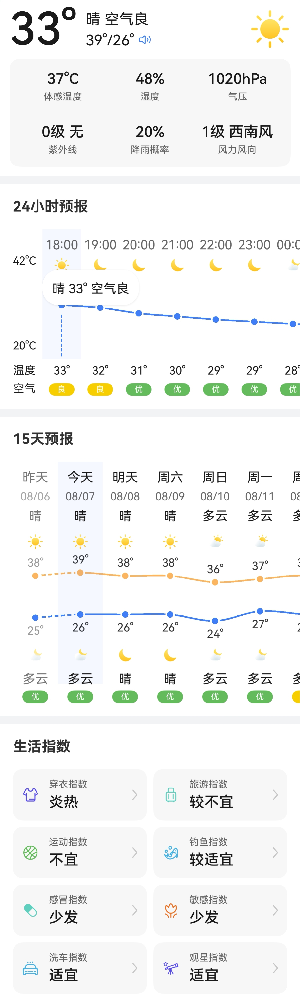
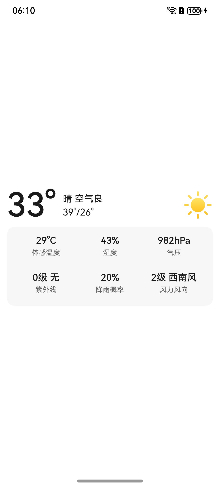
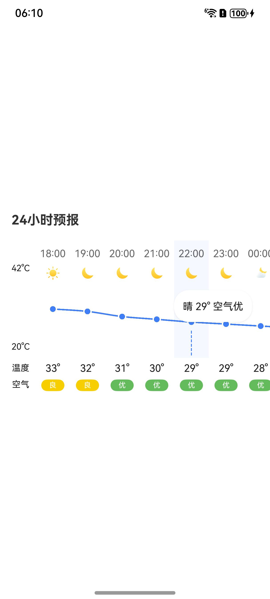
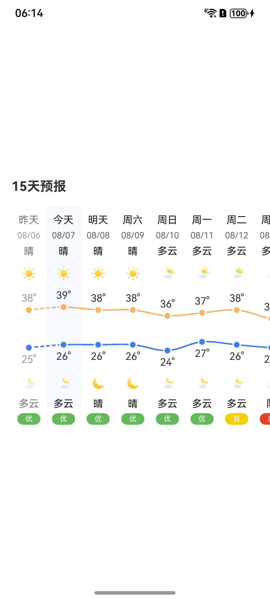
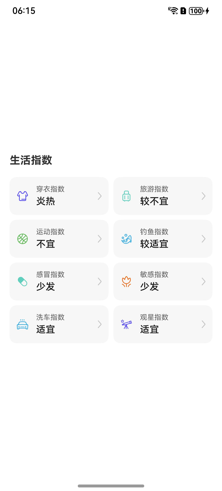

# 天气组件快速入门

## 目录

- [简介](#简介)
- [约束与限制](#约束与限制)
- [使用](#使用)
- [API参考](#API参考)
- [示例代码](#示例代码)

## 简介

本组件提供浏览实时天气、24小时天气、15天天气和生活指数的相关能力，通过绘图实现直观天气信息展示。并提供对应接口获取相应天气数据。



## 约束与限制
### 环境
* DevEco Studio版本：DevEco Studio 5.0.5 Release及以上
* HarmonyOS SDK版本：HarmonyOS 5.0.5 Release SDK及以上
* 设备类型：华为手机（包括双折叠和阔折叠）
* 系统版本：HarmonyOS 5.0.5(17)及以上

## 使用

1. 安装组件。

   如果是在DevEco Studio使用插件集成组件，则无需安装组件，请忽略此步骤。

   如果是从生态市场下载组件，请参考以下步骤安装组件。

   a. 解压下载的组件包，将包中所有文件夹拷贝至您工程根目录的XXX目录下。

   b. 在项目根目录build-profile.json5添加module_weather_core模块。

   ```
   // 项目根目录下build-profile.json5填写module_weather_core路径。其中XXX为组件存放的目录名
   "modules": [
      {
      "name": "module_weather_core",
      "srcPath": "./XXX/module_weather_core"
      }
   ]
   ```

   c. 在项目根目录oh-package.json5中添加依赖。
   ```
   // XXX为组件存放的目录名
   "dependencies": {
      "module_weather_core": "file:./XXX/module_weather_core"
   }
   ```

2. 引入组件句柄。
   ```
   import {WeatherUtils, RealTimeWeather, UINow, HourlyWeather, UIHours, DailyWeather, UIDays, IndicesWeather, UIIndices  } from 'module_weather_core';
   ```

3. 使用多种天气组件。详细参数配置说明参见[API参考](#API参考)。
   ```
   UINow({ weather: this.realTimeWeather })
   UIHours({ weathers: this.hourlyWeathers })
   UIDays({ weathers: this.dailyWeathers })
   UIIndices({ weathers: this.indicesWeathers })
   ```

## API参考

### 子组件

无

### 接口

UINow(options?: UINowOptions)

实时天气组件。

**参数：**

| 参数名     | 类型                                | 是否必填 | 说明           |
|---------|-----------------------------------|------|--------------|
| options | [UINowOptions](#UINowOptions对象说明) | 是    | 配置实时天气组件的参数。 |

### UINowOptions对象说明

| 名称       | 类型                                      | 是否必填 | 说明     |
|----------|-----------------------------------------|------|--------|
| weather  | [RealTimeWeather](#RealTimeWeather对象说明) | 是    | 实时天气数据 |
| customUi | () => void                              | 否    | 自定义构建器 |

### RealTimeWeather对象说明

| 名称         | 类型     | 是否必填 | 说明     |
|------------|--------|------|--------|
| time       | string | 是    | 采集时间   |
| temp       | number | 是    | 温度     |
| maxTemp    | number | 是    | 最高温度   |
| minTemp    | number | 是    | 最低温度   |
| shellTemp  | number | 是    | 体表温度   |
| humidity   | number | 是    | 湿度     |
| rain       | number | 是    | 降雨概率   |
| desc       | string | 是    | 相关文字描述 |
| icon       | string | 是    | 相关图标描述 |
| pressure   | number | 是    | 气压     |
| uv         | number | 是    | 紫外线    |
| windDir    | string | 是    | 风向     |
| winSpeed   | number | 是    | 风速     |
| airQuality | string | 是    | 空气质量   |


UIHours(options?: UIHoursOptions)

24小时天气组件。

**参数：**

| 参数名     | 类型                                    | 是否必填 | 说明             |
|---------|---------------------------------------|------|----------------|
| options | [UIHoursOptions](#UIHoursOptions对象说明) | 是    | 配置24小时天气组件的参数。 |

### UIHoursOptions对象说明

| 名称        | 类型                                    | 是否必填 | 说明       |
|-----------|---------------------------------------|------|----------|
| weathers  | [HourlyWeather](#HourlyWeather对象说明)[] | 是    | 24小时天气数据 |
| maxTemp   | number                                | 否    | 最高温度     |
| minTemp   | number                                | 否    | 最低温度     |
| itemWidth | number                                | 否    | 单元宽度     |

### HourlyWeather对象说明

| 名称         | 类型     | 是否必填 | 说明   |
|------------|--------|------|------|
| time       | string | 是    | 采集时间 |
| temp       | number | 是    | 当前温度 |
| desc       | string | 是    | 天气描述 |
| icon       | string | 是    | 天气图标 |
| airQuality | string | 是    | 空气质量 |


UIDays(options?: UIDaysOptions)

15天天气组件。

**参数：**

| 参数名     | 类型                                  | 是否必填 | 说明            |
|---------|-------------------------------------|------|---------------|
| options | [UIDaysOptions](#UIDaysOptions对象说明) | 是    | 配置15天天气组件的参数。 |

### UIDaysOptions对象说明

| 名称        | 类型                                  | 是否必填 | 说明      |
|-----------|-------------------------------------|------|---------|
| weathers  | [DailyWeather](#DailyWeather对象说明)[] | 是    | 15天天气数据 |
| maxTemp   | number                              | 否    | 最高温度    |
| minTemp   | number                              | 否    | 最低温度    |
| itemWidth | number                              | 否    | 单元宽度    |

### DailyWeather对象说明

| 名称         | 类型     | 是否必填 | 说明     |
|------------|--------|------|--------|
| time       | string | 是    | 采集时间   |
| maxTemp    | number | 是    | 最高气温   |
| minTemp    | number | 是    | 最低气温   |
| dayDesc    | string | 是    | 白天天气描述 |
| dayIcon    | string | 是    | 白天天气图标 |
| nightDesc  | string | 是    | 晚上天气描述 |
| nightIcon  | string | 是    | 晚上天气图标 |
| airQuality | string | 是    | 空气质量   |
| rain       | number | 是    | 降雨概率   |


UIIndices(options?: UIIndicesOptions)

生活指数组件。

**参数：**

| 参数名     | 类型                                        | 是否必填 | 说明           |
|---------|-------------------------------------------|------|--------------|
| options | [UIIndicesOptions](#UIIndicesOptions对象说明) | 是    | 配置生活指数组件的参数。 |

### UIIndicesOptions对象说明

| 名称       | 类型                                                       | 是否必填 | 说明     |
|----------|----------------------------------------------------------|------|--------|
| weathers | [IndicesWeather](#IndicesWeather对象说明)[]                  | 是    | 生活指数数据 |
| click    | (weather: [IndicesWeather](#IndicesWeather对象说明)) => void | 否    | 点击回调事件 |

### IndicesWeather对象说明

| 名称       | 类型     | 是否必填 | 说明   |
|----------|--------|------|------|
| time     | string | 是    | 采集时间 |
| type     | number | 是    | 指数类型 |
| name     | string | 是    | 指数名称 |
| level    | number | 是    | 指数等级 |
| category | string | 是    | 预报名称 |
| text     | string | 是    | 详细描述 |
| icon     | string | 是    | 显示图标 |


### WeatherUtils

天气数据获取工具。

#### getRealTimeWeathers

WeatherUtils.getRealTimeWeathers(codes: string[]):Promise<[RealTimeWeather](#RealTimeWeather对象说明)[]>

获取对应地区码区域的实时天气数据。

#### getHourlyWeathers

WeatherUtils.getHourlyWeathers(codes: string):Promise<[HourlyWeather](#HourlyWeather对象说明)[]>

获取对应地区码区域的24小时天气数据。

#### getDailyWeathers

WeatherUtils.getRealTimeWeathers(codes: string):Promise<[DailyWeather](#DailyWeather对象说明)[]>

获取对应地区码区域的15天天气数据。

#### getIndicesWeathers

WeatherUtils.getRealTimeWeathers(code: string, day: 1 | 3):Promise<[IndicesWeather](#IndicesWeather对象说明)[][]>

获取对应地区码区域对应天数的生活指数数据。

## 示例代码

### 示例1（实时天气）

本示例通过getRealTimeWeathers获取实时天气数据，并通过UINow组件直观展示对应数据。

```
import { RealTimeWeather, UINow, WeatherUtils } from 'module_weather_core';

interface LocationInfo {
  name: string;
  code: string;
}

@Entry
@ComponentV2
struct WeatherNow {
  @Local location: LocationInfo = { name: '北京', code: '110100' };
  @Local realTimeWeather: RealTimeWeather | undefined;

  aboutToAppear(): void {
    WeatherUtils.getRealTimeWeathers([this.location.code]).then(res => this.realTimeWeather = res[0]);
  }

  build() {
    Column() {
      if (this.realTimeWeather) {
        UINow({ weather: this.realTimeWeather })
      }
    }
    .justifyContent(FlexAlign.Center)
    .width('100%')
    .height('100%')
  }
}
```



### 示例2（24小时天气）

本示例通过getHourlyWeathers获取24小时天气数据，并通过UIHours组件绘制24小时温度曲线图。

```
import { HourlyWeather, UIHours, WeatherUtils } from 'module_weather_core';

interface LocationInfo {
  name: string;
  code: string;
}

@Entry
@ComponentV2
struct WeatherHours {
  @Local location: LocationInfo = { name: '北京', code: '110100' };
  @Local hourlyWeathers: HourlyWeather[] = [];

  aboutToAppear(): void {
    WeatherUtils.getHourlyWeathers(this.location.code).then(res => this.hourlyWeathers = res);
  }

  build() {
    Column() {
      if (this.hourlyWeathers.length) {
        UIHours({ weathers: this.hourlyWeathers })
      }
    }
    .justifyContent(FlexAlign.Center)
    .width('100%')
    .height('100%')
  }
}
```



### 示例3（15天天气）

本示例通过getDailyWeathers获取15天天气数据，并通过UIDays组件绘制最高气温和最低气温的曲线图。

```
import { DailyWeather, UIDays, WeatherUtils } from 'module_weather_core';

interface LocationInfo {
  name: string;
  code: string;
}

@Entry
@ComponentV2
struct WeatherDays {
  @Local location: LocationInfo = { name: '北京', code: '110100' };
  @Local dailyWeathers: DailyWeather[] = [];

  aboutToAppear(): void {
    WeatherUtils.getDailyWeathers(this.location.code).then(res => this.dailyWeathers = res);
  }

  build() {
    Column() {
      if (this.dailyWeathers.length) {
        UIDays({ weathers: this.dailyWeathers })
      }
    }
    .justifyContent(FlexAlign.Center)
    .width('100%')
    .height('100%')
  }
}
```



### 示例4（生活指数）

本示例通过getIndicesWeathers获取生活指数数据，并通过UIIndices组件直观展示对应数据。

```
import { IndicesWeather, UIIndices, WeatherUtils } from 'module_weather_core';

interface LocationInfo {
  name: string;
  code: string;
}

@Entry
@ComponentV2
struct WeatherIndices {
  @Local location: LocationInfo = { name: '北京', code: '110100' };
  @Local indicesWeathers: IndicesWeather[] = [];

  aboutToAppear(): void {
    WeatherUtils.getIndicesWeathers(this.location.code, 1).then(res => this.indicesWeathers = res[0]);
  }

  build() {
    Column() {
      if (this.indicesWeathers.length) {
        UIIndices({ weathers: this.indicesWeathers })
      }
    }
    .justifyContent(FlexAlign.Center)
    .width('100%')
    .height('100%')
  }
}
```

