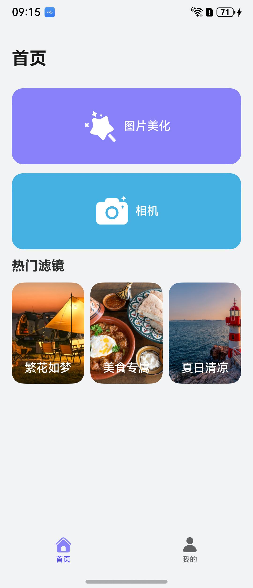
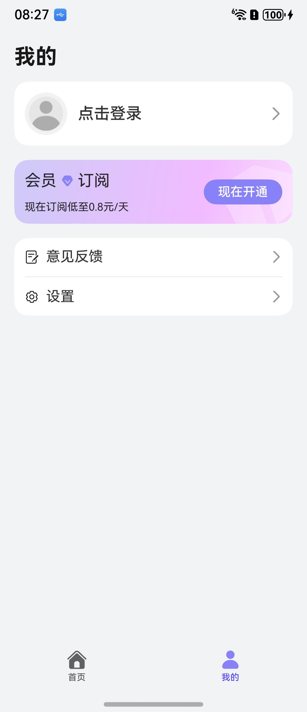
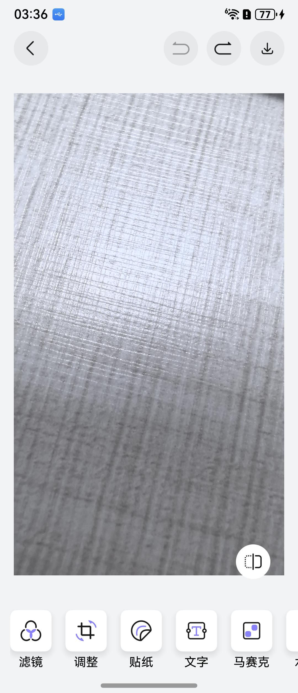
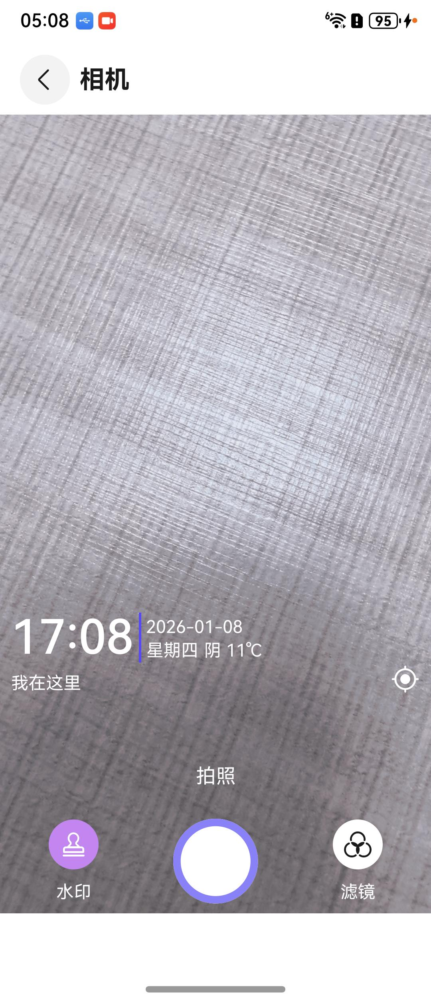

# 拍摄美化（图像美化）应用模板快速入门

## 目录

- [功能介绍](#功能介绍)
- [约束与限制](#约束与限制)
- [快速入门](#快速入门)
- [示例效果](#示例效果)
- [开源许可协议](#开源许可协议)

## 功能介绍

您可以基于此模板直接定制应用，也可以挑选此模板中提供的多种组件使用，从而降低您的开发难度，提高您的开发效率。

此模板提供如下组件，所有组件存放在工程根目录的components下，如果您仅需使用组件，可参考对应组件的指导链接；如果您使用此模板，请参考本文档。

| 组件                 | 描述                  | 使用指导                                    |
|--------------------|---------------------|-----------------------------------------|
| 通用会员组件（membership） | 提供通过应用内支付实现会员开通的能力。 | [使用指导](components/membership/README.md) |

本模板为图片美化应用提供了常用功能的开发样例，提供了图片裁剪、添加文字、滤镜、贴纸、马赛克、水印等功能。模板主要分首页、我的两大模块：

* 首页：包含图片美化、相机2大入口，以及图片美化的裁剪、文字、滤镜、贴纸、马赛克、水印入口。

* 我的：提供账号管理、开通会员、设置、帮助与反馈等功能。

本模板已集成华为账号、开通会员等服务，只需做少量配置和定制即可快速实现华为账号登录、开通会员。

**【注意】**

* 本模版在未配置华为账号一键登录的情况下为保证正常使用本模版，均采用模拟用户信息登录，实际开发中请以具体业务为准。

| 首页                                                         | 我的                                                         |
|------------------------------------------------------------|------------------------------------------------------------|
|  |  |

本模板主要页面及核心功能如下所示：

```ts
美拍
 ├─ 首页
 │    ├─ 图片美化
 │    │    ├─ 图片裁剪
 │    │    ├─ 添加文字
 │    │    ├─ 添加滤镜   
 │    │    ├─ 添加贴纸
 │    │    ├─ 添加马赛克   
 │    │    └─ 添加水印
 │    │ 
 │    └─ 相机
 │         ├─ 拍照
 │         ├─ 滤镜
 │         └─ 水印
 │    
 └─ 我的
      ├─ 登录
      │
      ├─ 开通会员
      │
      ├─ 设置
      │    ├─ 账号设置
      │    ├─ 保存设置
      │    │   ├─ 图片格式
      │    │   └─ 图片质量
      │    └─ 服务条款
      └─ 帮助与反馈
```

本模板工程代码结构如下所示：

```ts
ImageProcessing  
├─common
│  └─src
│     └─main
│        └─ets
│           ├─components
│           │     IconAndTextView.ets                        // 图标文字显示组件
│           │     TitleBar.ets                               // 公共标题栏组件
│           │      
│           └─model
│                 DateUtil.ets                               // 日期时间工具
│                 MockService.ets                            // 模拟数据服务类
│                 PageParams.ets                             // 公共页面参数类
│
├─commons
│  │
│  ├─aggregated_payment
│  │  └─src
│  │     └─main
│  │        └─cpp                                           // 滤镜相机能力库
│  │
│  │
│  └─commonlib
│     └─src
│        └─main
│           └─ets
│              ├─components
│              │     GlobalAttributeModifier.ets             // 全局属性修改组件
│              │     IconAndTextView.ets                     // 图标文字显示组件
│              │     NoData.ets                              // 无数据布局组件
│              │     TitleBar.ets                            // 公共标题栏组件
│              │     TopBar.ets                              // 顶部栏组件
│              │     WaterMark.ets                           // 水印展示组件
│              │      
│              ├─constants
│              │     CommonConstants.ets                     // 公共常量
│              │     CommonEnums.ets                         // 公共枚举类
│              │     Constants.ets                           // 常量
│              │     ErrorCode.ets                           // 错误码
│              │     GridRowColSetting.ets                   // 网格行列设置
│              │     Types.ets                                // 类型
│              │      
│              │─models
│              │     DateUtil.ets                            // 日期时间工具
│              │     Index.ets                               // 类型
│              │     MockService.ets                         // 模拟数据服务类
│              │     PageParams.ets                          // 公共页面参数类
│              │     UserInfo.ets                            // 用户属性
│              │     WindowSize.ets                          // 窗口大小
│              │
│              └─utils
│                    CommonTipDialog.ets                     // 公共提示窗
│                    DialogUtil.ets                          // 窗口工具类
│                    ErrorCodeHelper.ets                     // 错误码帮助类
│                    FileUtils.ets                           // 文件工具类
│                    Logger.ets                              // 日志类
│                    PermissionUtil.ets                      // 权限请求工具类
│                    PopViewUtils.ets                        // 视图弹出工具类
│                    PreferenceUtil.ets                      // 持久化工具类
│                    RouterModule.ets                        // 导航模块
│
├─components
│  │
│  ├─feed_back                                               // 意见反馈组件
│  │
│  ├─login_info                                              // 登录组件
│  │
│  └─membership                                              // 通用会员组件
│
├─product
│  └─phone
│      └─src
│          └─main
│             └─ets
│                │      
│                ├─models
│                │      Type.ets                             // 类型
│                │      
│                ├─pages
│                │      Index.ets                            // 应用入口页
│                │      LaunchPage.ets                       // 启动页
│                │      LoginPage.ets                        // 登录页
│                │      MainEntry.ets                        // 主入口
│                │      PrivacyPolicyPage.ets                // 隐私协议页
│                │      PrivacyPolicyAlert.ets               // 隐私协议警告
│                │
│                ├─phoneability
│                │      PhoneAbility.ets                     // 手机启动页
│                │      
│                ├─phonebackupability
│                │      PhoneBackupAbility.ets               // 手机备份页
│                │      
│                │
│                └──viewmodels
│                       MainEntryVM.ets                      // 主入口视图模型
│                   
│                
│                      
│                      
└─scenes
   ├─camera
   │   └─src
   │       └─main
   │          └─ets
   │             ├─model
   │             │      Index.ets                             // 类型
   │             │      
   │             ├─pages
   │             │      ImageDownloadPage.ets                 // 照片下载页
   │             │      LutCameraPage.ets                     // 相机页
   │             │      
   │             └─viewmodel                                  // 与页面一一对应的VM层
   │
   │
   ├─home
   │   └─src
   │       └─main
   │          └─ets
   │             └─pages
   │      	            HomePage.ets                          // 首页
   │
   ├─mine
   │   └─src
   │       └─main
   │          └─ets
   │             ├─components
   │             │      ActionSheet.ets                       // 交互动作类
   │             │      AggregatedPaymentPicker.ets           // 集成支付选择类
   │             │      
   │             ├─model
   │             │      Channel.ets                           // 支付渠道
   │             │      UserInfoModel.ets                     // 用户属性模型
   │             │      VersionModel.ets                      // 版本模型
   │             │      
   │             ├─pages
   │             │      AboutPage.ets                         // 关于页
   │             │      AuthenticationPage.ets                // 认证页
   │             │      DataSharingPage.ets                   // 数据分享页
   │             │      FeedBackListPage.ets                  // 意见反馈列表页
   │             │      FeedBackPage.ets                      // 意见反馈页
   │             │      FeedBackRecordsPage.ets               // 意见反馈记录页
   │             │      MinePage.ets                          // 我的
   │             │      PersonalInfoPage.ets                  // 个人属性页
   │             │      PersonalInformationCollectionPage.ets // 个人信息收藏页
   │             │      PrivacyAgreementPage.ets              // 隐私同意页
   │             │      PrivacySetPage.ets                    // 隐私设置页
   │             │      PrivacyStatementPage.ets              // 隐私陈述页
   │             │      SaveSettingPage.ets                   // 保存设置页
   │             │      SetUpPage.ets                         // 设置页
   │             │      TermsPage.ets                         // 服务协议页
   │             │      UserAgreementPage.ets                 // 用户同意页
   │             │      VipPage.ets                           // 开通vip页
   │             │ 
   │             └─views
   │      	            ClearCacheItem.ets                    // 清除缓存
   │      	            OpenVipCard.ets                       // 开通会员卡片
   │      	            PersonalVM.ets                        // 个人视图模型
   │      	            SettingAndHelpCard.ets                // 设置和帮助卡片
   │      	            UpdateVersionContentCard.ets          // 更新版本卡片
   │      	            UpdateVersionItem.ets                 // 更新版本组件
   │      	            UserCard.ets                          // 用户卡片
   │
   ├─personal
   │   └─src
   │       └─main
   │          └─ets
   │             ├─components
   │             │      AgreementView.ets                     // 协议授权弹框
   │             │      DraftCard.ets                         // 草稿箱卡片组件
   │             │      MarterialCenterCard.ets               // 素材中心卡片组件
   │             │      PrivacyTextSpan.ets                   // 协议文本组件
   │             │      SettingAndHelpCard.ets                // 帮助与反馈卡片组件
   │             │      UserCard.ets                          // 用户信息卡片组件
   │             │      
   │             ├─generated
   │             │      RouterBuilder.ets                     // 路由构建类
   │             │      
   │             ├─model
   │             │      Constants.ets                         // 常量类
   │             │      ErrorCodeEntity.ets                   // 请求错误码类
   │             │      
   │             └─pages
   │                    Help.ets                              // 帮助与反馈页
   │                    OtherLogin.ets                        // 其他方式登录页
   │                    QuickLoginPage.ets                    // 华为一键登录页
   │                    Setting.ets                           // 设置页
   │                    Terms.ets                             // 服务条款页
   │
   └─photo_editing
       └─src
           └─main
              └─ets
                 ├─components
                 │      AddTextComponent.ets                   // 添加文字组件
                 │      AddTextToolBar.ets                     // 添加文字工具栏
                 │      BeautToolBar.ets                       // 美颜工具栏
                 │      BeautyActionBar.ets                    // 图片美化总操作栏
                 │      CarouseCutToolBar.ets                  // 图片裁剪工具栏
                 │      DiscardDialog.ets                      // 确认弹框
                 │      FilterToolBar.ets                      // 图片滤镜工具栏
                 │      IconAndTextView.ets                    // 图标和文本视图
                 │      MosaicComponent.ets                    // 马赛克绘制组件
                 │      MosaicToolBar.ets                      // 马赛克工具栏
                 │      StickerComponent.ets                   // 添加贴纸组件
                 │      StickerToolBar.ets                     // 添加贴纸工具栏
                 │      TextEditDialog.ets                     // 编辑文字弹窗
                 │      WatermarkToolBar.ets                   // 添加水印工具栏
                 │      
                 ├─constant
                 │      Constants.ets                         // 常量类
                 │      Enum.ets                              // 枚举类
                 │      Presets.ets                           // 预设数据
                 │    
                 ├─model
                 │      BeautificationParam.ets               // 图片美化页面参数
                 │      CustomFilter.ets                      // 自定义滤镜类
                 │      FreeCollageModel.ets                  // 自由拼接模型
                 │      ImageModel.ets                        // 图片模型
                 │      Index.ets                             // 图像类
                 │      PageParams.ets                        // 页面参数
                 │      
                 ├─pages
                 │      PictureBeautification.ets             // 图片美化页
                 │
                 ├─util
                 │      ImageProcessingUtil.ets               // 图片处理工具类
                 │
                 └─viewmodel
                       PhotoBeautificationVM.ets              // 图片美化VM层

```

## 约束与限制

### 环境

* DevEco Studio版本：DevEco Studio 6.0.1 Release及以上
* HarmonyOS SDK版本：HarmonyOS 6.0.1 Release SDK及以上
* 设备类型：华为手机（包括双折叠和阔折叠）
* HarmonyOS版本：HarmonyOS 5.1.0(18)及以上

### 权限

* 获取相机权限：ohos.permission.CAMERA
* 位置权限：ohos.permission.LOCATION
* 模糊位置权限：ohos.permission.APPROXIMATELY_LOCATION
* 网络权限：ohos.permission.INTERNET

## 快速入门

在运行此模板前，需要完成以下配置：

1. 在AppGallery Connect创建应用，将包名配置到模板中。

   a. 参考[创建应用](https://developer.huawei.com/consumer/cn/doc/app/agc-help-create-app-0000002247955506)为应用创建APP ID，并将APP ID与应用进行关联。

   b. 返回应用列表页面，查看应用的包名。

   c. 将根目录下AppScope/app.json5文件中的bundleName替换为创建应用的包名。

2. 配置华为账号服务。

   a. 将应用的client ID配置到product/phone模块的src/main/module.json5文件，详细参考：[配置Client ID](https://developer.huawei.com/consumer/cn/doc/harmonyos-guides/account-client-id)。

   b. 申请华为账号一键登录所需的权限，详细参考：[申请账号权限](https://developer.huawei.com/consumer/cn/doc/harmonyos-guides/account-config-permissions)。

3. 配置地图服务。

   a. 将元服务的client ID配置到product/phone/src/main路径下的module.json5文件，如果华为账号服务已配置，可跳过此步骤。

   b. [开通地图服务](https://developer.huawei.com/consumer/cn/doc/harmonyos-guides/map-config-agc)。

4. 配置应用内支付服务。

   a. 您需[开通商户服务](https://developer.huawei.com/consumer/cn/doc/start/merchant-service-0000001053025967)才能开启应用内购买服务。商户服务里配置的银行卡账号、币种，用于接收华为分成收益。

   b. 使用应用内购买服务前，需要打开应用内购买服务(HarmonyOS NEXT) 开关，此开关是应用级别的，即所有使用IAP Kit功能的应用均需执行此步骤，详情请参考[打开应用内购买服务API开关](https://developer.huawei.com/consumer/cn/doc/app/switch-0000001958955097)。

   c. 开启应用内购买服务(HarmonyOS NEXT) 开关后，开发者需进一步激活应用内购买服务 (HarmonyOS NEXT)，具体请参见[激活服务和配置事件通知](https://developer.huawei.com/consumer/cn/doc/app/parameters-0000001931995692)。

5. （可选）用户购买商品后，IAP服务器会在订单（消耗型/非消耗型商品）和订阅场景的某些关键事件发生时发送通知至开发者配置的订单/订阅通知接收地址，您可以根据关键事件的通知进行服务端的开发，详情请参考[激活服务和配置事件通知](https://developer.huawei.com/consumer/cn/doc/app/parameters-0000001931995692)。

6. 配置会员商品信息，详情请参考[配置商品信息](https://developer.huawei.com/consumer/cn/doc/harmonyos-guides/iap-config-product)。

7. 注册字体。图片美化添加文字功能如需其它字体需自行添加，可按以下方式导入字体。

   a. 将需要导入的字体文件放到product/phone/src/main/resources/rawfile下。

   b. 在EntryAbility.ets的onCreate方法中按照以下示例注册字体。
   ```typescript
   onCreate(want: Want, launchParam: AbilityConstant.LaunchParam): void    {
    hilog.info(0x0000, 'testTag', '%{public}s', 'Ability onCreate');
    // 注册自定义字体
    let fontCollection = text.FontCollection.getGlobalInstance()
    fontCollection.loadFontSync('宋体',$rawfile('simsun.ttf'))
   }
   ```

8. 对应用进行[手工签名](https://developer.huawei.com/consumer/cn/doc/harmonyos-guides/ide-signing#section297715173233)。

9. 添加手工签名所用证书对应的公钥指纹。详细参考：[配置公钥指纹](https://developer.huawei.com/consumer/cn/doc/app/agc-help-cert-fingerprint-0000002278002933)。

### 运行调试工程

1. 连接调试手机和PC。

2. 对应用[手工签名](https://developer.huawei.com/consumer/cn/doc/harmonyos-guides/ide-signing#section297715173233)。

3. 菜单选择“Run > Run 'phone' ”或者“Run > Debug 'phone' ”，运行或调试模板工程。

## 示例效果

| 图片美化                                                           | 相机                                                         | 
|----------------------------------------------------------------|------------------------------------------------------------|
|  |  |

## 开源许可协议

该代码经过[Apache 2.0 授权许可](http://www.apache.org/licenses/LICENSE-2.0)。
