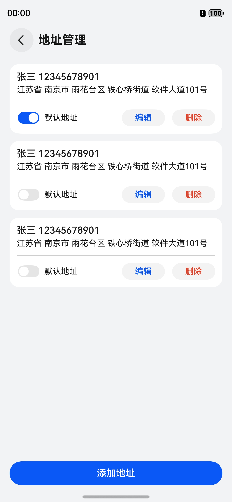
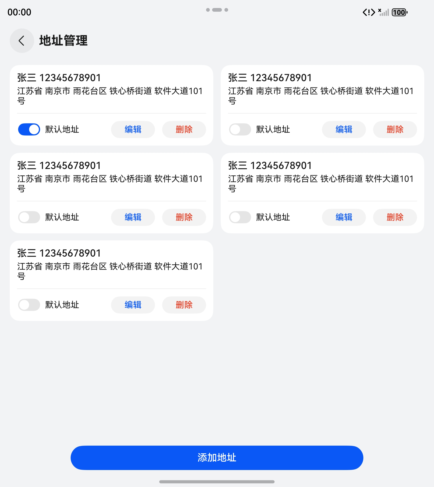
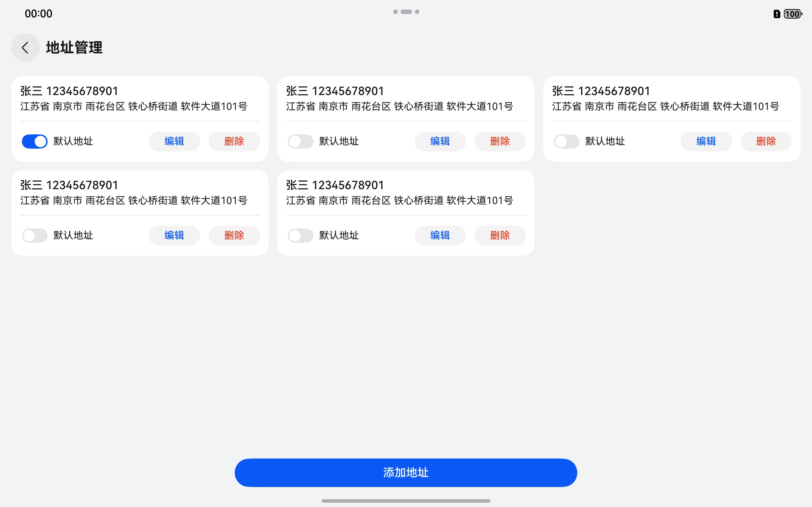
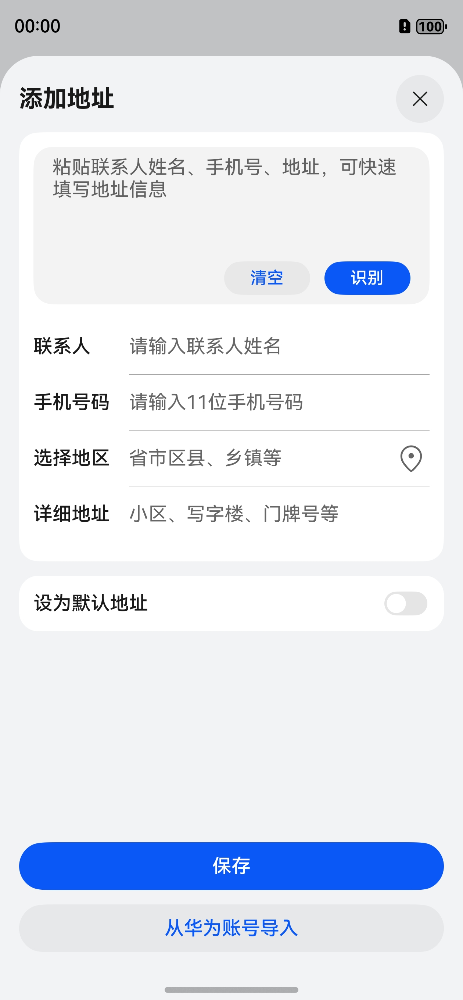
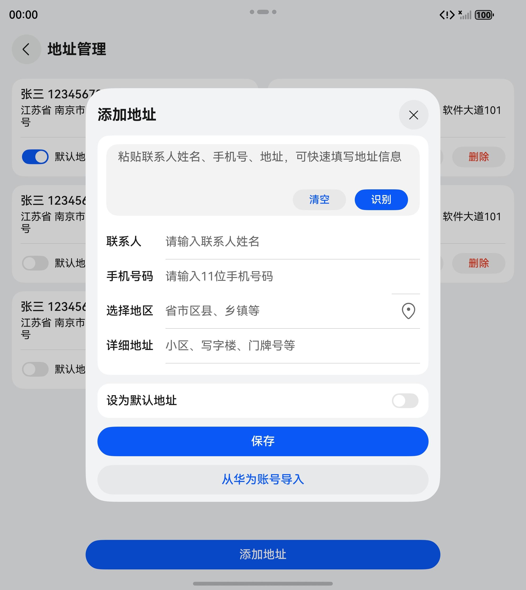
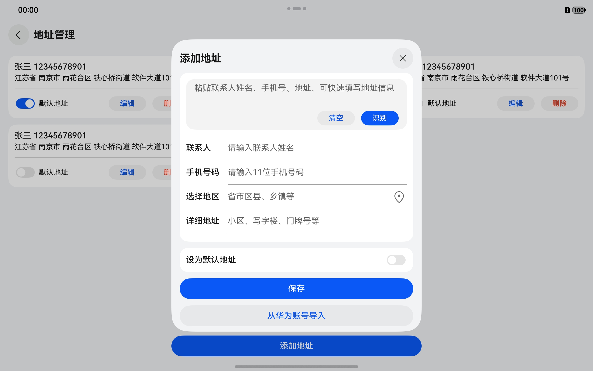

# 通用地址管理组件快速入门

## 目录

- [简介](#简介)
- [约束与限制](#约束与限制)
- [使用](#使用)
- [API参考](#API参考)
- [示例代码](#示例代码)

## 简介

本组件提供了新增/编辑/删除地址等功能，支持从地图选址、智能识别地址、获取华为账号收货地址。

<div style='overflow-x:auto'>
  <table style='min-width:800px'>
    <tr>
      <th></th>
      <th>直板机</th>
      <th>折叠屏</th>
      <th>平板</th>
    </tr>
    <tr>
      <th scope='row'>地址列表</th>
      <td valign='top'></td>
      <td valign='top'></td>
      <td valign='top'></td>
    </tr>
    <tr>
      <th scope='row'>地址编辑</th>
      <td valign='top'></td>
      <td valign='top'></td>
      <td valign='top'></td>
    </tr>
  </table>
</div>

## 约束与限制

### 环境

- DevEco Studio版本：DevEco Studio 5.0.5 Release及以上
- HarmonyOS SDK版本：HarmonyOS 5.0.5 Release SDK及以上
- 设备类型：华为手机（包括双折叠和阔折叠）、华为平板
- 系统版本：HarmonyOS 5.0.3(15)及以上

### 权限

- 网络权限：ohos.permission.INTERNET
- 振动权限：ohos.permission.VIBRATE

### 调试

- 如果您需要在模拟器环境下进行相关测试，请使用 HarmonyOS 5.1.0(18) 及以上的模拟器。(高版本模拟器可以通过最新的 DevEco Studio 下载)
- 当前模拟器不支持智能识别地址功能。
- 当前模拟器不支持华为账号收货地址导入功能。

## 使用

1. 安装组件

   如果是在 DevEco Studio 使用插件集成组件，则无需安装组件，请忽略此步骤。

   如果是从生态市场下载组件，请参考以下步骤安装组件。

   a. 解压下载的组件包，将包中所有文件夹拷贝至您工程根目录的 XXX 目录下。

   b. 在项目根目录 build-profile.json5 添加 address_management 模块。

    ```
    // 在项目根目录 build-profile.json5 填写 address_management 路径。其中 XXX 为组件存放的目录名
    "modules": [
      {
        "name": "address_management",
        "srcPath": "./XXX/address_management"
      }
    ]
    ```

   c. 在项目根目录 oh-package.json5 中添加依赖。

    ```
    // XXX 为组件存放的目录名称
    {
      "dependencies": {
        "address_management": "file:./XXX/address_management"
      }
    }
    ```

2. 配置地图服务。

   地址管理组件支持并依赖地图服务的区划选择与地点选取能力，这需要您提前开通地图服务并完成手动签名。详细参考：[地图服务开发准备](https://developer.huawei.com/consumer/cn/doc/harmonyos-guides/map-config-agc)

3. 配置华为账号服务 (可选)。

   地址管理组件支持从华为账号中导入收货地址，这需要您完成账号权限的申请并满足一系列开发前提。详细参考：[收货地址能力开发前提](https://developer.huawei.com/consumer/cn/doc/harmonyos-guides/account-choose-address-dev#section1061219267293)

   您如果跳过该项配置，仅会导致地址编辑页面的 '从华为账号导入' 按钮不可用。

4. 引入组件。

    ```
    import { AddressDTO, AddressVM, goToAddressListPage } from 'address_management';
    ```

## API参考

### 子组件

无

### 接口

**goToAddressListPage(navPathStack: NavPathStack, onAddressSelected?: (dto: AddressDTO) => void): void**

前往地址列表页。

**参数：**

| 参数名               | 类型                                                                                                                              | 是否必填  | 说明               |
|-------------------|---------------------------------------------------------------------------------------------------------------------------------|-------|------------------|
| navPathStack      | [NavPathStack](https://developer.huawei.com/consumer/cn/doc/harmonyos-references/ts-basic-components-navigation#navpathstack10) | 是     | Navigation 导航控制器 |
| onAddressSelected | (dto: [AddressDTO](#AddressDTO)) => void                                                                                        | 否     | 地址选择回调           |

### AddressDTO

地址数据的结构体。

| 字段名         | 类型      | 是否必填  | 说明               |
|-------------|---------|-------|------------------|
| id          | string  | 是     | 地址唯一标识符          |
| name        | string  | 是     | 姓名               |
| phone       | string  | 是     | 手机号              |
| countryCode | string  | 是     | 国家代码（如 'CN'）     |
| country     | string  | 是     | 国家名称             |
| province    | string  | 是     | 所在省份             |
| city        | string  | 是     | 所在城市             |
| district    | string  | 是     | 所在区/县            |
| street      | string  | 是     | 街道名称（如乡镇、街道）     |
| detail      | string  | 是     | 详细地址（如门牌号、楼栋房间号） |
| isDefault   | boolean | 是     | 是否为默认地址          |
| createdAt   | number  | 是     | 创建时间戳（毫秒）        |
| updatedAt   | number  | 是     | 更新时间戳（毫秒）        |

### AddressVM

[AddressDTO](#AddressDTO) 的 ViewModel 实现，支持数据快照，封装了对各地址属性的常用拼接，用于组件/页面的视图渲染。

#### constructor(dto?: AddressDTO)

AddressVM 的构造函数，支持通过 AddressDTO 对象进行数据初始化。

**参数：**

| 参数名  | 类型                        | 是否必填  | 说明            |
|------|---------------------------|-------|---------------|
| dto  | [AddressDTO](#AddressDTO) | 否     | AddressDTO 对象 |

#### title(): string

通过 [@Computed](https://developer.huawei.com/consumer/cn/doc/harmonyos-guides/arkts-new-computed) 装饰的方法，用于获取地址标题。

**返回值：**

| 类型     | 说明               |
|--------|------------------|
| string | 地址标题 (由姓名、手机号组成) |

#### region(): string

通过 [@Computed](https://developer.huawei.com/consumer/cn/doc/harmonyos-guides/arkts-new-computed) 装饰的方法，用于获取地区信息。

**返回值：**

| 类型     | 说明                                      |
|--------|-----------------------------------------|
| string | 地区信息 (由国家、省、市、区、街道组成，如果国家为中国，则直接从省开始拼接) |

#### fullAddress(): string

通过 [@Computed](https://developer.huawei.com/consumer/cn/doc/harmonyos-guides/arkts-new-computed) 装饰的方法，用于获取完整地址。

**返回值：**

| 类型     | 说明                  |
|--------|---------------------|
| string | 完整地址 (由地区信息、详细地址组成) |

#### refreshSnapshot(): void

刷新实例内部当前缓存的数据快照。

#### hasChanges(): boolean

校验当前数据与上次快照刷新时相比是否发生了变化 (首次快照刷新发生在实例构造完成时)。

**返回值：**

| 类型      | 说明                                |
|---------|-----------------------------------|
| boolean | true: 当前数据发生了变化, false: 当前数据未发生变化 |

#### clearRegion(): void

清除地区信息 (包含国家代码、国家、省、市、区、街道)。

#### assignFromDTO(address: AddressDTO): void

根据 AddressDTO 对象重构当前实例 (不会刷新快照)。

**参数：**

| 参数名  | 类型                        | 是否必填  | 说明            |
|------|---------------------------|-------|---------------|
| dto  | [AddressDTO](#AddressDTO) | 否     | AddressDTO 对象 |

#### toDTO(): AddressDTO

根据当前实例构造 AddressDTO 对象。

**返回值：**

| 类型                        | 说明            |
|---------------------------|---------------|
| [AddressDTO](#AddressDTO) | AddressDTO 对象 |

## 示例代码

```
import { AddressDTO, AddressVM, goToAddressListPage } from 'address_management';

@Entry
@ComponentV2
struct Index {

  private navPathStack: NavPathStack = new NavPathStack();

  public build(): void {
    Navigation(this.navPathStack) {
      Column() {
        Button('地址管理')
          .onClick(() => {
            goToAddressListPage(this.navPathStack, (dto: AddressDTO): void => {
              const address: AddressVM = new AddressVM(dto);
              this.getUIContext().getPromptAction().showToast({
                message: `${address.name}  |  ${address.phone}  |  ${address.fullAddress}`
              });
            });
          })
      }
      .width('100%')
      .height('100%')
      .justifyContent(FlexAlign.Center)
    }
    .hideTitleBar(true)
    .mode(NavigationMode.Stack)
  }
}
```
