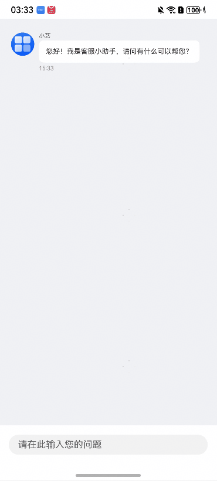

# 客服聊天组件快速入门

## 目录

- [简介](#简介)
- [约束与限制](#约束与限制)
- [快速入门](#快速入门)
- [API参考](#API参考)
- [示例代码](#示例代码)

## 简介

本模板提供客服聊天组件，提供原生的聊天交互界面。



## 约束与限制

### 环境

- DevEco Studio版本：DevEco Studio 5.0.1 Release及以上
- HarmonyOS SDK版本：HarmonyOS 5.0.1 Release SDK及以上
- 设备类型：华为手机（包括双折叠和阔折叠）
- 系统版本：HarmonyOS 5.0.1(13)及以上

## 快速入门

1. 安装组件。

   如果是在DevEco Studio使用插件集成组件，则无需安装组件，请忽略此步骤。

   如果是从生态市场下载组件，请参考以下步骤安装组件。

   a. 解压下载的组件包，将包中所有文件夹拷贝至您工程根目录的XXX目录下。

   b. 在项目根目录build-profile.json5添加module_ui_base和module_custom_service_chat模块。

   ```
   // 项目根目录下build-profile.json5填写module_ui_base和module_custom_service_chat路径。其中XXX为组件存放的目录名
   "modules": [
     {
       "name": "module_ui_base",
       "srcPath": "./XXX/module_ui_base"
     },
     {
       "name": "module_custom_service_chat",
       "srcPath": "./XXX/module_custom_service_chat"
     }
   ]
   ```

   ```
   // 在项目根目录oh-package.json5中添加依赖
   "dependencies": {
     "module_custom_service_chat": "file:./XXX/module_custom_service_chat"
   }
   ```

2. 引入组件。

   ```
   import { ChatView } from 'module_custom_service_chat';
   ```

3. 调用组件，详细参数配置说明参见[API参考](#API参考)。

## API参考

ChatView(options: [ChatViewOptions](#ChatViewOptions对象说明))

客服聊天组件。

### ChatViewOptions对象说明

| 名称          | 类型                                                         | 是否必填 | 说明     |
| ------------- | ------------------------------------------------------------ | -------- | -------- |
| serviceAvatar | [ResourceStr](https://developer.huawei.com/consumer/cn/doc/harmonyos-references/ts-types#resourcestr) | 否       | 客服头像 |
| serviceName   | string                                                       | 否       | 客服名称 |
| userAvatar    | [ResourceStr](https://developer.huawei.com/consumer/cn/doc/harmonyos-references/ts-types#resourcestr) | 否       | 用户头像 |

## 示例代码

```ts
import { KeyboardAvoidMode } from '@ohos.arkui.UIContext';
import { ChatView } from 'module_custom_service_chat';

@Entry
@ComponentV2
struct Chat {
  onPageShow(): void {
    this.getUIContext().setKeyboardAvoidMode(KeyboardAvoidMode.RESIZE_WITH_CARET)
  }

  onPageHide(): void {
    this.getUIContext().setKeyboardAvoidMode(KeyboardAvoidMode.OFFSET_WITH_CARET)
  }

  build() {
    Column() {
      ChatView({
        serviceAvatar: $r('app.media.startIcon'),
        serviceName: '小艺',
        userAvatar: $r('app.media.ic_default_avatar'),
      })
    }
    .height('100%')
    .width('100%')
  }
}
```