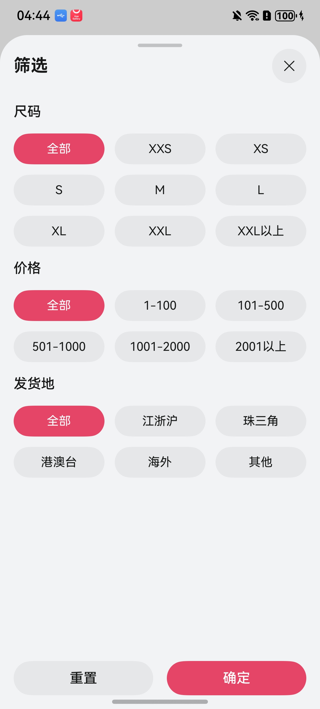

# 商品筛选组件快速入门

## 目录

- [简介](#简介)
- [约束与限制](#约束与限制)
- [使用](#使用)
- [API参考](#API参考)
- [示例代码](#示例代码)

## 简介

本组件提供了根据筛选条件对商品进行筛选的功能。



## 约束与限制

### 环境

- DevEco Studio版本：DevEco Studio 5.0.1 Release及以上
- HarmonyOS SDK版本：HarmonyOS 5.0.1 Release SDK及以上
- 设备类型：华为手机（包括双折叠和阔折叠）
- 系统版本：HarmonyOS 5.0.1(13)及以上

### 权限

无

## 使用

1. 安装组件。

   如果是在DevEco Studio使用插件集成组件，则无需安装组件，请忽略此步骤。

   如果是从生态市场下载组件，请参考以下步骤安装组件。

   a. 解压下载的组件包，将包中所有文件夹拷贝至您工程根目录的XXX目录下。

   b. 在项目根目录build-profile.json5添加module_ui_base和module_product_filter模块。

   ```
   // 项目根目录下build-profile.json5填写module_ui_base和module_product_filter路径。其中XXX为组件存放的目录名
   "modules": [
     {
       "name": "module_ui_base",
       "srcPath": "./XXX/module_ui_base"
     },
     {
       "name": "module_product_filter",
       "srcPath": "./XXX/module_product_filter"
     }
   ]
   ```

   ```
   // 在项目根目录oh-package.json5中添加依赖
   "dependencies": {
     "module_product_filter": "file:./XXX/module_product_filter"
   }
   ```

2. 引入组件。

   ```
   import { ProductFilter } from 'module_product_filter';
   ```

3. 调用组件，详细参数配置说明参见[API参考](#API参考)。

## API参考

### ProductFilter工具说明

| 名称                                                         | 描述                     |
| :----------------------------------------------------------- | :----------------------- |
| show(options: [ProductFilterOptions](#ProductFilterOptions对象说明), uiContext: [UIContext](https://developer.huawei.com/consumer/cn/doc/harmonyos-references/arkts-apis-uicontext-uicontext)) | 控制商品筛选器打开的事件 |
| hide()                                                       | 控制商品筛选器关闭的事件 |

### ProductFilterOptions对象说明

| 名称             | 类型                                                              | 是否必填 | 说明                 |
|----------------|-----------------------------------------------------------------|------|--------------------|
| filterTypeList | [FilterTypeInterface](#FilterTypeInterface接口说明)[]               | 否    | 过滤类型列表，默认为[]       |
| initFilter     | [FilterSelectionItem](#FilterSelectionItem接口说明)[]               | 否    | 初始化时选中的过滤项，默认为[]   |
| handleConfirm  | (res:[FilterSelectionItem](#FilterSelectionItem接口说明)[]) => void | 否    | 确认过滤结果时的回调函数，默认为[] |

### FilterTypeInterface对象说明

| 名称      | 类型                                          | 是否必填 | 说明          |
|---------|---------------------------------------------|------|-------------|
| id      | string                                      | 是    | 过滤类型的唯一标识符  |
| label   | string                                      | 是    | 过滤类型显示的标签   |
| options | [FilterOptionItem](#FilterOptionItem接口说明)[] | 是    | 过滤类型对应的选项列表 |

### FilterOptionItem对象说明

| 名称    | 类型     | 是否必填 | 说明      |
|-------|--------|------|---------|
| key   | string | 是    | 选项的唯一标识 |
| label | string | 是    | 选项显示的文本 |

### FilterSelectionItem对象说明

| 名称    | 类型     | 是否必填 | 说明        |
|-------|--------|------|-----------|
| id    | string | 是    | 选中的过滤类型标识 |
| value | string | 是    | 选中的过滤值    |

## 示例代码

```ts
import { FilterSelectionItem, ProductFilter } from 'module_product_filter';

@Entry
@ComponentV2
struct ProductFilterDemo {
  @Local filterList: FilterSelectionItem[] = []

  build() {
    Column({ space: 16 }) {
      Button('筛选')
        .onClick(() => {
          ProductFilter.show({
            initFilter: this.filterList,
            handleConfirm: (res) => {
              this.filterList = res
            },
          }, this.getUIContext())
        })
      Text('选择结果:')
      ForEach(this.filterList, (item: FilterSelectionItem) => {
        Text(item.id + '-' + item.value).margin({ right: 16 })
      })
    }
    .height('100%')
    .width('100%')
    .justifyContent(FlexAlign.Center)
    .alignItems(HorizontalAlign.Center)
  }
}
```
