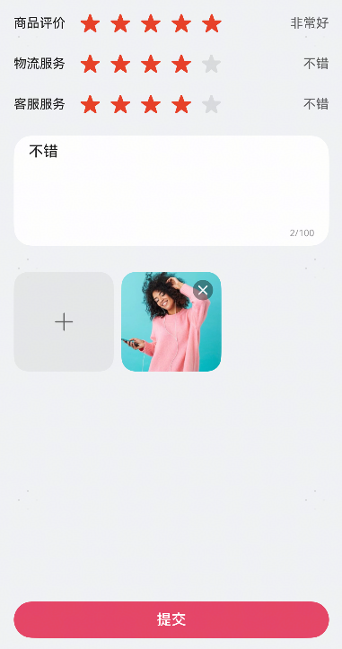

# 商品评价组件快速入门

## 目录

- [简介](#简介)
- [约束与限制](#约束与限制)
- [快速入门](#快速入门)
- [API参考](#API参考)
- [示例代码](#示例代码)

## 简介

本组件提供商品评价功能，支持评定星级、填写评价、上传图片。



## 约束与限制

### 环境

- DevEco Studio版本：DevEco Studio 5.0.1 Release及以上
- HarmonyOS SDK版本：HarmonyOS 5.0.1 Release SDK及以上
- 设备类型：华为手机（包括双折叠和阔折叠）
- 系统版本：HarmonyOS 5.0.1(13)及以上

## 快速入门

1. 安装组件。

   如果是在DevEco Studio使用插件集成组件，则无需安装组件，请忽略此步骤。

   如果是从生态市场下载组件，请参考以下步骤安装组件。

   a. 解压下载的组件包，将包中所有文件夹拷贝至您工程根目录的XXX目录下。

   b. 在项目根目录build-profile.json5添加module_ui_base和module_product_review模块。

   ```
   // 项目根目录下build-profile.json5填写module_product_review路径。其中XXX为组件存放的目录名
   "modules": [
     {
       "name": "module_ui_base",
       "srcPath": "./XXX/module_ui_base"
     },
     {
       "name": "module_product_review",
       "srcPath": "./XXX/module_product_review"
     }
   ]
   ```

   ```
   // 在项目根目录oh-package.json5中添加依赖
   "dependencies": {
     "module_product_review": "file:./XXX/module_product_review"
   }
   ```

2. 引入组件。

   ```
   import { ProductReviewCreation } from 'module_product_review';
   ```

## API参考

### 接口

ProductReviewCreation(options: ProductReviewCreationOptions)

商品评价组件。

| 参数名  | 类型                                                                  | 是否必填 | 说明                     |
| ------- | --------------------------------------------------------------------- | -------- | ------------------------ |
| options | [ProductReviewCreationOptions](#ProductReviewCreationOptions对象说明) | 否       | 配置商品评价组件的参数。 |

### ProductReviewCreationOptions对象说明

| 名称         | 类型                                                 | 是否必填 | 说明                 |
| ------------ | ---------------------------------------------------- | -------- | -------------------- |
| skuList      | [OrderSkuItem](#OrderSkuItem类型说明)[]              | 否       | 待评价的商品列表     |
| handleSubmit | (value: [ReviewDraft](#ReviewDraft类型说明)) => void | 否       | 点击提交后的回调事件 |

### OrderSkuItem类型说明

| 字段名      | 类型                                                                                                  | 是否必填 | 说明         |
| ----------- | ----------------------------------------------------------------------------------------------------- | -------- | ------------ |
| productId   | string                                                                                                | 是       | 商品ID       |
| skuCode     | string                                                                                                | 是       | 商品SKU编码  |
| skuDesc     | string                                                                                                | 是       | 商品SKU描述  |
| count       | number                                                                                                | 是       | 商品数量     |
| banner      | [ResourceStr](https://developer.huawei.com/consumer/cn/doc/harmonyos-references/ts-types#resourcestr) | 是       | 商品轮播图   |
| title       | string                                                                                                | 是       | 商品标题     |
| serviceDesc | string                                                                                                | 是       | 商品服务描述 |
| dashPrice   | number                                                                                                | 是       | 商品原价     |
| price       | number                                                                                                | 是       | 商品价格     |

### ReviewDraft类型说明

| 字段名         | 类型                              | 是否必填 | 说明               |
| -------------- | --------------------------------- | -------- | ------------------ |
| shipmentRating | number                            | 是       | 物流评分           |
| serviceRating  | number                            | 是       | 服务评分           |
| feedback       | string                            | 是       | 用户反馈内容       |
| date           | number                            | 是       | 评论日期（时间戳） |
| reviewList     | [SkuReview](#SkuReview类型说明)[] | 是       | 商品评论列表       |

### SkuReview类型说明

| 字段名    | 类型                                          | 是否必填 | 说明         |
| --------- | --------------------------------------------- | -------- | ------------ |
| productId | string                                        | 是       | 商品ID       |
| skuCode   | string                                        | 是       | 商品SKU编码  |
| skuDesc   | string                                        | 是       | 商品SKU描述  |
| rating    | number                                        | 是       | 商品评分     |
| content   | string                                        | 是       | 商品评论内容 |
| mediaList | [ReviewMediaItem](#ReviewMediaItem类型说明)[] | 是       | 评论媒体列表 |

### ReviewMediaItem类型说明

| 字段名 | 类型                                                                                                  | 是否必填 | 说明        |
| ------ | ----------------------------------------------------------------------------------------------------- | -------- | ----------- |
| uri    | [ResourceStr](https://developer.huawei.com/consumer/cn/doc/harmonyos-references/ts-types#resourcestr) | 是       | 媒体资源uri |
| type   | [ReviewMediaType](#ReviewMediaType枚举说明)                                                           | 是       | 媒体类型    |

### ReviewMediaType枚举说明

| 字段名 | 说明     |
| ------ | -------- |
| IMAGE  | 图片类型 |
| VIDEO  | 视频类型 |

## 示例代码

```ts
import { OrderSkuItem, ProductReviewCreation } from 'module_product_review';

const list: OrderSkuItem[] = [
  {
    productId: 'product_10001',
    skuCode: 'sku_100001',
    skuDesc: '粉色;160/80A',
    count: 1,
    banner: $r('app.media.mock_spec_pink'),
    title: '时尚轻商务系列针织打底纯羊毛内搭',
    serviceDesc: '运费险｜7天无理由',
    price: 188,
    dashPrice: 200,
  },
  {
    productId: 'product_10001',
    skuCode: 'sku_100002',
    skuDesc: '白色;160/80A',
    count: 1,
    banner: $r('app.media.mock_spec_white'),
    title: '时尚轻商务系列针织打底纯羊毛内搭',
    serviceDesc: '运费险｜7天无理由',
    price: 188,
    dashPrice: 200,
  },
]

@Entry
@ComponentV2
struct ProductReview {
  @Local stack: NavPathStack = new NavPathStack()

  @Builder
  pageMap(name: string) {
    if (name === 'Review1') {
      Review1()
    } else if (name === 'Review2') {
      Review2()
    }
  }

  build() {
    Navigation(this.stack) {
      Column({ space: 16 }) {
        Button('评价一件商品').onClick(() => {
          this.stack.pushPath({ name: 'Review1' })
        })
        Button('评价多件商品').onClick(() => {
          this.stack.pushPath({ name: 'Review2' })
        })
      }
    }
    .height('100%')
    .width('100%')
    .hideTitleBar(true)
    .navDestination(this.pageMap)
  }
}

@ComponentV2
struct Review1 {
  build() {
    NavDestination() {
      ProductReviewCreation({
        skuList: list.slice(0, 1),
        handleSubmit: (draft) => {
          console.log(JSON.stringify(draft))
          this.getUIContext().getPromptAction().showToast({ message: '提交成功！' })
        },
      })
    }
    .title('评价一件商品', { backgroundColor: Color.White })
  }
}

@ComponentV2
struct Review2 {
  build() {
    NavDestination() {
      ProductReviewCreation({
        skuList: list,
        handleSubmit: (draft) => {
          console.log(JSON.stringify(draft))
          this.getUIContext().getPromptAction().showToast({ message: '提交成功！' })
        },
      })
    }
    .title('评价多件商品', { backgroundColor: Color.White })
  }
}
```


