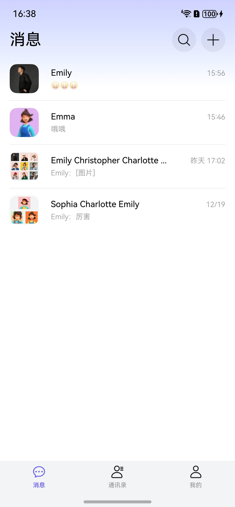
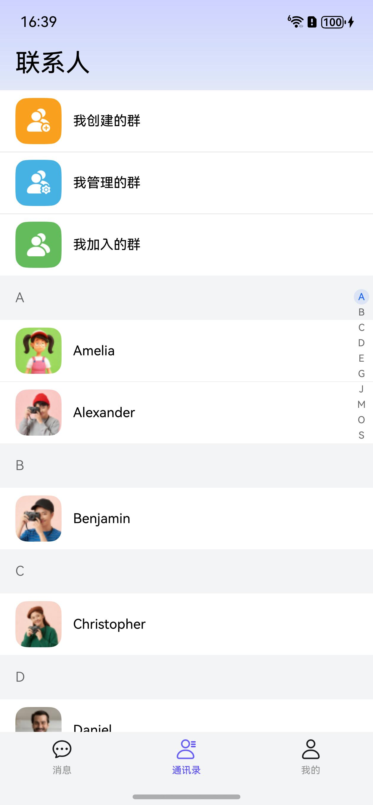
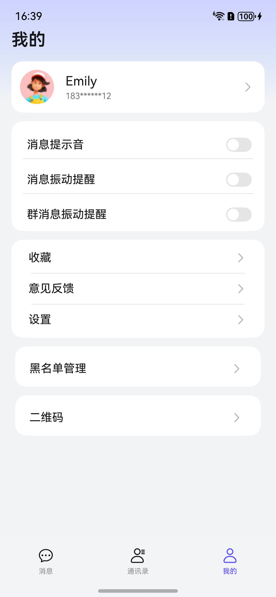
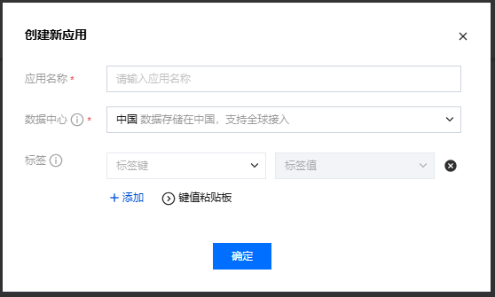
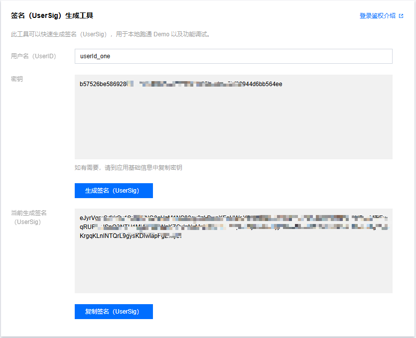
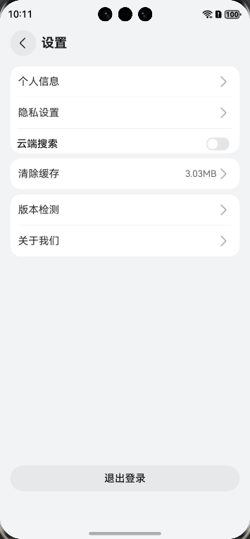
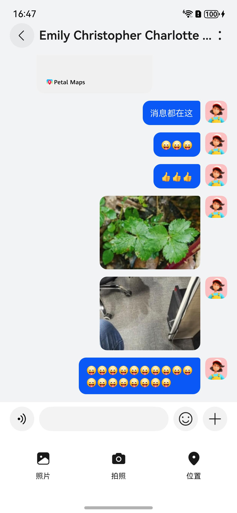

# 社交（交友）应用模板快速入门

## 目录

- [功能介绍](#功能介绍)
- [约束与限制](#约束与限制)
- [快速入门](#快速入门)
- [示例效果](#示例效果)
- [开源许可协议](#开源许可协议)
- [附录](#附录)

## 功能介绍

您可以基于此模板直接定制社交交友应用，也可以挑选此模板中提供的多种组件使用，从而降低您的开发难度，提高您的开发效率。

此模板提供如下组件，所有组件存放在工程根目录的components下，如果您仅需使用组件，可参考对应组件的指导链接；如果您使用此模板，请参考本文档。

| 组件                              | 描述                                       | 使用指导                                               |
|:--------------------------------|:-----------------------------------------|----------------------------------------------------|
| 聊天输入组件（chat_input）              | 提供即时通讯的功能，支持文本输入、长按语音、表情选择、照片/视频选择与位置选择。 | [使用指导](components/chat_input/README.md)            |
| 发送位置组件（chat_location）           | 提供选择地理位置和查看地理位置的功能。                      | [使用指导](components/chat_location/README.md)         |
| 聊天窗口组件（chat_window）             | 提供展示文本消息、表情消息、图片消息、视频消息、语音消息、地理位置消息的功能。  | [使用指导](components/chat_window/README.md)           |
| 通用登录组件（aggregated_login）        | 提供华为账号一键登录及其他方式登录（微信、手机号登录）。             | [使用指导](components/aggregated_login/README.md)      |
| 检测应用更新组件（check_app_update）      | 提供检测应用是否存在新版本功能。                         | [使用指导](components/check_app_update/README.md)      |
| 通用个人信息组件（collect_personal_info） | 支持编辑头像、昵称、姓名、性别、手机号、生日、个人简介等。            | [使用指导](components/collect_personal_info/README.md) |
| 通用问题反馈组件（feedback）              | 提供通用的问题反馈功能                              | [使用指导](components/feedback/README.md)              |

本模板为社交交友类应用提供了常用功能的开发样例，模板主要分消息、通讯录和个人中心三大模块：

* 消息：提供会话列表、消息聊天、聊天设置、添加朋友、搜索聊天记录、收藏聊天记录等功能。

* 通信录：支持查看自己创建的群、自己管理的群、自己加入的群、自己的好友等功能。

* 个人中心：提供个人信息管理、消息提醒、黑名单管理、收藏查看、个人二维码、意见反馈、设置等功能。

本模板已集成华为账号、腾讯云即时通信IM、地图展示、麦克风语音录制、视频图片等相机拍照服务，支持深色模式、适老化、无障碍等特性，提供完整的社交应用解决方案，只需做少量配置和定制即可快速实现社交应用的核心功能。

| 消息                                                            | 通讯录                                                            | 个人中心                                                           |
|---------------------------------------------------------------|----------------------------------------------------------------|----------------------------------------------------------------|
|  |  |  |

本模板主要页面及核心功能如下所示：

```text
社交交友应用模板
  ├──消息                           
  │   ├──顶部栏-搜索  
  │   │   ├── 搜索                          
  │   │   │   ├── 搜索历史                  
  │   │   │   ├── 搜索聊天记录                 
  │   │   │   ├── 搜索收藏                 
  │   │   │   └── 搜索联系人                 
  │   │   ├── 创建群聊                      
  │   │   └── 添加朋友                   
  │   │       ├── 搜索添加                
  │   │       ├── 手机联系人添加                 
  │   │       └── 扫一扫              
  │   │         
  │   ├──会话列表         
  │   │   ├── 会话消息                                             
  │   │   ├── 侧滑删除                                             
  │   │   └── 侧滑置顶
  │   │
  │   └──消息聊天    
  │       ├── 文本消息                                             
  │       ├── 表情消息                                             
  │       ├── 视频消息                      
  │       ├── 图片消息
  │       ├── 地理位置消息
  │       ├── 语音消息
  │       ├── 消息发送
  │       ├── 消息处理
  │       ├── 收藏列表
  │       └── 聊天设置              
  │           ├── 发起群聊/添加删除群员
  │           ├── 查找聊天消息
  │           ├── 设置聊天背景
  │           ├── 删除聊天记录
  │           ├── 设置群聊天消息                                          
  │           └── 解散群组
  │
  ├──通讯录                           
  │   ├──我创建的群                       
  │   ├──我管理的群                                     
  │   ├──我加入的群                       
  │   └──好友列表                                                        
  │
  └──个人中心                           
      ├──账号管理  
      │   ├── 华为账号登录                          
      │   ├── 个人信息编辑                                                   
      │   └── 账号安全设置                       
      │         
      ├──消息提醒         
      │   ├── 消息提示音
      │   ├── 消息震动提醒
      │   └── 群消息震动提醒
      │                    
      ├──收藏    
      ├──意见反馈  
      │
      ├──设置    
      │   ├── 清除缓存                                        
      │   ├── 隐私设置                   
      │   ├── 版本检测                             
      │   ├── 关于我们                             
      │   └── 退出登录
      │
      ├──黑名单管理    
      └──二维码                             
```

本模板工程代码结构如下所示：

```text
Community
├── commons                                           // 公共模块
│   ├── common/src/main/ets                           // 基础公共模块
│   │   ├── basic                                     // 基础类（ViewModel、日志等）
│   │   ├── constant                                  // 通用常量（路由、偏好设置等）
│   │   ├── core                                      // 核心功能（路由器）
│   │   ├── model                                     // 数据模型（文件信息、用户信息等）
│   │   ├── service                                   // 服务层（Mock服务）
│   │   ├── ui                                        // 通用UI组件（头部、协议页等）
│   │   └── util                                      // 通用工具类（权限、缓存、下载等）
│   └── OHRouter                                      // 路由模块
│
├── components                                       // 业务组件
│   ├── aggregated_login                             // 通用登录组件
│   ├── chat_base                                    // 聊天基础组件
│   ├── chat_history_collection                      // 聊天记录收藏组件
│   ├── chat_history_search                          // 聊天记录搜索组件
│   ├── chat_input                                   // 聊天输入组件
│   ├── chat_location                                // 发送位置组件
│   ├── chat_window                                  // 聊天窗口组件
│   ├── collect_personal_info                        // 个人信息收集组件
│   ├── feedback                                     // 意见反馈组件
│   └── check_app_update                             // 检测应用更新组件
│
├── features                                        // 功能模块
│   ├── address_book/src/main/ets                   // 通信录模块
│   │   ├── components                              // 组件
│   │   │   ├── AddressBookNavigationBar.ets        // 导航栏组件
│   │   │   └── FriendInfoRow.ets                   // 好友信息行组件
│   │   ├── pages                                   // 页面
│   │   │   ├── AddressBookPage.ets                 // 通讯录主页面
│   │   │   ├── MyGroupListPage.ets                 // 群组列表页面
│   │   │   └── MyGroupRow.ets                      // 群组行组件
│   │   └── viewmodel                               // 视图模型
│   │       ├── AddressBookPageViewModel.ets        // 通讯录视图模型
│   │       └── MyGroupListPageViewModel.ets        // 群组列表视图模型
│   │
│   ├── message/src/main/ets                       // 消息模块
│   │   ├── components                             // 组件
│   │   │   ├── AddFriendRow.ets                   // 添加好友组件
│   │   │   ├── ContactSingleRow.ets               // 联系人单项组件
│   │   │   └── ...                                // 其他组件
│   │   ├── view                                   // 页面
│   │   │   ├── MessageListPage.ets                // 消息列表页面
│   │   │   ├── MessageChatPage.ets                // 聊天页面
│   │   │   └── ...                                // 其他页面
│   │   └── viewmodel                              // 视图模型
│   │       ├── MessageListModel.ets               // 消息列表模型
│   │       ├── MessageChatModel.ets               // 聊天模型
│   │       └── ...                                // 其他模型
│   │
│   └── person/src/main/ets                       // 个人中心模块
│       ├── comp                                  // 组件
│       │   ├── UserInfoRow.ets                   // 用户信息行组件
│       │   ├── UserItem.ets                      // 用户项组件
│       │   └── ...                               // 其他组件
│       ├── viewmodel                             // 视图模型
│       │   ├── MineModel.ets                     // 个人中心模型
│       │   ├── MineViewModel.ets                 // 我的视图模型
│       │   ├── SetUpVM.ets                       // 设置视图模型
│       │   └── ...                               // 其他模型
│       └── views                                 // 视图页面
│           ├── MinePage.ets                      // 个人主页
│           ├── SetupPage.ets                     // 设置页面
│           ├── PrivacySettingsPage.ets           // 隐私设置页
│           ├── EditPersonalCenterPage.ets        // 个人资料编辑页
│           └── ...                               // 其他页面
│
├── products                                     // 产品模块
│   └── entry/src/main/ets                       // 应用入口模块
│       ├── entryability                         // 入口能力
│       │   └── EntryAbility.ets                 // 应用入口
│       ├── entrybackupability                   // 备份能力
│       │   └── EntryBackupAbility.ets           // 应用备份入口
│       ├── pages                                // 页面
│       │   ├── HomePage.ets                     // 主页
│       │   └── Index.ets                        // 入口页
│       └── viewmodels                           // 视图模型
│           ├── HomeModel.ets                    // 主页模型
│           ├── IndexVM.ets                      // 入口页模型
│           └── TabSingleItem.ets                // 底部导航模型
│
└── sdk                                        // SDK模块
    └── instant_messaging/src/main/ets         // 即时通讯SDK
        ├── control                            // 控制层
        │   ├── CMChatBase.ets                 // 聊天基类
        │   ├── CMChatFactory.ets              // 聊天工厂类
        │   └── CMChatTencent.ets              // 腾讯IM实现
        ├── listener                           // 监听器
        │   ├── CMChatAdvanceMsgListener.ets   // 高级消息监听
        │   ├── CMChatConversationListener.ets // 会话监听
        │   ├── CMChatFriendshipListener.ets   // 好友关系监听
        │   └── CMChatSDKListener.ets          // SDK事件监听
        ├── utlis                              // 工具类
        │   └── CMChatTencentUtlis.ets         // 腾讯工具类
        └── viewmodels                         // 视图模型
            ├── CMChatConversation.ets         // 会话模型
            ├── CMChatGroupMemberInfo.ets      // 群成员模型
            └── CMChatMessage.ets              // 消息模型
```

## 约束与限制

### 环境

- DevEco Studio版本：DevEco Studio 5.0.5 Release及以上
- HarmonyOS SDK版本：HarmonyOS 5.0.5 Release SDK及以上
- 设备类型：华为手机（包括双折叠和阔折叠）
- 系统版本：HarmonyOS 5.0.3(15) 及以上

### 权限

- 网络权限: ohos.permission.INTERNET
- 获取网络信息权限: ohos.permission.GET_NETWORK_INFO
- 模糊地理位置权限: ohos.permission.APPROXIMATELY_LOCATION
- 详细地理位置权限: ohos.permission.LOCATION
- 相机权限: ohos.permission.CAMERA
- 麦克风权限: ohos.permission.MICROPHONE
- 震动权限: ohos.permission.VIBRATE

## 快速入门

### 腾讯云即时通信IM控制台配置

1. 腾讯云即时通信IM需要在[腾讯云控制台](https://console.cloud.tencent.com/im)创建社交交友应用，获取应用appId

   

2. 社交交友模板应用使用mock的账户信息来登录，需要在[UserSig生成验证](https://console.cloud.tencent.com/im/tool-usersig)
   使用mock的userId来生成用户签名证书字符串

   

3. 社交交友模板应用使用了腾讯云平台的搜索插件功能，来实现应用内消息的搜索功能；腾讯云的搜索插件是增值服务类型，需要通过控制台的[插件市场](https://console.cloud.tencent.com/im/plugin)开通云端搜索服务

   

4. 腾讯云即时通信IM SDK的详细集成流程可以按照[集成文档](https://console.cloud.tencent.com/im/tool-guide)来处理
5. 社交交友模板应用搜索消息功能，默认使用本地缓存的方式来实现，可以打开**我的->设置->云端搜索**开关，来调用腾讯云平台的搜索能力

   

### 腾讯云即时通信IM SDK的使用

1. 使用ohpm安装
   ```ts
   "@tencentcloud/imsdk": "8.7.7203"
   ```

2. 初始化SDK

   ```ts
    let applicationContext = this.getUIContext().getHostContext();
    let initResult = CMChatFactory.instance.initSDK(applicationContext, /*appId*/);
   ```

3. 配置mock账户用于登录

   ```ts
   export const MOCK_ACCOUNT_LIST: MockAccountSingleModel[] = [
     {
       userId: 'user_one',
       // todo： mock的用户昵称
       nickName: '',
       // todo： mock的用户手机号
       phone: '',
       avatarUrl: 'user_one_avatar',
       // todo： 需要使用${userId}在腾讯云控制台生成签名，具体见readme
       userSig: '',
       selfSignature: ''
     }
   ];
   ```

### 配置工程

在运行此模板前，需要完成以下配置：

1. 在AppGallery Connect创建应用，将包名配置到模板中。

   a. 参考[创建HarmonyOS应用](https://developer.huawei.com/consumer/cn/doc/app/agc-help-create-app-0000002247955506)
   为应用创建APP ID，并将APP ID与应用进行关联。

   b. 返回应用列表页面，查看应用的包名。

   c. 将模板工程根目录下AppScope/app.json5文件中的bundleName（当前为"com.huawei.community"）替换为创建应用的包名。

2. 配置华为账号服务。

   a. 将应用的Client ID配置到products/entry/src/main路径下的module.json5文件中的metadata部分（当前为"xxxxxx"
   ），详细参考：[配置Client ID](https://developer.huawei.com/consumer/cn/doc/harmonyos-guides/account-client-id)。

   b.
   申请华为账号一键登录所需权限，详细参考：[配置scope权限](https://developer.huawei.com/consumer/cn/doc/harmonyos-guides/account-config-permissions)。

3. 对应用进行[手工签名](https://developer.huawei.com/consumer/cn/doc/harmonyos-guides/ide-signing#section297715173233)。

4.
添加手工签名所用证书对应的公钥指纹，详细参考：[配置应用签名证书指纹](https://developer.huawei.com/consumer/cn/doc/app/agc-help-cert-fingerprint-0000002278002933)

### 运行调试工程

1. 连接调试手机和PC。

2. 菜单选择"Run > Run 'entry' "或者"Run > Debug 'entry' "，运行或调试模板工程。

## 示例效果

运行应用后，您可以体验以下功能：

### 1. 消息模块

消息提供会话列表、消息聊天、聊天设置、添加朋友、搜索聊天记录、收藏聊天记录等功能。


**消息聊天展示**

支持的消息类型：文本、表情、图片、视频、语音、地理位置。
支持输入不同的消息类型

 

### 2. 通讯录模块

支持我创建的群、我管理的群、我加入的群、我的好友查看等功能。

 

### 3. 个人中心模块

提供个人信息管理、消息提醒、黑名单管理、收藏查看、个人二维码、意见反馈、设置等功能。


## 开源许可协议

该代码经过[Apache 2.0 授权许可](http://www.apache.org/licenses/LICENSE-2.0)。

## 附录

无
