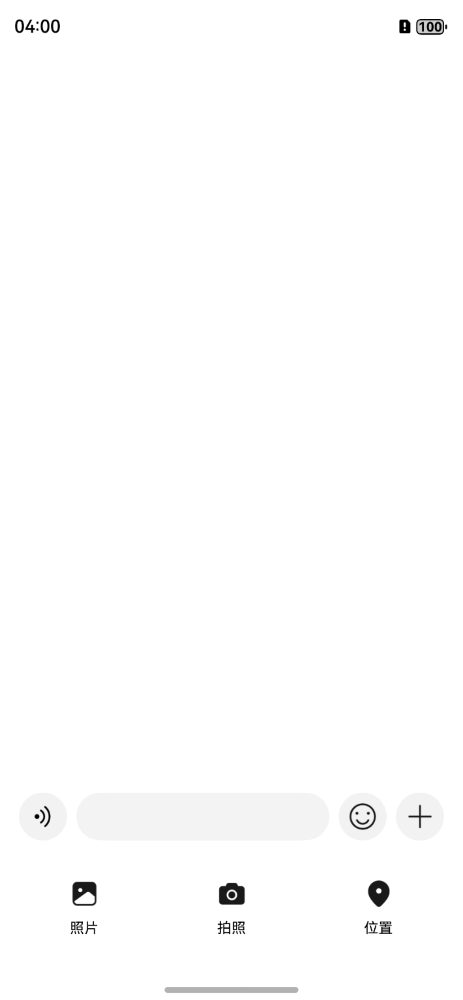

# 聊天输入组件快速入门

## 目录

- [简介](#简介)
- [约束与限制](#约束与限制)
- [使用](#使用)
- [API参考](#API参考)
- [示例代码](#示例代码)

## 简介

聊天输入组件，面向即时通讯场景，支持文本输入、长按语音、表情选择、照片/视频选择与位置选择。采用 Top/Content
结构：顶部输入行（语音/键盘切换、文本输入/按住说话、表情与更多按钮），底部 Tabs（表情页与文件选择页）。

| 聊天输入组件                                                         | 
|----------------------------------------------------------------|
|  |

## 约束与限制

### 环境

- DevEco Studio版本：DevEco Studio 5.0.5 Release及以上
- HarmonyOS SDK版本：HarmonyOS 5.0.3 Release SDK及以上
- 设备类型：华为手机（包括双折叠和阔折叠）
- 系统版本：HarmonyOS 5.0.3(15) 及以上

### 权限

- 麦克风权限：ohos.permission.MICROPHONE
- 模糊定位权限：ohos.permission.APPROXIMATELY_LOCATION
- 精准定位权限：ohos.permission.LOCATION
- 网络权限：ohos.permission.INTERNET

## 使用

1. 安装组件。

   如果是在DevEco Studio使用插件集成组件，则无需安装组件，请忽略此步骤。

   如果是从生态市场下载组件，请参考以下步骤安装组件。

   a. 解压下载的组件包，将包中所有文件夹拷贝至您工程根目录的xxx目录下。

   b. 在项目根目录build-profile.json5并添加chat_input、chat_base和chat_location模块。

   在项目根目录的build-profile.json5填写chat_input、chat_base和chat_location路径。其中xxx为组件存在的目录名称。
   ```json
   {
    "modules": [
     {
       "name": "chat_input",
       "srcPath": "./xxx/chat_input"
     },
     {
       "name": "chat_base",
       "srcPath": "./xxx/chat_base"
     },
     {
       "name": "chat_location",
       "srcPath": "./xxx/chat_location"
     }
    ]
   }
   ```

   c. 在module.json5中添加INTERNET、LOCATION、APPROXIMATELY_LOCATION、MICROPHONE相应权限。

   ```json
   {
    "requestPermissions": [
      {
        "name": "ohos.permission.INTERNET"
     },
     {
        "name": "ohos.permission.APPROXIMATELY_LOCATION",
        "reason": "$string:EntryAbility_label",
        "usedScene": {
           "abilities": [
              "EntryAbility"
           ],
           "when": "inuse"
        }
     },
     { "name": "ohos.permission.LOCATION",
        "reason": "$string:EntryAbility_label",
        "usedScene": {
           "abilities": [
              "EntryAbility"
           ],
           "when":"inuse"
        }
     },
     {
        "name": "ohos.permission.MICROPHONE",
        "reason": "$string:EntryAbility_label",
        "usedScene": {
           "abilities": [
              "EntryAbility"
           ],
           "when": "inuse"
        }
     }
    ]
   }
   ```

   d. 在项目根目录oh-package.json5中添加依赖，xxx为组件存放的目录名称

   ```json
   {
    "dependencies": {
     "chat_input": "file:./xxx/chat_input"
    }
   }
   ```

2. 引入组件。

   ```ts
   import { ChatInputComponent, ChatInputSendMessageModel } from 'chat_input';
   ```

3. 调用组件，详细参数配置说明参见[API参考](#API参考)。

   ```ts
   sendMessageAction: (content: ChatInputSendMessageModel) => void =
    (content: ChatInputSendMessageModel) => {
    }
   ChatInputComponent({
      sendMessageAction: this.sendMessageAction
    })
   ```

## API参考

### 接口

#### ChatInputComponent

ChatInputComponent(options: { sendMessageAction: (content: ChatInputSendMessageModel) => void, initialContent:
string = '' })

聊天输入组件，展示语音、输入框 、表情、文件选项。

**参数：**

| 参数                | 类型       | 是否必填 | 说明     |
|-------------------|----------|------|--------|
| sendMessageAction | Function | 是    | 输出消息内容 |
| initialContent    | string   | 否    | 默认文本内容 |

**注意：** 组件使用 `@Param` 装饰器，参数通过对象形式传递。

### 数据模型

#### ChatInputSendMessageModel

发送消息对象。

**构造函数：**

```ts
constructor(messageType: ChatTypeEnum, timeStamp: number = Date.now())
```

**参数：**

| 参数名         | 类型                            | 是否必填 | 说明   |
|-------------|-------------------------------|------|------|
| messageType | [ChatTypeEnum](#ChatTypeEnum) | 是    | 消息类型 |
| timeStamp   | number                        | 否    | 时间戳  |

**属性：**

| 名称                | 类型                            | 说明                             |
|-------------------|-------------------------------|--------------------------------|
| content           | string                        | 消息内容                           |
| messageType       | [ChatTypeEnum](#ChatTypeEnum) | 消息类型                           |
| pictureUrl        | string                        | messageType=IMAGE时，本地缓存图片地址    |
| videoUrl          | string                        | messageType=VIDEO时，本地缓存视频地址    |
| audioUrl          | string                        | messageType=SOUND，本地缓存音频地址     |
| timeStamp         | number                        | 消息生成时的时间戳                      |
| width             | number                        | 图片/视频宽度                        |
| height            | number                        | 图片/视频高度                        |
| duration          | number                        | 视频时长，单位毫秒                      |
| mimeType          | string                        | 视频格式                           |
| snapshotPath      | string                        | 视频封面路径                         |
| size              | number                        | 图片/视频大小                        |
| locationName      | string                        | 消息类型 为 LOCATION，地理位置名称         |
| locationDesc      | string                        | 消息类型 为 LOCATION，地理位置描述，发送消息时设置 |
| locationLongitude | number                        | 消息类型 为 LOCATION，经度，发送消息时设置     |
| locationLatitude  | number                        | 消息类型 为 LOCATION，纬度，发送消息时设置     |

#### ChatTypeEnum

聊天消息类型枚举

**枚举：**

| 值 | 名称                 | 说明     |
|---|--------------------|--------|
| 0 | CHAT_TYPE_NONE     | 未知消息   |
| 1 | CHAT_TYPE_TEXT     | 文本消息   |
| 3 | CHAT_TYPE_IMAGE    | 图片消息   |
| 4 | CHAT_TYPE_SOUND    | 语音消息   |
| 5 | CHAT_TYPE_VIDEO    | 视频消息   |
| 7 | CHAT_TYPE_LOCATION | 地理位置消息 |
| 9 | CHAT_GROUP_TIPS    | 群通知提醒  |

## 示例代码

```ts
import { ChatInputComponent, ChatInputSendMessageModel, ChatTypeEnum } from 'chat_input'

@Entry
@ComponentV2
export struct Index {
  sendMessageAction: (content: ChatInputSendMessageModel) => void =
    (content: ChatInputSendMessageModel) => {
      switch (content.messageType) {
        case ChatTypeEnum.CHAT_TYPE_IMAGE: {
          this.getUIContext().getPromptAction().showToast({
            message: '发送成功，图片地址：' + content.pictureUrl
          })
        }
          break
        case ChatTypeEnum.CHAT_TYPE_SOUND: {
          this.getUIContext().getPromptAction().showToast({
            message: '发送成功，语音地址：' + content.audioUrl
          })
        }
          break
        case ChatTypeEnum.CHAT_TYPE_TEXT: {
          this.getUIContext().getPromptAction().showToast({
            message: '发送成功，文本内容：' + content.content
          })
        }
          break
        case ChatTypeEnum.CHAT_TYPE_LOCATION: {
          this.getUIContext().getPromptAction().showToast({
            message: '发送成功，地理位置：' + content.locationDesc
          })
        }
          break
        case ChatTypeEnum.CHAT_TYPE_VIDEO: {
          this.getUIContext().getPromptAction().showToast({
            message: '发送成功，视频地址：' + content.videoUrl
          })
        }
          break
        default:
          break
      }
    }

  build() {
    Column() {
      ChatInputComponent({ sendMessageAction: this.sendMessageAction })
    }
    .height('100%')
    .width('100%')
    .alignItems(HorizontalAlign.Center)
    .justifyContent(FlexAlign.End)
  }
}
```
