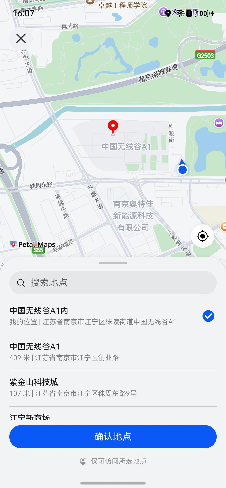
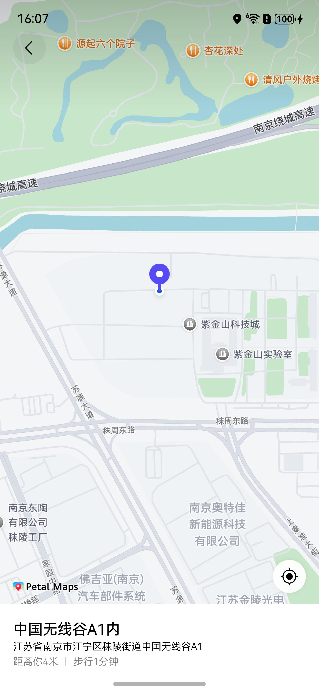

# 发送位置组件快速入门

## 目录

- [简介](#简介)
- [约束与限制](#约束与限制)
- [使用](#使用)
- [API参考](#API参考)
- [示例代码](#示例代码)

## 简介

本组件提供了选择地理位置的功能和查看地理位置的功能。

| 选择地理位置                                                                     | 查看地理位置                                                                   |
|----------------------------------------------------------------------------|--------------------------------------------------------------------------|
|  |  | 

## 约束与限制

### 环境

- DevEco Studio版本：DevEco Studio 5.0.5 Release及以上
- HarmonyOS SDK版本：HarmonyOS 5.0.3(15) Release SDK及以上
- 设备类型：华为手机（包括双折叠和阔折叠）
- 系统版本：HarmonyOS 5.0.3(15) 及以上

### 权限

- 模糊定位权限：ohos.permission.APPROXIMATELY_LOCATION
- 精准定位权限：ohos.permission.LOCATION
- 网络权限：ohos.permission.INTERNET

## 使用

1. 安装组件。
   如果是在DevEco Studio使用插件集成组件，则无需安装组件，请忽略此步骤。
   如果是从生态市场下载组件，请参考以下步骤安装组件。

   a. 解压下载的组件包，将包中所有文件夹拷贝至您工程根目录的XXX目录下。

   b. 在项目根目录build-profile.json5添加chat_base和chat_location模块。

   在项目根目录build-profile.json5填写chat_base和chat_location路径，其中XXX为组件存放的目录名称。
    ```json
   {
    "modules": [
        {
          "name": "chat_base",
          "srcPath": "./XXX/chat_base"
        },
        {
          "name": "chat_location",
          "srcPath": "./XXX/chat_location"
        }
    ]
   }
    ```

   c. 在module.json5中添加INTERNET、LOCATION、APPROXIMATELY_LOCATION相应权限。

   ```json
   {
   "requestPermissions": [
      {
        "name": "ohos.permission.INTERNET"
     },
     {
        "name": "ohos.permission.APPROXIMATELY_LOCATION",
        "reason": "$string:EntryAbility_label",
        "usedScene": {
           "abilities": [
              "EntryAbility"
           ],
           "when": "inuse"
        }
     },
     { "name": "ohos.permission.LOCATION",
        "reason": "$string:EntryAbility_label",
        "usedScene": {
           "abilities": [
              "EntryAbility"
           ],
           "when":"inuse"
        }
     }
   ]
   }
   ```

   d. 在项目根目录oh-package.json5中添加依赖，xxx为组件存放的目录名称

    ```json
      {
         "dependencies": {
          "chat_location": "file:./XXX/chat_location"
        }
     }
   ```
   
2. 引入组件。

   ```ts
    import { ChatLocationComponent, ChooseLocationUtil } from 'chat_location';
    import { ChatBreakpoint } from 'chat_location';
   ```

3. 获取适配设备数据，详细参数配置说明参见[API参考](#API参考)。

    ```ts
     chatBreakpoint = AppStorageV2.connect(ChatBreakpoint, () => new ChatBreakpoint())!;
   
    windowClass.on('avoidAreaChange', () => {
      let type = window.AvoidAreaType.TYPE_SYSTEM;
      let avoidArea = windowClass.getWindowAvoidArea(type);
      this.chatBreakpoint.topValue = px2vp(avoidArea.topRect.height);

      type = window.AvoidAreaType.TYPE_NAVIGATION_INDICATOR;
      avoidArea = windowClass.getWindowAvoidArea(type);
      this.chatBreakpoint.bottomValue = px2vp(avoidArea.bottomRect.height);
      this.chatBreakpoint.currentScreenWidth =
        windowClass.getWindowProperties().windowRect.width / display.getDefaultDisplaySync().densityPixels;
    });
    ```
4. 调用组件，详细参数配置说明参见[API参考](#API参考)。

    ```ts
        context: common.UIAbilityContext = this.getUIContext().getHostContext() as common.UIAbilityContext
        ChooseLocationUtil.chooseLocation(this.context)
          .then((result: sceneMap.LocationChoosingResult) => {
            hilog.info(0x0000, 'ChatInputComponent', '%{public}s',
                    'choose location result = ' + JSON.stringify(result));
          })
           .catch((err: BusinessError) => {
             hilog.error(0x0000, 'ChatInputComponent', '%{public}s',
               'choose location err = ' + JSON.stringify(err));
         })
   
       ChatLocationComponent({
        latitude: 31.8698571539735,
        longitude: 118.82523154589367,
        onReturnClick: () => {
        
        },
        address: '秣周东路悠湖产业园',
        addressDetail: '江苏省南京市江宁区秣周东路'
      })
    ```

## API参考

### 子组件

无

### 接口

#### ChatLocationComponent

查看地理位置组件。

**参数：**

| 参数名           | 类型       | 必填 | 说明       |
|---------------|----------|----|----------|
| latitude      | number   | 是  | 目的地的维度   |
| longitude     | number[] | 是  | 目的地的经度   |
| address       | string   | 是  | 目的地的名称   |
| addressDetail | string   | 是  | 目的地的描述   |
| onReturnClick | Function | 是  | 点击返回事件回调 |

#### ChooseLocationUtil

选择地理位置组件。

**方法：**

| 方法名            | 类型   | 说明      |
|----------------|------|---------|
| chooseLocation | 静态方法 | 拉起地点选择页 |

## 示例代码

```ts
import { common } from '@kit.AbilityKit';
import { sceneMap } from '@kit.MapKit';
import { hilog } from '@kit.PerformanceAnalysisKit';
import { BusinessError } from '@kit.BasicServicesKit';
import { AppStorageV2 } from '@kit.ArkUI';
import { ChatLocationComponent, ChooseLocationUtil } from 'chat_location';
import { ChatBreakpoint } from 'chat_location';

@Entry
@ComponentV2
struct Index {
   @Local message: string = '选择地理位置';
   @Local chatBreakpoint: ChatBreakpoint = AppStorageV2.connect(ChatBreakpoint, () => new ChatBreakpoint())!;
   @Local result: sceneMap.LocationChoosingResult = {
      location: {
         latitude: 31.8698571539735,
         longitude: 118.82523154589367
      },
      address: '江苏省南京市江宁区秣周东路',
      name: '秣周东路悠湖产业园',
      zoom: 0
   }

   build() {
      Stack({ alignContent: Alignment.TopEnd }) {
         ChatLocationComponent({
            latitude: this.result.location.latitude,
            longitude: this.result.location.longitude,
            onReturnClick: () => {

            },
            address: this.result.name,
            addressDetail: this.result.address,
         })

         Text('选择地理位置')
            .fontSize($r('sys.float.Body_M'))
            .fontColor(Color.Black)
            .fontWeight(FontWeight.Medium)
            .lineHeight(18)
            .maxLines(3)
            .textOverflow({ overflow: TextOverflow.Ellipsis })
            .textAlign(TextAlign.End)
            .width('100%')
            .height(54)
            .padding({
               top: this.chatBreakpoint.topValue,
               left: 16,
               right: 16
            })
            .onClick(() => {
               let context: common.UIAbilityContext = this.getUIContext().getHostContext() as common.UIAbilityContext
               ChooseLocationUtil.chooseLocation(context)
                  .then((result: sceneMap.LocationChoosingResult) => {
                     hilog.info(0x0000, 'ChatInputComponent', '%{public}s',
                        'choose location result = ' + JSON.stringify(result));
                     this.result = result;
                     this.message =
                        result.name + '\n' + result.address + '\n' + result.location.latitude + '\n' + result.location.longitude
                  })
                  .catch((err: BusinessError) => {
                     hilog.error(0x0000, 'ChatInputComponent', '%{public}s',
                        'choose location err = ' + JSON.stringify(err));
                  })
            })
      }
      .height('100%')
         .width('100%')
   }
}

```
