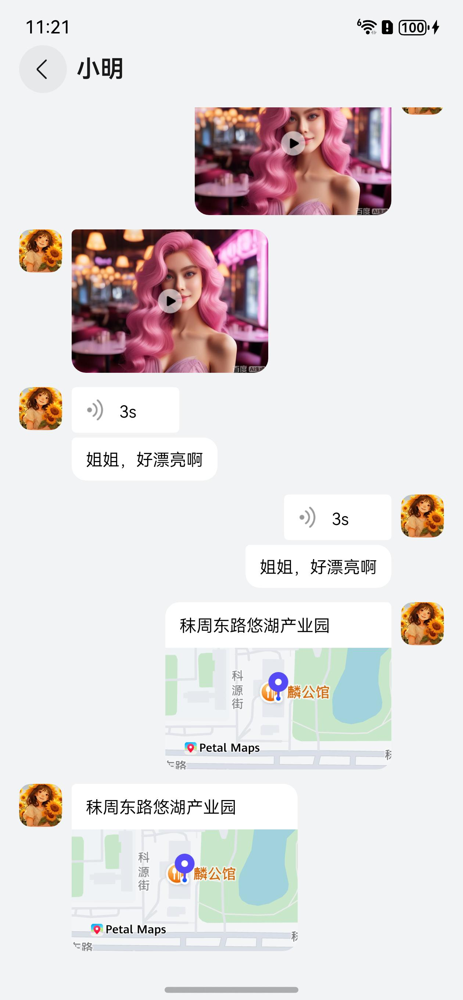

# 聊天窗口组件快速入门

## 目录

- [简介](#简介)
- [约束与限制](#约束与限制)
- [使用](#使用)
- [API参考](#API参考)
- [示例代码](#示例代码)

## 简介

本组件提供了展示文本消息、表情消息、图片消息、视频消息、语音消息、地理位置消息的功能。

| 聊天窗口消息列表                                                                 | 聊天窗口消息列表                                                                 |
|--------------------------------------------------------------------------|--------------------------------------------------------------------------|
|  |  | 

## 约束与限制

### 环境

- DevEco Studio版本：DevEco Studio 5.0.5 Release及以上
- HarmonyOS SDK版本：HarmonyOS 5.0.3(15) Release SDK及以上
- 设备类型：华为手机（包括双折叠和阔折叠）
- 系统版本：HarmonyOS 5.0.3(15) 及以上

### 权限

- 网络权限：ohos.permission.INTERNET

## 使用

1. 安装组件。

   如果是在DevEco Studio使用插件集成组件，则无需安装组件，请忽略此步骤。

   如果是从生态市场下载组件，请参考以下步骤安装组件。

   a. 解压下载的组件包，将包中所有文件夹拷贝至您工程根目录的XXX目录下。

   b. 在项目根目录build-profile.json5添加chat_base和chat_window模块。

   在项目根目录build-profile.json5填写chat_base和chat_window路径。其中XXX为组件存放的目录名称。
    ```json
    {
       "modules": [
           {
             "name": "chat_base",
             "srcPath": "./XXX/chat_base"
           },
           {
             "name": "chat_window",
             "srcPath": "./XXX/chat_window"
           }
       ]
   }
    ```

   c. 在module.json5中添加INTERNET、LOCATION、APPROXIMATELY_LOCATION、MICROPHONE相应权限。

   ```json
   {
   "requestPermissions": [
      {
        "name": "ohos.permission.INTERNET"
     }
   ]
   }
   ```

   d. 在项目根目录oh-package.json5中添加依赖，xxx为组件存放的目录名称
    ```json
      {
         "dependencies": {
          "chat_window": "file:./XXX/chat_window"
        }
     }
   ```

2. 引入组件。

   ```ts
   import {
    ChatWindowComponent,
    ChatContentAudio,
    ChatContentImage,
    ChatContentSingleModel,
    ChatTypeEnum,
    ChatBreakpoint
      } from 'chat_window';
   ```

3. 获取适配设备数据，详细参数配置说明参见[API参考](#API参考)。

    ```ts
     chatBreakpoint = AppStorageV2.connect(ChatBreakpoint, () => new ChatBreakpoint())!;
   
    windowClass.on('avoidAreaChange', () => {
      let type = window.AvoidAreaType.TYPE_SYSTEM;
      let avoidArea = windowClass.getWindowAvoidArea(type);
      this.chatBreakpoint.topValue = px2vp(avoidArea.topRect.height);

      type = window.AvoidAreaType.TYPE_NAVIGATION_INDICATOR;
      avoidArea = windowClass.getWindowAvoidArea(type);
      this.chatBreakpoint.bottomValue = px2vp(avoidArea.bottomRect.height);
      this.chatBreakpoint.currentScreenWidth =
        windowClass.getWindowProperties().windowRect.width / display.getDefaultDisplaySync().densityPixels;
    });
    ```
4. 调用组件，详细参数配置说明参见[API参考](#API参考)。

    ```ts
      onReturnClick: () => void = () => {

      }
      scroller: ListScroller = new ListScroller();
      chatContentList: ChatContentSingleModel[] = [];
      ChatWindowComponent({
         onReturnClick: this.onReturnClick,
         title: '聊天对象名称',
         chatContentList: this.chatContentList,
         scroller: this.scroller
      })
    ```

## API参考

### 子组件

无

### 接口

#### ChatWindowComponent

**参数：**

| 参数名               | 类型                                                  | 是否必填 | 说明              |
|-------------------|-----------------------------------------------------|------|-----------------|
| onReturnClick     | Function                                            | 是    | 返回事件回调          |
| chatContentList   | [ChatContentSingleModel](#ChatContentSingleModel)[] | 是    | 组件展示的数据内容       |
| title             | string                                              | 否    | 组件标题，聊天对象名称     |
| scroller          | ListScroller                                        | 否    | 滑动组件控制器         |
| onChatBubbleClick | Function                                            | 否    | 聊天消息点击事件回调      |
| onChatAvatarClick | Function                                            | 否    | 头像点击事件回调        |
| isShowRightImage  | boolean                                             | 否    | 是否展示右上角更多按钮     |
| menuList          | MenuElement[]                                       | 否    | 右上角更多按钮点击后的弹框内容 |

### 数据模型

#### ChatContentSingleModel

聊天消息结构类

**主要属性：**

| 参数名               | 类型                                            | 说明                                                |
|-------------------|-----------------------------------------------|---------------------------------------------------|
| forwardMessage    | Object                                        | 转发的消息对象                                           |
| chatId            | string                                        | 消息 ID                                             |
| ConversationType  | [ChatConversationType](#ChatConversationType) | 会话类型                                              |
| timestamp         | number                                        | 消息的 UTC 时间戳                                       |
| nickName          | string                                        | 消息发送者昵称                                           |
| friendRemark      | string                                        | 消息发送者好友备注                                         |
| avatarUrl         | string                                        | 消息发送者头像                                           |
| chatType          | [ChatTypeEnum](#ChatTypeEnum)                 | 消息元素类型                                            |
| groupId           | string                                        | 如果是群组消息，groupID 为会话群组 ID，否则为空                     |
| userId            | string                                        | 如果是单聊消息，userID 为会话用户 ID，否则为空                      |
| sender            | string                                        | 消息发送者                                             |
| keyId             | string                                        | 消息序列号                                             |
| isOwner           | boolean                                       | 消息发送者是否是自己                                        |
| textElem          | string                                        | 消息类型 为 CHAT_TYPE_TEXT，textElem 会存储文本消息内容          |
| locationName      | string                                        | 消息类型 为 CHAT_TYPE_LOCATION，地理位置名称                  |
| locationDesc      | string                                        | 消息类型 为 CHAT_TYPE_LOCATION，地理位置描述信息                |
| locationLongitude | number                                        | 消息类型 为 CHAT_TYPE_LOCATION，经度，发送消息时设置              |
| locationLatitude  | number                                        | 消息类型 为 CHAT_TYPE_LOCATION，纬度，发送消息时设置              |
| groupTipContent   | string                                        | 消息类型 为 CHAT_GROUP_TIPS，群消息提醒内容                    |
| imageInfo         | [ChatContentImage](#ChatContentImage)[]       | 消息类型 为 CHAT_TYPE_IMAGE，ChatContentImage 会存储图片消息内容 |
| soundInfo         | [ChatContentAudio](#ChatContentAudio)         | 消息类型 为 CHAT_ELEM_TYPE_SOUND，soundInfo 会存储语音消息内容   |
| speechToText      | string                                        | 语音转换文字内容                                          |
| videoChatSrc      | string                                        | 视频URL                                             |
| type              | string                                        | 视频类型                                              |
| duration          | number                                        | 视频时间                                              |
| snapshotPath      | string                                        | 视频封面                                              |

#### ChatContentImage

图片消息结构类

**主要属性：**

| 参数名    | 类型     | 说明                     |
|--------|--------|------------------------|
| uuid   | string | 图片 ID，内部标识，可用于外部缓存 key |
| type   | number | 图片类型，1: 原图，2：缩略图，4：大图  |
| size   | number | 图片大小（type == 1 有效）     |
| width  | number | 图片宽度                   |
| height | number | 图片高度                   |
| url    | string | 图片 url                 |

#### ChatContentAudio

语音消息结构类

**主要属性：**

| 参数名      | 类型     | 说明               |
|----------|--------|------------------|
| path     | string | 语音文件路径，只有发送方才能获取 |
| uuid     | string | 语音消息内部 ID        |
| dataSize | number | 语音数据大小           |
| duration | number | 语音长度（秒）          |
| url      | string | 获取语音的 URL 下载地址   |

#### ChatConversationType

聊天会话类型枚举

**枚举：**

| 值 | 名称           | 说明 |
|---|--------------|----|
| 0 | CHAT_UNKNOWN | 未知 |
| 1 | CHAT_C2C     | 单聊 |
| 2 | CHAT_GROUP   | 群聊 |

#### ChatTypeEnum

聊天消息类型枚举

**枚举：**

| 值 | 名称                 | 说明     |
|---|--------------------|--------|
| 0 | CHAT_TYPE_NONE     | 未知消息   |
| 1 | CHAT_TYPE_TEXT     | 文本消息   |
| 3 | CHAT_TYPE_IMAGE    | 图片消息   |
| 4 | CHAT_TYPE_SOUND    | 语音消息   |
| 5 | CHAT_TYPE_VIDEO    | 视频消息   |
| 7 | CHAT_TYPE_LOCATION | 地理位置消息 |
| 9 | CHAT_GROUP_TIPS    | 群通知提醒  |

#### ChatBreakpoint

一多适配的数据结构类

**主要属性：**

| 参数名                | 类型     | 说明            |
|--------------------|--------|---------------|
| topValue           | number | 顶部状态栏高度       |
| bottomValue        | number | 底部状态栏高度       |
| currentScreenWidth | number | 当前屏幕宽度        |
| pagePadding        | number | 根据当前断点，获取页面边距 |

## 示例代码

```ts
import { ChatBreakpoint, ChatContentAudio, ChatContentImage, ChatContentSingleModel, ChatTypeEnum } from 'chat_window';
import { ChatWindowComponent } from 'chat_window';
import { AppStorageV2 } from '@kit.ArkUI';

@Entry
@ComponentV2
struct Index {
  @Local chatContentList: ChatContentSingleModel[] = [];
  @Local chatBreakpoint: ChatBreakpoint = AppStorageV2.connect(ChatBreakpoint, () => new ChatBreakpoint())!;

  aboutToAppear(): void {
    let custom = new ChatContentSingleModel();
    custom.chatType = ChatTypeEnum.CHAT_TYPE_TEXT;
    custom.textElem = '你好啊，😀😀😀，我们一起到软件园玩吧，顺便买杯奶茶，看个电影';
    custom.avatarUrl = 'https://gips2.baidu.com/it/u=1651586290,17201034&fm=3028&app=3028&f=JPEG&fmt=auto&' +
      'q=100&size=f600_800';
    custom.isOwner = true;

    let otherCustom = new ChatContentSingleModel();
    otherCustom.chatType = ChatTypeEnum.CHAT_TYPE_TEXT;
    otherCustom.textElem = '好啊好啊，😀😀😀，要不要结束的时候再去老门东逛个街，看看那边的好玩的，' +
      'https://gips2.baidu.com/it/u=1651586290_17201034&fm=3028&app=3028';
    otherCustom.avatarUrl = 'https://gips2.baidu.com/it/u=1651586290,17201034&fm=3028&app=3028&f=JPEG&fmt=auto&' +
      'q=100&size=f600_800';
    otherCustom.isOwner = false;

    let otherImage = new ChatContentSingleModel();
    otherImage.chatType = ChatTypeEnum.CHAT_TYPE_IMAGE;
    let otherImageModel = new ChatContentImage();
    otherImageModel.url = 'https://gips2.baidu.com/it/u=1651586290,17201034&fm=3028&app=3028&f=JPEG&fmt=auto&' +
      'q=100&size=f600_800';
    otherImage.imageInfo = [otherImageModel];
    otherImage.isOwner = false;
    otherImage.avatarUrl = 'https://gips2.baidu.com/it/u=1651586290,17201034&fm=3028&app=3028&f=JPEG&fmt=auto&' +
      'q=100&size=f600_800';

    let image = new ChatContentSingleModel();
    image.chatType = ChatTypeEnum.CHAT_TYPE_IMAGE;
    let imageModel = new ChatContentImage();
    imageModel.url = 'https://gips2.baidu.com/it/u=1651586290,17201034&fm=3028&app=3028&f=JPEG&fmt=auto&' +
      'q=100&size=f600_800';
    image.imageInfo = [imageModel];
    image.isOwner = true;
    image.avatarUrl = 'https://gips2.baidu.com/it/u=1651586290,17201034&fm=3028&app=3028&f=JPEG&fmt=auto&' +
      'q=100&size=f600_800';

    let video = new ChatContentSingleModel();
    video.chatType = ChatTypeEnum.CHAT_TYPE_VIDEO;
    video.isOwner = true;
    video.videoChatSrc = 'https://haokan.baidu.com/v?vid=2367902486523572908&pd=pcshare&hkRelaunch=' +
      'p1%3Dpc%26p2%3Dvideoland%26p3%3Dshare_input';
    video.snapshotPath = 'https://gips1.baidu.com/it/u=3309509281,2660302226&fm=3042&app=3042&f=JPEG&' +
      'wm=1,baiduai3,0,0,13,9&wmo=5,5&w=640&h=480';
    video.avatarUrl = 'https://gips2.baidu.com/it/u=1651586290,17201034&fm=3028&app=3028&f=JPEG&' +
      'fmt=auto&q=100&size=f600_800';

    let otherVideo = new ChatContentSingleModel();
    otherVideo.chatType = ChatTypeEnum.CHAT_TYPE_VIDEO;
    otherVideo.isOwner = false;
    otherVideo.videoChatSrc = 'https://haokan.baidu.com/v?vid=2367902486523572908&pd=pcshare&hkRelaunch=' +
      'p1%3Dpc%26p2%3Dvideoland%26p3%3Dshare_input';
    otherVideo.snapshotPath = 'https://gips1.baidu.com/it/u=3309509281,2660302226&fm=3042&app=3042&f=JPEG&' +
      'wm=1,baiduai3,0,0,13,9&wmo=5,5&w=640&h=480';
    otherVideo.avatarUrl = 'https://gips2.baidu.com/it/u=1651586290,17201034&fm=3028&app=3028&f=JPEG&' +
      'fmt=auto&q=100&size=f600_800';

    let otherVoice = new ChatContentSingleModel();
    otherVoice.chatType = ChatTypeEnum.CHAT_TYPE_SOUND;
    otherVoice.isOwner = false;
    otherVoice.speechToText = '姐姐，好漂亮啊';
    otherVoice.avatarUrl = 'https://gips2.baidu.com/it/u=1651586290,17201034&fm=3028&app=3028&f=JPEG&fmt=auto&' +
      'q=100&size=f600_800';
    let otherVoiceModel = new ChatContentAudio()
    otherVoiceModel.duration = 3;
    otherVoiceModel.url = '语音文件链接';
    otherVoice.soundInfo = otherVoiceModel;

    let voice = new ChatContentSingleModel();
    voice.chatType = ChatTypeEnum.CHAT_TYPE_SOUND;
    voice.isOwner = true;
    voice.speechToText = '姐姐，好漂亮啊';
    voice.avatarUrl = 'https://gips2.baidu.com/it/u=1651586290,17201034&fm=3028&app=3028&f=JPEG&fmt=auto&' +
      'q=100&size=f600_800';
    let voiceModel = new ChatContentAudio()
    voiceModel.duration = 3;
    voiceModel.url = '语音文件链接';
    voice.soundInfo = voiceModel;

    let location = new ChatContentSingleModel();
    location.chatType = ChatTypeEnum.CHAT_TYPE_LOCATION;
    location.isOwner = true;
    location.avatarUrl = 'https://gips2.baidu.com/it/u=1651586290,17201034&fm=3028&app=3028&f=JPEG&' +
      'fmt=auto&q=100&size=f600_800';
    location.locationName = '秣周东路悠湖产业园'
    location.locationLatitude = 31.8698571539735;
    location.locationLongitude = 118.82523154589367;

    let otherLocation = new ChatContentSingleModel();
    otherLocation.chatType = ChatTypeEnum.CHAT_TYPE_LOCATION;
    otherLocation.isOwner = false;
    otherLocation.avatarUrl = 'https://gips2.baidu.com/it/u=1651586290,17201034&fm=3028&app=3028&f=JPEG&' +
      'fmt=auto&q=100&size=f600_800';
    otherLocation.locationName = '秣周东路悠湖产业园'
    otherLocation.locationLatitude = 31.8698571539735;
    otherLocation.locationLongitude = 118.82523154589367;

    this.chatContentList = [
      custom,otherCustom, otherImage, image,video, otherVideo, otherVoice,voice, location, otherLocation
    ]
  }

  build() {
    Column() {
      ChatWindowComponent({
        chatContentList: this.chatContentList,
        title: '小明',
        isShowRightImage: false,
        onReturnClick: () => {

        }
      });
    }
    .backgroundColor(0xf1f3f5)
      .height('100%')
      .width('100%')
      .padding({
        bottom: this.chatBreakpoint.bottomValue
      })
  }
}

```
