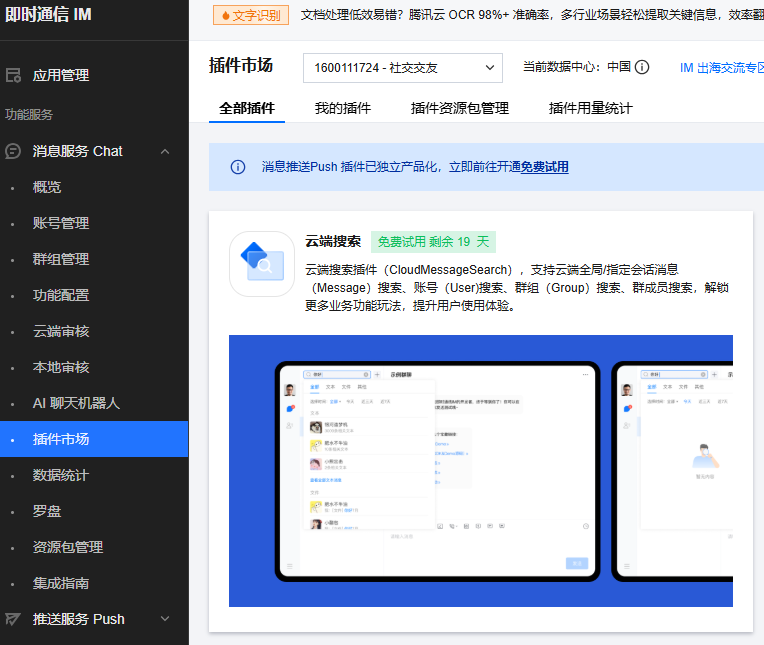

# 即时通信SDK集成快速入门

## 目录

- [简介](#简介)
- [约束与限制](#约束与限制)
- [使用](#使用)
- [API参考](#API参考)
- [示例代码](#示例代码)

## 简介

本SDK提供了即时通信SDK的初始化登录、获取会话列表、消息列表、会话和消息监听、添加好友、创建群组等接口的功能。
SDK使用工厂模式，允许开发者集成使用不同厂家的即时通信SDK，来对CMChatBase重写，实现不同SDK的集成使用，当前使用腾讯云即时通信IM
SDK来为例，说明SDK的使用。

## 约束与限制

### 环境

- DevEco Studio版本：DevEco Studio 5.0.5 Release及以上
- HarmonyOS SDK版本：HarmonyOS 5.0.3(15) Release SDK及以上
- 设备类型：华为手机（包括双折叠和阔折叠）
- 系统版本：HarmonyOS 5.0.3(15) 及以上

## 使用

### 腾讯云即时通信IM控制台配置

1. 腾讯云即时通信IM需要在[腾讯云控制台](https://console.cloud.tencent.com/im)创建社交交友应用，获取应用appId

   
   
2. 社交交友模板应用使用mock的账户信息来登录，需要在[UserSig生成验证](https://console.cloud.tencent.com/im/tool-usersig)
   使用mock的userId来生成用户签名证书字符串

   
   
3. 社交交友模板应用使用了腾讯云平台的搜索插件功能，来实现应用内消息的搜索功能；腾讯云的搜索插件是增值服务类型，需要通过控制台的[插件市场](https://console.cloud.tencent.com/im/plugin)
开通云端搜索服务

   

4. 腾讯云即时通信IM SDK的详细集成流程可以按照[集成文档](https://console.cloud.tencent.com/im/tool-guide)来处理
5. 社交交友模板应用搜索消息功能，默认使用本地缓存的方式来实现，可以打开**我的->设置->云端搜索**开关，来调用腾讯云平台的搜索能力

   

### 项目中SDK使用

1. 安装SDK。
   如果是在DevEco Studio使用插件集成SDK，则无需安装SDK，请忽略此步骤。
   如果是从生态市场下载SDK，请参考以下步骤安装SDK。
   a. 解压下载的SDK包，将包中所有文件夹拷贝至您工程根目录的XXX目录下。
   b. 在项目根目录build-profile.json5添加instant_messaging模块。

   // 在项目根目录build-profile.json5填写instant_messaging路径。其中XXX为SDK存放的目录名
    ```json
   {
    "modules": [
        {
          "name": "instant_messaging",
          "srcPath": "./XXX/instant_messaging"
        }
    ]
   }
    ```
   c. 在项目根目录oh-package.json5中添加依赖。
   XXX为SDK存放的目录名称
    ```json
      {
         "dependencies": {
          "instant_messaging": "file:./XXX/instant_messaging"
        }
     }
   ```

2. 填写在腾讯云即时通信IM控制台生成的用户签名证书字符串到**commons->common->src->main->ets->constant->Constants.ets**中的MOCK_ACCOUNT_LIST里面
```ts
export const MOCK_ACCOUNT_LIST: MockAccountSingleModel[] = [
  {
    userId: 'user_one',
     // todo： mock的用户昵称
    nickName: 'xxx',
     // todo： mock的用户手机号
    phone: 'xxx',
    avatarUrl: 'user_one_avatar',
     // todo： 需要使用${userId}在腾讯云控制台生成签名
    userSig: 'xxx',
    selfSignature : ''
  }
  ]
```

3. 引入SDK。

```ts
    import { 
    CMChatConversation, 
    CMChatGroupInfo,
    CMChatConversationOperationResult,
    CMChatConversationResult,
    CMChatConversationType,
    CMChatFactory,
    CMChatMessage,
    ...
   } from 'instant_messaging';
```

4. 调用SDK，详细参数配置说明参见[API参考](#API参考)。

```ts
   // 初始化SDK xxx是在腾讯云即时通信IM控制台新建应用的appId
   let applicationContext = context as common.ApplicationContext;
   CMChatFactory.instance.initSDK(applicationContext, xxx)
   // 登录SDK
   await CMChatFactory.instance.login('userId', 'userSig')
   // 获取会话列表
   let result = await CMChatFactory.instance.getConversationListByFilter(0);
   // 获取消息列表 xxx是用户id，xxxx是群组id， xx是请求的消息数量
   let result =
      await CMChatFactory.instance.getHistoryMessageList('xxx', 'xxxx', xx);
   // ...
```
5.

SDK集成使用的腾讯云即时通信IM，增值服务搜索功能，有体验版免费试用和收费版本两种，体验版账号首次免费额度是100000搜索量，10000请求量，有效期是一个月，可提交两次申请，第二次有效期是七天；收费版根据开通的版本（企业版、旗舰版、专业版）不同，每个月的费用是6000元、3000元、1500元；社交交友本地缓存的搜索功能，是在app冷启动后，将用户的会话列表和对应的消息列表请求并缓存下载，用于在搜索时只会从这次缓存的数据中查看对应的消息。社交交友模板应用的两个搜索功能可以通过
**我的->设置->云端搜索**开关来切换

## API参考

### 接口

#### CMChatFactory

即时通信SDK工厂类，用于初始化不同厂家的即时通信sdk的实现类。

#### CMChatBase

即时通信SDK接口基类。

**方法：**

| 方法名                                 | 参数                                                                                                             | 返回值                                                                                | 说明                     |
|-------------------------------------|----------------------------------------------------------------------------------------------------------------|------------------------------------------------------------------------------------|------------------------|
| initSDK                             | context: common.ApplicationContext, sdkAppID: number                                                           | boolean                                                                            | 初始化 SDK                |
| addSDKListener                      | listener: [CMChatSDKListener](#CMChatSDKListener)                                                              | void                                                                               | 添加 SDK 监听              |
| login                               | userID: string, userSig: string                                                                                | Promise\<void\>                                                                    | 登录                     |
| logout                              | void                                                                                                           | Promise\<void\>                                                                    | 登出                     |
| getLoginStatus                      | void                                                                                                           | number                                                                             | 获取登录状态                 |
| setSelfInfo                         | nickName: string, avatar: string                                                                               | Promise\<void\>                                                                    | 修改个人资料（昵称、头像）          |
| getConversationListByFilter         | nextSeq: number, count?: number                                                                                | Promise<[CMChatConversationResult](#CMChatConversationResult)>                     | 获取会话列表                 |
| addConversationListener             | listener: [CMChatConversationListener](#CMChatConversationListener)                                            | void                                                                               | 添加会话监听器                |
| removeConversationListener          | void                                                                                                           | void                                                                               | 移除会话监听器                |
| pinConversation                     | conversationID: string, isPinned: boolean                                                                      | Promise\<void\>                                                                    | 会话置顶                   |
| deleteConversation                  | conversationID: string                                                                                         | Promise\<void\>                                                                    | 删除会话                   |
| deleteConversationList              | conversationIDList: string[], clearMessage: boolean                                                            | Promise<[CMChatConversationOperationResult](#CMChatConversationOperationResult)[]> | 删除会话列表                 |
| cleanConversationUnreadMessageCount | conversationID: string, cleanTimestamp: number                                                                 | Promise\<void\>                                                                    | 清理会话的未读消息计数            |
| addFriend                           | userID: string, nickName: string                                                                               | Promise<[CMChatFriendOperationResult](#CMChatFriendOperationResult)>               | 添加好友                   |
| deleteFromFriendList                | userIDList: string[]                                                                                           | Promise<[CMChatFriendOperationResult](#CMChatFriendOperationResult)[]>             | 删除好友                   |
| getFriendList                       | void                                                                                                           | Promise<[CMChatFriendInfo](#CMChatFriendInfo)[]>                                   | 获取好友列表                 |
| addFriendshipListener               | listener: [CMChatFriendshipListener](#CMChatFriendshipListener)                                                | void                                                                               | 监听好友变化                 |
| removeFriendListener                | void                                                                                                           | void                                                                               | 移除关系链监听器               |
| getFriendsInfo                      | userIDList: string[]                                                                                           | Promise<[CMChatFriendInfo](#CMChatFriendInfo)[]>                                   | 获取指定好友资料               |
| setFriendInfo                       | userID: string, friendRemark: string                                                                           | Promise\<void\>                                                                    | 设置指定好友备注               |
| checkFriend                         | userIDList: string[]                                                                                           | Promise<[CMChatFriendCheckResult](#CMChatFriendCheckResult)[]>                     | 检查指定用户的好友关系            |
| addToBlackList                      | userIDList: string[]                                                                                           | Promise<[CMChatFriendOperationResult](#CMChatFriendOperationResult)[]>             | 添加用户到黑名单               |
| deleteFromBlackList                 | userIDList: string[]                                                                                           | Promise<[CMChatFriendOperationResult](#CMChatFriendOperationResult)[]>             | 把用户从黑名单中删除             |
| getBlackList                        | void                                                                                                           | Promise<[CMChatFriendInfo](#CMChatFriendInfo)[]>                                   | 获取黑名单列表                |
| addAdvancedMsgListener              | listener: [CMChatAdvanceMsgListener](#CMChatAdvanceMsgListener)                                                | void                                                                               | 添加高级消息的事件监听器           |
| removeAdvancedMsgListener           | void                                                                                                           | void                                                                               | 移除高级消息监听器              |
| getHistoryMessageList               | userID?: string, groupID?: string, count?: number                                                              | Promise<[CMChatMessage](#CMChatMessage)[]>                                         | 获取历史消息、撤回、删除、标记已读等高级接口 |
| createCustomMessage                 | data: ArrayBuffer, userId?: string, groupId?: string                                                           | Promise<[CMChatMessage](#CMChatMessage)>                                           | 创建自定义消息                |
| createLocationMessage               | name: string, desc: string, longitude: number, latitude: number, userId?: string, groupId?: string             | Promise<[CMChatMessage](#CMChatMessage)>                                           | 创建地理位置消息               |
| createImageMessage                  | imagePath: string, userId?: string, groupId?: string                                                           | Promise<[CMChatMessage](#CMChatMessage)>                                           | 创建图片消息                 |
| createSoundMessage                  | soundPath: string, duration: number, userId?: string, groupId?: string                                         | Promise<[CMChatMessage](#CMChatMessage)>                                           | 创建语音消息                 |
| createVideoMessage                  | videoFilePath: string, type: string, duration: number, snapshotPath: string, userId?: string, groupId?: string | Promise<[CMChatMessage](#CMChatMessage)>                                           | 创建视频接口                 |
| createForwardMessage                | forwardMsg?: Object, userId?: string, groupId?: string                                                         | Promise<[CMChatMessage](#CMChatMessage) \| undefined>                              | 创建转发消息                 |
| createGroup                         | memberList?: [CMChatGroupMemberInfo](#CMChatGroupMemberInfo)[]                                                 | Promise\<string\>                                                                  | 创建自定义群组                |
| getJoinedGroupList                  | void                                                                                                           | Promise<[CMChatGroupInfo](#CMChatGroupInfo)[]>                                     | 获取当前用户已经加入的群列表         |
| getGroupMemberList                  | groupID: string, filter: number, nextSeq: number                                                               | Promise<[CMChatGroupMemberResult](#CMChatGroupMemberResult)>                       | 获取群成员列表                |
| getGroupsInfo                       | groupIDList: string[]                                                                                          | Promise<[CMChatGroupInfo](#CMChatGroupInfo)[]>                                     | 拉取群资料                  |
| setGroupInfo                        | info: [CMChatGroupInfo](#CMChatGroupInfo)                                                                      | Promise\<void\>                                                                    | 修改群资料                  |
| quitGroup                           | groupID: string                                                                                                | Promise\<void\>                                                                    | 退出群聊接口                 |
| dismissGroup                        | groupID: string                                                                                                | Promise\<void\>                                                                    | 解散群聊接口                 |
| inviteUserToGroup                   | groupID: string, userList: string[]                                                                            | Promise<[GroupMemberOperationResult](#GroupMemberOperationResult)[]>               | 邀请他人入群                 |
| kickGroupMember                     | groupID: string, memberList: string[], reason: string, duration: number                                        | Promise<[GroupMemberOperationResult](#GroupMemberOperationResult)[]>               | 群聊踢人                   |
| setGroupMemberRole                  | groupID: string, userID: string, role: number                                                                  | Promise\<void\>                                                                    | 设置管理员和取消管理员接口          |
| searchMessage                       | searchKey: string, userId?: string, groupId?: string, startDate?: number                                       | Promise<[CMChatMessage](#CMChatMessage)[]>                                         | 搜索聊天记录                 |
| searchContact                       | searchKey: string                                                                                              | Promise<[CMChatFriendInfo](#CMChatFriendInfo)[]                                    | 搜索好友                   |
| delMessages                         | messages: Object[]                                                                                             | Promise\<void\>                                                                    | 删除消息                   |

#### CMChatTencent

腾讯云即时通信SDK实现类，继承[CMChatBase](#CMChatBase)，是对[CMChatBase](#CMChatBase)类的各个方法的重写。

#### CMChatAdvanceMsgListener

高级消息监听器

**属性：**

| 参数名              | 类型                                                 | 说明    |
|------------------|----------------------------------------------------|-------|
| onRecvNewMessage | (message: [CMChatMessage](#CMChatMessage)) => void | 收到新消息 |

#### CMChatConversationListener

会话事件的监听类

**属性：**

| 参数名                   | 类型                                                                   | 说明            |
|-----------------------|----------------------------------------------------------------------|---------------|
| onNewConversation     | (conversations: [CMChatConversation](#CMChatConversation)[]) => void | 有新的会话         |
| onConversationChanged | (conversations: [CMChatConversation](#CMChatConversation)[]) => void | 某些会话的关键信息发生变化 |

#### CMChatFriendshipListener

好友关系监听类

**属性：**

| 参数名                 | 类型                                                            | 说明      |
|---------------------|---------------------------------------------------------------|---------|
| onFriendListAdded   | (userIDList: [CMChatFriendInfo](#CMChatFriendInfo)[]) => void | 好友新增通知  |
| onFriendListDeleted | (userIDList: string[]) => void                                | 好友删除通知  |
| onBlackListAdded    | (infoList: [CMChatFriendInfo](#CMChatFriendInfo)[]) => void   | 黑名单新增通知 |
| onBlackListDeleted  | (userIDList: string[]) => void                                | 黑名单删除通知 |

#### CMChatSDKListener

全局监听类

**属性：**

| 参数名             | 类型         | 说明         |
|-----------------|------------|------------|
| onKickedOffline | () => void | 当前用户被踢下线通知 |

#### CMChatConversation

会话列表中单个会话的数据结构

**属性：**

| 参数名              | 类型                                                | 说明                                                      |
|------------------|---------------------------------------------------|---------------------------------------------------------|
| type             | [CMChatConversationType](#CMChatConversationType) | 会话类型 0：未知；1：单聊；2：群聊                                     |
| userId           | string                                            | 如果会话类型为 C2C 单聊，userID 会存储对方的用户ID，否则为空字符串                |
| groupID          | string                                            | 如果会话类型为群聊，groupID 会存储当前群的群 ID，否则为空字符串                   |
| memberInfoList   | [CMChatGroupMemberInfo](#CMChatGroupMemberInfo)[] | 群成员信息列表                                                 |
| memberAvatarList | string[][]                                        | 群成员头像二维列表                                               |
| showName         | string                                            | 会话展示名称（群组：群名称 >> 群 ID；C2C：对方好友备注 >> 对方昵称 >> 对方的 userID） |
| faceURL          | string                                            | 会话展示头像（群组：群头像；C2C：对方头像）                                 |
| conversationID   | string                                            | 会话唯一 ID                                                 |
| unreadCount      | number                                            | 会话未读消息数量                                                |
| lastMessage      | [CMChatMessage](#CMChatMessage)                   | 消息列表中最后一条消息内容                                           |
| isPinned         | boolean                                           | 是否置顶                                                    |
| isBackTop        | boolean                                           | 是否返回首页                                                  |

#### CMChatConversationResult

会话列表数据结构

**属性：**

| 参数名              | 类型                                          | 说明           |
|------------------|---------------------------------------------|--------------|
| nextSeq          | number                                      | 获取下一次分页拉取的游标 |
| isFinished       | boolean                                     | 会话列表是否已经拉取完毕 |
| conversationList | [CMChatConversation](#CMChatConversation)[] | 获取会话列表       |

#### CMChatConversationOperationResult

会话操作结果数据结构

**属性：**

| 参数名            | 类型     | 说明    |
|----------------|--------|-------|
| conversationID | string | 会话 ID |
| userID         | string | 用户Id  |
| resultCode     | number | 返回码   |
| resultInfo     | string | 返回信息  |

#### CMChatGroupMemberRole

群成员角色类型枚举

**枚举：**

| 值   | 名称                            | 说明           |
|-----|-------------------------------|--------------|
| 0   | CHAT_GROUP_MEMBER_UNDEFINED   | 未定义（没有获取该字段） |
| 200 | CHAT_GROUP_MEMBER_ROLE_MEMBER | 群成员          |
| 300 | CHAT_GROUP_MEMBER_ROLE_ADMIN  | 群管理员         |
| 400 | CHAT_GROUP_MEMBER_ROLE_SUPER  | 群主           |

#### CMChatUserInfo

用户基本资料

**属性：**

| 参数名       | 类型     | 说明    |
|-----------|--------|-------|
| userId    | string | 用户 ID |
| nickName  | string | 用户昵称  |
| avatarUrl | string | 用户头像  |

#### CMChatGroupMemberInfo

群成员详细资料是对CMChatUserInfo的继承

**属性：**

| 参数名  | 类型     | 说明    |
|------|--------|-------|
| role | number | 群成员角色 |

#### CMChatGroupInfo

群详细资料

**属性：**

| 参数名              | 类型                                                | 说明            |
|------------------|---------------------------------------------------|---------------|
| groupId          | string                                            | 群组 ID         |
| groupName        | string                                            | 群名称           |
| notification     | string                                            | 群公告           |
| introduction     | string                                            | 群简介           |
| faceURL          | string                                            | 群头像           |
| owner            | string                                            | 群创建人/管理员      |
| createTime       | number                                            | 创建群组的 UTC 时间戳 |
| role             | number                                            | 当前用户在此群组中的角色  |
| memberInfoList   | [CMChatGroupMemberInfo](#CMChatGroupMemberInfo)[] | 群成员信息列表       |
| groupRemark      | string                                            | 群备注           |
| groupMiRemark    | string                                            | 群中自己的备注       |
| memberAvatarList | string[][]                                        | 群成员头像二维列表     |

#### CMChatFriendInfo

好友资料是对CMChatUserInfo的继承

**属性：**

| 参数名           | 类型     | 说明   |
|---------------|--------|------|
| friendRemark  | string | 好友备注 |
| selfSignature | string | 用户签名 |

#### CMChatGroupMemberResult

获取群成员信息的结果

**属性：**

| 参数名            | 类型                                                | 说明          |
|----------------|---------------------------------------------------|-------------|
| nextSequence   | number                                            | 获取分页拉取的 seq |
| memberInfoList | [CMChatGroupMemberInfo](#CMChatGroupMemberInfo)[] | 群成员信息列表     |

#### CMChatFriendCheckResult

好友关系链检查结果是对CMChatUserInfo的继承

**属性：**

| 参数名        | 类型      | 说明   |
|------------|---------|------|
| resultCode | number  | 返回码  |
| resultInfo | string  | 返回信息 |
| isFriend   | boolean | 检查结果 |

#### CMChatFriendOperationResult

好友操作结果（添加、删除、加黑名单、添加分组等）

**属性：**

| 参数名        | 类型     | 说明   |
|------------|--------|------|
| resultCode | number | 返回码  |
| resultInfo | string | 返回信息 |
| userID     | string | 用户Id |

#### CreateGroupMemberInfo

创建群成员数据结构类

**属性：**

| 参数名    | 类型     | 说明    |
|--------|--------|-------|
| userID | string | 用户Id  |
| role   | number | 群成员类型 |

#### GroupMemberOperationResult

群成员操作结果数据结构类

**属性：**

| 参数名    | 类型     | 说明   |
|--------|--------|------|
| userID | string | 用户Id |
| result | number | 返回状态 |

#### CMChatMessage

消息列表中单个消息的数据结构

**属性：**

| 参数名               | 类型                        | 说明                            |
|-------------------|---------------------------|-------------------------------|
| forwardMessage    | Object                    | 转发的消息对象                       |
| msgID             | string                    | 消息 ID（消息创建的时候为空，消息发送的时候会生成）   |
| timestamp         | number                    | 消息的 UTC 时间戳                   |
| sender            | string                    | 消息发送者                         |
| nickName          | string                    | 消息发送者昵称                       |
| friendRemark      | string                    | 消息发送者好友备注                     |
| faceURL           | string                    | 消息发送者头像                       |
| elemType          | number                    | 消息元素类型                        |
| groupID           | string                    | 如果是群组消息，groupID 为会话群组 ID，否则为空 |
| userID            | string                    | 如果是单聊消息，userID 为会话用户 ID，否则为空  |
| seq               | number                    | 消息序列号                         |
| isSelf            | boolean                   | 消息发送者是否是自己                    |
| textElem          | string                    | 文本消息内容                        |
| locationName      | string                    | 地理位置名称                        |
| locationDesc      | string                    | 地理位置描述信息                      |
| locationLongitude | number                    | 经度，发送消息时设置                    |
| locationLatitude  | number                    | 纬度，发送消息时设置                    |
| groupTipContent   | string                    | 群消息提醒                         |
| videoChatSrc      | string                    | 视频消息内容                        |
| type              | string                    | 视频类型                          |
| duration          | number                    | 视频时长                          |
| snapshotPath      | string                    | 视频封面图片路径                      |
| imageInfo         | [ChatImage](#ChatImage)[] | 图片消息内容                        |
| soundInfo         | [ChatAudio](#ChatAudio)   | 语音消息内容                        |

#### ChatImage

图片消息结构类

**属性：**

| 参数名    | 类型     | 说明                     |
|--------|--------|------------------------|
| uuid   | string | 图片 ID，内部标识，可用于外部缓存 key |
| type   | number | 图片类型，1: 原图，2：缩略图，4：大图  |
| size   | number | 图片大小（type == 1 有效）     |
| width  | number | 图片宽度                   |
| height | number | 图片高度                   |
| url    | string | 图片 url                 |

#### ChatAudio

语音消息结构类

**属性：**

| 参数名      | 类型     | 说明               |
|----------|--------|------------------|
| path     | string | 语音文件路径，只有发送方才能获取 |
| uuid     | string | 语音消息内部 ID        |
| dataSize | number | 语音数据大小           |
| duration | number | 语音长度（秒）          |
| url      | string | 获取语音的 URL 下载地址   |

#### CMChatConversationType

聊天会话类型枚举

**枚举：**

| 值 | 名称           | 说明 |
|---|--------------|----|
| 0 | CHAT_UNKNOWN | 未知 |
| 1 | CHAT_C2C     | 单聊 |
| 2 | CHAT_GROUP   | 群聊 |

#### ChatTypeEnum

聊天消息类型枚举

**枚举：**

| 值 | 名称                      | 说明     |
|---|-------------------------|--------|
| 0 | CHAT_ELEM_TYPE_NONE     | 未知消息   |
| 1 | CHAT_ELEM_TYPE_TEXT     | 文本消息   |
| 3 | CHAT_TYPE_IMAGE         | 图片消息   |
| 4 | CHAT_ELEM_TYPE_SOUND    | 语音消息   |
| 5 | CHAT_ELEM_TYPE_VIDEO    | 视频消息   |
| 7 | CHAT_ELEM_TYPE_LOCATION | 地理位置消息 |
| 9 | CHAT_ELEM_GROUP_TIPS    | 群通知提醒  |

#### GroupMemberResult

群成员操作结果类型枚举

**枚举：**

| 值 | 名称                                  | 说明                                   |
|---|-------------------------------------|--------------------------------------|
| 0 | V2TIM_GROUP_MEMBER_RESULT_FAIL      | 操作失败                                 |
| 1 | V2TIM_GROUP_MEMBER_RESULT_SUCC      | 操作成功                                 |
| 2 | V2TIM_GROUP_MEMBER_RESULT_INVALID   | 无效操作，加群时已经是群成员，移除群组时不在群内             |
| 3 | V2TIM_GROUP_MEMBER_RESULT_PENDING   | 等待处理，邀请入群时等待审批                       |
| 4 | V2TIM_GROUP_MEMBER_RESULT_OVERLIMIT | 操作失败，创建群指定初始群成员列表或邀请入群时，被邀请者加入的群总数超限 |

## 示例代码

无
