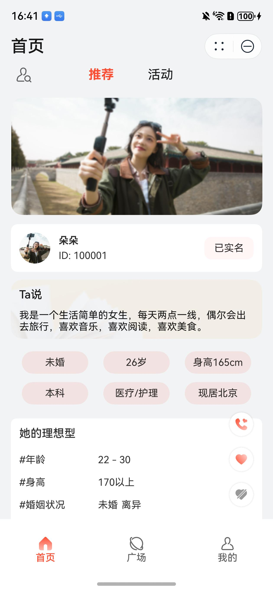
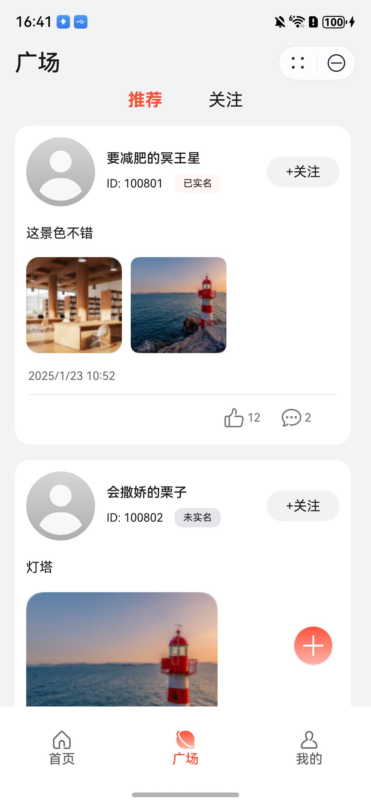
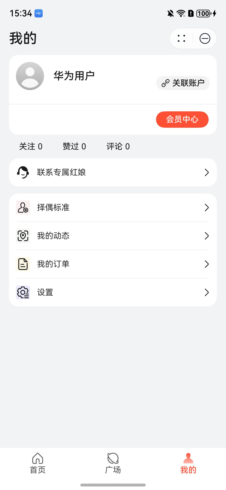

# 社交(相亲交友平台)行业模板快速入门

## 目录

- [功能介绍](#功能介绍)
- [约束与限制](#约束与限制)
- [快速入门](#快速入门)
- [API说明](#API说明)
- [示例效果](#示例效果)
- [开源许可协议](#开源许可协议)


## 功能介绍

您可以基于此模板直接定制应用，也可以挑选此模板中提供的多种组件使用，从而降低您的开发难度，提高您的开发效率。

此模板提供如下组件，所有组件存放在工程根目录的components下，如果您仅需使用组件，可参考对应组件的指导链接；如果您使用此模板，请参考本文档。

| 组件                               | 描述                 | 使用指导                                             |
|:---------------------------------|:-------------------|:-------------------------------------------------|
| 通用会员组件（membership）               | 提供通过应用内支付实现会员开通的能力 | [使用指导](components/membership/README.md)          |
| 通用元服务关联账号组件（atomicservice_login） | 提供元服务关联账号能力的组件     | [使用指导](components/atomicservice_login/README.md) |
| 通用个人信息组件（collect_personal_info）  | 提供收集个人信息能力的组件      | [使用指导](components/collect_personal_info/README.md) |
| 通用拨号组件（dial_panel）               | 提供拨号能力的组件          | [使用指导](components/dial_panel/README.md)          |

本模板为社交类相亲交友平台的元服务提供了常用功能的开发样例，提供了用户推荐、相亲活动、广场、个人中心等能力。模板主要分首页、广场、我的三大模块：

* 首页：分为“推荐”和“活动”两个页签，默认的“推荐”页签展示系统推荐的用户信息。“活动”页签展示活动信息。
* 广场：分为“推荐”和“关注”两个页签。“推荐”页签展示系统推荐的（热门）的动态信息，“关注”页签展示当前用户关注的用户发布的动态信息。
* 我的：展示用户的个人信息、会员中心、操作记录、以及择偶标准、我的动态、我的订单、设置的管理。

本模板已集成华为账号、支付等服务，只需做少量配置和定制即可快速实现华为账号的关联账号和购买会员套餐等功能。

| 首页                                              | 广场                                          | 我的                                              |
|-------------------------------------------------|---------------------------------------------|-------------------------------------------------|
|  |  |  |

本模板主要页面及核心功能如下所示：

```ts
相亲平台模板
 |-- 首页
 |    |-- 推荐用户
 |    |    |-- 用户信息
 |    |    |    |-- 用户相册展示
 |    |    |    |-- 用户自我介绍
 |    |    |    |-- 用户基本信息
 |    |    |    |-- 用户择偶条件
 |    |    |    └-- 用户近期动态
 |    |    └-- 操作
 |    |         |-- 联系红娘
 |    |         |-- 关注用户
 |    |         └-- 对当前用户不感兴趣
 |    |-- 活动
 |         |-- 活动地区选择
 |         └-- 活动列表
 |              |-- 活动详情
 |              └-- 活动报名
 |-- 广场
 |    |-- 推荐
 |    |    |-- 动态列表  
 |    |         |-- 动态详情
 |    |         |-- 动态点赞
 |    |         |-- 动态评论 
 |    |         |-- 关注用户
 |    |         └-- 新增动态
 |    |-- 关注
 |         |-- 动态列表
 |              |-- 动态详情
 |              |-- 动态点赞
 |              |-- 动态评论 
 |              └-- 新增动态
 └-- 我的
      |-- 个人信息
      |    |-- 头像设置
      |    |-- 详细信息设置
      |    └-- 实名认证
      |-- 操作记录汇总
      |    |-- 关注总数及详情查看
      |    |-- 点赞总数及详情查看
      |    └-- 评论总数及详情查看
      |-- 择偶标准	    
      |    └--择偶标准设置 
      |-- 我的动态
      |    |-- 动态列表 
      |    └-- 新增动态 
      |-- 我的订单
      |    └-- 订单查看 
      |-- 设置
           └--  是否公开设置
           └--  销户
```

本模板工程代码结构如下所示：

```
SocialDating
  ├─commons/src/main
  │  ├─ets
  │  │  ├─constant                            // 常量
  │  │  ├─model                               // 公共数据模型
  │  │  ├─page                                // 公共页面
  │  │  ├─service                             // 基础服务，其中MockService为本地桩的实现类，在本地模拟服务端的实现
  │  │  └─utils                               // 常量、工具类
  │  │                                       
  │  └─resources                             
  │     └─base
  │        ├─element                         // 公共的资源变量定义，如颜色、字符串等
  │        ├─media                           // 公共的图标、媒体文件 
  │        └─profile                         // 路由页面配置                 
  │
  ├─components
  │  ├─atomicservice_login                   // 通用元服务关联账号组件
  │  ├─dial_panel                            // 通用拨号组件
  │  ├─collect_personal_info                 // 通用个人信息组件
  │  └─membership                            // 通用会员组件
  │
  │─features                   
  │  ├─activity/src/main                     // 活动模块                                    
  │  │  ├─ ets
  │  │  │  ├─model                           // 活动模块相关的模型定义，如活动对象、参加的活动对象、请求和响应对象等
  │  │  │  ├─pages                           // 活动页面，主要是活动详情页和我参加的活动列表页  
  │  │  │  └─service                         // 活动服务类，该类负责对接后端进行数据处理                             
  │  │  └─resources                          // 资源文件目录， 同commons模块，不再赘述
  │  │                                
  │  ├─composite/src/main                    // 组合模块，这个模块在活动、用户、动态、会员这些基础模块的上一层，
  │  │  │                                    // 组合各基础模块的能力以提供组合服务，当前主要包括首页和个人中心两部分                       
  │  │  ├─ ets
  │  │  │  ├─model                           // 首页和个人中心相关的模型定义，如操作记录页参数等
  │  │  │  └─pages                           // 页面，主要包括首页、个人中心页、我的操作记录（关注、点赞、评论）页 
  │  │  └─resources                          // 资源文件目录， 同commons模块，不再赘述    
  │  │     
  │  ├─feed/src/main                         // 动态（feed）模块                                    
  │  │  ├─ ets
  │  │  │  ├─model                           // 动态相关的模型定义，如动态对象、评论、动态相关的请求和响应对象等
  │  │  │  ├─pages                           // 动态页面，包括动态列表、动态详情、新增动态页等  
  │  │  │  └─service                         // 动态服务类，该类负责对接后端进行数据处理                             
  │  │  └─resources                          // 资源文件目录， 同commons模块，不再赘述
  │  │     
  │  ├─member/src/main                       // 会员模块                                    
  │  │  ├─ ets
  │  │  │  ├─model                           // 会员相关的模型定义，如红娘对象。
  │  │  │  ├─pages                           // 会员页面，当前主要是会员服务页  
  │  │  │  └─service                         // 会员服务类，该类负责对接后端进行数据处理                             
  │  │  └─resources                          // 资源文件目录， 同commons模块，不再赘述
  │  │     
  │  └─user/src/main                         // 用户模块                                    
  │     ├─ ets
  │     │  ├─model                           // 用户相关的模型和数据对象定义。
  │     │  ├─pages                           // 用户页面，包括用户配置、用户信息编辑页、择偶条件设置页、用户列表、用户详情、用户注册、和用户搜索、实名认证等页面
  │     │  └─service                         // 用户服务类，该类负责对接后端进行数据处理                             
  │     └─resources                          // 资源文件目录， 同commons模块，不再赘述                                            
  └─products                       
     └─phone/src/main                                  
        ├─ets                        
        │  ├─model                           // 模型和数据对象定义
        │  ├─pages                           // 主页          
        │  ├─phoneability                    // 应用主窗口     
        │  └─viewmodels                      // 视图模型                                      
        │                                    
        └─resources                
           ├─base                           
           │  ├─element                      // 产品相关的资源变量定义，如颜色、字符串等
           │  ├─media                        // 产品相关的图标等
           │  └─profile                      // 主页和路由表配置文件
           │                        
           └─rawfile                         // mock数据。本模板仅实现了端侧，与后端相关的数据请求由本目录下的json文件进行mock                      
```

## 约束与限制

### 环境
* DevEco Studio版本：DevEco Studio 6.0.2 Release及以上
* HarmonyOS SDK版本：HarmonyOS 6.0.2 Release SDK及以上
* 设备类型：华为手机（直板机）
* HarmonyOS版本：HarmonyOS 6.0.0(20)及以上

### 权限
* 网络权限：ohos.permission.INTERNET

## 快速入门

在运行此模板前，需要完成以下配置：

1. 在AppGallery Connect创建元服务，将包名配置到模板中。

   a. 参考[创建元服务](https://developer.huawei.com/consumer/cn/doc/app/agc-help-createharmonyapp-0000001945392297)为元服务创建APP ID，并将APP ID与元服务进行关联。

   b. 返回应用列表页面，查看元服务的包名。

   c. 将模板工程根目录下AppScope/app.json5文件中的bundleName替换为创建元服务的包名。

2. 配置服务器域名。

   本模板接口均采用mock数据，由于元服务包体大小有限制，部分图片资源将从云端拉取，所以需为模板项目[配置服务器域名](https://developer.huawei.com/consumer/cn/doc/atomic-guides-V5/agc-help-harmonyos-server-domain-V5)，“httpRequest合法域名”需要配置为：`https://agc-storage-drcn.platform.dbankcloud.cn`

3. 配置华为账号服务。

   a. 将元服务的client ID配置到phone模块的src/main/module.json5文件，详细参考：[配置Client ID](https://developer.huawei.com/consumer/cn/doc/atomic-guides-V5/account-atomic-client-id-V5)。

4. 配置应用内支付服务。

   a. 您需[开通商户服务](https://developer.huawei.com/consumer/cn/doc/start/merchant-service-0000001053025967)才能开启应用内购买服务。商户服务里配置的银行卡账号、币种，用于接收华为分成收益。

   b. 使用应用内购买服务前，需要打开应用内购买服务(HarmonyOS NEXT) 开关，此开关是应用级别的，即所有使用IAP Kit功能的应用均需执行此步骤，详情请参考[打开应用内购买服务API开关](https://developer.huawei.com/consumer/cn/doc/app/switch-0000001958955097)。

   c. 开启应用内购买服务(HarmonyOS NEXT) 开关后，开发者需进一步激活应用内购买服务 (HarmonyOS NEXT)，具体请参见[激活服务和配置事件通知](https://developer.huawei.com/consumer/cn/doc/app/parameters-0000001931995692)。

5. （可选）用户购买商品后，IAP服务器会在订单（消耗型/非消耗型商品）和订阅场景的某些关键事件发生时发送通知至开发者配置的订单/订阅通知接收地址，您可以根据关键事件的通知进行服务端的开发，详情请参考[激活服务和配置事件通知](https://developer.huawei.com/consumer/cn/doc/app/parameters-0000001931995692)。

6. 配置会员商品信息，详情请参考[配置商品信息](https://developer.huawei.com/consumer/cn/doc/harmonyos-guides/iap-config-product)。

7.  隐私保护：

    使用AGC的标准化隐私声明托管服务。
    详细说明和云侧集成参考：[隐私声明和用户协议托管](https://developer.huawei.com/consumer/cn/doc/app/agc-help-harmonyos-privacystatementguide-0000001757041969)

8. 对元服务进行[手工签名](https://developer.huawei.com/consumer/cn/doc/harmonyos-guides/ide-signing#section297715173233)

9. 添加手工签名所用证书对应的公钥指纹。详细参考：[配置应用签名证书指纹](https://developer.huawei.com/consumer/cn/doc/app/agc-help-signature-info-0000001628566748#section5181019153511)

###  运行调试工程
1. 连接调试手机和PC。

2. 配置多模块调试：由于本模板存在多个模块，运行时需确保所有模块安装至调试设备。

   a. 运行模块选择“phone”。

   b. 下拉框选择“Edit Configurations”，在“Run/Debug Configurations”界面，选择“Deploy Multi Hap”页签，勾选上模板中所有模块。

   c. 点击"Run"，运行模板工程。

## API说明

-    [API文档](read_me_resource/SocailDating_API.html)

## 示例效果

[功能展示录屏](read_me_resource/功能展示录屏.gif)

## 开源许可协议

该代码经过[Apache 2.0 授权许可](http://www.apache.org/licenses/LICENSE-2.0)。

