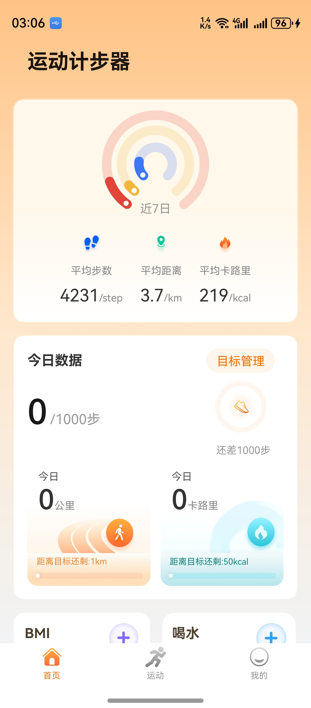
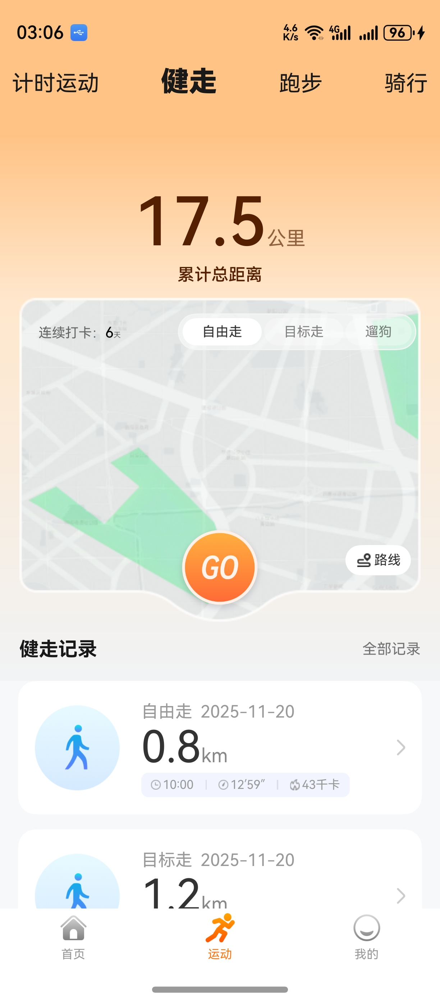
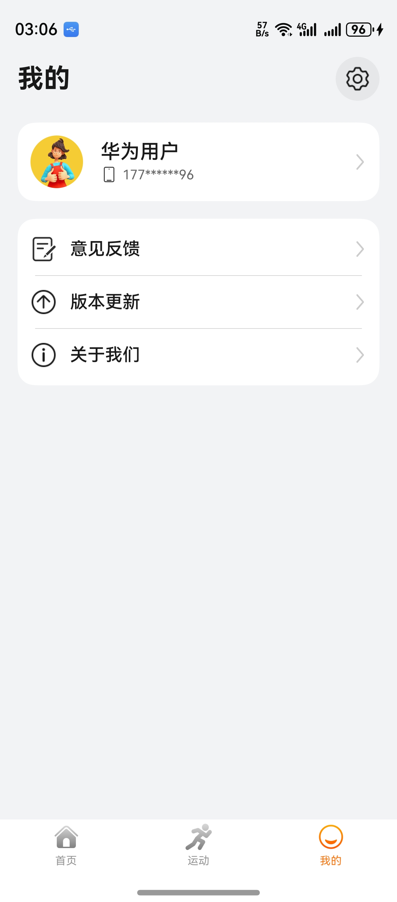

# 运动健康（计步）应用模板快速入门

## 目录
- [功能介绍](#功能介绍)
- [约束与限制](#约束与限制)
- [快速入门](#快速入门)
- [示例效果](#示例效果)
- [开源许可协议](#开源许可协议)

## 功能介绍

您可以基于此模板直接定制应用，也可以挑选此模板中提供的多种组件使用，从而降低您的开发难度，提高您的开发效率。

此模板提供如下组件，所有组件存放在工程根目录的components下，如果您仅需使用组件，可参考对应组件的指导链接；如果您使用此模板，请参考本文档。

| 组件                     | 描述                        | 使用指导                                                  |
|------------------------|---------------------------|:------------------------------------------------------|
| 轨迹地图面板组件（module_trajectory）   | 支持展示运动路径列表、删除路径、展示运动路径等功能 | [使用指导](components/module_trajectory/README.md)                      |
| 目标设定面板组件（module_target）   | 支持自定义设置指定运动目标等功能          | [使用指导](components/module_target/README.md) |
| 运动计时面板组件（module_timer）   | 支持倒计时控制和展示等功能             | [使用指导](components/module_timer/README.md) |
| 开始运动组件（module_running） | 支持开始/暂停/继续/长按结束运动和锁定/解锁屏等功能 | [使用指导](components/module_running/README.md)           |
| 图表及数据展示组件（module_datechart）  | 支持按日、周、月展示线形图和柱状图等功能      | [使用指导](components/module_datechart/README.md) |
| 计步数据展示组件（module_moveratio）   | 支持运动数据可视化等功能              | [使用指导](components/module_moveratio/README.md) |
| 每日打卡组件（module_daily）     | 支持七天运动切换显示等功能             | [使用指导](components/module_daily/README.md) |
| BMI组件（module_bmiassess）      | 支持BMI计算、健康评估建议展示等功能       | [使用指导](components/module_bmiassess/README.md) |
| 图片预览组件（module_imagepreview）      | 支持预览图片、双指放大、缩小，滑动预览等功能       | [使用指导](components/module_imagepreview/README.md) |

本模板为计步类应用提供了常用功能的开发样例，模板主要分首页、运动和我的三大模块：

* 首页：提供近七日数据、今日数据、BMI和喝水等功能。

* 运动：计时运动、健走、跑步、骑行和对应记录等功能。

* 我的：提供个人主页查看、意见反馈、设置等功能。

本模板已集成华为账号登录等服务，只需做少量配置和定制即可快速实现华为账号的登录等功能。

| 首页                                          | 运动                                          | 我的                                          |
|---------------------------------------------|---------------------------------------------|:--------------------------------------------|
|  |  |  |

本模板主要页面及核心功能如下所示：

```text
计步模板
  ├──首页                         
  │   ├──每日打卡  
  │   │   ├── 近七日数据显示
  │   │   ├── 日历运动数据展示  
  │   │   └── 每日目标完成情况
  │   │  
  │   ├──今日数据
  │   │   ├── 步行数据
  │   │   ├── 公里数据  
  │   │   └── 卡路里 
  │   │  
  │   ├──目标管理 
  │   │   ├── 距离/步数/热量
  │   │   └── 自定义    
  │   │      
  │   ├──BMI      
  │   │   ├── 我的评估
  │   │   └── BMI计算   
  │   │                               
  │   └──喝水                                                
  │       ├── 我的目标
  │       ├── 喝水记录
  │       └── 喝水提醒
  │            ├── 提醒方式
  │            └── 定时提醒    
  │
  ├──运动                          
  │   ├──计时运动/健走/跑步/骑行 
  │   │   ├── 运动记录
  │   │   ├── 运动轨迹  
  │   │   ├── 路线管理
  │   │   ├── 保存路线
  │   │   └── 导出路线      
  │   │
  │   ├──运动控制
  │   │   ├── 暂停/开始/停止
  │   │   └── 锁定/解锁屏幕
  │   │  
  │   ├──语音播报
  │   │       
  │   ├──户外健走 
  │   │   ├── 自由走
  │   │   ├── 遛狗
  │   │   └── 目标走  
  │   │
  │   ├──户外跑步
  │   │   ├── 自由跑
  │   │   └── 目标跑  
  │   │
  │   └──户外骑行 
  │       ├── 自由骑行
  │       └── 目标骑行     
  │                     
  └──我的                           
      ├──登录  
      │   ├── 华为账号一键登录                          
      │   ├── 微信登录                                                   
      │   ├── 账密登录
      │   └── 用户隐私协议同意                       
      │         
      ├──个人主页         
      │   └── 头像、昵称、简介、性别、生日
      │
      └──常用服务    
          ├── 意见反馈 
          ├── 关于我们                  
          └── 设置
               ├── 通知设置 
               ├── 自动生成运动记录 
               ├── 用户协议/隐私政策           
               ├── 清理缓存
               ├── 授权权限                
               └── 退出登录                               
```

本模板工程代码结构如下所示：

```text
stepcount
├──commons
│  ├──lib_account/src/main/ets                            // 账号登录模块             
│  │    ├──components
│  │    │   └──AgreePrivacyBox.ets                        // 隐私同意勾选       
│  │    │     
│  │    ├──constants  
│  │    │   ├──Constants.ets                              // 常量值
│  │    │   ├──ErrorCode.ets                              // 异常码
│  │    │   └──Types.ets                                  // 跳转登录路由参数
│  │    │
│  │    ├──pages  
│  │    │   ├──HuaweiLoginPage.ets                        // 华为账号登录页面
│  │    │   ├──OtherLoginPage.ets                         // 其他方式登录页面
│  │    │   └──ProtocolWebView.ets                        // 协议H5   
│  │    │               
│  │    └──utils  
│  │        ├──HuaweiAuthUtils.ets                        // 华为认证工具类
│  │        ├──LoginSheetUtils.ets                        // 统一登录半模态弹窗
│  │        └──WXApiUtils.ets                             // 微信登录事件处理类 
│  │
│  ├──lib_common/src/main/ets                             // 基础模块             
│  │    ├──constants                                      // 通用常量 
│  │    ├──datasource                                     // 懒加载数据模型
│  │    ├──dialogs                                        // 通用弹窗 
│  │    ├──models                                         // 状态观测模型
│  │    └──utils                                          // 通用方法     
│  │        
│  ├──ui_base/src/main/ets                                // 基本模块 
│  │    ├──commons                                        // 公共常量 
│  │    └──components                                     // 自定义组件 
│  │ 
│  ├──lib_sport_api/src/main/ets                          // 服务端api模块             
│  │    ├──database                                       // 数据库 
│  │    ├──observedmodels                                 // 状态模型  
│  │    ├──params                                         // 请求响应参数 
│  │    ├──services                                       // 服务api  
│  │    └──utils                                          // 工具utils  
│  │ 
│  └──lib_widget/src/main/ets                             // 通用UI模块             
│       └──components
│           ├──CustomBadge.ets                            // 自定义信息标记组件
│           ├──EmptyBuilder.ets                           // 空数据组件
│           └──NavHeaderBar.ets                           // 自定义标题栏
│
├──components   
│  ├──module_trajectory                                   // 轨迹地图面板组件
│  ├──module_target                                       // 目标设定面板组件
│  ├──module_timer                                        // 运动计时面板组件
│  ├──module_feedback                                     // 意见反馈组件
│  ├──module_running                                      // 开始运动组件组件
│  ├──module_imagepreview                                 // 图片预览组件
│  ├──module_datechart                                    // 图表及数据展示组件
│  ├──module_moveratio                                    // 计步数据展示组件  
│  ├──module_daily                                        // 每日打卡组件
│  └──module_bmiassess                                    // BMI组件
│     
├──features 
│  │     
│  ├──business_home/src/main/ets                          // 首页模块             
│  │    ├──components
│  │    │   ├──DrinkRecord.ets                            // 喝水记录
│  │    │   └──NavBar.ets                                 // 标题
│  │    │ 
│  │    ├──constants
│  │    │   └──CommonConstants.ets                        // 常量
│  │    │ 
│  │    ├──page
│  │    │   ├──DrinkPage.ets                              // 喝水
│  │    │   ├──DrinkWarnPage.ets                          // 喝水提醒
│  │    │   ├──HomePage.ets                               // 首页
│  │    │   └──EditBMIInfo.ets                            // 喝水管理
│  │    │
│  │    ├──models
│  │    │   ├──DrinkModel.ets                             // 喝水相关模型
│  │    │   └──GoalInfo.ets                               // 初始化目标
│  │    │ 
│  │    ├──utils
│  │    │   └──TargetReminderAgentHelper.ets              // 通知提醒
│  │    │ 
│  │    └──viewmodels
│  │        ├──DrinkVM.ets                                // 喝水模型
│  │        ├──DrinkWarnViewModel.ets                     // 喝水提醒模型
│  │        └──HomeViewModel.ets                          // 首页
│  │ 
│  ├──business_mine/src/main/ets                          // 我的模块             
│  │    ├──components      
│  │    │   └──CancelDialogBuilder.ets                    // 取消组件    
│  │    │                    
│  │    ├──constants 
│  │    │    └──Constants.ets                             // 常量定义文件
│  │    │ 
│  │    ├──pages
│  │    │   └──MinePage.ets                               // 我的页面组件             
│  │    │  
│  │    ├──types
│  │    │   └──Types.ets                                  // 类型定义文件 
│  │    │ 
│  │    └──viewmodels         
│  │        └──MineVM.ets                                 // 我的视图模型类            
│  │    
│  └──business_setting/src/main/ets                       // 设置模块             
│       ├──components
│       │   ├──SettingCard.ets                            // 设置卡片
│       │   └──SettingSelectDialog.ets                    // 设置选项弹窗 
│       │               
│       ├──pages
│       │   ├──SettingAbout.ets                           // 关于页面
│       │   ├──SettingAuthorization.ets                   // 授权页面
│       │   ├──SettingAutoSportRecord.ets                 // 自动运动设置页面
│       │   ├──SettingNetwork.ets                         // 网络设置页面
│       │   ├──SettingNotice.ets                          // 通知设置页面
│       │   ├──SettingPage.ets                            // 设置页面
│       │   ├──SettingPersonal.ets                        // 个人信息页面
│       │   ├──SettingPrivacy.ets                         // 隐式页面
│       │   ├──SettingVoiceTipPage.ets                    // 语音提示设置页面
│       │   └──VersionUpdate.ets                          // 版本更新
│       │ 
│       ├──types
│       │   └──Types.ets                                  // 设置所数据类型 
│       │ 
│       └──viewmodels
│           ├──SettingAboutVM.ets                         // 关于处理类
│           ├──SettingAuthorizationVM.ets                 // 授权页面处理类
│           ├──SettingAutoSportRecordVM.ets               // 自动运动处理类
│           ├──SettingNetworkVM.ets                       // 网络设置处理类
│           ├──SettingNoticeVM.ets                        // 通知设置处理类
│           ├──SettingPersonalVM.ets                      // 个人信息处理类
│           ├──SettingPrivacyVM.ets                       // 隐式处理类
│           └──SettingVM.ets                              // 设置处理类  
│ 
└──products
   └──phone/src/main/ets                                  // phone模块
        ├──common                        
        │   ├──AppTheme.ets                               // 应用主题色
        │   └──Constants.ets                              // 业务常量
        │
        ├──components                    
        │   └──CustomTabBar.ets                           // 应用底部Tab
        │
        ├──pages   
        │   ├──AgreeDialogPage.ets                        // 隐私同意弹窗
        │   ├──Index.ets                                  // 入口页面
        │   ├──IndexPage.ets                              // 应用主页面
        │   ├──PrivacyPage.ets                            // 查看隐私协议页面
        │   ├──SafePage.ets                               // 隐私同意页面
        │   └──StartPage.ets                              // 应用启动页面
        │
        └──viewmodels                                     
            ├──IndexPageVM.ets                            // 首页事件处理类
            ├──IndexVM.ets                                // 首页处理类
            └──SafePageVM.ets                             // 隐私同意处理类    
 
```
## 约束与限制
### 环境

- DevEco Studio版本：DevEco Studio 5.0.5 Release及以上
- HarmonyOS SDK版本：HarmonyOS 5.0.5 Release SDK及以上
- 设备类型：华为手机(直板机)
- 系统版本：HarmonyOS 5.0.5(17)及以上

### 权限

- Internet网络权限：ohos.permission.INTERNET
- 允许应用获取数据网络信息：ohos.permission.GET_NETWORK_INFO
- 允许应用获取Wi-Fi信息：ohos.permission.GET_WIFI_INFO
- 允许应用获取位置信息：ohos.permission.LOCATION
- 允许应用获取模糊位置信息：ohos.permission.APPROXIMATELY_LOCATION
- 允许应用使用后台代理提醒：ohos.permission.PUBLISH_AGENT_REMINDER

### 调试

由于模板引入华为地图服务，建议在真机上运行。

## 快速入门

### 配置工程

在运行此模板前，需要完成以下配置：

1. 在AppGallery Connect创建应用，将包名配置到模板中。

   a. 参考[创建HarmonyOS应用](https://developer.huawei.com/consumer/cn/doc/app/agc-help-create-app-0000002247955506)为应用创建APP ID，并将APP ID与应用进行关联。

   b. 返回应用列表页面，查看应用的包名。

   c. 将模板工程根目录下AppScope/app.json5文件中的bundleName替换为创建应用的包名。

2. 配置华为账号服务。

   a. 将应用的Client ID配置到products/phone/src/main路径下的module.json5文件中，详细参考：[配置Client ID](https://developer.huawei.com/consumer/cn/doc/harmonyos-guides/account-client-id)。

   b.申请华为账号一键登录所需的权限，详细参考：[申请账号权限](https://developer.huawei.com/consumer/cn/doc/harmonyos-guides/account-config-permissions)。

   c.申请华为代理提醒所需的权限，详细参考：[代理提醒开放能力申请](https://developer.huawei.com/consumer/cn/doc/harmonyos-guides/agent-powered-reminder#%E4%BB%A3%E7%90%86%E6%8F%90%E9%86%92%E5%BC%80%E6%94%BE%E8%83%BD%E5%8A%9B%E7%94%B3%E8%AF%B7)
3. [配置华为地图服务](https://developer.huawei.com/consumer/cn/doc/harmonyos-guides/map-config-agc)。

4. 接入微信SDK。
   前往微信开放平台申请AppID并配置鸿蒙应用信息，详情参考：[鸿蒙接入指南](https://developers.weixin.qq.com/doc/oplatform/Mobile_App/Access_Guide/ohos.html)。

5. 对应用进行[手工签名](https://developer.huawei.com/consumer/cn/doc/harmonyos-guides/ide-signing#section297715173233)。

6. 添加手工签名所用证书对应的公钥指纹，详细参考：[配置公钥指纹](https://developer.huawei.com/consumer/cn/doc/app/agc-help-cert-fingerprint-0000002278002933)


### 运行调试工程

1. 连接调试手机和PC。

2. 菜单选择“Run > Run 'phone' ”或者“Run > Debug 'phone' ”，运行或调试模板工程。

## 示例效果
1. [开始运动](screenshots/y_1.png)
2. [计时运动](screenshots/j_1.png)
3. [打卡记录](screenshots/d_1.png)

## 开源许可协议

该代码经过[Apache 2.0 授权许可](http://www.apache.org/licenses/LICENSE-2.0)。
