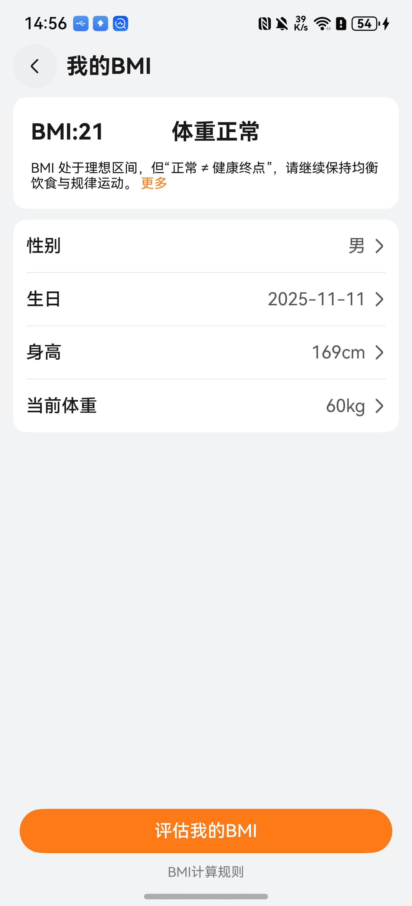
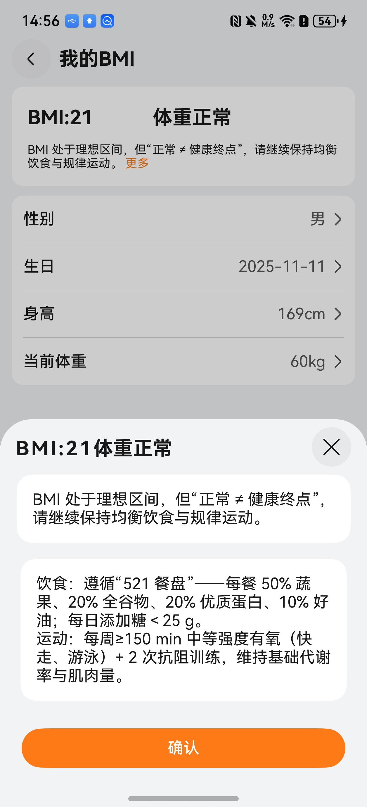
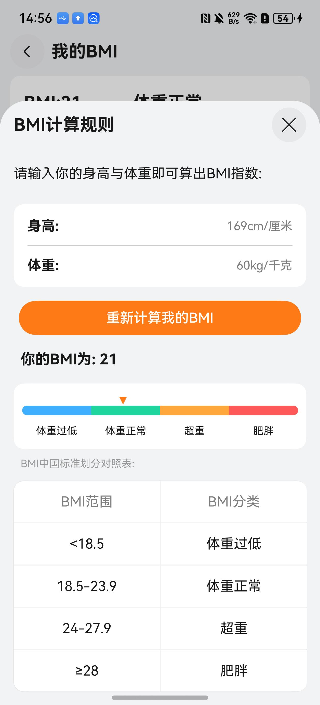

# BMI组件快速入门

## 目录

- [简介](#简介)
- [约束与限制](#约束与限制)
- [快速入门](#快速入门)
- [API参考](#API参考)
- [示例代码](#示例代码)
- [开源许可协议](#开源许可协议)

## 简介

本组件提供了BMI（Body Mass Index，身体质量指数）评估功能，其中包含：BMI值计算、BMI范围显示、用户信息编辑（身高、体重、性别、生日等）、BMI健康建议等功能。

| 计算BMI | 展示BMI结果 | BMI计算规则 |
| ------- | ----------- | ----------- |
||||

## 约束与限制
### 环境

- DevEco Studio版本：DevEco Studio 5.0.5 Release及以上
- HarmonyOS SDK版本：HarmonyOS 5.0.5 Release SDK及以上
- 设备类型：华为手机(直板机)
- 系统版本：HarmonyOS 5.0.5(17)及以上

## 快速入门

1. 安装组件。

   如果是在DevEco Studio使用插件集成组件，则无需安装组件，请忽略此步骤。

   如果是从生态市场下载组件，请参考以下步骤安装组件。

   a. 解压下载的组件包，将包中所有文件夹拷贝至您工程根目录的XXX目录下。

   b. 在项目根目录build-profile.json5添加module_bmiassess模块。

   ```
    // 在项目根目录build-profile.json5填写module_bmiassess路径。其中XXX为组件存放的目录名
    "modules": [
        {
        "name": "module_bmiassess",
        "srcPath": "./XXX/module_bmiassess",
        }
    ]
   ```
   c. 在项目根目录oh-package.json5中添加依赖。
   ```
    // XXX为组件存放的目录名称
    "dependencies": {
      "module_bmiassess": "file:./XXX/module_bmiassess"
    }
   ```
2. 在EntryAbility的onWindowStageCreate中设置全屏模式。

   ```typescript
   let windowClass: window.Window = windowStage.getMainWindowSync();

   await windowClass.setWindowLayoutFullScreen(true);
   ```

3. 引入组件。

   ```typescript
   import { BMIPage, EditUserInfo } from 'module_bmiassess';
   ```

4. 调用组件，详细参数配置说明参见[API参考](#API参考)。

   ```typescript
    BMIPage()
   ```

## API参考

### 接口

#### BMIPage(options?: [BMIPageOptions](#BMIPageOptions对象说明))

BMI组件，提供BMI计算、展示等功能。

### BMIPageOptions对象说明

| 名称 | 类型                        | 是否必填 | 说明                  |
| :--- |:--------------------------| :--- |:--------------------|
| isLogin | boolean                   | 否 | 用户是否登录，默认为false     |
| stack | NavPathStack              | 是 | 路由栈，用于页面跳转          |
| navBarFontSize | number                    | 否 | 导航栏字体大小，默认为16       |
| navBarLineHeight | number                    | 否 | 导航栏行高，默认为22         |
| navBarColor | string                    | 否 | 导航栏颜色，默认为'#4F412E'  |
| sliderSelectedColor | string                    | 否 | 滑块选中颜色，默认为'#8667FC' |
| rightPartBuilder | () => void                | 否 | 右侧自定义构建器            |
| bgImageBuilder | () => void                | 否 | 背景图片自定义构建器          |
| bmiInfo | [bmiStore](#bmiStore对象说明) | 否 | 用户bmi信息             |

### bmiStore对象说明

| 参数名 | 类型     | 是否必填 | 说明      |
| :--- |:-------| :--- |:--------|
| bmiValue | number | 是 | bmi值    |
| physicalState | string | 是 | 健康状态    |
| healthAnalysis | string | 是 | 健康分析    |
| healthTips | string | 是 | 健康建议    |

### UserInfo对象说明

| 参数名 | 类型 | 是否必填 | 说明 |
| :--- | :--- | :--- | :--- |
| weight | number | 是 | 体重（千克） |
| userheight | number | 是 | 身高（厘米） |
| gender | string | 是 | 性别 |
| birthday | string | 是 | 生日 |

### 事件

支持以下事件：

#### onClick
onClick: () => void;

点击跳转事件

#### onNeedLogin
onNeedLogin: () => void;

登录校验事件

## 示例代码

```ts
import { BMIPage } from 'module_bmiassess';

@Entry
@ComponentV2
struct Index {
  @Consumer() stack: NavPathStack = new NavPathStack();
  @Local isLogin: boolean = true;

  @Builder
  bgImageBuilder() {
    Column().width('100%').height('100%').backgroundColor(Color.Pink)
  }

  build() {
    Navigation(this.stack) {
      Column({ space: 5 }) {
        BMIPage({
          isLogin: this?.isLogin,
          stack: this.stack,
        })
          .width('48%')
          .height(210)
      }
      .width('100%')
      .height('100%')
      .backgroundColor('#ffd6d6d7')
      .justifyContent(FlexAlign.Center)
      .alignItems(HorizontalAlign.Center)
      .padding({
        bottom: 28
      , top: 100
      })
    }
    .hideTitleBar(true)
  }
}
```

## 开源许可协议

该代码经过[Apache 2.0 授权许可](http://www.apache.org/licenses/LICENSE-2.0)。
